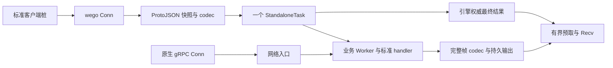

# wego SDK 功能与包结构

SDK `0.2.9`，RPC 与流日志协议 `4`，依赖未经修改的官方 Hatchet `v0.110.5`。0.2.0 的 18 项门禁、28 源文件/74 构造片段及完整验收见 [历史验收报告](acceptance-report.md) 和 [交付报告](v0.2.0-p5-report.md)。0.2.1 增加 AWS S3 SDK / MinIO codec 示例，部署及专项验证见 [专项报告](minio-codec-report.md)。0.2.2 增加经 API 认证的租户 Durable Streams 部署脚本；数据库授权由部署管理处理，SDK 运行时不直接操作数据库。设计与约束见 [v0.2.0.md](v0.2.0.md)，完整 option 与使用示例见 [worker.md](worker.md)。

## 一、公开功能与边界

业务使用标准 protobuf 桩和 `context.Context`。`Conn` 实现 `grpc.ClientConnInterface`，`Server` 实现 `grpc.ServiceRegistrar`。同一 handler 可接受任务入口和原生网络入口；网络请求直接执行 handler，不产生任务身份。

| 包 | 功能 | 边界 |
|---|---|---|
| `wego` | `NewConn`、`NewServer`、自有类型别名、版本 | 只提供构造门面，不重复持有状态。 |
| `client` | Conn、同步/异步/批量 Run、原生 Worker 句柄、routing、幂等键、消费 checkpoint、ResumeStream | 公开配置和调用入口；借用 Conn 拒绝关闭共享资源。ResumeStream 只消费已有任务，输入已关闭。 |
| `server` | 共享注册表、服务信息、网络 gRPC、Worker 入口、Serve/Stop/GracefulStop | 原生 gRPC 选项仅作用于网络入口；不提供 ServeHTTP、外部 listener 或网络请求转任务。 |
| `runtime` | 连接、TLS、namespace、实例名称、容量、Worker 开关、routing 默认值、流模式与预算、事件回调、观测和关闭策略 | 实例配置，不启动资源；WithLogger 应用时设置 wego 共享输出。Worker 开关属于 Runtime，任务策略属于 worker/task。 |
| `worker` | 按完整 RPC 方法选择任务入口，配置方法禁用及普通/durable 默认/覆盖策略 | 不建立连接。禁用仅影响本实例的任务注册和消费，网络服务完整保留。流必须是普通 standalone，可靠输出允许明确配置应用重试；不参与 durable eviction/replay。 |
| `task` | 策略、任务身份、借用连接、持久等待、Now、稳定子调用、续期、不可重试错误、输出历史 checkpoint | 通过 context 查询执行能力。网络 handler 或不支持的执行类型返回明确错误。 |
| `features` | Crons、Schedules、Events、Filters、Runs、Workers 和管理客户端 | 参数与结果为 wego 类型；Worker 定向/广播事件与任务事件触发分别提供入口。 |
| `model` | 自有 DTO、枚举、错误、运行信息、checkpoint 与 WorkerEvent | 不持有后端连接；不别名或嵌入 Hatchet 类型。 |
| `middleware` | unary/stream 拦截器、载荷编码、完整帧有界 codec、压缩/加密/卸载适配 | routing 保持可读 JSON；所有流帧统一 codec。自定义流 codec 必须提供稳定标识及有界解码。 |
| `log` | 共享输出、上下文属性、标准 slog Handler 与显式任务上报 | context 不选日志器；WithLogger 原子设置共享出口，不修改 slog.Default。R 系列打印后同步上报。 |
| `telemetry` | Trace/Metrics 配置 | provider/registry 属于实例，metrics 默认关闭；不替换全局 OTel provider，借用 exporter 由应用关闭。 |
| `option` | 泛型显式值 | 区分未配置与显式 0/false，无生命周期或运行状态。 |

公开签名、嵌套字段、嵌入、泛型约束、方法集、回调值、动态结果及错误链均不得暴露 Hatchet 类型。只允许标准库、gRPC、protobuf、OTel 等标准依赖和 wego 自有契约；没有 RawClient/Unwrap 出口。

### 名称与配置

- namespace 默认空。Worker 默认展示名称为 `<namespace>-<hostname>-<worker_key 前12位十六进制>`，空 namespace 省略前段。`WithInstanceName` 覆盖完整展示名称。
- Worker 注册自动追加 `worker_name`，取最终展示名称，并同步到任务的 `WorkerLabels`。其他业务标签保留；配置中的同名键由实际名称覆盖，每个实例持有独立标签副本。
- worker_key 每个 SDK Worker 实例随机生成 UUID；重连保持不变，重启生成新值，不允许业务指定。同名副本仍有不同 key。
- RPC workflow 为 `<namespace>-<完整 protobuf 服务名>-<方法名>`，保留大小写；内部 action 独立生成稳定摘要。副本共享定义及版本，不把随机身份写入定义。
- Worker 停止不删除或暂停 workflow。控制台 Active 表示定义未暂停，不能据此判断 Worker 在线。
- `client.WithRouting` 的调用快照覆盖 `runtime.WithRoutingDefaults` 顶层同名键；CEL 读取 `input.routing.*`，嵌套对象整体覆盖。原生 JSON 任务保留自己的载荷语义。
- `WithDisableWorker` 关闭 Server 任务入口，不禁止独立 Conn 提交任务；直接创建原生 Worker 时此配置冲突明确报错。
- `worker.WithDisableMethod(method ...string)` 从调度绑定中批量排除指定完整方法名，保存传入切片的独立快照；空参数无效果，禁用优先于同方法的任务策略，未知方法在启动时失败。全部方法禁用时使用 Runtime 的 Worker 开关；纯网络模式不验证 Worker 方法配置。不删除已有 workflow，不修改其他副本。

## 二、目录与内部职责

SDK 使用独立 Go module；发行验证使用 `GOWORK=off`。禁止修改 Hatchet 源码、根依赖或模块缓存。只有 `internal/backend` 导入 Hatchet 实现，其他包通过 `internal/ports` 调用。

```text
sdks/wego/
├── wego.go / version.go / CHANGELOG.md / README.md
├── client/                       # 公开 Conn、调用配置、checkpoint
├── server/                       # 注册、网络入口、Worker 入口、生命周期
├── runtime/ / worker/ / task/     # 实例配置、方法策略、执行能力
├── features/ / model/            # 管理门面、自有数据与错误
├── middleware/ / log/ / telemetry/ / option/
├── internal/
│   ├── spec/                     # 配置默认值、合并、复制与校验
│   ├── ports/                    # 后端能力与观测接口
│   ├── binding/                  # 标准服务描述、workflow/action 映射
│   ├── callctx/                  # 执行能力、routing、幂等和恢复上下文
│   ├── wire/                     # ProtoJSON envelope、metadata、status、完整帧 codec
│   ├── backend/                  # 官方连接、注册、执行器、结果、发布订阅及通知
│   ├── rpc/                      # unary/三种流、输入封包、handler 与恢复适配
│   ├── stream/                   # CLAIM、日志解释器、producer、有限历史和终态对账
│   ├── client/ / features/       # 自有句柄与管理能力实现
│   ├── engine/                   # 实例装配、在途调用、资源所有权与排空
│   ├── logging/                  # 共享出口、上下文/固定字段合并、记录与上报属性编码
│   └── telemetry/                # 独立 provider、registry、flush 与指标
├── examples/                     # 独立入口、scenarios、业务 proto、验收 manifest
├── tests/ / scripts/             # 单元/race/fuzz、真实引擎、生成及门禁
├── docs/                         # 设计、使用方式与版本化证据
└── deployment/                   # 本机部署和受控故障 fixture；不参与 SDK 初始化
```

`examples/codec/payload` 是示例专属压缩、加密及 S3 适配，不作为核心 SDK API 发布；由应用持有 S3 连接与密钥。通过 `middleware.FramedPayload` 接入，核心不依赖对象存储类型。真实 S3 场景由独立示例和 `TestMinIOCodec` 执行，验收运行器要求其单独证据；存储对象随持久历史保留，停止时只释放客户端资源。

| 内部包 | 当前规则 |
|---|---|
| `spec` | 仅配置值，不创建资源；显式零值不被默认值覆盖；map/slice/TLS 等配置独立复制。 |
| `ports` | 仅 wego 与标准依赖，backend 实现接口，上层消费接口。 |
| `binding` | 客户端和 Worker 共用稳定映射；名称不承担执行类型检测，使用显式 RPC 绑定。 |
| `callctx` | 通过自有能力保留身份、父子关系和 durable 账本；原始后端 context 只在 backend 私有保存。 |
| `wire` | 负责协议/codec，限制编码及还原字节；不调度任务。控制与业务帧均单次变换。 |
| `backend` | 官方 v1 SDK/REST/生成协议的唯一适配边界；producer/seq/cursor 和订阅错误完整保留；CLAIM 门禁隔离 START、终态和旧 CANCEL。底层兼容接口仅限私有使用。 |
| `rpc` | 标准 gRPC 类型/metadata/headers/trailers/status/deadline 适配；输入快照、整批提交、有限 feeder、消费 checkpoint 与恢复。 |
| `stream` | 客户端和 Worker 共用有效日志解释器；同 producer 串行发布，响应不明确复用冻结字节，不建立输入会话。 |
| `engine` | 装配 backend、调用跟踪和生命周期；不保存全局连接，不定义业务策略。 |
| `client` / `features` | 自有句柄与管理语义，结果转换与触发 RPC 编码；不向公开层交付后端类型。 |
| `logging` | 固定单次调用的输出实例，合并字段、保护身份并构造同一记录；不持有后端连接。官方 PutLog 只在 backend，登记到 Engine I/O。 |
| `telemetry` | 维护实例资源及有限 method/mode/outcome 指标；RunID、worker_key、writer 等身份仅进入日志/trace，不作为 metrics 标签。 |

## 三、执行与资源模型



client/bidi 输入在 CloseSend 时一次提交请求数组，空输入为 `[]`；Worker 逐条 Recv，耗尽返回 EOF。Worker bidi 为整批输入、流式输出；需要交互式双向通信使用网络入口。业务任务占用正常 slots，没有 START/SESSION、控制 workflow 或控制 Worker。

Reliable 是 server/bidi 默认输出模式，要求部署启用 Durable Streams。规范 CLAIM 确认后才启动 handler；更高代次接管保留之前有效前缀，忽略接管后的旧输出。成功 EOF 同时要求引擎成功、最终结束清单匹配及全部输出交付。实时模式显式使用 PutStream，不支持回放或 checkpoint；订阅没有官方就绪 ACK，不能保证丢帧透明恢复。

消费 checkpoint 只在成功 Recv 后推进，预取不推进。ResumeStream 校验 tenant、namespace、方法及原输入身份，不能追加输入。可靠 handler 重试有历史时须把有限 checkpoint 读到 EOF，再从下一个业务位置继续发送；外部副作用和消费后保存 checkpoint 的崩溃窗口由业务自行幂等。

每个任务 Worker 在开始消费前初始化定向和广播 topic 的 JOIN 屏障，不占业务 slots。内部取消与有限业务回调队列分开；通知发布成功代表持久存储，不代表处理确认。重连保持 worker_key 和 cursor，不把正常空闲当作恢复超时。

由于实例通知也依赖 Durable Streams，仅注册 unary 的 Worker 同样要求部署启用租户 entitlement；纯网络模式没有此启动依赖。

事件 JOIN 扫描保留历史；相同 namespace 使用一致 codec profile，历史密钥和卸载对象需覆盖 topic 实际保留期。事件已过逻辑 TTL 不代表其整帧可以不解码。


Server Serve 阻塞；应用显式调用 GracefulStop 等待业务完成，Stop 可中断排空；Conn/原生 Worker 使用配置关闭策略。独立清理预算默认 30 秒，不永久等待不响应取消的 handler。借用连接不能关闭共享资源；纯网络模式不建立任务连接、订阅或 Worker telemetry。

## 四、standalone 验收范围

验收基线为 `sdks/go/examples` 中上一轮列出的 standalone 示例：普通 23 个文件、durable 5 个文件、batch 1 个文件；`migration-guides/temporal.go` 同时属于普通与 durable，合计 **28 个不同源文件**。逐片段映射见 `examples/acceptance.json`，通过状态以当前版本的最终报告为准。

示例改写至 `sdks/wego/examples`，按相同相对路径建立对应关系，配套 trigger、Worker、消费者一起改写。验收要求行为等价，使用 wego 自有 API；RPC 使用标准 proto 与生成桩，业务不导入 Hatchet 包。混合文件验收其中全部 standalone 场景及关联能力；迁移指南中的旧框架代码是对照资料。

### 1. 普通 StandaloneTask

| 官方源文件 | 必须验证的行为 |
| --- | --- |
| [simple/main.go](../../../go/examples/simple/main.go) | 定义与注册；同步、异步调用；结果读取；任务内子调用及并行调用。 |
| [retries/main.go](../../../go/examples/retries/main.go) | 重试次数、RetryCount、退避参数生效；不可重试错误停止重试。 |
| [concurrency/main.go](../../../go/examples/concurrency/main.go) | 分组并发、多个并发键、各取消策略及动态并发限制生效。 |
| [rate-limiting/main.go](../../../go/examples/rate-limiting/main.go) | 静态与动态限流正确约束任务执行。 |
| [slot-cost/main.go](../../../go/examples/slot-cost/main.go) | 多 slot 任务按成本占用容量；剩余容量限制分配。 |
| [runtime-affinity/main.go](../../../go/examples/runtime-affinity/main.go) | 每次运行指定 required label，实际执行实例符合路由要求。 |
| [sticky-workers/main.go](../../../go/examples/sticky-workers/main.go) | standalone 父子调用的 sticky 配置生效，可核对实际 Worker 标识。 |
| [child-workflows/main.go](../../../go/examples/child-workflows/main.go) | 顺序及并行子调用、结果汇总与错误处理。 |
| [cron/main.go](../../../go/examples/cron/main.go) | 多种 Cron 表达式注册并触发对应 standalone 任务。 |
| [events/main.go](../../../go/examples/events/main.go) | 事件发布、触发 standalone 任务及结果读取。 |
| [on-event/main.go](../../../go/examples/on-event/main.go) | 事件绑定、默认过滤器、过滤条件与 filter payload 读取。 |
| [webhooks/main.go](../../../go/examples/webhooks/main.go) | 示例中的 Webhook 类型可用受控 HTTP 请求触发，任务收到对应载荷。 |
| [idempotency/worker.go](../../../go/examples/idempotency/worker.go) | 幂等键及基于状态的幂等策略；重复提交返回可识别冲突与已有 RunID。 |
| [logs_test/main.go](../../../go/examples/logs_test/main.go) | 任务日志可上报、查询并关联到对应运行。 |
| [panic-handler/main.go](../../../go/examples/panic-handler/main.go) | 捕获业务 panic，调用配置的 panic handler，Worker 可继续工作。 |
| [opentelemetry_instrumentation/main.go](../../../go/examples/opentelemetry_instrumentation/main.go) | standalone 任务及关联调用的 trace 传播、业务子 span 与任务属性正确；配置的 exporter 收到 spans。 |
| [streaming/shared/task.go](../../../go/examples/streaming/shared/task.go) | Worker 发布输出块，客户端按序消费并取得最终结果；配套 Worker、消费者与 HTTP 转发可运行。 |
| [embedded/main.go](../../../go/examples/embedded/main.go) | 嵌入引擎启动、任务注册与调用、资源关闭。 |
| [stubs/stub-workflow.go](../../../go/examples/stubs/stub-workflow.go) | 任务定义模板可注册、调用并解码结果。 |
| [sdk-migration/main.go](../../../go/examples/sdk-migration/main.go) | 基础任务定义、Worker 启动及调用可通过 wego 完成。 |
| [sdk-migration/v1.go](../../../go/examples/sdk-migration/v1.go) | 事件绑定的 standalone 任务可通过 wego 注册、触发。 |
| [migration-guides/mergent.go](../../../go/examples/migration-guides/mergent.go) | 图像处理任务、嵌套结果与错误传播保持业务语义。 |
| [migration-guides/temporal.go](../../../go/examples/migration-guides/temporal.go) | 全部普通 standalone 片段可执行，覆盖子任务、重试、Cron、并发、限流、日志等关联能力。 |

### 2. StandaloneDurableTask

| 官方源文件 | 必须验证的行为 |
| --- | --- |
| [durable/sleep/main.go](../../../go/examples/durable/sleep/main.go) | 持久 Sleep；恢复后复用等待记录，不重新开始完整等待。 |
| [durable/event/main.go](../../../go/examples/durable/event/main.go) | 事件等待、过滤、scope、lookback 与可重放的 Now。 |
| [durable/eviction/main.go](../../../go/examples/durable/eviction/main.go) | TTL 驱逐、容量驱逐、禁用驱逐；等待完成后恢复并取得结果。 |
| [durable/eviction/trigger/main.go](../../../go/examples/durable/eviction/trigger/main.go) | 可驱逐任务的定义与触发；配套事件发布完成等待与恢复。 |
| [migration-guides/temporal.go](../../../go/examples/migration-guides/temporal.go) | 全部 durable 编排片段：子调用、持久等待、事件审批与并行子任务；恢复后复用已记录的等待及子运行结果。 |

### 3. StandaloneBatchTask

| 官方源文件 | 必须验证的行为 |
| --- | --- |
| [batch_assign/main.go](../../../go/examples/batch_assign/main.go) | 按大小 / 时间窗口聚合、按键分组、逐条结果映射及单结果广播。 |

### 4. 通过条件

- 每项均有可运行的 wego 示例和对应行为断言，包含源文件中的辅助函数与未在 main 调用的演示片段；只编译通过或仅 mock 后端不算通过。
- 在真实 Hatchet 引擎上验证任务注册、调度、结果、策略及事件；第三方业务依赖可使用受控 fixture。长时间等待允许缩短测试参数，仍须使用真实 durable 等待及恢复。
- 所有示例遵守公开 API 隔离约束；gRPC 适配路径验证 protobuf 请求 / 响应，公开类型、回调、动态结果及错误链不泄露 Hatchet 类型。
- 保存源文件到 wego 示例 / 验证用例的映射、执行命令及验证结果；清单全部通过后，当前阶段才算完成。

## 五、阶段与质量门禁

| 阶段 | 交付与证据 |
|---|---|
| P0 | 官方协议、去重、CLAIM、START/结果隔离、保留期故障；见 [P0 报告](v0.2.0-p0-report.md)。 |
| P1 | 名称、实例身份、ProtoJSON/routing、共享定义/版本、大小写路由；见 [P1 报告](v0.2.0-p1-report.md)。 |
| P2 | 单任务三种流、完整帧 codec、对账、预算；见 [P2 报告](v0.2.0-p2-report.md)。 |
| P3 | 已通过：消费/handler checkpoint、同 key 恢复、进程崩溃接管、晚写与历史缺失；见 [P3](v0.2.0-p3-report.md)。 |
| P4 | 已通过：定向/广播事件、JOIN、重连、满 slots 取消、队列与关闭边界；见 [P4](v0.2.0-p4-report.md)。 |
| P5 | 已通过：28 源文件/74 构造片段、全部故障、官方回归、middleware、embedded、生成/API/注释/格式/race/fuzz；见 [P5](v0.2.0-p5-report.md)。 |

本版最终门禁和真实验收已通过。历史阶段报告保留当时版本与断言；最终报告聚合本轮 SDK/协议/官方服务版本一致、命令和清理记录完整的成功证据，缺失/失败/Skip 不能报告完成。

```sh
GOWORK=off go -C sdks/wego test ./...
GOWORK=off go -C sdks/wego vet ./...
GOWORK=off go -C sdks/wego test -race ./...
python3 sdks/wego/scripts/acceptance.py
```

生成工具固定 protoc 29.6、protoc-gen-go v1.36.12、protoc-gen-go-grpc v1.5.1；只生成 wego 协议与业务桩。门禁包含公开 API 类型图、动态结果/错误链、backend 导入边界、源码边界、中文注释、生成复现及协议 fuzz。上游回归只读执行官方发行依赖；嵌入引擎使用独立进程和测试数据库，部署 fixture 启用 entitlement，SDK 不直接操作业务数据库。

本机使用官方 v0.110.5 镜像和 PostgreSQL MQ，记录实际镜像 tag/digest；所有 CI 启动点显式设置 `SERVER_SECURITY_CHECK_ENABLED=false`。按唯一 namespace 删除业务定义和触发器，明确保留运行历史、引擎 Worker 记录、持久 topic 及协议探针定义，不记录凭证。

升级时排空旧任务、协调客户端和 Worker 使用协议 4、更新 workflow/Cron/Schedule/Event 引用；不自动删除旧定义或转换协议 3 的历史运行。官方高层 Streams 客户端当前不能满足稳定 producer/seq 重试契约；后续依赖升级须重新核验并运行同一协议一致性门禁，再替换私有适配。

### 0.2.4 质量与性能补充

- 输入提交、结果等待、输出观察和消费按职责组织在同包文件中；不增加转发包。
- client stream 响应 codec 在状态锁外执行，使用独立 DecodeTimeout；取消/Stop 与对象下载可以并行，迟到响应不能覆盖终态。
- 完整帧编码一次分配无变换封装，codec 输入及发布重试结果仍为独立快照。CLAIM 不建立跨运行缓存，逃逸帧不进入对象池。
- 持久流读回、保留期、超限、快照隔离及 1024 个候选的执行索引回收有专项回归；race 与资源回收分别验证。
- `scripts/quality-baselines.py` 收集语句加权覆盖率、固定版本复杂度、分配基准和 CPU/heap profile；CI 模板保存报告，核心协议至少 70%，其他包按已测基线防退步。现存复杂度 >15 的函数显式登记，新增或增长失败。
- `TestStreamPerformanceBaseline` 默认 100 路调用，每路十条 1 KiB 消息，断言独立 RunID、顺序、checkpoint 与权威 EOF，记录 P50/P95/P99、吞吐及本进程 heap/goroutine 峰值。
- 新增 `wego_frame_encode_total`、`wego_frame_decode_total`、对应耗时直方图及 `wego_output_prefetch_bytes`；仅有限方法/操作/结果标签，默认关闭，不修改全局 provider。

逐项处理与实测结果见 [本轮报告](v0.2.4-quality-performance-report.md)。

### 0.2.6 方法接收者约定

普通结构体统一使用指针接收者，包括只读方法；`Clone` / `Snapshot` 显式复制后返回独立值，接收者为指针不代表返回共享对象。`Validate` 在可寻址变量或指针上调用，例如 `limits := runtime.StreamOptions{...}; err := limits.Validate()`。

值接收者的明确例外：`Envelope` 的 RPC 查询与 `MarshalJSON` 保证协议值本身实现传输接口；JSON 解码需要回填，使用指针。封闭请求 / Webhook 认证接口的无状态标记支持值和指针。map 类型不按 struct 规则处理，生成代码遵循生成器约定。指针接收者不提供并发同步，共享可变状态仍遵守锁与所有权规则。


### 0.2.7 统一日志与任务上报

- Runtime 的 WithLogger 配置 wego log 包共享出口，最后一次显式配置生效，原子替换；context 保存属性、trace 和任务身份。不会调用 slog.SetDefault。关闭实例不重置共享日志器，退出后的普通日志仍可打印。
- With 创建独立字段快照；合并顺序为固定属性 → context → 本次参数。按分组层级去重，具名 Group 整体覆盖，无名组展开；任务和有效 trace 字段最终补充。Enabled=false 不解析动态值，也不上报。
- R 系列本地打印之后附加同步 PutLog；原始 message、metadata、时间、等级及 retry 保留。默认 WithLogReportTimeout 为 5 秒，并受调用 deadline 限制。上报取消、超限、编码和传输错误明确返回；本地 Handler 失败仍尝试上报，两个错误合并。
- 专项测试、命令、真实运行身份与清理记录见 [0.2.7 报告](v0.2.7-logging-report.md)。协议保持 4，SDK 外源码及根依赖不修改。

### 0.2.8 按方法选择任务入口

- 新增 `worker.WithDisableMethod(fullMethod)`：在 protobuf 绑定和任务定义生成前筛选 unary 及三种流，网络注册表与 `GetServiceInfo` 完整保留。禁用优先于同方法的任务策略；未知方法启动失败，全部禁用时使用 Runtime 的 Worker 开关。
- 单元测试覆盖选项复用隔离、重复禁用、策略顺序、四种 RPC、手写网络方法及服务、未知配置和空 Worker；纯网络测试验证 Worker 配置不影响标准调用。`scripts/unit.py -race`、`go vet ./...`、API / 导入边界、中文声明注释及生成 / manifest 一致性门禁通过。
- 官方 `v0.110.5`、PostgreSQL MQ 下，`TestDisabledWorkerMethods` 验证六个 RPC 禁用四个后仅注册两个 workflow，启用的 unary / server stream 有真实执行身份，禁用的 unary / client stream / bidi stream 仍能从网络调用。两个测试 workflow 已清理，运行及 Worker / topic 历史保留。
- `TestExamples/simple`、`grpc-streams`、`dual-entry`、`durable-sleep` 的真实引擎 race 回归通过。专项命令及输出保存在 `.test-results/disabled-methods-*.log`；证据为 `.test-results/selective_1791542867403450000-methods.json`，包括两个 RunID、WorkerID、服务版本、断言及清理结果，不包含凭证。协议仍为 4，仅修改 `sdks/wego/**`。
