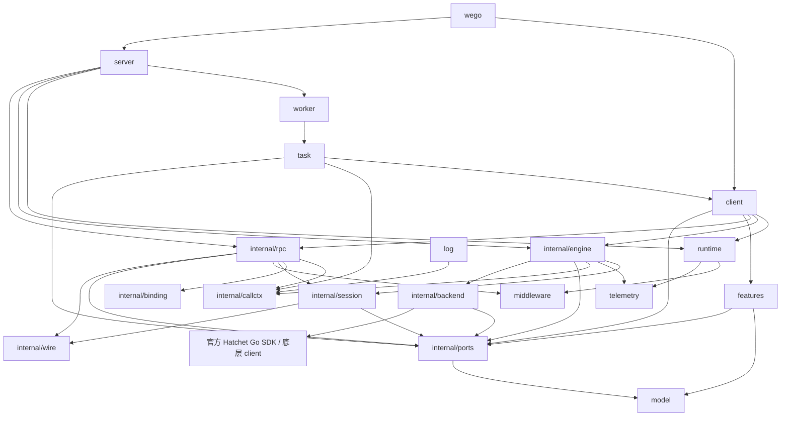

# wego SDK 功能与包结构

> 当前 SDK `0.1.11`，协议 `3`；Claude 评审的处理见 [claude-review-fixes.md](../claude-review-fixes.md)。禁止修改 Hatchet 源码，后端只适配官方执行器与协议。独立评审背景见 [review-context.md](../review-context.md)；完整验收以注明实际版本的 [报告](acceptance-report.md) 为准。使用方式见 [worker.md](worker.md)。

## 公开 API 约束

- 公开参数、返回值、字段、选项、枚举、回调及泛型约束均不得引用 Hatchet 类型；嵌套字段与动态返回值也遵守此规则。
- 不嵌入官方 Client，不通过类型别名或基于 Hatchet 结构定义新类型来透出其字段与方法；不提供 `RawClient` / `Unwrap` 等获取底层对象的入口。根包只可别名 wego 自有类型。
- `Run`、`RunNoWait`、`RunMany`、`Crons()`、`Events()` 等保留对应功能与调用形式；请求、结果、句柄和 Option 由 wego 定义，内部显式转换。
- Hatchet SDK、REST DTO 与内部 proto 仅由 `internal/backend` 导入；其他包通过 wego 自有能力接口调用。底层错误转换为 wego 错误或 gRPC status，不通过错误链泄露 Hatchet 实例。
- 标准库、gRPC、Protobuf、OpenTelemetry 类型可用于公开契约；应用不需要导入 Hatchet 包。

## 一、功能目录

| 功能 | 使用入口 | 实现归属 |
| --- | --- | --- |
| 网络 gRPC 与 Worker 开关 | `server.WithGRPC`、`runtime.WithDisableWorker` | `server` 管理网络入口，`internal/spec` 保存启用开关 |
| 创建连接、创建服务 | `wego.NewConn`、`wego.NewServer` | 根包转发至 `client`、`server` |
| 标准 gRPC unary 调用 | `pb.NewXXXClient(conn).Method(ctx, req)` | `client` → `internal/rpc` → `internal/backend` |
| 注册 unary 普通 / durable 任务 | `pb.RegisterXXXServer`、`worker.WithTask` / `WithDurableTask` | `server` → `internal/binding`、`internal/rpc` |
| client / server / bidi stream | 生成桩的 `Send`、`Recv`、`CloseSend`、`CloseAndRecv` | `internal/rpc` 适配接口，`internal/session` 管理会话 |
| 执行策略与容量 | `task.With*`、`worker.With*`、`runtime.WithSlots` / `WithDurableSlots` | `internal/spec` 保存配置，`internal/engine` 与 `internal/backend` 应用配置 |
| 任务信息、续期、不可重试错误 | `task.Info`、`WithRefreshTimeout`、`NonRetryable` | `task` → `internal/callctx`、`internal/ports` |
| 持久等待与子调用 | `task.Sleep`、`task.Client`、`WithChildKey` | `task` 与 `client` 保留 durable 上下文，委托 Hatchet |
| 日志及任务日志上报 | `log.Info` / `RInfo` 等、`runtime.WithLogger` / `WithLogReport` | `log`、`internal/callctx`、`internal/engine` |
| Trace 与 Metrics | `runtime.WithTelemetry(telemetry.Config{...})`、`task.Tracer` | `internal/telemetry` 创建实例资源，`internal/engine` 管理生命周期 |
| 中间件及载荷处理 | `runtime.WithMiddleware` | `middleware` 定义契约，`internal/rpc` 执行链 |
| Run / RunNoWait / RunMany | `conn.Run*` | `client` 的 wego 请求 / 结果句柄 → `internal/ports` → `internal/backend` |
| Cron、Schedule、Events、Filters 等 | `conn.Crons()` / `Schedules()` / `Events()` / `Filters()` 等 | wego `features` 客户端与 `model` 数据类型 → `internal/backend` |
| 取消、排空与关闭 | 调用 `ctx`、连接 `Close`、`runtime.WithShutdown` | `internal/engine` 协调，`internal/session` 清理会话 |

workflow、DAG、batch、条件、并发、限流、幂等及管理能力均通过 wego 自有 API 提供。已有 JSON workflow 的载荷语义保持兼容；RPC 使用 protobuf 与 gRPC 中间件。`conn.NewWorker` 返回 wego Worker 句柄，由调用者管理生命周期，不直接返回官方 Worker。

## 二、目录结构

以下为当前代码结构，SDK 使用独立 Go module 和 `sdks/wego` 包路径。开发时通过 SDK 内的 go.work 复用仓库模块，发行验证在 GOWORK=off 下使用未经修改的官方依赖。各包的 `doc.go` 用中文说明功能边界；同一职责集中组织，协议状态与资源生命周期分别管理。

```text
sdks/wego/
├── wego.go / version.go         # 构造入口、类型别名和 SDK 版本
├── CHANGELOG.md / README.md
├── client/api.go               # Conn / Run / Worker / Task 的公开业务门面
├── features/api.go             # 管理能力的公开业务门面
├── model/
│   ├── execution.go             # 执行策略、上下文信息、请求和错误
│   └── features.go              # 管理资源、触发器和认证参数
├── server/
│   ├── server.go                # 配置、双入口启动和运行错误
│   ├── registration.go          # 共享注册表及服务信息
│   ├── network.go               # 网络调用跟踪和取消
│   ├── worker.go                # Worker 方法绑定及业务 / 控制容量
│   └── lifecycle.go             # 统一排空、强制停止和资源清理
├── runtime/options.go           # Worker 开关、实例连接、容量、投影和关闭策略
├── worker/options.go            # 方法分类、默认策略和方法覆盖
├── task/
│   ├── options.go               # 重试、超时、容量、限流及 eviction
│   └── context.go               # 执行能力、durable 等待和子调用
├── log/log.go                   # 本地日志和任务日志上报
├── telemetry/config.go         # 仅 TraceConfig / MetricsConfig
├── middleware/middleware.go     # gRPC 拦截器与业务载荷变换
├── option/option.go             # 显式零值选项
├── internal/
│   ├── client/              # Conn、定义、执行、Worker 句柄与借用视图装配
│   ├── features/             # 管理调用、RPC 触发编码与订阅生命周期
│   ├── telemetry/           # 实例观测资源创建、flush 与关闭
│   ├── spec/runtime.go          # 实例配置、默认值和校验
│   ├── spec/task.go             # 任务策略、合并和校验
│   ├── ports/                   # 仅使用 wego 类型的能力接口
│   ├── binding/                 # gRPC 描述绑定及稳定任务名
│   ├── callctx/                 # context 执行能力和子任务键
│   ├── wire/
│   │   ├── envelope.go / metadata.go # protobuf 载荷、binary metadata 与 deadline
│   │   ├── projection.go        # 显式调度字段投影
│   │   ├── errors.go            # status、details 和错误元数据编码
│   │   └── frames.go / stream.* # 流帧编解码、协议与生成代码
│   ├── backend/
│   │   ├── backend.go           # 连接装配及所有权
│   │   ├── run.go / events.go   # 调度、结果、事件、日志接口
│   │   ├── features.go / feature_calls.go # 名称规则、编译期绑定与 REST 参数转换
│   │   ├── execution.go         # durable 能力和原始上下文
│   │   ├── handler.go           # handler 转换、上下文和取消
│   │   ├── worker.go            # 注册、启动、排空和关闭
│   │   ├── transport.go         # 分发、结果确认和注销观察
│   │   ├── options.go           # 任务和工作流选项转换
│   │   └── errors.go / convert.go / logger.go
│   ├── rpc/                     # unary 与三种流的 gRPC 接口适配
│   ├── session/
│   │   ├── manager.go           # owner 会话表、初始化、排空和清理
│   │   ├── control.go           # 服务端握手、输入帧和 ACK 状态机
│   │   ├── endpoint.go          # handler 收发、半关闭和最终状态
│   │   ├── client.go            # 客户端会话建立及订阅
│   │   ├── client_protocol.go   # 客户端帧校验、序号和故障
│   │   └── client_stream.go     # grpc.ClientStream 收发接口
│   └── engine/                  # 调用跟踪、观测、实例排空和关闭
├── examples/                    # 独立入口；scenarios 按场景拆分
├── tests/ / scripts/            # 质量门禁、引擎验收、生成和运行器
├── docs/                        # 设计、用法与历史验收证据
└── deployment/                  # 本机部署资料
```

## 三、公开包的功能与边界

| 包 | 功能与公开入口 | 边界 |
| --- | --- | --- |
| `wego` | `NewConn` / `NewServer`；`Conn` / `Server` 类型别名及 SDK 版本 | 构造函数分别转发 `client.New` / `server.New`，不保存状态或重复实现下层逻辑；其他包不反向依赖根包。 |
| `client` | `New` 创建 `Conn`；实现 `grpc.ClientConnInterface`；Run 系列、自有运行 / 定义 / Worker 句柄、连接配置与关闭入口 | 官方能力通过自有方法委托，禁止嵌入官方 Client。`Crons()` / `Events()` 等返回 wego `features` 客户端；`Close` 协调运行资源；不向业务传递 Hatchet 回调上下文。 |
| `features` | `RunsClient`、`CronsClient`、`SchedulesClient`、`EventsClient`、`FiltersClient` 及管理客户端 | 参数与结果使用 `model`；通过 `internal/ports` 调用后端，不返回官方 feature client、REST DTO 或 proto。公开门面位于 api.go，实现按能力分文件集中在 internal/features，不提供装配工厂。 |
| `model` | Run、Cron、Schedule、Event、Filter 与管理接口的请求、结果、状态、分页、标识等自有数据类型 | 纯数据与枚举，无连接、执行、生命周期或 SDK 句柄；字段独立声明，不别名或嵌入 Hatchet DTO。运行等待句柄归 `client`，任务策略归 `task`。 |
| `server` | `New`、`WithGRPC`；标准服务注册与服务信息；`Serve` / `Stop` / `GracefulStop` | 管理共享注册表、网络 listener 和双入口生命周期；网络直接执行 handler，Worker 绑定任务。Worker 专属策略只在启用 Worker 时校验，不实现任务流状态机。 |
| `runtime` | `WithDisableWorker`、`WithToken`、地址 / TLS / namespace、普通 / durable 容量、logger、日志上报、中间件、telemetry、shutdown 配置 | 公开包仅表达实例配置；配置文件由应用加载。Worker 的连接、goroutine、provider 与 metrics listener 归 `internal/engine`；网络 gRPC listener 归 `server`，不使用进程全局实例。 |
| `worker` | `WithTaskDefaults`、`WithTask`、`WithDurableTask`；按完整 RPC 方法名选择执行类型与策略 | 管理注册策略，不创建连接、不执行任务；多个 service 共用实例业务容量。流会话使用专门策略，不继承 unary 的自动重试，不能声明为 durable。 |
| `task` | 策略 Option；`Info`、`Client`、`Tracer`、`WithChildKey`、`WithRefreshTimeout`、`Sleep`、`NonRetryable` | 业务使用 `context.Context` 获取能力。普通任务、durable 任务、流会话能力分别校验；缺少上下文明确报错。持续续期随闭包结束停止；不管理实例生命周期。 |
| `log` | 基于 slog 的级别方法，以及 `RDebug` / `RInfo` / `RWarn` / `RError` | 普通方法只打印；R 系列按实例配置额外上报任务日志。通过 ctx 获取 logger、任务及 trace 信息，不设置全局 logger，不直接访问 Hatchet 连接。 |
| `telemetry` | Trace / Metrics 配置与 exporter 选项，实例资源工厂在 `internal/telemetry` | 使用当前实例连接信息，不重新从环境读取凭证；不替换 OTel 全局 provider。Hatchet 出口通过后端能力接入。Metrics 默认关闭，开启时管理 `/metrics` listener；与 `conn.Metrics()` 查询接口分开，资源关闭由 engine 协调。 |
| `middleware` | unary / stream 调用与消息拦截接口；载荷正反向处理接口 | 日志、压缩、加密、S3 卸载由使用方组装。规定执行顺序，不绑定存储或密钥系统；业务可变换 payload，协议控制字段由 SDK 管理。 |
| `option` | 泛型可选值，区分未设置、`0`、`false` | 纯值类型，不依赖其他 wego 包；用于策略继承与覆盖，不承载运行状态。 |

`task.Client(ctx)` 返回借用的 `client.Conn`，提供同一组 API；借用句柄的 `Close` 拒绝关闭共享资源。`NewConn` 创建的自有连接以及 `Server` 创建的实例分别由其创建入口负责关闭。

## 四、内部包的功能与边界

| 包 | 功能 | 边界 |
| --- | --- | --- |
| `internal/spec` | 保存 runtime、client、server、worker、task 配置值；默认值、显式覆盖、校验 | 无运行副作用；不得依赖 `client` / `server` / `worker` / `task`。合并必须保留显式 `0` / `false`，不能靠零值判断是否设置。 |
| `internal/ports` | 定义运行触发 / 等待、注册、管理、持久执行、日志、stream 传输等后端能力接口 | 签名只使用 wego 自有数据类型及标准依赖，不依赖 `internal/backend` 或公开 `client` / `features`；backend 实现接口，其他包消费接口。 |
| `internal/binding` | 从 `grpc.ServiceDesc` 保存 handler 与方法类型；完整方法名到稳定 Hatchet 名称的映射、namespace 与内部任务名隔离 | 不消费任务、不做编解码；映射规则供客户端与服务端共用。Worker 实例名与任务定义名分开；服务排序只影响实例命名。 |
| `internal/callctx` | 将 wego 任务信息、借用连接、logger、tracer 与执行能力绑定到 ctx | 不保存可被业务取出的 Hatchet 上下文，不依赖公开 client / server / task。经 `WithValue`、deadline、span 派生后仍可查找状态；原始上下文由 backend 私有保存，子调用经能力接口继续执行。 |
| `internal/wire` | protobuf 请求 / 响应、流帧与终态；JSON envelope / base64；gRPC metadata、status details 与不可重试标记的传输 | 协议与编解码，并按配置执行 Payload.Encode/Decode；不调用 Hatchet、不调度任务，gRPC interceptor 由 rpc/session 执行。RPC 载荷与原生 Hatchet JSON 输入保持各自语义，协议有显式版本。 |
| `internal/backend` | 私有持有官方 Client、句柄、执行上下文与 DTO；实现 ports；完成请求、结果、枚举、Option、回调及错误的双向适配 | 唯一导入 Hatchet 实现包的边界。保留事件与错误语义，返回自有类型；SDK 回调先转换成 wego 能力再调用上层。不依赖 `sdks/go/internal`，不包含 gRPC 业务 handler 或会话状态。 |
| `internal/rpc` | unary 的 `Invoke` 与服务端 handler 调用；实现 `grpc.ClientStream` / `ServerStream`；执行中间件、编解码及上下文桥接 | 负责 gRPC 方法语义及 header / trailer / status 映射；stream 操作委托 session，不自行保存第二套会话状态。普通与 durable unary 绑定 wego 的对应执行能力，不读取 SDK 上下文。 |
| `internal/session` | START / PING / READY / OPEN / DATA / ACK / END / CANCEL；固定 owner、序号、去重、窗口、半关闭、超时及资源清理 | 内存会话，无 durable 重放；handler 由会话任务承载。控制通道独立容量；通过 ports 传输，通过回调执行 handler，不导入 `internal/rpc` 或公开 client / server。 |
| `internal/engine` | 装配 backend、实例资源及会话管理器；初始化 logger bridge、跟踪在途调用并协调排空；控制任务定义及 Worker 启动由 server/worker.go 负责 | 管资源所有权与关闭顺序，不定义业务执行策略。依赖接口调用 RPC handler；不导入公开 client / server / task，不暴露全局单例。 |

`internal/wire` 的流帧至少包含协议版本、`stream_id`、帧类型、方向、序号 / ACK、payload。metadata 与 gRPC status 使用 protobuf 表达；最终响应、trailers、status 和末帧序号写入会话任务结果，订阅关闭本身不代表成功。

## 五、依赖与执行流程

箭头表示 Go 包依赖方向，省略叶子配置类型；依赖必须保持无环。只有 backend 可以依赖官方 SDK，model 与 ports 均不依赖官方 SDK。



选项的值存放于 `internal/spec`，公开包使用各自的 `Option` 构造这些值；`task` 的策略值与上下文实现分开，内部编译任务只读取 spec，不反向导入 `task`。`internal/callctx` 通过能力接口保存借用连接，`task.Client` 在公开层返回 `client.Conn`，避免循环依赖。`internal/engine` 装配 backend 实现并注入 ports；公开包只消费接口。


响应按反向链返回；流消息逐帧处理。载荷中间件只变换业务 payload，START / ACK / END 等控制信息由协议层保护；中间件不得破坏任务 ctx、父子运行身份与稳定 child key。

## 六、资源与关闭边界

Server 按启用入口管理资源：网络入口拥有原生 gRPC 与 listener；Worker 入口拥有后端 Client、业务与控制 Worker、会话、续期任务、日志上报队列、trace provider 和 metrics listener。纯网络模式不创建 Worker 资源；独立 Conn 拥有连接及客户端资源，不创建消费 Worker。SDK 创建的 exporter 随实例关闭；应用传入的 logger、exporter 和外部存储资源视为借用，排空 SDK 的批处理后不调用其关闭方法。


Server 的 `GracefulStop` 等待业务完成，`Stop` 可中断排空；Conn / 原生 Worker 的 `DrainUntilDone` 等待完成，`DrainWithTimeout` 到期请求取消。强制取消后注销和观测资源使用独立清理预算，默认 30 秒。控制通道最后关闭；业务代码须响应 ctx，Go goroutine 无法被强制终止。独立 Conn 关闭其调用与会话，不暂停其他实例 Worker。

## 七、实现范围

当前阶段按下方示例清单验收，功能按示例落实；包结构保留后续扩展边界。RPC 使用方式及三种 stream 设计沿用 `worker.md`；本阶段官方 streaming 示例验证任务输出流场景。

`examples` 使用标准生成的业务 proto；`tests/e2e` 验证实际调度、固定 owner、半关闭、取消、输出缺口及关闭行为。测试部署显式设置 `SERVER_SECURITY_CHECK_ENABLED=false`。`deployment` 是本地运行资料，不参与 SDK 初始化或发行。

API 检查覆盖公开签名、嵌套类型、匿名嵌入、动态结果与错误链；包依赖检查禁止 backend 之外导入 Hatchet 实现包。示例只导入 wego、标准依赖和业务生成桩。

代码实现与发行维护 wego 自身的版本及 changelog；通信协议版本由 `internal/wire` 单独管理。

## 八、当前阶段验收标准

验收基线为 `sdks/go/examples` 中上一轮列出的 standalone 示例：普通 23 个文件、durable 5 个文件、batch 1 个文件；`migration-guides/temporal.go` 同时属于普通与 durable，合计 **28 个不同源文件**。对应实现与示例已建立；逐项验收以第九节和最终报告为准。

示例改写至 `sdks/wego/examples`，按相同相对路径建立对应关系，配套 trigger、Worker、消费者一起改写。验收要求行为等价，使用 wego 自有 API；RPC 使用标准 proto 与生成桩，业务不导入 Hatchet 包。混合文件验收其中全部 standalone 场景及关联能力；迁移指南中的旧框架代码是对照资料。

### 1. 普通 StandaloneTask

| 官方源文件 | 必须验证的行为 |
| --- | --- |
| [simple/main.go](../../../go/examples/simple/main.go) | 定义与注册；同步、异步调用；结果读取；任务内子调用及并行调用。 |
| [retries/main.go](../../../go/examples/retries/main.go) | 重试次数、RetryCount、退避参数生效；不可重试错误停止重试。 |
| [concurrency/main.go](../../../go/examples/concurrency/main.go) | 分组并发、多个并发键、各取消策略及动态并发限制生效。 |
| [rate-limiting/main.go](../../../go/examples/rate-limiting/main.go) | 静态与动态限流正确约束任务执行。 |
| [slot-cost/main.go](../../../go/examples/slot-cost/main.go) | 多 slot 任务按成本占用容量；剩余容量限制分配。 |
| [runtime-affinity/main.go](../../../go/examples/runtime-affinity/main.go) | 每次运行指定 required label，实际执行实例符合路由要求。 |
| [sticky-workers/main.go](../../../go/examples/sticky-workers/main.go) | standalone 父子调用的 sticky 配置生效，可核对实际 Worker 标识。 |
| [child-workflows/main.go](../../../go/examples/child-workflows/main.go) | 顺序及并行子调用、结果汇总与错误处理。 |
| [cron/main.go](../../../go/examples/cron/main.go) | 多种 Cron 表达式注册并触发对应 standalone 任务。 |
| [events/main.go](../../../go/examples/events/main.go) | 事件发布、触发 standalone 任务及结果读取。 |
| [on-event/main.go](../../../go/examples/on-event/main.go) | 事件绑定、默认过滤器、过滤条件与 filter payload 读取。 |
| [webhooks/main.go](../../../go/examples/webhooks/main.go) | 示例中的 Webhook 类型可用受控 HTTP 请求触发，任务收到对应载荷。 |
| [idempotency/worker.go](../../../go/examples/idempotency/worker.go) | 幂等键及基于状态的幂等策略；重复提交返回可识别冲突与已有 RunID。 |
| [logs_test/main.go](../../../go/examples/logs_test/main.go) | 任务日志可上报、查询并关联到对应运行。 |
| [panic-handler/main.go](../../../go/examples/panic-handler/main.go) | 捕获业务 panic，调用配置的 panic handler，Worker 可继续工作。 |
| [opentelemetry_instrumentation/main.go](../../../go/examples/opentelemetry_instrumentation/main.go) | standalone 任务及关联调用的 trace 传播、业务子 span 与任务属性正确；配置的 exporter 收到 spans。 |
| [streaming/shared/task.go](../../../go/examples/streaming/shared/task.go) | Worker 发布输出块，客户端按序消费并取得最终结果；配套 Worker、消费者与 HTTP 转发可运行。 |
| [embedded/main.go](../../../go/examples/embedded/main.go) | 嵌入引擎启动、任务注册与调用、资源关闭。 |
| [stubs/stub-workflow.go](../../../go/examples/stubs/stub-workflow.go) | 任务定义模板可注册、调用并解码结果。 |
| [sdk-migration/main.go](../../../go/examples/sdk-migration/main.go) | 基础任务定义、Worker 启动及调用可通过 wego 完成。 |
| [sdk-migration/v1.go](../../../go/examples/sdk-migration/v1.go) | 事件绑定的 standalone 任务可通过 wego 注册、触发。 |
| [migration-guides/mergent.go](../../../go/examples/migration-guides/mergent.go) | 图像处理任务、嵌套结果与错误传播保持业务语义。 |
| [migration-guides/temporal.go](../../../go/examples/migration-guides/temporal.go) | 全部普通 standalone 片段可执行，覆盖子任务、重试、Cron、并发、限流、日志等关联能力。 |

### 2. StandaloneDurableTask

| 官方源文件 | 必须验证的行为 |
| --- | --- |
| [durable/sleep/main.go](../../../go/examples/durable/sleep/main.go) | 持久 Sleep；恢复后复用等待记录，不重新开始完整等待。 |
| [durable/event/main.go](../../../go/examples/durable/event/main.go) | 事件等待、过滤、scope、lookback 与可重放的 Now。 |
| [durable/eviction/main.go](../../../go/examples/durable/eviction/main.go) | TTL 驱逐、容量驱逐、禁用驱逐；等待完成后恢复并取得结果。 |
| [durable/eviction/trigger/main.go](../../../go/examples/durable/eviction/trigger/main.go) | 可驱逐任务的定义与触发；配套事件发布完成等待与恢复。 |
| [migration-guides/temporal.go](../../../go/examples/migration-guides/temporal.go) | 全部 durable 编排片段：子调用、持久等待、事件审批与并行子任务；恢复后复用已记录的等待及子运行结果。 |

### 3. StandaloneBatchTask

| 官方源文件 | 必须验证的行为 |
| --- | --- |
| [batch_assign/main.go](../../../go/examples/batch_assign/main.go) | 按大小 / 时间窗口聚合、按键分组、逐条结果映射及单结果广播。 |

### 4. 通过条件

- 每项均有可运行的 wego 示例和对应行为断言，包含源文件中的辅助函数与未在 main 调用的演示片段；只编译通过或仅 mock 后端不算通过。
- 在真实 Hatchet 引擎上验证任务注册、调度、结果、策略及事件；第三方业务依赖可使用受控 fixture。长时间等待允许缩短测试参数，仍须使用真实 durable 等待及恢复。
- 所有示例遵守公开 API 隔离约束；gRPC 适配路径验证 protobuf 请求 / 响应，公开类型、回调、动态结果及错误链不泄露 Hatchet 类型。
- 保存源文件到 wego 示例 / 验证用例的映射、执行命令及验证结果；清单全部通过后，当前阶段才算完成。

## 九、实施与质量门禁

本阶段验收 28 个官方源文件全部 standalone 场景及三种 gRPC 流；普通 / durable 示例优先标准 RPC，batch / Webhook 保留原生入口。RPC 使用 protobuf，CEL 字段通过共享配置显式投影到 `input.routing`。

| 阶段 | 交付 | 状态 |
| --- | --- | --- |
| P0 | 契约、包边界、配置与验收 manifest | 包结构、版本、协议、28 源文件 manifest 已实现；API 类型图与导入边界检查通过 |
| P1 | unary、结果、上下文及取消 | 同步/异步/批量、子调用、metadata/status/details/deadline 本机通过 |
| P2 | 策略、触发、管理、日志与 trace | 并发、affinity、sticky 子调用和 DAG、slot cost、限流、Cron/Schedule、5 组 Webhook、事件/过滤、日志、panic、Jaeger 与关联 DAG 本机通过 |
| P3 | durable、eviction、batch | sleep/event/filter/scope/lookback、TTL/容量/禁用驱逐、batch 3 种、子 RunID / Now 复用和 Worker 进程重启本机通过 |
| P4 | 三种流、故障、背压与半关闭 | 零/多消息、同时收发、半关闭、业务错误、取消及 9 组故障矩阵本机通过；协议 race / fuzz 通过 |
| P5 | middleware、排空、embedded、全清单 | 28 源文件 / 74 构造片段全量通过；middleware、两种排空策略、控制通道、并发 batch 预算取消和独立 embedded 通过；最终报告已生成 |

门禁：生成可复现、gofmt / vet / race、公开类型与动态结果隔离、上游回归、真实引擎断言、资源关闭。必需用例不得 Skip。CI 启动显式关闭 security check，MQ 使用 PostgreSQL。报告记录映射、命令、RunID、版本和清理结果，不记录凭证。

验收映射：[acceptance.json](../../examples/acceptance.json)，通过 Go AST 收集每个源文件中的全部 standalone 构造函数与所在函数（包括辅助函数）。运行器：[tests/e2e](../../tests/e2e)。本机入口自动读取已配置 token，不输出凭证：

```bash
sdks/wego/scripts/local-test.py go test -tags=e2e ./sdks/wego/tests/e2e/... -timeout 30m
go run ./sdks/wego/scripts/manifest -check
```

执行证据保存在 `.test-results/*.json`，每次仅记录实际运行场景。报告按稳定源片段 ID 及必需断言 ID 关联本轮执行证据；缺失、Skip、失败或场景错配不能生成 PASSED，区分 PASSED / FAILED / NOT_RUN，记录 RunID、必要 WorkerID / traceID、命令、工具与服务版本和清理结果。普通包及真实引擎流 / batch / 排空 race、API 隔离、生成复现、vet、上游回归、生命周期和协议 fuzz 已通过。最终逐片段断言、命令与运行标识见 [验收报告](acceptance-report.md) 和 [JSON 证据](acceptance-report.json)。

附加入口：`TestStreamFaults`、`TestDurableRestart`；embedded 使用 `go test -tags=e2e,wego_embedded ./sdks/wego/tests/e2e/... -run '^TestEmbedded$' -timeout 10m`。Embedded 子进程单独构建 Go module，使用独立 PostgreSQL 库和端口，避免环境变量影响普通测试。CI 模板：[tests/ci.yml](../../tests/ci.yml)，服务配置：[tests/compose.yml](../../tests/compose.yml)，均显式关闭 security check、使用 PostgreSQL MQ；未安装仓库工作流。

统一入口：`sdks/wego/scripts/acceptance.py`。仅在全部门禁及必需场景通过后生成完成报告；单次失败会保留日志并停止。CI 使用相同入口，服务启动显式设置 `SERVER_SECURITY_CHECK_ENABLED=false`。本机完成 2026-10-02 验收，基线 Hatchet `v0.107.0` / PostgreSQL MQ；托管 CI 尚未执行。

SDK `0.1.1` 可读性整理：按职责拆分后端、原生 Worker、功能客户端、流会话和示例；展开密集语句与配置，为边界、协议和生命周期补充中文注释。语法结构比对确认执行逻辑一致；gofmt、vet、单元测试、race、上游回归、API 隔离、生成复现及两个 embedded 独立模块编译通过。本机重新验证 `simple`、`grpc-streams`、`shutdown`，使用 Hatchet `v0.107.0` / PostgreSQL MQ；完整 28 源文件报告保留实际验收版本 `0.1.0`。

服务构造签名：`wego.NewServer(opts ...wego.ServerOption) *wego.Server`，`server.New(opts ...server.Option) *server.Server`。构造仅收集配置；`RegisterService` 共享服务定义，`GetServiceInfo` 查询注册信息。`Serve()` 自动监听配置地址并启动已启用入口；`Stop()` 立即取消，`GracefulStop()` 等待业务完成。Server 不提供 ServeContext / WaitReady / Shutdown，也不接管进程信号。

SDK `0.1.2` 验证：单元测试、vet、服务生命周期 race、API 隔离、生成复现及 embedded 独立模块编译通过。本机 `simple` / `grpc-streams` / `shutdown` 复验受 Hatchet `v1_payload` 时间分区缺失阻塞，不能计为通过；历史完整验收报告保留其原版本和实际结果。


### SDK 0.1.3：双入口边界与验收

- Runtime 保存 DisableWorker，默认 false；只控制 Server 的 Worker 入口。WithWorker 配置执行策略；原生 Worker 创建拒绝 DisableWorker，Conn 的任务调用仍然可用。
- 网络入口使用原生 gRPC，直接执行共享 handler；任务策略、payload middleware、任务身份和 durable 能力只属于 Worker 入口。纯网络模式不创建后端、嵌入引擎或 Worker telemetry。
- 网络原生选项由 server.WithGRPC 透传；本次不实现 ServeHTTP 或外部 listener。注册表与生命周期、网络调用、Worker 绑定分别组织；Worker protobuf 描述符仅在启用 Worker 时检查。
- 强制停止可中断排空，已有流排空时控制 Worker 保持可用；取消业务后仍给注销、上报和 telemetry 清理独立预算。
- 新增独立示例 examples/dual-entry 和 TestExamples/dual-entry；完整运行器将双入口纳入必需验收。
- 本机分区修复：为 2026-10-02 16:00 UTC 至 2026-10-03 00:00 UTC 的七个实际空档补建分区，不修改已有记录；旧上海时区边界与新 UTC 边界造成的缺口已补齐。
- SDK 0.1.3 完整复验通过：13 个质量门禁、28 源文件 / 74 构造片段、30 个示例场景 / 252 条断言、三种流与 9 组故障、durable 重启、batch 预算关闭、引擎 race 和独立 embedded；测试库已删除。
- 网络 TLS / unary / 三种流 / 原生 interceptor / stats / metadata / status details / deadline / cancel / 消息限制 / 生命周期 race 通过；dual-entry、simple、grpc-streams 独立程序退出码均为 0。
- 报告版本统一引用 wego.Version。本轮旧报告 emitter 的版本字面量已修正，并保留原标注及修正原因；断言和结果未改动。embedded 首次编译缺少 pgx 导入，修复后的真实引擎重试通过，门禁记录保留首次失败。
- 完成报告：[acceptance-report.md](acceptance-report.md)、[acceptance-report.json](acceptance-report.json)。命令和 RunID 保存在报告引用的 .test-results 文件；工作流和触发资源已删除，运行历史与引擎 Worker 记录保留。


### SDK 0.1.4：中文注释与维护门禁

- 覆盖 SDK、独立示例、单元测试、质量测试及真实引擎测试中的公开和私有声明、字段、常量、枚举、接口方法与局部变量。逻辑说明包含用途、结果、并发或生命周期约束及实际数据例子，例如 `ACK=3` 释放 1～3 的窗口、`END=2` 只半关闭输入、`Some(0)` 覆盖默认值。
- `.proto` 维护业务消息、字段与 RPC 的中文说明；固定生成流程同时补齐私有描述符、运行时缓存和适配器的说明，生成文件不手工维护。
- 新增 `TestDeclarationsHaveChineseComments`：检查所有 Go 文件（包括生成代码、测试和 embedded 独立模块），遗漏声明或短变量声明会报告文件及行号。门禁检查覆盖度，说明准确性与数据例子仍需源码校对。
- 此次不改变业务执行逻辑；现有 Go 文件去注释后语法树只有 SDK 版本常量变化，新增 Go 文件是中文注释门禁。完整引擎报告不改写为本版验收，测试范围及覆盖统计见 [中文注释验收报告](comment-report.md)。


### SDK 0.1.5：评审修复与边界

- R01～R15 的修复、定向回归及真实运行状态记录在 [review-fixes.md](review-fixes.md)。历史版本的阶段结果保留历史含义，不替代本轮门禁。
- SDK `0.1.5` 本机完整复验通过：13 个质量门禁、28 源文件 / 74 个片段的必需断言、30 个示例场景 / 252 条断言、三种流 / 9 组故障、durable 重启、batch、引擎 race 与独立 embedded。完整验收的 48 个 namespace 无剩余工作流定义，embedded 测试库已删除；运行历史和 Worker 记录保留。最终源码另行复查 format、unit、vet、race，独立 simple / grpc-streams / dual-entry 均成功；托管 CI 尚未执行。
- START 使用 `binding.Name(fullMethod)+"-start"`；每个控制 Worker 只注册自身支持的方法。后续会话控制使用共同任务名与 Required owner label。
- 每个 Worker 的本地实例键独立于显示名称；监听器完成通知、注销预算与注册 ID 按实例键隔离。注册/启动/提交使用调用 context，共享结果订阅由连接生命周期拥有。
- 协议 2 的 unary JSON metadata 使用 bytes/base64，流 metadata 使用 repeated bytes，错误结果遵守同一规则。客户端与 Worker 必须一起升级，拒绝其他版本，不提供协议 1 自动转换。
- `client`、`features` 是业务门面；`client`、`features` 与 `telemetry` 集中各自实现和内部装配。保留 session/rpc/wire/engine 的状态、语义、编码、所有权边界，不按文件大小合并这些职责。
- 管理操作使用明确方法和参数类型完成编译期绑定。亲和标签不得经过 JSON 转换；动态 REST 查询/资源仍由自有 Query/Resource 表达，这不是 Hatchet 全部 REST 字段的强类型保证。
- `WithCronInput(nil)` 明确清除默认输入；只改表达式保留输入，只改输入保留表达式。缓存删除后失效，旧查询不能重新写入缓存。Metrics 与主工作流客户端共享缓存及关闭所有权。
- 每个源片段的断言合同在 `examples/fragment_assertions.json`，稳定 ID 为“源文件::函数::构造”。运行器只记录实际成功断言，报告必须同时匹配场景、ID 和断言内容。

Worker gRPC 兼容范围与成本约束：

| 能力 | Worker 入口 | 网络入口 |
| --- | --- | --- |
| 生成桩、protobuf、metadata、headers/trailers、status/details | 显式适配，binary metadata 无损 | 原生 gRPC |
| deadline/cancel | 覆盖注册、提交、等待、payload I/O；远期触发不继承发布 deadline | 原生 gRPC |
| Header/Trailer CallOption、unary interceptor 传递/替换选项 | 使用实际 invoker 参数 | 原生 gRPC |
| Peer/TLS/网络 codec/压缩/连接重试 CallOption | Worker 任务传输没有相应网络语义，不声明全量兼容 | 通过原生 Conn / ServerOption 配置 |
| 三种流 | owner 内存会话、独立控制容量、有限窗口；无 durable 重放 | 原生 gRPC |

任务等待仍包含每运行 250ms REST 兜底轮询；控制 DATA/ACK 仍有任务调度与持久化成本。此版修复正确性，不宣称高频流的最优吞吐实现。下一次性能迭代应以消息速率、延迟、任务放大率及内存基准决定共享退避轮询和累计 ACK 合并，不能牺牲结果确认或背压。


### SDK 0.1.6：上游零修改与复审修复

- 实现、依赖、测试和 CI 模板均限定在 `sdks/wego`。已撤回 wego 引入的 21 处外部修改与 9 个外部新增文件。独立 `go.mod/go.sum/go.work` 承担 SDK 依赖，`scripts/check-upstream.py` 只读检查源码边界。
- 发行依赖固定官方 `v0.109.0`，不使用本地 `replace`；开发工作区复用仓库模块。新增发行依赖门禁，在 `GOWORK=off` 下验证单元测试及 embedded 适配层编译。官方 `v0.107.0` 客户端缺少关闭和带预算 memo 完成接口；服务端兼容性另在本机 `v0.107.0` 实例验证。
- embedded 子进程及独立示例也使用 `GOWORK=off` 和官方 `v0.109.0` 依赖，启动器从构建信息取得明确版本，迁移在独立测试库执行。
- `internal/backend` 复用官方 `pkg/worker` 执行器；工作流注册、分块提交、结果订阅和 durable 桥接由私有官方协议适配完成。仅内部保留 `pkg/client.Client`，不使用旧工作流定义系统，不暴露其类型。官方没有连接注入入口，因此执行连接和可取消协议连接分别拥有并统一关闭。
- 管理 Workflows/Metrics 无后台缓存；删除、重建始终查询实际定义。Cron/Schedule/Webhook 删除接受所有成功 2xx。无需上游缓存关闭、失效或连接注入补丁。
- RR01～RR05：启动预算贯通 Cron payload I/O；部分 RunMany 返回已确认句柄及自有部分提交错误；结果等待拥有独立可取消订阅；辅助 HTTP 轮询独立、每次最多 500ms，并在结果到达后取消回收；批量冲突保留成功与冲突身份。
- RR06～RR08：流取消保留 Canceled/DeadlineExceeded 和已有 status；致命错误优先于缓存 DATA；终态协议增加 `has_response`，零字节响应合法、零次响应返回 Internal、重复响应拒绝。客户端与 Worker 必须同时升级协议 3。
- durable 使用根执行已有 listener 与稳定 branch/node，不重新创建子 durable 上下文或修改原始 context。单任务 durable 输出恢复任务结果键；批处理输出校验完整成员集合，广播结果映射到各成员。
- `Now()` 在同一次 invocation 内共享已确认的时间，重复调用不新增 memo 节点；Worker 恢复执行从引擎读取原值。32 次并发调用与新 execution 恢复通过协议模拟验证，真实 durable-sleep 场景复跑三次通过。
- 远端子任务不依赖父 Worker 的本地注册信息：先等待 durable 日志完成，再用已确认 RunID 读取任务名到输出的持久映射；不再次提交子运行。
- 本轮完整验收通过 15 项质量门禁、28 源文件 / 74 片段、30 个示例场景；三种流、9 组故障、durable 重启、batch 预算、引擎 race 和独立 embedded 全部通过。最终代码另行验证发行依赖、vet、race、格式与源码边界；跨 Worker durable 子结果额外 race 复跑三次通过。先前版本报告仅为历史证据，当前结果见 [acceptance-report.md](acceptance-report.md)。CI 模板位于 `tests/ci.yml`，未修改 `.github` 或注册托管 CI。


### SDK 0.1.7：并发边界与结果读取

- ACK 协调集中在 `internal/backend`：按 invocation 串行登记 Sleep / WaitEvent / Now / 子提交，只锁到引擎确认；长期等待释放登记权。已发送请求取消后隔离迟到 ACK，根 invocation 退出清理登记。
- 同一 durable branch/node 只登记一次底层结果监听；观察者各自取消，暂时没有观察者仍保留唯一根监听，监听随根退出清理，缓存随执行视图释放；完成结果交付字节副本。驱逐引用计数及取消函数均绑定具体 invocation 记录，迟到确认不能取消恢复执行。根入口在业务启动前串行绑定一次派生执行预算，取消状态同时供官方结果上报判断使用，子调用不重建上下文或并发改写原始 context。
- 普通批量累计所有分块的成功身份、冲突和其他错误；durable 按数量与字节分块，后续失败仍返回已确认句柄、输入下标和 PartialSubmissionError。
- `Runtime.Clone` 统一复制标签、两层投影、选项容器、TLS 和 embedded 配置；能力对象由原所有者管理。Worker 创建失败不能改变 Conn。原生 `WithWorkerRuntime` 只允许容量（Slots / DurableSlots）、标签和日志局部覆盖，其他实例配置变化明确报错。
- `ports.FeatureRequest` 为封闭命令集合，参数使用自有类型与命名字段；字符串操作名和动态位置参数只存在于 backend 的官方适配。公开 Resource / Query 保留 JSON 扩展能力，不作为执行策略或协议身份。
- `Result.IntoContext(ctx, target)` 为对象下载提供独立预算并登记 Conn 生命周期；`Into` 默认使用关闭预算。JSON 字符串不猜测内容，显式 null 区分缺失键。
- 流 RUN 提交受握手预算约束，取消后确认输出订阅及结果等待退出再释放实例登记；强制排空后先确认 SDK 在途 I/O 退出再释放后端。
- trace 的协议属性引用 `wire.Version`，与协议 3 一致。质量门禁同时检查工作区和未经修改的官方发行依赖；最终本机结果见 [验收报告](acceptance-report.md)。


流性能的基线与适用范围：`TestReviewStreamingCost` 在本机 PostgreSQL MQ 上测量单会话、256 字节请求的 8 次串行 bidi 往返，记录实际握手/往返耗时及 START / RUN / PING / OPEN / DATA / ACK / END 任务计数。每条输入 DATA 和每条输出 ACK 都要提交控制任务；输出发布和辅助 REST 查询另有成本。此测试不作为跨机器吞吐保证，不能据此宣称高频流最优。最终数值与运行命令保存在验收报告的 `stream-cost` 证据中；需要低延迟直接执行 handler 时可使用已有网络 gRPC 入口。


本轮复审问题与回归定位（F01～F11）：

| 问题 | 实现与边界 | 回归测试 |
| --- | --- | --- |
| F01：durable ACK 登记互相覆盖 | `backend/durable.go` 串行确认、隔离迟到 ACK；确认后释放锁，不串行长期等待 | `TestSyncReviewConcurrentSleepAndNow`、`TestCancelledAckDrainsBeforeNextRequest` |
| F02：durable 后续分块失败丢失成功结果 | `backend/durable_submit.go` 保存已确认 RunID / InputIndex；返回部分成功和错误，拒绝空身份 ACK | `TestSyncReviewDurablePartialSubmission`、`TestDurableMissingIdentityAck` |
| F03：普通批量只保存首块冲突 | `backend/run.go` 累计所有冲突、成功身份及其他分块错误；1002 条输入按 1000 / 2 分块验证 | `TestIndependentReviewValidBulkCollisionChunks`、`TestBulkConflictPreservesOtherChunkError` |
| F04：旧 invocation 释放或取消影响恢复执行 | `backend/native_worker.go` 等待计数、驱逐候选及取消函数绑定具体执行记录 | `TestSyncReviewOldInvocationWaitRelease`、`TestLateEvictionCancelsOnlyCapturedInvocation`；真实 durable eviction / restart |
| F05：流 RUN 提交无限等待 | `session/client.go` 将 RUN 纳入握手预算 | `TestSyncReviewHandshakeBudgetIncludesRUN` |
| F06：流清理过早结束 | `session/client.go` 初始化屏障及等待组确认 Stream / Wait goroutine 退出；控制取消仍可发送 | `TestSyncReviewStreamCleanupJoinsOwnedGoroutines`；真实 stream faults / shutdown |
| F07：JSON 字符串被猜测为 JSON 片段 | `rpc/unary.go` 按原值编码；字符串 `"7"` 仍为字符串，显式 `json.RawMessage` 保持原语义 | `TestSyncReviewJSONStringOutput`、`TestSyncReviewDecodeJSONDoesNotChangeJSONString` |
| F08：合法 null 输出被判为缺失 | `client/run.go` 单独记录键存在性；null 可解码为 nil，缺失键返回错误 | `TestSyncReviewSelectedNullOutput` |
| F09：Worker 配置污染 Conn | `spec/runtime.go` 深复制可变容器；`client/worker.go` 只允许局部容量、标签、日志覆盖 | `TestRuntimeCloneOwnership`、`TestSyncReviewWorkerProjectionIsolation`、`TestWorkerRuntimeBoundary` |
| F10：结果下载缺少预算及生命周期 | `Result.IntoContext` 登记实例 I/O；强制关闭先取消并等待 SDK I/O，再释放后端；内存结果读取无额外连接要求 | `TestResultDecodeBudgetsAndShutdown`、`TestOwnedIOCleanupPrecedesBackendRelease` |
| F11：多个 durable Result 观察者覆盖监听 | `backend/durable.go` 按 branch/node 共享根监听；观察者独立取消，完成结果可重复读取且交付副本 | `TestIndependentReviewConcurrentDurableResultWaiters`、`TestSharedResultCompletionCancellationRace`；真实 `TestIndependentReviewDurableSharedResult` |

额外修正：trace 协议属性由常量统一提供（`TestSpanUsesActualProtocolVersion`）；修正任务命名注释；管理调用改为封闭的类型化请求。新增文件集中在已有职责包，没有新增公开包。官方 Worker 的底层 `pkg/client.Client` 仅作为 backend 私有适配依赖，公开 wego API、动态结果及错误链继续执行隔离门禁。


复验过程保留：一次长套件运行的延迟订阅握手耗尽 8 秒测试预算；相同配置随后连续 3 次通过（约 4.7～5.9 秒）。真实故障测试改用 20 秒握手预算及 30 秒初始化 TTL，保留 800 毫秒延迟注入、READY 后才 OPEN 的断言和 75 秒场景总预算；SDK 默认握手预算仍为 10 秒。受控单元测试继续验证 RUN 黑洞必须被握手预算取消，未通过增加预算移除超时约束。失败日志保留在 `.test-results/fix-acceptance-final.log` 和对应 gate 日志，最终报告只采用重新运行的通过证据。


另一次完整复验中，middleware 的最后一条取消用 bidi 流在 30 秒握手预算内未就绪；相同配置随后连续 3 次完整通过（约 42～55 秒），没有改变此场景的预算。当前未定位到会话容量释放错误，不能将单次超时解释为已修复的 SDK 缺陷；失败日志保留在 `.test-results/fix-acceptance-verified.log` 和对应 gate 日志，最终完整复验另行执行。Worker 传输仍受本机任务调度与 PostgreSQL MQ 状态影响，调用方应显式设置符合业务需求的握手及总调用预算。


补充发现 F12：`Now` 恢复到 `MemoAlreadyExisted=true` 但 payload 为空的记录时，必须补算并发送 CompleteMemo，不能将空载荷当作已完成时间。`execution.Now` 与官方 memo 执行语义一致；`TestNowCompletesPendingMemo` 通过真实 listener 验证引用、完成通知中的时间与业务返回值相同，同一 invocation 再读取不增加 memo 节点。该修复在完整验收运行期间补入，最终源码另行执行 unit / vet / race、发行依赖及真实 durable 复验，不能将先前构建自动当作此边界的证据。


0.1.7 本机完整复验完成于 2026-10-07T11:29:11.102801+00:00：15 项质量门禁、28 个源文件 / 74 个片段、30 个示例场景 / 252 条必需断言全部通过；三种流、9 组故障、durable 重启、batch 预算、真实引擎 race 和独立 embedded 均通过。Hatchet 为 v0.107.0，MQ 为 PostgreSQL；发行依赖为未经修改的官方 v0.109.0。测试工作流和触发资源已删除，embedded 测试库已删除，运行历史及引擎 Worker 记录保留；托管 CI 未执行。

最终 race 性能样本：8 条 256 字节 bidi 请求共提交 22 个任务（DATA 8、ACK 8、START / RUN / OPEN / END 各 1、PING 2）；握手约 1962ms，往返最小 / 中位 / 最大约 68 / 615 / 2085ms。此为包含 race 运行开销的单机单会话 Worker 传输样本；输出发布与辅助 REST 查询未计入任务数。

最终源码补充检查已全部通过：unit / vet / race、GOWORK=off 官方发行依赖、Hatchet 源码边界、真实 durable 等待 / 驱逐 / 重启。F01～F11 与补充 F12 的状态和源码摘要记录在 [本轮修复记录](review-fixes-0.1.7.json)，实际命令与日志记录在验收 JSON 的 `final_source_checks`。

### SDK 0.1.9：Claude 评审修复

- PING 与 READY 分开等待，最多一个在途 PING，250ms～1s 退避；握手总 deadline 保持为唯一预算。READY 后取消并回收 PING 等待再 OPEN。
- CANCEL 独立预算默认 5 秒；握手、取消与传输退出记录阶段诊断，自有 I/O 超时记录编号、类别、耗时和数量，logger 在锁外调用。
- 结果辅助轮询由 Runtime 配置，默认 1 秒，查询完成后再计时；原生 Worker 禁止覆盖 Conn 的轮询策略。
- ACK 协调响应根生命周期退出，但不能用任意超时释放活跃 invocation 的确认槽；增加 Stop / CleanupTaskState / 根取消回归。
- model 按文件分离 DTO / 策略 / 错误；内部实现包名称为 internal/client、internal/features、internal/telemetry，公开包路径不变。
- 真实 pending memo 丢帧后两次 Worker 重启、补算持久复用与四会话并发流成本均有独立 E2E；验收运行器要求本轮实际版本的对应证据，不能用普通重启或串行样本替代。
- 历史 0.1.7 报告另存版本化文件；当前验收状态以实际生成报告为准。改动限定 SDK、MQ 仍为 PostgreSQL，不增加 token 日志或 RabbitMQ 性能对比。

0.1.9 完整验收完成于 `2026-10-07T13:03:39.865221+00:00`：15 门禁、28 源文件/74 片段、30 示例场景/252 必需断言、9 组流故障、真实 engine race 和 embedded 均通过；pending memo 补算后再次恢复证明持久复用，四会话并发样本纳入必需证据。Hatchet v0.107.0、PostgreSQL MQ。测试定义/触发资源与 embedded 数据库已清理，历史记录保留，托管 CI 未执行。最终源码摘要及处理结果见 [修复 JSON](../claude-review-fixes.json)。

### SDK 0.1.10：深度质量与热路径优化

- 双向累计 ACK 只遍历新增确认范围；订阅及控制结果都先校验上界，重复确认不重复释放。序号窗口以差值比较，耗尽时禁止回绕。
- 广播通道在等待者持锁登记时懒创建，无等待者的连续状态变化合并；不采用可能丢失唤醒的临时 goroutine + sync.Cond 桥接。故障检查与输入消费保持原子性。
- 控制入口统一临界区，DATA、END、ACK 各自处理对应方向状态；READY 在锁外发布。端点按值分组保存生命周期、输入、输出和响应，不增加独立锁或额外对象分配。
- 原始 JSON 字节直接解码；消息缓存保持独立所有权并使用精确切片容量。默认窗口预分配有界，巨大配置不触发巨大初始申请。
- 所有新增源码及测试保留中文声明与逻辑说明。基准、边界回归和本轮完整验收证据见 [深度评审完成报告](../deep-quality-fixes.md)；不以未测量的百分比作为完成证据。

0.1.10 完整复验完成于 `2026-10-07T15:14:27.098397+00:00`：15 门禁、28 源文件 / 74 片段、30 示例 / 252 必需断言及全部流故障、durable 恢复、真实引擎 race、embedded 均通过。额外修复事件示例异步查询记录可见性等待。前序引擎分派阻塞与重启、事件 404、局部性能收益和局限均记录在 [完成报告](../deep-quality-fixes.md)，不隐去失败历史。Hatchet 源码及根依赖未改，MQ 仍为 PostgreSQL。

### SDK 0.1.11：简洁性与官方最新实例复验

- 处理 `CONCISENESS_REVIEW.md` 的 C-001～C-006：清理机械性局部注释，保留声明与协议约束；复用 protobuf 校验与错误出口，命名窗口和输出缺口判断。
- 中文注释门禁覆盖公开与私有声明、字段、枚举及测试，短变量和循环使用逻辑块说明；局部锁内快照不会为减少行数而删除。
- 本机镜像统一升级至官方 `v0.110.5`，完成数据库、认证配置备份与迁移，沿用 PostgreSQL MQ、明文 gRPC 和 trace。
- 本轮最终验收与原始基准见 [处理报告](../conciseness-fixes.md)。0.1.10 的完整验收保留为 [历史报告](acceptance-report-0.1.10.json)，不改写其运行版本。

0.1.11 最终完整验收完成于 `2026-10-07T15:49:59.866491+00:00`：15 门禁、28 源文件 / 74 片段、30 示例 / 252 必需断言、9 组流故障及全部恢复、race、embedded 场景通过。普通真实引擎采用官方 v0.110.5 镜像，PostgreSQL MQ；schema 20261002182802，最终 Engine / Dashboard healthy，任务运行时与近期活跃 Worker 数均为 0。源码与根依赖未改，测试定义和 embedded 数据库已清理，历史记录保留。实际减量、性能波动与源码摘要见 [本轮完成报告](../conciseness-fixes.md)。
