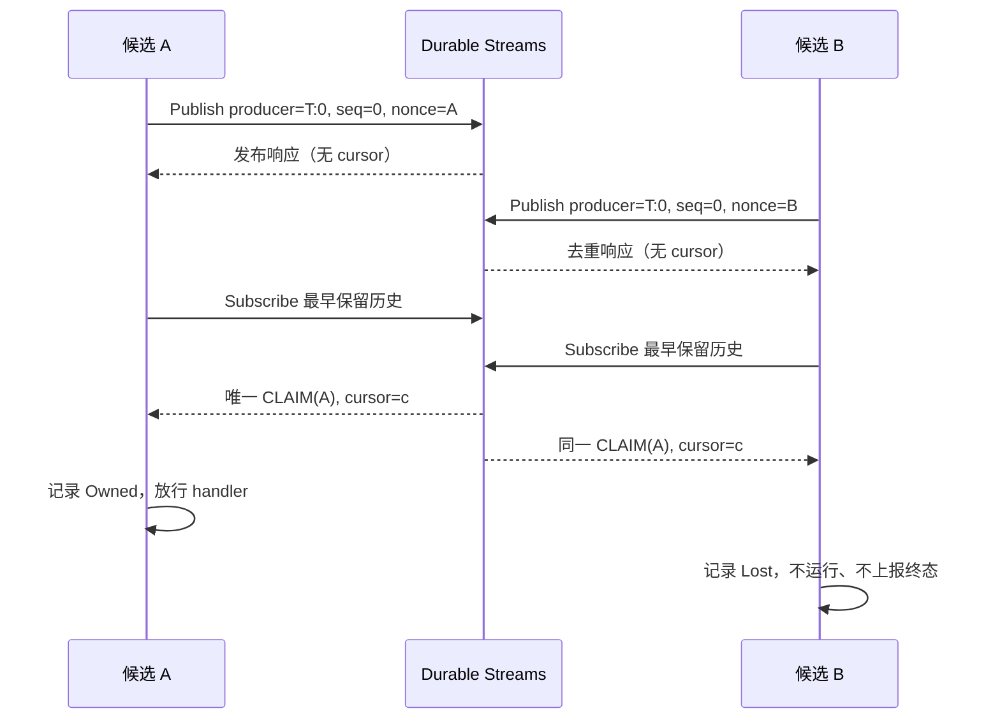
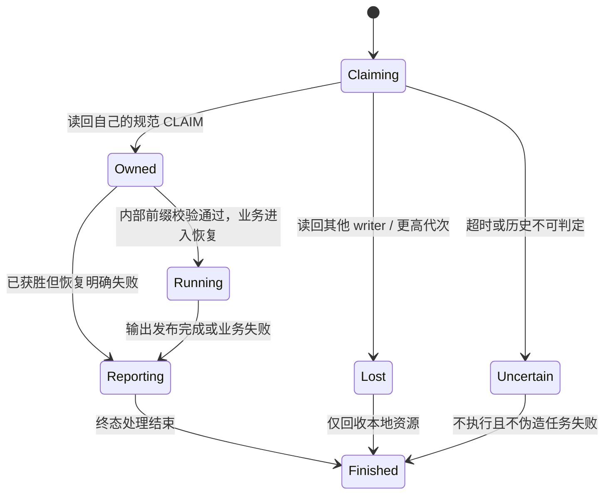

# wego SDK v0.2.0：背景、协议设计与实施计划（评审修订稿）

> 修订日期：2026-10-09。评审输入：[Claude 评审报告](v0.2.0-review.md)。
>
> 状态：P0–P5 已完成。SDK `0.2.0` 的 18 项质量门禁、28 个源文件/74 个构造片段与全部必需真实引擎验收通过。阶段证据见 [P0](v0.2.0-p0-report.md)、[P1](v0.2.0-p1-report.md)、[P2](v0.2.0-p2-report.md)、[P3](v0.2.0-p3-report.md)、[P4](v0.2.0-p4-report.md)、[P5](v0.2.0-p5-report.md)，最终命令与身份见 [验收报告](acceptance-report.md)。
>
> SDK `0.2.0`，官方发行依赖 `v0.110.5`；公开 RPC 与持久日志协议均为 `4`。版本号不代表验收自动通过；所有必需场景通过后才生成完成报告。

## 一、背景、范围与核验依据

### 1. 项目与当前基线

wego 在 Hatchet 之上提供标准 gRPC 编程入口：`Conn` 实现 `grpc.ClientConnInterface`，`Server` 实现 `grpc.ServiceRegistrar`。生成客户端和业务 handler 可以使用任务入口，也可以使用网络 gRPC 入口。

本次评审的代码基线为 SDK `0.1.12`、协议 `3`，独立模块依赖 Hatchet `v0.109.0`。现有实现包含 unary、三种流、standalone、durable、batch、管理客户端、观测和载荷中间件。当前流实现使用 START、SESSION、控制 workflow 和独立控制 Worker；业务载荷是 protobuf 二进制 envelope，CEL 字段来自显式投影。

本次重构目标：**一个 RPC 对应一个 StandaloneTask，输入一次提交，输出逐条发布。** 去掉 START/SESSION 分离调度、控制 workflow、控制 Worker 和输入方向的跨进程会话。

- client stream：本地缓冲输入，关闭发送后一次提交。
- server stream：一次请求，流式输出。
- bidi stream：任务入口为整批输入、流式输出；需要交互式双向通信时使用网络 gRPC。
- 任务从调度到 handler 完成正常占用业务 slots，不提前释放。

### 2. 不变的工程边界

- 只修改 `sdks/wego/**`；禁止修改 Hatchet 源码、根模块依赖或依赖未发布补丁。
- 只有 `internal/backend` 导入 Hatchet 实现；公开签名、回调、动态结果及错误链均使用 wego 自有类型。
- 使用官方正式镜像和 PostgreSQL MQ，不依赖 RabbitMQ。
- 实例持有自己的配置、连接和 telemetry provider，不替换全局 OTel provider。
- 普通和 durable handler 使用 `context.Context`；网络 handler 不伪造任务身份。
- 不承诺业务副作用 exactly-once；外部写入仍需要业务幂等或事务约束。

### 3. 官方能力核验与适配决定

截至 **2026-10-09**，最新正式版本为 [v0.110.5](https://github.com/hatchet-dev/hatchet/releases/tag/v0.110.5)。本机已使用该版本官方镜像，API 为 `http://localhost:8080`，gRPC 为 `localhost:7077`，使用 PostgreSQL MQ。P0 已通过独立发行依赖、真实引擎和 race 验证；范围及保留限制见阶段报告。

本轮同时检查 main 快照 `d5cd976c01a60b82d00712c3ad9843017b28237d`，但运行验收以固定正式版为准；不把 main 的新增接口当成正式版能力。

| 能力 | 源码核验结果 | 本计划处理 |
|---|---|---|
| Durable Streams | v0.110.5 提供持久 Publish、带游标 Subscribe、producer 序号去重 | Reliable 的基础能力，P0 已验证组合协议 |
| Go 高层客户端 | 正式版已有 `Client.Streams()`，不是“Go SDK 尚无 Streams” | 检查其语义是否满足协议，而非仅检查方法是否存在 |
| 发布身份控制 | 高层及 `pkg/client` 的发布入口不接受调用方指定 producer/seq；不明确错误可能使底层切换 producer | backend 直接使用正式版生成协议，显式控制 producer/seq/重试 |
| 订阅错误 | 高层 `Events()` 返回消息 channel，错误写日志后关闭 channel | backend 保留消息、hangup、游标和错误，禁止将关闭误判为 EOF |
| Publish 返回值 | `PublishStreamMessageResponse` 为空 | 游标必须通过订阅读回取得，不能从 Publish 获取 |
| topic 元数据 | main 的协议有 `GetTopicMetadata`；v0.110.5 没有 | 启动和 CLAIM 不能依赖此接口 |
| 幂等冲突 | `IdempotencyCollisionError.existing_run_external_id` 已存在 | 转换为 `model.IdempotencyCollisionError.ExistingRunID` |
| 任务结果上报 | 上报携带 RetryCount；引擎终结路径过滤非当前 retry，没有 writer nonce 条件 | 跨代次依赖官方 retry 隔离，同代次依赖 wego 本地上报门禁 |
| `PutStream` | 运行关联的实时输出，不提供 Durable Streams 的持久 topic 和游标恢复 | 只用于显式 Realtime 模式 |

源码依据：

- [正式版 Streams 协议](https://github.com/hatchet-dev/hatchet/blob/v0.110.5/api-contracts/v1/streams.proto)、[存储与顺序](https://github.com/hatchet-dev/hatchet/blob/v0.110.5/pkg/repository/sqlcv1/streams.sql)、[限制与 producer 保留](https://github.com/hatchet-dev/hatchet/blob/v0.110.5/pkg/repository/streams.go)。
- [Go 高层 Streams](https://github.com/hatchet-dev/hatchet/blob/v0.110.5/sdks/go/features/streams.go)、[底层发布与订阅](https://github.com/hatchet-dev/hatchet/blob/v0.110.5/pkg/client/streams.go)。
- [幂等冲突协议](https://github.com/hatchet-dev/hatchet/blob/v0.110.5/api-contracts/v1/workflows.proto)、本地既有转换 `internal/backend/errors.go`。
- [dispatcher 上报](https://github.com/hatchet-dev/hatchet/blob/v0.110.5/internal/services/dispatcher/server.go)、[任务终结过滤](https://github.com/hatchet-dev/hatchet/blob/v0.110.5/pkg/repository/task.go)、[按 retry 释放运行资源](https://github.com/hatchet-dev/hatchet/blob/v0.110.5/pkg/repository/sqlcv1/tasks-overwrite.go)。

P0 已在 wego 独立模块将依赖固定到验收使用的正式版本，使用其现成生成协议，不复制或重新生成 Hatchet 源码。当前 wego 模块路径位于 `github.com/hatchet-dev/hatchet/` 下，backend 已使用官方 internal 协议；发行门禁必须以 `GOWORK=off` 验证该依赖方式，不能借工作区绕过缺失接口。

## 二、身份、命名与注册

### 1. Worker 身份

`worker_key` 是 **每个 Worker 实例本次启动的随机 UUID**，复用 backend 现有身份机制。

- 同机双进程、同进程双实例各不相同。
- 同一实例网络重连保持 key；重新创建实例生成新 key。
- 不从 hostname、PID 或展示名称推导，不提供 `WithWorkerKey`。
- 用于定向事件寻址，不再建立语义重复的“实例 ID”。

另外保留 `writer_nonce`：它标识一次实际执行，不是 Worker 身份。同一 Worker 的不同执行必须有不同 nonce。

### 2. Worker 展示名称

默认 namespace 为空。默认展示名称为：

```text
namespace 非空：<namespace>-<hostname>-<worker_key 去掉连字符后的前12位>
namespace 为空：<hostname>-<worker_key 去掉连字符后的前12位>
```

`runtime.WithInstanceName("processor")` 覆盖完整展示名称。展示名称允许重复，不影响 Worker 注册身份、任务所有权、硬亲和性或通知地址。

启动日志同时记录 `instance_name`、`worker_key`、namespace 和引擎分配的 WorkerID，便于区分同名副本。名称只用于展示；定向通知使用完整 worker_key。

### 3. RPC workflow 与内部 action

workflow 展示名称：

```text
<namespace>-<完整 protobuf 服务名>-<方法名>
```

namespace 为空时省略该部分及连接符；保留大小写，不加 `wego`、`wego-rpc` 或摘要后缀，不静默截断。

内部 action 由官方执行器路由，执行器会转为小写。若直接使用方法名，`SayHello` 与 `Sayhello` 会冲突。因此内部 action 使用：

```text
digest = hex(SHA256(UTF8(namespace) || 0x00 || UTF8(fullMethod)))
action = "rpc_" + digest + ":invoke"
```

使用完整 64 位十六进制摘要，不使用有歧义的字符串直接拼接，也不截取 12 位。分隔符 NUL 只参与摘要输入，不进入名称。`rpc_` 是内部 action 的类型标记，不是 workflow 或 Worker 展示前缀。

以下 namespace 均为示例值 `demo`；摘要栏只缩写展示，实际 action 使用完整摘要：

| fullMethod | workflow 名称 | action 摘要开头 |
|---|---|---|
| `/demo.Greeter/SayHello` | `demo-demo.Greeter-SayHello` | `57c3a693349e4936…` |
| `/demo.Greeter/Sayhello` | `demo-demo.Greeter-Sayhello` | `f3d53671c75c8ba3…` |
| `/Demo.Greeter/SayHello` | `demo-Demo.Greeter-SayHello` | `e424a4d8776def16…` |

客户端、Worker、Cron、Schedule、Event 和运行查询统一使用同一绑定记录：namespace、fullMethod、workflow 名称、action、协议版本、RPC 形态和流模式。不能在不同路径重复添加 namespace；不能用字符串前缀猜测 RPC 类型。

原生 JSON 任务继续使用自己的命名规则。注册时校验最终名称、RPC/native 名称冲突及绑定冲突；两个不同绑定映射到同名时明确失败。多副本不把 worker_key、随机值和启动时间写入 workflow 定义。

### 4. workflow 生命周期

同一 tenant、namespace、方法由多个副本共享一份 workflow。六个 RPC 启动两个相同 Worker，仍为六份 workflow；更换 namespace 才产生另一组。

定义一致应复用版本，定义变化才创建新版本；handler 代码变化不一定改变定义 checksum。并发首次注册和版本复用必须通过真实引擎验证。

Worker 停止不自动删除或暂停 workflow。workflow 是持久定义，供其他副本、触发器和历史运行使用。控制台 Active 表示未暂停，不代表有 Worker 在线；永久下线使用明确管理操作。

## 三、公开 API 与配置边界

### 1. Server 双入口

```go
srv := wego.NewServer(
    server.WithRuntime(
        runtime.WithNamespace("demo"),
        runtime.WithInstanceName("processor"),
    ),
)
pb.RegisterGreeterServer(srv, &greeter{})
if err := srv.Serve(); err != nil {
    log.Fatal(err)
}
```

Server 继续只公开 `RegisterService`、`GetServiceInfo`、`Serve`、`Stop`、`GracefulStop`。

- `server.WithGRPC` 只配置网络入口及原生 gRPC ServerOption。
- `runtime.WithDisableWorker` 禁止 Server 创建任务后端和 Worker 资源；纯网络模式不需要 token。
- 禁用 Worker 不禁止 Conn 提交任务；直接创建原生 Worker 与此配置冲突时明确报错。
- `WithWorker` 只配置任务执行策略；网络入口不应用这些策略。
- 不新增 ServeHTTP、外部 listener 或网络请求转任务执行。
- 网络 handler 调用任务身份、durable、checkpoint 能力时返回明确错误。

### 2. ProtoJSON 与 routing

业务消息使用 `protojson`，设置 `UseProtoNames=true`，解码保留 protobuf 类型规则。不直接使用 `encoding/json` 处理生成结构体。

协议 v4 的 JSON envelope 保存 `version`、`method`、`payload`、`routing`、metadata、trace、deadline、调用幂等字段及恢复身份校验信息。

| RPC | 还原业务 codec 后的逻辑 payload 形状 |
|---|---|
| unary、server stream | 一个 ProtoJSON 请求对象 |
| client stream、bidi stream | ProtoJSON 请求数组，空流为 `[]` |

```go
runtime.WithRoutingDefaults(fullMethod, map[string]any{
    "group": "default",
    "cost":  1,
})

ctx = client.WithRouting(ctx, map[string]any{
    "group": "group-a",
    "cost":  3,
})
```

- 调用配置位于 `client`，默认配置位于 `runtime`；不增加顶层 `wego.WithRouting`。
- 调用值按顶层键覆盖默认值；嵌套对象整体覆盖，显式 null 保留。
- 保存独立快照；闭包、channel、NaN、循环引用等非法 JSON 值在提交前报错，不 panic。
- 一批输入只用一份 routing，CEL 统一读取 `input.routing.*`。
- 删除 `WithInputProjection`；`model.RPCInput` 增加 Routing，服务于 Cron、Schedule、Event 的 unary 输入，不新增流触发器入口。
- Hatchet 调度必须读取的 `input.routing` 留在任务外层，不进入 codec；流协议字段与业务 DATA 则一起经过 codec，不为控制帧设置旁路。

ProtoJSON 的 int64 可能是字符串，bytes 是 base64，枚举使用名称，默认值可能省略。调度表达式不要假设它等同普通 Go JSON；routing 中的数值也必须通过精度和有限值检查。

**所有流协议帧统一经过 codec。** CLAIM、HEADERS、DATA、ATTEMPT_END、JOIN、业务事件和内部取消均适用。这里区分消息序列化与 codec（基于现有 `middleware.Payload`，负责压缩、加密、对象存储卸载）；先完成消息或帧的序列化，再运行 codec。

```text
任务输入：protobuf 请求 → ProtoJSON → codec.Encode → 载荷数组 → 任务 envelope
流输出：protobuf 响应 → ProtoJSON 放入 DATA → 整帧 protobuf 编码 → codec.Encode → 发布
控制消息：CLAIM / HEADERS / END / JOIN / 取消等整帧 protobuf 编码 → codec.Encode → 发布
流接收：收到编码载荷 → codec.Decode → protobuf 帧解码 → 解释协议 / 解码业务消息
```

- client/bidi 输入逐条执行 codec，CloseSend 仅把已编码的载荷封装为数组，不再对整批重复 Encode；Worker 逐条还原后提供给 Recv。没有载荷变换时保留可读 ProtoJSON；有变换时数组项保存变换后的字节或引用及解码所需描述，最终还原的业务语义仍为 `[]request`。
- DATA 先装入业务 ProtoJSON、epoch、writer、output_seq 等字段，再对完整帧执行一次 codec；不先处理 DATA.payload 再处理整帧。HEADERS、ATTEMPT_END 中的 metadata/status 同样随整帧处理。
- client stream 的最终响应与 unary 请求/响应继续在对应消息封装层执行一次 codec。Reliable 发布 codec 后的字节；Realtime 再 base64 适配 `PutStream` 的字符串出口，base64 不算第二次 codec。
- `task.Checkpoint`、`ResumeStream`、CLAIM 读回和 Worker 事件订阅均复用同一解码路径。先成功 Decode 和校验帧，再解释代次、序号、headers 或取消目标；不能在解码前推断帧类型。
- Hatchet Publish/Subscribe 接口的 tenant、namespace、topic、producer_id、producer_seq，以及服务端返回的 cursor 是外层寻址和去重参数，不属于帧内容；保留在接口外层。业务 routing 也由引擎读取。其余流帧内部字段完整进入 codec。
- 持久载荷保留最小 codec 格式版本/配置标识和变换结果；这些解码引导信息在外层，不能依赖尚未解出的 CLAIM 来选择解码器。RPC topic 的方法上下文由调用绑定或恢复身份确定；Worker 定向/广播 topic 使用约定的事件上下文和 namespace 内一致的 codec 配置。
- 所有生产者、消费者和重启后的 Worker 必须保留匹配的解码器、密钥及卸载对象。无法解码时明确报错，不尝试明文旁路、不跳过未知帧、不推进解释或交付游标。对象和密钥的保留期覆盖数据帧与控制帧的恢复需求。

### 3. 流模式与恢复 API

```go
runtime.WithStreamMode(fullMethod, runtime.Reliable)
runtime.WithStreamMode(fullMethod, runtime.Realtime)

ctx = client.WithIdempotencyKey(ctx, operationKey)
checkpoint, err := client.StreamCheckpoint(stream.Context())
resumed, err := conn.ResumeStream(ctx, checkpoint)
history, err := task.Checkpoint(stream.Context())
```

- Reliable 是 server/bidi 输出默认模式；能力未启用时明确失败，不静默降级。
- Realtime 不提供持久回放、客户端恢复或 Worker checkpoint。
- client stream 只有一个最终响应，放入任务结果；不为它建立多消息输出 topic，也不提供 Worker checkpoint。客户端可通过既有运行身份读取结果。
- `ResumeStream` 返回 `grpc.ClientStream`，仅接收已提交运行的输出；输入已关闭，SendMsg 按关闭后的 gRPC 流语义返回 `io.EOF`，CloseSend 幂等成功。
- `model.StreamCheckpoint` 为自有可序列化类型，包含 tenant/namespace 绑定、RunID、TaskRunID、方法、协议、模式、输入摘要、已交付游标、代次、writer、业务输出序号及 headers 状态。
- checkpoint 不含凭证，不能替代鉴权；恢复时核对连接租户、namespace、方法和运行输入，拒绝跨调用误用。
- 已提交但尚未交付第一条消息也可取得初始 checkpoint；提交身份未确认时返回 `FailedPrecondition`。
- `task.Checkpoint` 返回有限历史迭代器 `Next(proto.Message) error` 和 `Close() error`。EOF 表示历史完整读完；提前 Close 不代表已经恢复。

### 4. 资源限制与超时

避免每个字段拆成一个配置函数。新增 `runtime.WithStreamOptions(fullMethod, runtime.StreamOptions{...})`；结构体零值字段继承默认值，负值非法，不用零表示无限。

| 字段 | 默认值 | 含义 |
|---|---:|---|
| `MaxMessageBytes` | 1 MiB | 单条业务 ProtoJSON 在 codec 之前、逆变换完成后的字节上限 |
| `MaxFrameBytes` | 4 MiB | codec 前及 Decode 后的完整 protobuf 流帧上限，所有帧类型适用 |
| `MaxEncodedMessageBytes` | 4 MiB | 单条输入载荷或完整流帧完成 codec 后的字节上限 |
| `MaxInputBytes` | 4 MiB | codec 前完整逻辑输入数组的字节上限，含数组标点 |
| `MaxEncodedInputBytes` | 4 MiB | codec 后完整载荷数组的字节上限，包含引用描述及 JSON/base64 包装 |
| `MaxInputMessages` | 4096 | 防止大量空消息仅受字节限制 |
| `PrefetchMessages` | 64 | 已预取业务输出数量上限 |
| `PrefetchBytes` | 4 MiB | 预取队列中已还原业务 ProtoJSON 的累计字节上限 |
| `ClaimTimeout` | 10 秒 | 单次 CLAIM 发布和确认预算 |
| `RecoveryTimeout` | 30 秒 | 历史扫描及业务历史迭代总预算 |
| `CompletionTimeout` | 30 秒 | 已确认引擎终态后，等待输出对账的预算 |
| `MaxCheckpointMessages` | 1000 | 一次恢复有效业务历史条数上限 |
| `MaxCheckpointBytes` | 10 MiB | 一次恢复有效业务历史逆 codec 后的 ProtoJSON 累计字节上限 |
| `MaxReplayFrames` | 100000 | 一次恢复扫描的总帧数，包含无效旧帧 |
| `MaxReplayBytes` | 64 MiB | 一次恢复扫描的编码字节与还原帧字节分别累计，各自不得超限 |
| `PublishTimeout` | 10 秒 | 一个固定序号的发布及重试预算 |
| `DecodeTimeout` | 10 秒 | 单个完整帧的下载、逆 codec 和解码预算，受更短的阶段/调用预算约束 |

这些值是 SDK 默认保护预算，不是后端能力承诺；可按方法提高，但必须满足内部一致性检查。队列仅保留业务 ProtoJSON 和轻量身份快照，响应头共享不可变快照；编码帧和还原帧只在单帧解码工作区保留，分别受编码及帧预算约束，不为每条预取消息再保存完整帧。预取 4 MiB 不是整个 SDK 堆内存上限。所有限制同时生效，不能因某一层通过就跳过其他层。事件 topic 沿用同一帧预算规则，由实例事件配置提供对应限制。

新增实例配置 `runtime.WithBackendMessageLimit(bytes)`，默认 4 MiB：检查完整任务提交、最终结果和协议 RPC 的编码尺寸，包含 metadata、routing、envelope 和载荷变换增加的开销。对应设置自有 gRPC 连接的消息限制；提高客户端配置不会提高服务端限制。

v0.110.5 Durable Streams 的内联 payload 上限为 **4 MiB − 5 KiB**。TaskRun JSON 输入、RPC 消息大小和 Streams payload 是不同限制，不把“业务输入 4 MiB”解释成后端一定接受。backend 在实际编码后检查，本地超限返回 `ResourceExhausted`；正式版服务器对内联 payload 超限返回 `InvalidArgument`，保留其实际状态，不误报为传输失败。

大小检查分别覆盖：**逻辑消息/批次 → codec 前完整协议帧 → codec 输出与本地缓冲 → 完整后端 RPC**。例如 2 MiB 业务消息压缩后只有 200 KiB，仍超过默认 1 MiB 的逻辑消息限制；将 `MaxMessageBytes` 调到 2 MiB 以上后，才可能通过其余传输检查。CLAIM 没有业务消息，但同样受完整帧和 codec 输出限制。对象卸载能减小传输体积，也不能绕过解码和业务内存预算。

接收端先限制编码载荷，再有界地下载、解密和解压，检查还原的完整帧上限，最后解析帧并检查其中业务消息大小。不能读取一个只有几百字节的对象引用后无限下载，也不能等解压分配完全部内存才检查。codec 的中间输出需要独立预算，不能机械地对每一层都套用最终明文字节数。P1 必须补齐现有 `middleware.Payload` 的预算感知解码契约或有界读写适配；只有无上限 `Decode([]byte) []byte` 的自定义实现不具备内存上限保证，不能冒充有界 codec 通过门禁。

压缩、加密、对象存储 I/O 都使用当前调用或恢复 context。`PublishTimeout` 覆盖整帧序列化、Encode、Publish 及同一编码载荷重试，不在每层重新获得一份预算；历史下载和 Decode 计入 `RecoveryTimeout`。发送重试必须复用已经生成的编码字节，不能重跑带随机 nonce 的加密或重新上传产生另一个对象引用。这一规则同样约束 CLAIM、JOIN 和取消通知。

错误包含类别、实际值和有效上限，例如 `input_bytes=4300000 exceeds max_input_bytes=4194304`，不包含完整请求载荷。超限不拆分提交、不截断历史、不部分执行。

运行状态查询沿用 `runtime.WithResultPollInterval`，默认 1 秒；资源清理沿用 30 秒预算。重连使用可取消、带抖动的退避（100ms 起，最多 2 秒），受调用 deadline、阶段预算和实例关闭共同约束。

CLAIM 的 10 秒预算覆盖本次 CLAIM 序列化、codec Encode、发布、读回 Decode 和获胜确认；此前读取前置历史受恢复预算约束。普通首次调用记录实测延迟，不承诺固定 500ms 启动。

## 四、输入封包与单任务执行


1. SendMsg 立即验证 protobuf 类型和逻辑大小，执行 codec 并保存编码快照；调用方后续修改原消息不改变已缓冲输入。同时累计 codec 前后的批次预算，不等 CloseSend 才发现本地缓冲无界增长。
2. CloseSend 完成数组封装，校验整个后端请求，使用稳定幂等键提交。并发或重复 CloseSend 共享同一提交结果；客户端本地去重与服务端注册的幂等策略必须同时存在。
3. `CloseAndRecv` 自动关闭输入；server stream 生成客户端发送单请求后会关闭输入。
4. Worker 解包后以有界 channel 喂给 Recv；输入耗尽返回 EOF。handler 提前返回则取消馈送并释放缓冲。
5. 客户端在关闭输入前调用 Recv 会等待提交，不触发隐式半包提交。bidi 业务必须先结束发送；文档和示例明确这一点。
6. 封包前取消不创建任务；提交请求已发出但响应丢失时属于“提交结果不明确”，用同一个幂等键恢复身份。

若 codec 在 SendMsg 时已上传对象，封包取消或后续校验失败可能留下未引用对象；由 codec 的暂存过期/清理机制回收。已经被成功提交任务或持久输出引用的对象，不能在单次 Send、一次消费或一次 attempt 结束后删除，其可读期限必须覆盖约定的恢复期限。

实例事件的 JOIN 屏障也扫描保留历史，因此历史 codec profile、密钥及卸载对象的可读期限必须覆盖 topic 的实际保留期，不能只按事件逻辑 TTL 删除。帧统一经过 codec，尚未解码时无法判断其中事件是否过期。相同 namespace 的事件订阅使用一致 profile；切换不兼容 profile 时使用隔离 namespace，或提供能够还原保留历史的 codec。

不再有业务层 ACK、OPEN、START、SESSION 或 owner 亲和调度。CLAIM 是输出日志中的竞争记录，不创建任务、不占额外 slots。

**背压边界：** 输入是有限批次；可靠输出由持久日志解耦。预取 64 条/4 MiB 只限制消费者本地内存，不能限制生产者随慢消费者减速。生产者受 Publish、服务端限额和保留策略约束；消费者过慢可能遇到历史过期。Realtime 没有持久日志保护，也不承诺慢消费者无损。

## 五、可靠输出协议

### 1. 身份和帧

每个 TaskRunID 使用固定 topic `rpc.<TaskRunID>`；tenant 来自鉴权，namespace 使用 Runtime 的独立字段。RunID 用于管理和幂等恢复，TaskRunID 用于任务输出身份，两者不假设相等。

```text
epoch        = 官方分配的 RetryCount，首次为 0
producer_id  = TaskRunID + ":" + 十进制 epoch
producer_seq = 该代次持久发布序号，CLAIM 固定为 0
writer_nonce = 本次物理执行随机 UUID
output_seq   = 跨代次连续的业务输出序号，从 1 开始
```

常规应用重试和引擎内部重投都必须检查 RetryCount；不能以本地自增次数、InvocationCount、输入 hash 或 WorkerID 代替 epoch。手动 replay 也必须遵守同一身份与历史规则，不能暗中把业务输出序号重置。

帧类型为 CLAIM、HEADERS、DATA、ATTEMPT_END。每帧携带版本、运行身份、epoch、writer 和帧身份；DATA 另携带 output_seq 和业务 payload。CLAIM 包含 worker_key、方法及输入身份摘要。输入摘要用于检测同一 key 的不同业务输入，不作为默认幂等键。

### 2. CLAIM 获胜确认

**同代次只有一个规范 CLAIM；Publish 成功不证明当前 writer 获胜。** 两个候选使用相同 producer_id/seq=0，但 nonce 不同。服务端只存其中一个，另一个可能也收到成功。

具体流程：

1. dispatcher 适配层登记 `(worker_key, TaskRunID, epoch)`，分配 nonce；同实例同代次重复 START 在进入官方执行器前合并。
2. RetryCount > 0 时先验证历史起点可用；不得在无法证明历史完整时制造新起点。此前扫描只是校验，不据此确定恢复输出前缀。
3. 完整 CLAIM 帧经 codec 编码一次后，以 seq=0 持久发布。不明确响应只重试同一 producer、序号和编码字节，不更换 nonce，也不重新执行 codec。
4. 从最早保留位置订阅并校验历史，读到该代次的规范 CLAIM。Durable Streams 支持持久回读，因此发布在订阅之前不丢失 CLAIM；不能把这条规则用于实时输出。
5. 收到 topic 消息先逆 codec、再解析帧；读到该代次的规范 CLAIM 后，nonce 相同则获胜，不同则落选；若已见更高代次，则当前执行已过时。即便两个候选使用随机加密，也按读回的明文 nonce 判断，不比较密文字节。
6. 获胜者记录 CLAIM 的实际 cursor，并将其之前的有效输出固定为本次恢复边界。只有获胜且前缀校验通过才可执行业务。
7. 在 handler 启动前，不向官方执行器放行对应 START；CLAIM 竞争和历史验证不能让官方执行器自动上报失败。





- CLAIM 已持久化但确认前崩溃：下一实际执行使用官方的新 epoch 接管；不能借用前一次 nonce 重新认领。
- 新进程同代次重投会落选，等待引擎超时或重新分配产生更高 epoch；不强行换 producer 抢占。
- 确认超时进入 Uncertain，不启动 handler，也不报告可终结别的 writer 的失败。停止该本地候选并记录诊断，远端运行由官方执行超时/重投机制处理。
- 若已确认 Owned，之后恢复遇到明确错误，可以按该 epoch 上报失败；不明确与已确认失败的处理必须区分。

### 3. 有效日志解释规则

客户端和 Worker 历史恢复先使用相同 codec 配置还原完整帧，再交给同一确定性解释器：

- 初始历史需要可信起点；后续更高 epoch 的 CLAIM 在其持久日志位置切换 writer。
- 同代次只接受首次规范 CLAIM 的 writer；相同 CLAIM 重复可幂等识别，冲突 CLAIM 不开启第二个 writer。
- DATA 必须关联已确认 CLAIM；当前 writer 的 output_seq 必须连续。
- 新 CLAIM 之前已接受的输出保留；新 CLAIM 之后的旧 epoch 输出和结束帧忽略。
- 低 epoch 的迟到 CLAIM 不能使代次倒退。
- 底层 cursor 是不透明值，不解析为整数、不要求连续；去重可能造成底层 offset 跳号。

```text
CLAIM(0, A)
DATA(0, A, 1, "a") → 接受
DATA(0, A, 2, "b") → 接受
CLAIM(1, B)
DATA(0, A, 3, "c") → 忽略
DATA(1, B, 3, "d") → 接受，累计输出为 a、b、d
```

接管发生在新 CLAIM 的日志位置，不是引擎重新分配的瞬间。这个协议过滤有效输出，不能阻止旧 Worker 向服务端物理写入，也不能撤销旧 handler 的外部副作用。

### 4. 历史起点与保留期

未携带可信消费 checkpoint 的首次消费、Worker 恢复必须证明有效前缀完整，不能只从“当前最早保留消息”开始就认为历史从零开始。

本版采用保守规则：需要看到 epoch=0 的初始 CLAIM，随后验证全部有效序号；若初始 CLAIM 已不可读，返回历史不可恢复错误。即使没有业务 DATA，也不能把看不见初始 CLAIM 当作空历史。

这会使“最初投递在建立 CLAIM 前就丢失，随后直接收到更高 epoch”的场景明确失败。P0 必须覆盖并记录这一可用性限制；不得静默当首次执行。若要支持该场景，必须另行评审可持久验证的日志起点机制，再修改此规则。

携带有效消费 checkpoint 的客户端已持有此前解释状态，可从其游标续读；Worker 本版不接受外部业务快照替代完整输出历史。两类恢复的保留要求不同。

producer 去重水位和消息历史有独立保留期。v0.110.5 空闲 producer 水位约保留 3 天；消息实际保留由租户限制和分区维护决定。序号缺口、水位失效、游标过期均明确失败；不得照搬官方客户端更换 producer 的恢复行为。

### 5. 同代次和跨代次的终态隔离

官方没有 `CompleteTaskConditional(task, epoch, writerNonce)`。本计划不新增虚构接口，也不使用“完成前查询一次所有权”冒充原子隔离。

**同代次：wego 在执行器前隔离。**

- 本地执行索引使用 worker_key、TaskRunID、epoch，并保存 nonce 和状态。
- Lost/Uncertain 从不进入官方执行器，避免自动 STARTED、COMPLETED、FAILED。
- backend 结果上报适配器再次核验本地记录；只有该物理执行的 Owned 记录可上报，落选记录不会向服务端发结果。
- 若适配器需向内部调用方返回“已处理”，必须同时记录 `suppressed`；不能将其计入“引擎确认完成”。
- 不得调用整个 Run 的取消接口来清理落选者，也不能释放胜者的运行身份或 slot。

**跨代次：显式携带原始 RetryCount。**

- 官方 `StepActionEvent` 支持 RetryCount；请求必须填实际执行的 epoch，不能留空让服务端补“当前 retry”。
- 官方资源释放及终结事件路径按 retry 区分并过滤过时代次；这提供跨代次隔离的源码依据，仍需故障验证其完整链路。
- 旧 epoch 的结果即使 RPC 返回成功，也不代表其成为最终结果；dispatcher 响应首先代表事件被接收进入后续处理。
- 原始完成/失败通知仅用于唤醒观察者，客户端以当前运行的权威终态及匹配的最终结果判定完成。

官方执行器的取消表按 TaskRunID 管理，且没有可在其清理尾部等待的公开钩子。Reliable 普通任务采用 backend 私有的按代次执行器：复用官方 Worker 的注册、分配、slots 和连接，在动作监听入口接管已明确绑定的任务；通过 `(TaskRunID, epoch)` 管理取消和结果。它不进入官方 task-only cancelMap。新代次取消旧 context 后可开始 CLAIM，旧执行的迟到清理只删除自己的记录。普通、durable 和 batch 任务继续使用官方执行器。执行器没有新增上游补丁或公开底层对象。

旧代次的 CANCEL 也必须核对 epoch，不能取消新代次。底层取消消息如果缺少可验证代次，禁止直接转成“按 TaskRunID 取消当前执行”；P0 必须确认可用字段和处理路径。

P0 必须测试实际 START、正常返回、panic、错误返回、取消、迟到回调和重复报告。仅证明客户端忽略旧 DATA，不算终态隔离通过。

CLAIM 门禁只应用于 Reliable server/bidi 输出任务。unary、client stream 和 Realtime 不因本节新增输出 topic；它们保留官方任务重试语义，不获得同代次业务执行只启动一次的附加保证。

## 六、输出恢复、幂等提交与完成判定

### 1. Worker checkpoint

`task.Checkpoint` 仅支持 Reliable server stream/bidi stream，不支持流 handler 的 durable eviction/replay。

- 首次执行返回空迭代器。
- 重试返回本次规范 CLAIM 之前的完整有效输出；扫描结果边界固定，不追踪后续写入。
- 使用小缓冲逐条执行逆 codec 并还原业务响应；有效历史按业务字节累计，历史扫描对编码字节和还原帧字节分别累计，旧代次无效帧也计入扫描预算。各项与内存缓冲限制分别检查。
- 有历史时，handler 必须读取至 EOF 才能发送新 DATA；提前 Close 或只读一部分后 Send 返回 `FailedPrecondition`。
- 超过 1000 条或 10 MiB 默认历史预算返回 `ResourceExhausted`，包含实际计数和上限。业务可调整配置；本版没有可替代完整历史的外部 checkpoint API。
- 显式过期游标映射 `OutOfRange`；已经证明前缀缺失、缺少 CLAIM 或序号不连续映射 `DataLoss`；网络故障映射 `Unavailable`，不混为一类。
- 相同执行重复调用 Checkpoint 不重置恢复状态；迭代器禁止并发 Next，必须可随 context 取消。

恢复只是把有效输出交给业务。业务需要根据历史重建计算状态和外部幂等记录，再发送下一条；SDK 不自动重复旧输出给客户端。

### 2. 发布重试

同一 producer 串行发布；CLAIM 使用 seq=0，HEADERS、DATA、ATTEMPT_END 依次消耗后续 producer_seq。每个完整帧先序列化并执行一次 codec，再固定编码载荷和序号；DATA.payload 不另行重复 Encode。只有成功确认当前序号后才递增。

结果不明确时，重试完全相同的 producer/seq/字节。发布预算耗尽后终止该 attempt 的正常输出，不能以新序号跳过，也不能发布“成功结束”掩盖不明确消息。

每条业务 Send 在 Publish 确认后返回，不能仅代表加入无界内存队列。发布 I/O 不持有执行索引锁；停止和定向取消可中断等待。

### 3. 客户端消费 checkpoint

解释器内部进度和业务交付进度分开。预取可前进，但对外 checkpoint 只反映成功 `RecvMsg` 解码并交付的前缀。

- protobuf 类型不匹配、解码失败、调用方取消时，不推进交付 checkpoint。
- 跳过无效旧帧也不能跨越尚未交付的有效 DATA 保存游标。
- headers 的成功交付和恢复状态一起保存；重连不得二次替换已见 headers。
- checkpoint 的字段原子读取，不能混入“新游标 + 旧 output_seq”。

业务保存 checkpoint 的时机应在处理消息之后。处理完成但 checkpoint 尚未保存时崩溃会重复交付；SDK 不宣称业务 exactly-once。

### 4. 幂等提交和恢复身份

三种流的输入提交均使用预留字段计算幂等键，默认 TTL 为 24 小时，避免 CloseSend 的不明确提交产生重复运行。新增 `runtime.WithStreamIdempotencyTTL(fullMethod, duration)`，要求正值；自定义任务幂等配置若与内部提交要求冲突，注册时报错。普通任务的自定义 CEL 幂等策略不变。

提交幂等与输出可恢复分别判断：client stream 冲突后读取原任务最终响应；Realtime 冲突只提供已有 RunID 和明确的不可回放错误，不能自动重新执行或假装恢复已经丢失的输出。

- 显式 key 由业务在提交前保存；未指定时 SDK 为本次调用生成随机 key，所有提交重试复用。
- 不把相同输入 hash 当成相同业务操作。
- 保存规范业务输入摘要，覆盖方法、请求及 routing；排除随机 trace、传输 deadline 和加密随机数。protobuf map 顺序不得造成摘要不稳定。
- 相同 key 冲突后，读取已有运行并核对方法、协议、模式及输入摘要；不同输入返回 `FailedPrecondition`，不能悄悄复用结果。
- 官方幂等空间在 tenant 内共享；实际预留键使用 `rpc:` 加 `SHA256(namespace + NUL + fullMethod + NUL + operationKey)`，避免不同 namespace 或方法相互冲突。
- 原始幂等键不默认输出日志。

恢复路径：

1. 已有 checkpoint/RunID：定位原 TaskRunID 并恢复，不再次提交输入。
2. 只有有效 key：以同一逻辑输入再次提交；从官方 `existing_run_external_id` 转换得到已有 RunID，再核验恢复身份。
3. key 过期：重新提交可能创建新运行；SDK 不保证通过 key 找回历史。
4. 已知 RunID：即使 key 已过期仍可读取未过期的输出历史。

已有错误转换是源码证据；P0 仍需实测普通提交和批量部分冲突，验证返回的是原运行身份而非仅有错误文本。提交结果不明确时不能为“重试方便”生成新 key。

### 5. headers、trailers、状态与 EOF

HEADERS 取首次有效交付的内容；后续 attempt 不得替换。trailers、status details 和结束身份取最终被引擎接受的执行。

每次执行发布 ATTEMPT_END，包含 epoch、writer、最后 output_seq、结束帧 ID、status 和 trailers。它表示 attempt 结束，不表示整个 Run 已终结。

成功结果输出必须携带同一份结束清单，并遵守顺序：**确认所有 DATA → 确认 ATTEMPT_END → 上报成功结果。** 业务错误仍通过官方失败路径保留重试语义；错误及结束身份编码成 wego 可识别的错误载荷。P0 验证官方失败详情在最终查询中可还原，不能通过返回“成功 envelope 内含错误”绕开重试。

零输出同样发布结束帧。没有匹配结束清单时，不能根据普通成功状态返回 EOF。

| 观察到的情况 | 处理 |
|---|---|
| attempt 结束，运行仍可能重试 | 继续观察，不返回最终错误或 EOF |
| 引擎成功，匹配结束帧和全部输出已交付 | 返回 EOF |
| 引擎成功，必要 DATA/结束帧尚未读到 | 在 CompletionTimeout 内续读、重连并核对结果 |
| 引擎取消 | 尽快返回 `Canceled`，不等待不存在的结束帧 |
| 引擎最终失败且有匹配结束清单 | 在预算内交付已确认前缀，再返回对应 status/details |
| 引擎最终失败且无结束清单，例如进程崩溃 | 返回明确运行失败及输出未完全对账信息，不无限等待 |
| 订阅 hangup/暂时断开，运行未终结 | 重连；不视作成功或用户取消 |

运行观察器从调用开始就工作：订阅通知与默认 1 秒状态轮询配合，不等 30 秒无消息后才检查取消。没有业务输出可能是正常长任务，不设置会误杀正常任务的全局“30 秒空闲失败”。

CompletionTimeout 从权威终态确认后开始。到期时：已证明缺帧/身份冲突返回 `DataLoss`；无法连通输出服务则返回 `Unavailable` 并保留可恢复 checkpoint；调用 deadline 到期返回 `DeadlineExceeded`。不能仅凭时间经过断言历史已丢失。

### 6. Realtime 的明确限制

Realtime 使用 `ctx.PutStream(chunk)`，没有持久回放。先建立实时订阅并等待其可验证就绪后再提交输入，仍不能消除网络断开时的丢失风险；订阅就绪不是新的控制 workflow。

若当前官方接口无法证明订阅就绪，P0 必须记录该限制并让 Realtime 对丢帧明确失败，不宣称完整传输。实时断流不重新执行任务以“补齐”输出；禁止配置可能重复实时输出的应用重试，内部重投也不能被解释为透明恢复。可靠交付需求使用 Reliable。

## 七、Worker 事件、取消与生命周期

### 1. 事件 API

```go
conn.Workers().SendEvent(ctx, workerKey, event)
conn.Workers().BroadcastEvent(ctx, event)

runtime.WithWorkerEventHandler(
    func(ctx context.Context, event model.WorkerEvent) error {
        return nil
    },
)
```

`WorkerEvent` 为自有类型，包含 ID、Type、Payload、SentAt、ExpiresAt。公共业务事件与 SDK 内部控制事件使用不同内部帧类型；不能通过业务 Type 伪造控制取消。

每个任务 Worker 复用已有连接订阅两个 topic：`worker.<worker_key>` 和 namespace 内的 `workers.broadcast`。不创建控制 Worker/workflow，不占业务 slots。纯网络 Server 不订阅。

本版这两个事件订阅是任务 Worker 的必备资源，所以仅注册 unary 或 Realtime 的 Worker 同样需要 Durable Streams entitlement。不得只在 Reliable 方法注册时检查此能力；纯网络模式不受影响。

发送成功只代表持久发布成功，不代表回调执行、至少一次处理或 exactly-once。`conn.Events()` 继续表示任务触发事件，职责不变。

### 2. 启动屏障

Publish 不返回 cursor，因此采用读回屏障：

1. 为两个 topic 各生成唯一 JOIN marker，完整编码并持久发布。
2. JOIN marker 按统一帧 codec 编码后发布，结果不明确时重试同一 producer/seq/编码字节。
3. 历史消息逐条逆 codec 并解析，直到各自 marker；屏障前业务事件丢弃，保存 marker 的实际 cursor。不能在解码前跳过消息或根据密文查找 marker。
4. 从 marker 后继续消费；两个订阅均完成屏障后才开始接受任务并对外宣布就绪。

广播的加入点是该 Worker 自己的 marker，不是所有 Worker 共同的一次 JOIN。新进程不复用旧进程游标；同实例重连从已处理 cursor 继续，不重新跳到末尾。

启动屏障总预算默认 30 秒，并设扫描上限（10 万帧/64 MiB）。若广播历史超出预算，启动明确失败；v0.110.5 没有高效获取 tail 的正式接口，不能假装扫描成本不存在。部署须控制事件保留期和广播量；后续正式版具备元数据接口时再优化。

### 3. 队列与内部取消

业务回调使用独立有界队列，新增 `runtime.WithWorkerEventOptions(runtime.WorkerEventOptions{...})`：默认 128 条、1 MiB 缓冲、单条 64 KiB、有效期 5 分钟、回调预算 30 秒。显式 ExpiresAt 优先，已过期事件直接忽略。

事件订阅先在有界预算内逆 codec 和解析完整帧，再分派业务事件或内部取消。内部取消完成身份校验后直接取消本地 context，不进入业务回调队列。业务队列满时丢弃该业务投递、推进已处理位置并记录计数/诊断；不通过等待业务回调拖延取消，不承诺业务事件至少一次。

控制帧经过同一 codec，取消时延会包含解密、解压或对象下载耗时，不能宣称不受 codec 影响。Decode 超时/失败时停止消费并暴露错误，不跳过该游标；启动期间视为未就绪，运行期间事件通道进入不可用状态并停止接受新任务，按恢复预算重连。此时依靠引擎取消和 CLAIM 输出隔离维持既有正确性，不能假装定向通知已经送达。

一个无响应回调不得导致无限创建 goroutine：回调执行并发有固定上限，超时后若业务不退出，保持其占用并拒绝后续超额业务事件，内部取消仍可处理。

重复事件按事件 ID 做有界、按有效期淘汰的去重；超出缓存覆盖范围也不提供 exactly-once。不回收共享广播 topic，历史按服务端保留策略清理。

### 4. 旧 writer 定向退出

客户端解释到更高 CLAIM 后，向上一有效 CLAIM 的 worker_key 发送内部取消通知：

```text
task_run_id, old_epoch, old_writer_nonce, new_epoch, expires_at
```

接收方必须完整匹配本地记录，并确认 new_epoch 更高，只取消旧物理执行的 context。重复和迟到通知不能取消新执行。

通知发送异步、有界、受独立短预算约束；失败不阻塞输出消费。多个客户端可能发重复通知，没有客户端在线时也可能无人通知。有效输出规则仍由持久 CLAIM 保证。

不得调用整个 Run 的 Cancel，也不得把展示名称作为事件地址。此机制是促使旧执行退出的优化，不是所有权锁或服务端 fencing。

### 5. 主动取消和控制台取消

保持已确定的调用语义，并明确共享运行的影响：

| 入口 | context 取消语义 |
|---|---|
| unary、stream、同步 Run | 请求取消远端运行；本地调用及时返回 |
| `RunRef.Result(ctx)` | 本计划按主动取消远端运行处理，其他观察者也会受到影响 |
| `RunNoWait`、`RunMany` | context 只控制提交，成功返回后不继续绑定 |
| 已提交异步运行 | 由显式运行取消接口取消 |
| 临时网络断开 | 重连，不视作主动取消 |

`ResumeStream` 仍是 RPC 消费入口，其 context 主动取消也按上述 stream 语义处理。多观察者不能把“只停止观察”与“取消共享运行”混用；API 文档必须突出这一约定。

取消请求使用独立、有限预算；失败通过结构化诊断和自有错误信息保留，不能宣称远端已取消。部分提交保留已确认 RunID，并通过原幂等键处理身份不明确的请求。

控制台取消通过当前运行状态观察获知，排队、运行、重试等待均须覆盖。即使 handler 不响应取消，阻塞的 Recv/Result 也应得到 `Canceled`。1 秒是默认轮询间隔，不是固定取消延迟保证。

### 6. 关闭顺序

```text
停止新增调用与任务分配
→ 保留事件订阅，排空现有执行
→ 确认必要输出、结果上报和日志
→ 停止订阅与观察器
→ flush telemetry
→ 关闭自有连接
```

Stop 可中断 GracefulStop，默认独立清理预算 30 秒。正常完成与“上报请求被接收”分别记录；不能把一个 HTTP/gRPC 成功响应当成已持久终结全部运行。

借用连接不关闭共享资源。业务 goroutine 无法被 Go 强制终止，但其包装层和 SDK 自有 goroutine 必须有退出路径，关闭后不得继续接受其输出。重复停止、启动失败、并发停止只释放一次资源。

## 八、观测与错误约定

日志和 trace 关联 RunID、TaskRunID、worker_key、epoch、writer_nonce、阶段和错误类别；默认不记录 token、幂等键、完整业务载荷。

Metrics 默认关闭。启用后使用统一前缀和低基数标签：

| 指标 | 类型与用途 |
|---|---|
| `wego_stream_publish_total` | 发布成功、明确拒绝、不明确失败计数 |
| `wego_stream_publish_duration_seconds` | 发布及重试耗时直方图 |
| `wego_stream_claim_conflict_total` | 同代次落选计数 |
| `wego_stream_claim_duration_seconds` | CLAIM 获胜/落选确认耗时 |
| `wego_checkpoint_restore_total` | 恢复结果计数 |
| `wego_checkpoint_restore_duration_seconds` | 历史恢复耗时 |
| `wego_checkpoint_history_messages` | 历史条数直方图 |
| `wego_output_messages_total` | 成功交付业务消息数 |
| `wego_output_prefetch_messages` | 当前预取数量 |
| `wego_worker_event_queue_size` | 当前业务事件队列深度 |
| `wego_worker_event_rejected_total` | 满队列、过期、超限等拒绝计数 |

标签限制为已注册 method、mode、outcome 和有限错误类别；不加入 run_id、worker_key、writer_nonce、cursor 或 epoch，避免每次执行建立新的时间序列。具体执行身份在日志和 trace 中查询。

错误转换保留 gRPC code/details、不可重试标记和幂等冲突 RunID，错误链不携带 Hatchet 实例。非法协议 `InvalidArgument`，版本/模式不符 `FailedPrecondition`，容量超限 `ResourceExhausted`，游标过期 `OutOfRange`，已证实输出损坏 `DataLoss`，传输不可用 `Unavailable`；业务 status 原样保留。

## 九、协议版本、迁移与回退边界

### 1. 双向检查

协议版本必须是 envelope 和每种协议帧的字段，不能只放入可被覆盖的业务 metadata。

- 任务 Worker 在执行 payload codec 和业务 handler 前检查外层任务 envelope 版本。
- 对流载荷先检查外层 codec 格式/配置标识，再逆 codec 和解析帧，检查帧协议版本后才解释 CLAIM、取消或交付业务。客户端在交付 headers、消息和结果前同样完成这些检查。
- 错误包含 expected/received 版本和方法，不回显业务载荷。
- checkpoint 自带格式版本；不把协议 3 状态解释为协议 4。

workflow 的 input JSON schema 声明版本常量与 RPC 形态，并带稳定的 wego 绑定扩展信息。首次按方法调用读取注册定义进行预检，缓存按 workflow version ID 管理；没有绑定或版本不匹配时提前失败。P1 必须验证这些字段能通过正式 API 完整读回，不以本地缓存代替服务端证据。

预检不能证明所有在线 Worker 的版本，也不能消除注册版本变化的竞态；执行端版本检查仍不可省略。NewConn 只连接引擎，尚未指定方法或选中 Worker，**不承诺在 NewConn 时发现所有版本冲突**。

### 2. 升级步骤

1. 固定官方依赖、镜像 tag/digest，完成迁移、分区和 Durable Streams entitlement 检查。
2. 停止旧任务提交和旧触发器，排空或明确取消旧流。
3. 使用新的测试/部署 namespace 验证协议 4；记录新旧 workflow、Cron、Schedule、Event 引用映射。
4. 停止协议 3 Worker，再切换生产调用与触发器；不让不同协议副本竞争同一方法。
5. 验证注册版本、实际 Worker、一次真实调用和取消后再恢复持续提交。

旧 workflow 和历史记录不自动删除；是否暂停旧定义由明确运维动作决定。

### 3. 回退约束

协议 4 的运行、checkpoint、ProtoJSON envelope 和新命名不能由 v0.1.12 原地接管。本版不实现历史格式转换，不承诺 v4 到 v3 的运行恢复。

出现问题优先前滚修复。确需使用旧 SDK 处理新的业务调用时，必须隔离 namespace/触发器并重新部署对应版本，明确处置 v4 在途运行；这不等于把 v4 运行回退为 v3。不得自动删除新 workflow 来制造“回退成功”。

## 十、模块职责与实现顺序

### 1. 模块边界

| 包 | 功能与边界 |
|---|---|
| `runtime` | 实例配置、展示名称、routing 默认值、流模式、预算、事件配置 |
| `client` | 单次 routing/幂等配置、消费 checkpoint、公开调用选项 |
| `task` | handler 历史恢复与既有执行能力，拒绝网络上下文误用 |
| `features` | Workers 事件门面及既有管理 API |
| `model` | 自有 checkpoint、事件、运行和错误 DTO |
| `internal/wire` | v4 JSON envelope、protobuf 帧、metadata/status 编解码；统一完整帧 codec 顺序与分层预算 |
| `internal/rpc` | gRPC 调用适配、输入封包、handler、中间件及消息交付 |
| `internal/stream` | 共享日志解释器、CLAIM、历史扫描、消费恢复与输出对账 |
| `internal/engine` | 实例资源、运行观察、事件队列及本地执行取消 |
| `internal/backend` | 正式版协议调用、dispatcher 拦截、官方类型转换和连接管理 |

删除旧 session 包和相关控制定义。保留既有私有实现包，不为每种帧或每种流创建独立包。执行身份状态只保存一份，stream 和 backend 通过自有窄接口协作；避免两套“获胜状态”和重复取消表。

同步更新 `middleware.Payload` 的契约、注释及示例：任务输入处理业务消息，流 topic 处理完整协议帧，控制帧不豁免。codec 必须能处理这些输入字节，不能假定每次输入都是业务 ProtoJSON；解码恢复其接收到的同一层字节，不自行解析并修改流协议。

### 2. 阶段和退出条件

| 阶段 | 工作 | 退出条件 |
|---|---|---|
| P0 协议原型 | 升级 wego 内依赖；探针、CLAIM、dispatcher 隔离、终态和错误载荷验证 | 下节阻塞矩阵全部达到明确预期；报告记录实际证据 |
| P1 基础协议 | 身份/命名、稳定 action、ProtoJSON/routing、配置、版本预检 | unary、CEL、触发器引用、双入口和大小写路由通过 |
| P2 单任务流 | 输入批次、三种流、Reliable/Realtime、输出对账 | 无控制 Worker/workflow；正常与超限、取消、提前返回通过 |
| P3 恢复 | checkpoint、同 key 恢复、历史过期和重复投递 | 晚写、重启、保留期及恢复预算故障测试通过 |
| P4 通知与关闭 | 双 topic、启动屏障、业务队列、取消和资源排空 | 满 slots、慢回调、控制台取消、并发关闭通过 |
| P5 交付 | 原有场景回归、示例、门禁、迁移文档与报告 | 全部必需验收通过，文档与实际实现一致 |

每阶段交付可运行纵向功能。P0 未通过不得将恢复保证写为已实现，也不得通过不报告落选结果、丢失错误或返回假 EOF 绕过门禁。原型证明方案不可行时，回到本文件调整协议。

### 3. 官方 SDK 升级检查

每次升级核验正式版 `Streams()`：是否支持显式 producer/seq；不明确结果是否保持身份；订阅是否保留错误、hangup、cursor；能否共享连接和关闭预算。全部满足后可替换 backend 协议实现，公开 API 不变，并运行同一组一致性测试。

“已有 Streams()”不是替换的充分条件。不建立额外后台定时任务。

## 十一、P0 阻塞门禁与完整验收

### 1. P0 矩阵

以下 P0 原型检查已执行，通过情况、命令、RunID 和限制见 [P0 报告](v0.2.0-p0-report.md)。本版门禁再次执行 P0，公开流、进程级重启及事件生命周期通过独立真实引擎用例验证。源码核验不代替真实引擎断言。

| 编号 | 场景与必须断言 |
|---|---|
| P0-01 | 固定发行依赖可在 `GOWORK=off` 编译；官方镜像/PG MQ/分区/entitlement 正常；无高层 channel 静默吞错 |
| P0-02 | 同代次两个 writer 并发 CLAIM：只有一条规范 CLAIM、一个 handler；两者读到同一 cursor，不比较不存在的落选 cursor |
| P0-03 | CLAIM/业务 DATA 已存但响应丢失：同 producer/seq/字节重试，不增加有效消息、不切换 producer |
| P0-04 | 高代次 CLAIM 后旧 DATA/HEADERS/END 晚到：保留切换前前缀，忽略切换后旧输出，业务序号连续 |
| P0-05 | 同代次落选、超时不明确、panic/返回路径：无胜者以外的 START/完成/失败终态上报；实际 slots 最终正常释放 |
| P0-06 | 旧代次完成/失败/CANCEL 与新代次交错；同底层执行器 TaskRunID 重用：新结果和取消句柄不被覆盖，旧报告不释放新 slot |
| P0-07 | 相同 key 重复提交：冲突携带原 RunID；不同输入拒绝；批量部分成功/冲突均保留身份 |
| P0-08 | 有结束帧但引擎重试、引擎成功缺结束帧、引擎取消、进程无结束帧崩溃：无假 EOF、无无限等待；失败 details 可关联最终 epoch |
| P0-09 | 过期 cursor、初始 CLAIM 缺失、首次投递建 CLAIM 前丢失、producer 水位失效：按定义明确失败，不从剩余历史静默重置 |
| P0-10 | CLAIM 发布后确认前崩溃与同代次重投：不盗用旧 nonce；新 epoch 能在完整历史内接管 |
| P0-11 | Publish 空响应条件下，JOIN 屏障读回成功；屏障响应丢失、超时、历史超限均有确定结果 |
| P0-12 | 协议版本、实时订阅就绪、完整请求大小及服务端上限探针；错误包含可诊断信息，能力缺失不 Skip |

故障注入仅作用于专用 namespace、测试 Worker 与传输代理。既测试服务端正常行为，也测试人为重复投递；报告区分引擎可自然产生的场景和协议防御性场景。

尤其检查胜者、落选者、本地索引、执行器取消记录、引擎运行状态和 slot 计数。只检查客户端接收结果不够。

### 2. 后续强制验收矩阵

| 分类 | 必测范围 |
|---|---|
| 身份与定义 | 同机/同进程双实例、同名实例、重连/重启、共享 workflow、并发注册、版本复用、大小写 action 路由 |
| 序列化 | oneof、optional、枚举、64 位整数、bytes、well-known types、非法 JSON、消息修改隔离 |
| routing | 默认/覆盖、嵌套覆盖、精度、map 快照、批次共用、CEL、中间件后保持可读 |
| 流 codec | 输入消息、完整 DATA/CLAIM/HEADERS/END/JOIN/取消/业务事件、最终单响应及历史恢复全部覆盖压缩/加密/卸载；验证无双重 Encode、随机加密下 CLAIM 判胜、逻辑/帧/编码/RPC 限额、解码膨胀、对象或密钥缺失、I/O 取消和重试复用编码字节 |
| 输入流 | 零条、多条、空消息条数上限、重复 CloseSend、超限不提交、提交不明确、提前返回 |
| 输出 | 零输出、延迟订阅、慢消费者、headers/trailers、binary metadata、status details、缺口 |
| 恢复 | 业务已发布响应丢失、客户端保存点前后崩溃、Worker 重启、预算边界、读历史期间过期 |
| 幂等 | 相同 key/不同输入、TTL 过期、已知 RunID、批量部分失败 |
| 事件 | 定向、广播、namespace 隔离、屏障、重连、重复/过期、满队列、无响应回调 |
| 取消 | 排队、运行、重试等待、无响应 handler；覆盖 unary、三种流、Run/Result/RunMany |
| 生命周期 | 启动失败、端口冲突、停止先于启动、并发停止、强制打断排空、输出/结果/日志确认 |
| 既有能力 | module.md 中 28 个官方源文件的全部 standalone 场景、durable、batch、网络 gRPC、middleware、embedded |

测试使用可控时钟、就绪屏障和有 deadline 的断言；不以固定 sleep 替代完成条件。共享日志解释器做模型测试、确定性并发测试和 fuzz；覆盖错误、乱序、重复与截断输入。

### 3. 质量门禁与报告

在 wego 独立模块执行：

```bash
GOWORK=off go test ./...
GOWORK=off go vet ./...
GOWORK=off go test -race ./...
GOWORK=off go test -tags=e2e ./tests/e2e/... -timeout 30m
```

另验证生成代码可复现、API/错误类型隔离、backend 导入边界、发行依赖、相关上游回归和 embedded 独立进程/数据库验收。工具版本固定 `protoc 29.6`、`protoc-gen-go v1.36.12`、`protoc-gen-go-grpc v1.5.1`，只生成 wego 自有协议和业务桩。

CI 的每个服务启动点显式设置 `SERVER_SECURITY_CHECK_ENABLED=false`。部署初始化启用所需 entitlement，SDK 不操作数据库。必需能力缺失必须失败；不 Skip、不自动降级。

每次真实验收使用唯一 namespace。报告记录命令、断言、RunID/TaskRunID、必要 WorkerID/epoch/cursor、镜像 tag/digest、依赖版本及清理结果，不记录凭证。保留的运行历史明确标注。

实现交付时升级到 SDK 0.2.0/协议 4，更新 changelog、module.md、worker.md 和 manifest。worker.md 只保留简短用法和 Mermaid。中文注释说明身份、锁、状态转换和资源约束，不机械复述局部赋值。

## 十二、Claude 意见逐项处理

| 评审项 | 结论与修订 |
|---|---|
| 日期应改为 2025 | 不采纳。当前核验日期为 2026-10-09；评审中的 2025-01-XX 是占位日期 |
| 1 CLAIM 确认不完整 | 采纳，补充读回流程、状态机、超时和崩溃路径；不承诺 500ms，不比较落选 cursor |
| 2 终态隔离不明确 | 采纳，拆成同代次执行器前拦截与官方 RetryCount 隔离；最后查询/只过滤流终态不能代替它 |
| 3 冲突响应可能没有 RunID | 源码已确认存在，改为真实运行回归门禁；不设计无依据的 key 查询或延迟重试替代方案 |
| 4 输出完成超时 | 采纳目标，改为持续运行观察 + 终态后对账预算，不使用空闲 30 秒后才查询的策略 |
| 5 历史量化限制 | 采纳 1000 条/10 MiB 可配置默认值，另限制扫描帧；不截断，不虚构外部 checkpoint 支持 |
| 6 action 映射示例 | 采纳，使用无歧义摘要输入和完整 SHA-256，给出大小写不同的方法示例 |
| 7 配置与后端限制 | 采纳，给出配置结构、默认预算、完整编码检查和正式版 Streams 上限 |
| 8 指标命名/标签 | 采纳指标命名；拒绝 run_id、epoch、worker_key 等高基数标签，身份保留在日志/trace |
| 9 协议检查 | 采纳双向检查和首次方法预检；NewConn 无法识别未选中的 Worker，不作该保证 |
| 10 回退 | 明确不支持 v4 在途运行原地降为 v3；隔离旧部署只能承接新的调用 |
| 11 单任务模型和背压 | 保留模型，明确持久日志解耦；本地预取限额不等于端到端背压 |
| 12 名称和 key | 采纳文档/启动日志强化，展示名称不影响所有权 |
| 13 startup barrier | 修正伪代码：Publish 无 cursor，须订阅读回 JOIN；补充历史扫描成本和预算 |
| 14 P0 六场景 | 扩充为 12 项，纠正落选游标、跨代次前缀和过期错误断言 |
| “backend 已集成 Durable Streams” | 不采纳该基线判断；当前 wego 的 PutStream 实时路径不能算可靠 topic 适配完成 |
| “v0.109.0+ 已验证” | 不作为能力依据；本轮 v0.109.0 对应 streams.proto 未找到，固定验证 v0.110.5 |
| “Go SDK 没有 Streams” | 修正原计划：正式版已有高层 API，但 producer 控制、错误和重试语义仍不满足本协议 |
| P0 固定 2–3 周 | 不以未经原型测量的工期代替退出条件；按证据和阻塞门禁推进 |

**最终完成标准已达到：单任务模型、可靠恢复与故障矩阵通过；既有必需功能无回归；正式版镜像、发行依赖和全部质量门禁通过；实现、示例、文档及报告一致。**
