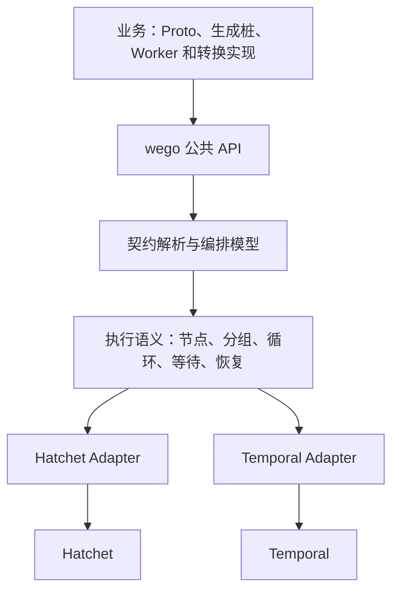

# wego SDK 设计方案

> 文档状态：设计方案，尚未实现。
> 后续对话以本文为设计基线，在同一份文档上持续迭代。
> 配置取证基线：本仓 `src/hatchet`，commit `315d43a72fd771b049b304b865a81dbab98c466c`（`v0.106.11-4-g315d43a72`）。配置抽象及覆盖范围见第四章第 7 节；源码清单是本文的附录，不是另一套设计方案。

## 一、总体定位与概念

**wego 是以 Protobuf 为契约、保持 gRPC 开发体验、直接连接调度引擎的 Go SDK。**

业务开发者负责定义能力和数据转换；SDK 负责把它们组织成可持久化执行的流程。第一套适配器使用 Hatchet，后续切换 Temporal 时，业务 `.proto`、实现代码、注册代码和调用代码保持不变。

以下目录、API 和 Protobuf options 均为拟议设计，尚未实现。

### 1. 核心概念

| 概念 | 定义 | 身份 |
|---|---|---|
| Worker | 一组可部署、可复用的业务能力 | Protobuf `package` |
| Worker 实例 | 某个 Worker 的运行进程 | 独立实例 ID |
| Operation | Worker 中的一个 RPC，可独立执行 | `/package.Service/Method` |
| StandaloneWorkflow | 一次独立 Operation 的执行定义 | SDK 内部映射 |
| Workflow | 一个完整流程 | Workflow Service 全名 |
| Entry | Service 中标记为入口的 `Run` RPC | 定义整个流程的输入输出 |
| Edge | Workflow 中的纯数据转换 RPC | Service 内的 RPC 名 |
| Node | 某个能力在流程中的一次引用 | 流程内独立 NodeID |
| Run | 一次流程或独立能力执行 | 引擎无关的 RunRef |

**Operation 使用完整 RPC 名；TypeURL 保留为数据类型身份。**

例如：

```text
Worker：      worker.document.v1
Operation：   /worker.document.v1.Parser/Parse
Input type：  type.googleapis.com/worker.document.v1.ParseRequest
```

多个 RPC 可以共用请求类型。类型唯一时自动推导绑定；出现歧义时要求显式指定 Operation 和 NodeID。

同一能力在流程中调用两次，也必须区分两个 NodeID。

### 2. Worker 与 Workflow 的注册规则

- Worker Service：每个 RPC 注册为一个独立能力，Hatchet 内部映射为 standalone workflow。
- Workflow Service：整个 Service 注册为一个完整流程。
- Workflow 的 `Run`：SDK 实现执行入口，业务无需手写编排函数。
- Workflow 的其他 RPC：业务实现纯转换，不公开注册为 standalone。
- 转换需要数据库、HTTP 等外部交互时，抽取成 Worker RPC。

Hatchet 的 standalone 本质上是只含一个任务的 Workflow，这与上述能力模型能够对应。[Hatchet Runnables](https://docs.hatchet.run/reference/go/runnables)

### 3. 数据流模型


例如：

```proto
rpc Convert(source.FetchResponse) returns (sink.SaveRequest);
```

含义是：

1. Fetch 节点完成。
2. SDK 把 `FetchResponse` 交给 Convert。
3. Convert 返回 `SaveRequest`。
4. SDK 调度 Save 节点。

**`import` 提供契约，实际调用由生成后的节点绑定决定。** 导入一个消息类型本身不会触发执行。

---

## 二、执行语义与引擎边界

### 1. 保留流式写法，使用有限批次执行

| RPC 形式 | Workflow 语义 |
|---|---|
| Unary | 一个输入转换成一个输出 |
| Client stream | 收齐当前分组的全部上游结果，调用一次转换函数 |
| Server stream | 生成多个下游输入，分别调度执行 |
| Bidi stream | 收齐一组输入，转换成多个下游输入 |

业务继续使用标准 `Recv()`、`Send()`、`SendAndClose()`。

具体规则：

- 扇入按 `Run + Node + 分组 + 循环轮次` 隔离。
- 等所有实际激活的上游分支成功后触发；条件分支未激活的路径不参与等待。
- 输入顺序按稳定的分支编号排列，不依赖完成时间。
- 扇入读取结束返回 `io.EOF`，可调度到任意可用实例。
- 扇出先完成本次转换并提交输出清单，再按并发上限调度下游。
- 转换失败时不发布部分输出；重试使用相同的逻辑节点和数据项身份。
- 数据集以分页清单和对象引用保存，运行时只加载有限窗口。

“一次打包触发”是一次逻辑任务提交，不要求把全部数据装进一个巨大的 Protobuf 消息。

对外使用 client/bidi stream 时，`CloseSend` 表示输入批次结束。这个模式保留 gRPC 的接口形状，但不提供无限持续的实时双向交互。

### 2. 循环、条件和外部事件

这些能力由编排声明表达，业务不接触引擎专用 API。

| 能力 | 声明与默认行为 |
|---|---|
| 条件分支 | 引用纯判断函数；返回分支选择，结果纳入执行记录 |
| 循环 | 显式声明循环体、状态输入输出、退出判断、最大轮次和超时 |
| 子流程 | 引用另一个 Workflow 的入口，独立 NodeID |
| 定时等待 | 使用持久化计时器，释放执行资源 |
| 外部事件等待 | 指定事件类型、等待标识、超时及后续路径 |
| 提前到达事件 | Run 已存在时持久化暂存，后续等待可消费 |
| 重复事件 | 通过 EventID 去重；每个等待实例只完成一次 |
| 循环内事件 | 等待标识包含轮次，防止上一轮事件唤醒下一轮 |

不允许通过任意回边隐式构造循环。达到循环上限或等待超时，默认返回明确的流程错误；业务可声明处理分支。

事件持久化使用引擎原生能力，不增加 wego 服务。当前源码已有 scope 和事件回看接口，但需要将保留期纳入运行约束。[本地接口依据](../../src/hatchet/sdks/go/hatchet.go#L138)

### 3. 引擎解耦架构



SDK 内部分开三个职责：

- **控制接口**：提交、查询、取消、事件、定时触发。
- **执行接口**：服务注册、能力执行、生命周期、执行结果。
- **持久化编排接口**：子调用、等待、计时器、结果记录和恢复。

不会用一个通用 `context.Context` 接口强行包装所有引擎行为。Temporal 的编排上下文和确定性要求由适配器处理，业务仍使用标准 Go/gRPC 函数签名。[Temporal Workflow 要求](https://docs.temporal.io/develop/go/workflows/basics)

纯转换在 Workflow 执行进程内运行，结果通过适配器记录；必要时可重算。S3 访问、加密随机数等操作放在执行边界内，不能直接进入 Temporal 的编排重放路径。

### 4. “切换引擎不改代码”的具体承诺

- 业务只导入 wego 和业务生成包。
- 引擎选择、地址、凭据来自统一运行配置。
- 用户升级 SDK、重新构建部署即可保持源码不变。
- 平台仍需部署新引擎、调整运行配置。
- RunRef 内部保存引擎归属；旧执行继续由旧适配器处理。
- 进行中的任务留在原引擎完成，不做跨引擎历史迁移。
- 公共能力必须通过两套适配器的同一组契约测试。
- 缺少持久化能力时启动或发布失败，不能静默降级。

---

## 三、功能模块与目录结构

### 1. 功能模块

| 模块 | 职责 |
|---|---|
| 契约与描述符 | 服务角色、完整 RPC 身份、消息类型、节点绑定、兼容性 |
| 代码生成 | 标准 Go/gRPC 桩之外，生成编排描述、类型化引用和异步辅助 API |
| Client | 标准桩调用、异步提交、批量提交、结果查询、取消、事件和定时触发 |
| Server / Worker | 标准注册、ServiceName + hostname 命名、slots、心跳、优雅退出、健康检查 |
| Workflow | 自动连边、显式绑定、分支、扇入扇出、子流程、循环和等待 |
| 执行控制 | 排队与执行超时、重试、幂等标识、取消传播、暂停及恢复 |
| Stream | 有限输入输出适配、批次封口、分页读取、顺序和背压 |
| Store | S3/MinIO、对象引用、校验、生命周期和测试存储 |
| Middleware | 客户端、Worker 执行、流消息、编排生命周期拦截；统一承载序列化、压缩、加密、S3 卸载与解码 |
| Logger | `slog`、上下文字段、业务与 SDK 日志分离 |
| Telemetry | OpenTelemetry trace、metrics、日志关联 |
| 配置与认证 | 配置加载、Token、TLS、实例及 slots 配置 |
| 引擎适配 | Hatchet、Temporal、能力检查与错误映射 |
| 测试工具 | 内存执行器、假时钟、事件注入、执行记录、故障注入 |
| 开发工具 | 生成、契约检查、流程检查、图展示、本地运行 |

执行控制默认遵循：

- 业务副作用按“可能重复执行”设计，SDK 提供稳定幂等键。
- 业务错误映射为 gRPC status，并保留是否可重试的信息。
- 同步调用的 context 结束会停止等待；持久化任务通过显式 `Cancel` 取消。
- 暂停阻止新节点启动，已运行任务可完成，结果继续保存。
- 定时触发支持一次性时间和带时区的 cron；重叠策略显式配置。
- 选择 Worker 使用可移植的执行池概念；引擎 labels、task queue 等细节留在适配层。

### 2. SDK 目录

```text
wego/
├── go.mod
├── wego.go                    # NewClient、NewServer
├── client/                    # grpc.ClientConnInterface、调用选项
├── server/                    # grpc.ServiceRegistrar、生命周期
├── worker/                    # WithWorker 的自有 Option、实例、执行池
├── connection/                # Client/Worker 共用连接、TLS、传输配置类型
├── workflow/                  # 编排声明、节点与控制结构
├── execution/                 # RunRef、状态、事件、重试、调度
├── descriptor/                # 契约描述、OperationRef、类型绑定
├── stream/                    # 有限批次的 gRPC stream 适配
├── metadata/                  # 调用元数据、身份与链路传播
├── store/
│   ├── store.go
│   ├── s3/
│   └── memory/
├── middleware/
│   ├── recovery/
│   ├── logging/
│   ├── tracing/
│   ├── metrics/
│   ├── validation/
│   └── payload/               # 消息序列化、压缩、加密、S3卸载中间件
├── log/
├── telemetry/
├── config/
├── testing/
│   └── conformance/           # 所有引擎共同执行的契约测试
├── proto/wego/v1/             # options、payload、执行元数据
├── cmd/
│   ├── protoc-gen-wego/
│   └── wego/
├── internal/
│   ├── compiler/              # 描述符 → 校验后的编排模型
│   ├── runtime/               # 公共执行规则
│   ├── engine/
│   │   ├── hatchet/
│   │   ├── temporal/
│   │   └── memory/
│   └── registry/
└── examples/
    ├── unary/
    ├── fanout-fanin/
    ├── loop/
    ├── event-wait/
    └── payload/
```

引擎包放在 `internal`，避免业务代码直接依赖。生成契约包仅依赖轻量描述符层，不通过门面包引入整个运行时。

### 3. Worker / Workflow 大仓库

沿用你示例中的“按领域分目录、独立 Go module、实现放 internal”的组织方式：

```text
wego-workspace/
├── go.work
├── buf.yaml
├── buf.gen.yaml
├── Makefile
├── be/
│   ├── worker/
│   │   ├── source/v1/
│   │   │   ├── go.mod
│   │   │   ├── source.proto
│   │   │   ├── source.pb.go
│   │   │   ├── source_grpc.pb.go
│   │   │   ├── source_wego.pb.go
│   │   │   └── internal/
│   │   │       ├── cmd/server/main.go
│   │   │       └── service/
│   │   └── sink/v1/
│   └── workflow/
│       └── ingest/v1/
│           ├── go.mod
│           ├── ingest.proto
│           ├── ingest.pb.go
│           ├── ingest_grpc.pb.go
│           ├── ingest_wego.pb.go
│           └── internal/
│               ├── cmd/server/main.go
│               └── transforms/
└── deploy/
```

约束：

- Workflow 依赖 Worker 契约包，不依赖其实现。
- 客户端依赖生成包，不依赖服务端实现。
- 本地使用 `go.work`，发布使用模块版本。
- `generate`、`check`、`release` 分开；生成代码不自动提交、打 tag 或推送。
- 固定 Buf 和生成器版本。

### 4. 载荷处理统一使用中间件

不再设计独立 Codec 模块、公共 Codec 接口、WithCodec Option 或顶层 codec 配置。Protobuf 序列化、压缩、加密、S3 卸载均作为统一 middleware 体系中的载荷处理中间件。Store 保留为卸载中间件使用的基础设施。

```text
发送：业务消息 → 序列化 → 压缩 → 加密 → 按阈值卸载 S3 → 引擎传输
接收：引擎载荷 → 读取 S3 → 解密 → 解压 → 反序列化 → 业务消息
```

这些中间件运行在提交/接收输入、持久化/读取输出的边界。普通 handler 中间件用于日志、恢复等执行拦截；载荷中间件必须覆盖 Client → Worker、Worker → 结果存储和下一节点的双向链路，不能只挂进 Hatchet 的 handler `Use` 就认为完成了传输变换。两者共用中间件注册与配置机制，由 SDK 按处理阶段编排。

- 业务 handler 仍接收/返回标准 protobuf 类型；基础序列化由内置中间件完成。
- 调用端用 `client.WithMiddleware(...)`，执行端用 `worker.WithMiddleware(...)`；不再配置独立 Pipeline。
- 载荷声明保留业务 TypeURL、处理版本、密钥 ID 和对象引用，接收端按声明反向恢复；缺少相应中间件能力则报错。
- Client/Server 使用实例级中间件注册表；发送链顺序校验为先压缩、后认证加密、最后卸载，读取链反向执行。
- S3 引用记录位置、大小和校验；对象保留期覆盖执行、重试和结果保留，限制还原后的大小及嵌套深度。
- 切换中间件配置时仍须能读取历史执行的载荷版本，不能简单删除旧解码能力。

现有 SDK 的编码实现可以迁入这些中间件，但不再保留其独立公开模块。[现有实现参考](/Users/fatcat/workspace/go/src/github.com/wegohub/wego/codec/codec.go:24)

---

## 四、使用方式

### 1. 定义 Worker

```proto
syntax = "proto3";

package worker.source.v1;

import "wego/v1/options.proto";

service Source {
  option (wego.v1.service_options).kind = WORKER;

  rpc Fetch(FetchRequest) returns (FetchResponse);
}

message FetchRequest {
  string url = 1;
}

message FetchResponse {
  bytes content = 1;
}
```

标准 gRPC 实现：

```go
type sourceServer struct {
    sourcepb.UnimplementedSourceServer
}

func (s *sourceServer) Fetch(
    ctx context.Context,
    req *sourcepb.FetchRequest,
) (*sourcepb.FetchResponse, error) {
    // 业务能力：允许 HTTP、数据库等外部交互。
    return fetch(ctx, req)
}
```

标准注册方式：

```go
srv, err := wego.NewServer(
    // WithConfig 是代码侧配置基线，必须先于字段级 Options。
    server.WithConfig(cfg),
    server.WithWorker(engineAddr,
        worker.WithToken(engineToken),
    ),
    server.WithTaskDefaults(
        execution.WithAttemptTimeout(30*time.Second),
        execution.WithRetry(execution.Retry{MaxAttempts: 3}),
    ),
    server.WithOperationPolicy(
        sourcepb.Source_Fetch_FullMethodName,
        execution.WithAttemptTimeout(10*time.Second),
        execution.WithRetry(execution.Retry{MaxAttempts: 5}),
    ),
    // 文件优先级最高；其在 Options 中的位置不影响优先级。
    server.WithConfigFile("source.wego.yaml"),
    server.WithLogger(logger),
)
if err != nil {
    return err
}

sourcepb.RegisterSourceServer(srv, &sourceServer{})
return srv.ServeContext(ctx)
```

SDK 从描述符获取请求类型，不通过试调用业务 Handler 探测。

### 2. 定义 Workflow

```proto
syntax = "proto3";

package workflow.ingest.v1;

import "wego/v1/options.proto";
import "be/worker/source/v1/source.proto";
import "be/worker/sink/v1/sink.proto";

service Ingest {
  option (wego.v1.service_options).kind = WORKFLOW;

  rpc Run(IngestRequest) returns (IngestResponse) {
    option (wego.v1.method_options).role = ENTRY;
  }

  rpc Prepare(IngestRequest)
      returns (worker.source.v1.FetchRequest);

  rpc Convert(worker.source.v1.FetchResponse)
      returns (worker.sink.v1.SaveRequest);

  rpc Finish(worker.sink.v1.SaveResponse)
      returns (IngestResponse);
}
```

生成器从导入的能力契约推导：

```text
Prepare → Source.Fetch → Convert → Sink.Save → Finish
```

出现多种合法连接时，生成检查失败，要求在编排声明中补充具体绑定；不会按注册顺序选择。

实现只包含转换：

```go
type ingestServer struct {
    ingestpb.UnimplementedIngestServer
}

func (s *ingestServer) Convert(
    ctx context.Context,
    input *sourcepb.FetchResponse,
) (*sinkpb.SaveRequest, error) {
    return &sinkpb.SaveRequest{
        Content: input.Content,
    }, nil
}
```

`Prepare`、`Finish` 同样实现。`Run` 由 SDK 接管：

```go
ingestpb.RegisterIngestServer(srv, &ingestServer{})
```

### 3. 扇入扇出

```proto
rpc Split(source.FetchResponse)
    returns (stream analyze.AnalyzeRequest);

rpc Gather(stream analyze.AnalyzeResponse)
    returns (sink.SaveRequest);
```

形成：

```text
Fetch
  → Split
  → 并行执行多个 Analyze
  → 全部成功后调用 Gather
  → Save
```

Gather 仍然是标准 gRPC 写法：

```go
func (s *flowServer) Gather(
    stream grpc.ClientStreamingServer[
        analyzepb.AnalyzeResponse,
        sinkpb.SaveRequest,
    ],
) error {
    result := &sinkpb.SaveRequest{}

    for {
        item, err := stream.Recv()
        if err == io.EOF {
            return stream.SendAndClose(result)
        }
        if err != nil {
            return err
        }
        merge(result, item)
    }
}
```

这里的 `Recv` 读取已经收齐的批次，不等待不同 Worker 实例持续向它推送。

### 4. 客户端

`wego.Client` 实现 `grpc.ClientConnInterface`：

```go
conn, err := wego.NewClient(
    client.WithConfig(cfg),
    client.WithMiddleware(payloadMiddleware),
)
if err != nil {
    return err
}
defer conn.Close()

api := ingestpb.NewIngestClient(conn)

result, err := api.Run(ctx, &ingestpb.IngestRequest{
    Url: "https://example.com/document",
})
```

调用独立 Worker 能力采用相同写法：

```go
source := sourcepb.NewSourceClient(conn)
result, err := source.Fetch(ctx, request)
```

额外生成类型化异步辅助 API：

```go
runs := ingestpb.NewIngestExecutionClient(conn)

run, err := runs.StartRun(ctx, request)
if err != nil {
    return err
}

result, err := run.Result(ctx)
```

通用执行管理提供：

```text
Describe / Watch / Cancel
Pause / Resume
Signal
Schedule / CancelSchedule
```

`Watch` 是运行事件观察接口，与业务 RPC 的扇入扇出区分。断开观察不终止执行。

### 5. 开发模式

- **单元测试**：直接调用业务实现。
- **本地编排测试**：同一生成桩连接内存执行器，使用假时钟和事件注入。
- **原生 gRPC 调试**：可选监听端口，提供 Worker RPC 和 Workflow 入口。
- **真实调度运行**：SDK 直接连接 Hatchet 或 Temporal。

内存模式用于验证业务和编排，不作为持久化恢复的验收依据。

### 6. 配置管理

以下均为拟议 API。所有调度参数集中在 `wego.NewServer` 的 Options 中；业务仍按标准方式调用 `RegisterXServer(srv, impl)`。

`server.WithConfig(cfg)` 提供代码侧配置基线，且应置于其他字段级 Options 之前。`WithTaskDefaults`、`WithOperationPolicy`、`WithWorkflowPolicy` 和 `WithWorkflowNodePolicy` 使用字段级 Options，才能表达“未设置”与显式 `0`、`false`、空列表的差异；同一层级、同一字段的后一个显式 Option 覆盖前一个。首版最多指定一个 `WithConfigFile(path)`。

```go
srv, err := wego.NewServer(
    server.WithConfig(cfg),
    server.WithWorker(engineAddr,
        worker.WithToken(engineToken),
    ),
    server.WithTaskDefaults(execution.WithAttemptTimeout(30*time.Second)),
    server.WithOperationPolicy(
        sourcepb.Source_Fetch_FullMethodName,
        execution.WithAttemptTimeout(2*time.Minute),
        execution.WithRetry(execution.Retry{MaxAttempts: 5}),
    ),
    server.WithWorkflowPolicy(
        ingestpb.Ingest_ServiceDesc.ServiceName,
        workflow.WithRunTimeout(24*time.Hour),
    ),
    server.WithWorkflowNodePolicy(
        ingestpb.Ingest_ServiceDesc.ServiceName, "fetch-source",
        execution.WithRetry(execution.Retry{MaxAttempts: 2}),
    ),
    server.WithConfigFile("wego.yaml"),
)
if err != nil {
    return err
}
sourcepb.RegisterSourceServer(srv, &sourceServer{})
ingestpb.RegisterIngestServer(srv, &ingestServer{})
return srv.ServeContext(ctx)
```

```yaml
task_defaults:
  attempt_timeout: 30s
  retry:
    max_attempts: 3
operations:
  /worker.source.v1.Source/Fetch: # 完整方法名
    attempt_timeout: 45s
workflows:
  workflow.ingest.v1.Ingest: # 完整 Service 名
    run_timeout: 12h
    nodes:
      fetch-source: # 编排声明的稳定 NodeID，指向 Source.Fetch
        retry:
          max_attempts: 2
```

合并遵循两维。对同一目标、同一字段，优先级为 SDK 默认值 < 代码 Options < 配置文件；文件未提供的字段保留代码值。作用域专属配置覆盖默认配置：文件里的 `task_defaults` 不能抹掉某 RPC 的显式代码策略，除非文件也在该完整方法名路径指定该字段。映射按键合并；列表只要显式提供即整体替换；`null` 一律拒绝。必须保留字段是否显式设置的信息，不能把未设置折叠为 `0`、`false` 或空列表。

上述配置生效后，独立调用 `Source.Fetch` 的单次执行超时为 45 秒，最大尝试次数仍为代码中的 5 次；`Ingest` 的整个流程超时为 12 小时，流程内 `fetch-source` 节点使用显式节点策略中的 2 次尝试。`run_timeout` 限制整个流程的生命周期，`attempt_timeout` 限制能力的一次执行，两者分别校验，不互相覆盖。节点策略只能在能力提供方允许的范围内覆盖能力默认值；超出约束时拒绝启动。

`fetch-source` 是编排声明的稳定 NodeID，不是任意方法名；它引用的能力为 `Source.Fetch`。`NewServer` 读取配置文件并校验字段；`Serve` 在全部标准 `RegisterXServer` 调用完成后，校验配置引用的 Service、完整方法名和 NodeID，失败返回 `error`。启动前冻结配置，本轮不支持热重载。YAML 只覆盖参数；Go handler、logger 和 middleware 实例/函数不可反序列化，可通过已注册名称或工厂引用。配置不修改 `.proto` 的角色或流程拓扑。

### 7. Hatchet 配置完整抽象

#### 7.1 源码范围与清单

本轮以用户指定的 `src/hatchet` 为依据，不以旧示例的 `v0.105.16` 或网站最新文档替代本地版本。盘点范围包括：

- 当前 Go SDK 的 Client、Worker、Workflow、Task、Standalone、Durable、Batch、Run、事件和 feature clients。
- SDK 实际调用的底层 client/worker、条件、创建请求，以及 v1 Protobuf/REST 请求字段。
- `client.yaml`、TLS、OTel、嵌入式、CLI profile 和 `hatchet.yaml` 开发配置。
- Engine/API 的 server/database/shared/limits 配置、loader、生产 env/flag 入口及内部构造器的配置来源。

逐项名称、类型、默认来源、约束、是否传递到下层及源码位置见：

| 附录 | 内容 |
|---|---|
| [Hatchet任务与编排配置清单](配置附录/Hatchet任务与编排配置清单.md) | 声明、运行参数、并发、限流、批处理、条件、事件及管理接口字段 |
| [Hatchet客户端与Worker配置清单](配置附录/Hatchet客户端与Worker配置清单.md) | 连接、TLS、容量、标签、观测、嵌入式、CLI 和代码注入 |
| [Hatchet引擎部署配置清单](配置附录/Hatchet引擎部署配置清单.md) | 部署字段、实际 YAML 路径、环境变量、默认来源和归属 |
| [Hatchet配置入口索引](配置附录/Hatchet配置入口索引.json) | 对 714 个非测试、非生成 Go 文件做 AST 扫描，得到 275 个配置相关类型候选、306 个 With/Without 函数候选；用于查漏，不等于 581 个生效配置 |
| [Hatchet引擎配置字段索引](配置附录/Hatchet引擎配置字段索引.json) | 部署清单的机器可读逐字段索引 |

入口对账：当前 `sdks/go` 非测试、非生成源码中的 60 个 `With/Without` 函数均已在附录定位；另核查 `InitWorkflows`、OTel Enable/Disable、构造器、结构体字段和协议独有字段。部署字段索引包含 281 项，启动命令的其他 flag 在部署附录单列，不与 SDK 入口数相加。入口覆盖不等于全部配置已经运行验证。

“完整”限定为上述 Go SDK、其实际协议/配置装载链及生产引擎配置面。其他语言 SDK 的重复封装、前端构建参数、CI/测试/hack/loadtest 开关不纳入 wego SDK 模型；数据库 CRUD 请求、查询分页和运行结果也不会因字段名包含 `Config` 或 `Opts` 就变成启动配置。旧入口、实验性能力、仅协议存在的字段及当前无效的 Option 均保留分类，不当作已支持能力。本轮为源码盘点，尚未启动服务验证这些配置的运行效果。

#### 7.2 统一分类

| 类别 | 处理方式 |
|---|---|
| 公共执行策略 | 定义 wego 的稳定语义与类型，使用 NewServer/NewClient Options 和配置文件 |
| Hatchet 适配参数 | 置于 `engines.hatchet`，由适配器读取；不把 Hatchet 类型放进业务签名 |
| 编排契约 | 入口、父子关系、循环、条件、能力和节点身份留在编排声明；配置只能调整允许覆盖的策略 |
| 本次运行参数 | input、metadata、priority、幂等键、RunMany 每项参数留在运行 API；启动配置最多提供默认值 |
| 管理接口参数 | cron/filter/webhook/限流资源的创建更新删除、Cancel/Replay 选择器留在管理 API |
| 代码注入 | handler、middleware、logger、TLS 对象、OTel provider、回调等只在代码注册，文件通过注册名引用 |
| 引擎部署参数 | PostgreSQL、RabbitMQ/NATS、服务端 TLS/认证、保留期等由引擎部署维护，不由业务 NewServer 启停或修改 |
| wego 新增语义 | 本轮源码没有直接对应项的能力，明确标为适配器组合实现，不伪称原生映射 |

公共模型是目标契约，不表示 Temporal 已验证支持每个字段。适配器必须公布字段/策略级能力，不能只公布“支持 Workflow”。无法保持语义时在启动或提交时拒绝；不得静默忽略、退化成内存状态或自动更换并发策略。

#### 7.3 配置对象与 Options

配置以“作用对象”分层。Server 的连接与实例配置已按第 8 节收拢到 `server.WithWorker(addr, ...worker.Option)`；下表为收拢后的作用域。

| 配置根 / 作用对象 | 建议入口 | 身份与边界 |
|---|---|---|
| `worker.connection` | `server.WithWorker(addr, worker.WithToken(...), ...)` | Server 所拥有的引擎连接；内部 client 与 worker 共用此连接描述 |
| `worker` | `server.WithWorker(addr, ...worker.Option)` | 调度执行组件的 Token、Slots、标签和中间件；单/多 Service 名称均自动派生，多个 Service 共用一个实例和 slots 池 |
| Client 的 `connection` | `wego.NewClient` 的连接 Options | 仅调用端实例；与 worker.connection 共用类型和解析规则 |
| `task_defaults` | `WithTaskDefaults(...)` | 独立能力和节点执行的基础任务策略 |
| `operations.<full_method>` | `WithOperationPolicy(fullMethod, ...)` | 对应 Worker RPC；standalone 不另建配置根 |
| `workflow_defaults` | `WithWorkflowDefaults(...)` | 整条流程的默认策略；不能混同节点单次执行策略 |
| `workflows.<full_service>` | `WithWorkflowPolicy(service, ...)` | 流程版本、默认优先级、并发、幂等、任务默认值、总超时等 |
| `workflows.<service>.nodes.<node_id>` | `WithWorkflowNodePolicy(service, nodeID, ...)` | 一次能力引用的策略，不能修改该节点绑定的能力 |
| `run_defaults` | Client/执行入口的 `WithRunDefaults(...)` | 只提供允许覆盖的运行默认值；每次请求仍有独立输入和标识 |
| `logger` / `telemetry` | 对应 Logger/Telemetry Options | wego 自身观测；与 Hatchet 服务端的观测配置分开 |
| `worker.middleware` / Client 的 `middleware` / `stores` | WithMiddleware 与存储注册 | 统一承载载荷处理和执行拦截；存储供 S3 卸载中间件使用 |
| `worker.engines.hatchet` | `worker.WithEngineConfig("hatchet", cfg)` | 该实例的原生连接补充、Cloud 和 listener 参数 |
| 策略对象的 `engines.hatchet` | 对应任务/流程策略扩展 | eviction、sticky、slot_cost 等保留原有业务作用域，不作为实例连接字段 |

上述 `With...` 均是拟议接口，不是当前已存在的方法。Worker/Workflow 仍使用标准 `pb.RegisterXServer(srv, impl)` 注册。

同一对象、同一字段的来源优先级仍为“SDK 默认 < 代码配置/Options < 配置文件”。先按来源合并同一配置树，再沿作用域继承默认；不能将文件里的全局默认无条件覆盖代码中的具体 RPC 配置。能力自己的显式默认、Workflow 的任务默认和 Node 覆盖需要区分：Workflow 任务默认仅填充仍未设置的字段，Node 的显式覆盖最后应用且必须满足能力提供方约束。每个生效字段保留来源和继承路径，供脱敏后的 `EffectiveConfig` 检查。

#### 7.4 公共策略字段族

下表统一命名；附录中的 `task.*`、`workflow.*` 是逻辑字段族，在实际配置中分别展开至 `operations`、`workflows` 及 `nodes`。

| 字段族 | 抽象字段 | Hatchet 来源与处理 |
|---|---|---|
| 连接与安全 | endpoint、credential_ref、tls.mode/server_name/min_version/ca/cert/key、headers | ClientConfigFile、TLS、ClientOpt；证书/密钥可使用文件或注册的凭据提供器 |
| 传输策略 | transport.compression、transport.retry.enabled、请求/流重连策略 | gzip、NoRetry/NoGrpcRetry、固定 retry/reconnect 行为；区分原生可设字段与源码固定值，不把后者伪称现成 Option |
| Worker | instance_id、labels、执行容量、shutdown 策略、panic_handler_ref | NewWorker 和底层 WorkerOpt；普通与 durable 槽位单独映射，不能统称一个 concurrency |
| 任务时间 | attempt_timeout、schedule_timeout | WithExecutionTimeout、WithScheduleTimeout；分别限制一次执行与排队，适配时检查秒级精度和取值范围 |
| 任务重试 | retry.max_attempts、retry.backoff.factor/max_interval | WithRetries、WithRetryBackoff；`max_attempts = retries + 1`，包含首次执行，不能直接复制数值 |
| 流程元数据 | version、description、default_priority | Workflow 对应 Option；版本声明不自动保证 replay 兼容 |
| 流程总时限 | run_timeout | wego 新增语义；当前声明协议无独立字段，需要持久化截止时间和子任务取消传播，未实现前拒绝配置而不是冒充 task timeout |
| 默认任务策略 | task_defaults.attempt_timeout/schedule_timeout/retry.* | TaskDefaults 五个原始字段；wego 必须补足未设置/显式零值的区分 |
| 并发约束 | concurrency[].key_expr/max_runs/on_limit | 同时适用于任务与流程；保留链顺序和约束对象，不能与 Worker slots 混同 |
| 动态/共享并发 | concurrency[].max_runs_expr；原生 shared.name/tenant_scoped | 动态上限为需能力声明的公共扩展；Hatchet 的 Name、IsTenantScoped 暂置 engines.hatchet，验证 DAG 路径与共享策略顺序 |
| 限流消费 | rate_limits[].key/key_expr/units/units_expr/limit_expr/window | Task RateLimit 六字段；静态限流资源由管理 API 建立，任务声明只引用/消费 |
| 幂等策略 | idempotency.key_expr/ttl/method | Workflow IdempotencyConfig；TTL 与 STATUS 分开，碰撞响应保留 existing run，不能改成成功新建 |
| 执行亲和 | routing.labels/policies，原生 sticky | Worker label 是声明，DesiredWorkerLabel 是调用选择条件；required/comparator/weight 与 sticky 不混并，Hatchet 原生规则保留在适配器层 |
| 时间触发 | triggers.cron[].expression/input，schedule.at/input | 静态 cron 声明与动态创建 cron/schedule 分开；时区/重叠/补跑若无对应原生参数，则标为 wego 新增能力 |
| 事件触发 | triggers.events[]、event_filters[].expression/scope/payload | WorkflowEvents、DefaultFilters；事件 Push 的 metadata/priority/scope 是单次消息参数 |
| 等待和跳过 | 声明中的 wait_for/skip_if、event.key/filter/scope/lookback_since、sleep | Condition 及 v1 wire；归编排契约，不允许用部署文件改拓扑 |
| 聚合批任务 | batch.max_size/max_wait/group_key/group_max_runs/broadcast_output | Hatchet BatchConfig 五字段，实验性扩展；与 RunMany 及流程扇入分别建模 |
| 持久等待资源 | eviction.wait_ttl/allow_capacity_eviction/priority | 仅 durable handler 的本地 Worker 驱逐策略，置于 engines.hatchet；不是业务超时，也不是结果保留期 |
| 失败处理 | on_failure 节点引用 | 回调本身是代码，图中的失败处理路径是契约；其任务策略仍按普通任务规则处理 |

`on_limit` 必须保留具体行为：取消正在执行项、取消新项、按组公平排队、只保留最新排队项、只保留最旧排队项。旧 `DROP_NEWEST`、`QUEUE_NEWEST` 标为 deprecated 兼容值，不自动等同其他策略。动态并发上限 0 的含义与固定 MaxRuns 的正数约束不同，不能用同一个验证器处理。

默认值处理规则：附录分别记录 SDK 默认、协议默认、结构体 tag、loader 和固定实现默认；它们不自动成为 wego 公共默认。适配器使用前必须得到明确的生效值及来源，不能将“字段存在但未验证生效”视作已支持。对声明默认与实际装载默认不同的项，以已核实调用链为准。

#### 7.5 单次运行与管理 API 的配置边界

| 对象 | 字段 | 所属入口 |
|---|---|---|
| 单次运行 | input、metadata、priority、目标标签、idempotency_key | Run/Start 调用选项；输入不存进 NewServer 全局默认 |
| 子调用 | child_key、sticky、父 Run/Node/轮次信息 | 内部运行时；有作用域，不可与外部提交幂等键混同 |
| RunMany | 每项 input/options、稳定 item_key、逐项提交状态 | 批量执行 API；不是 BatchConfig，也不是流输入 |
| 事件发送 | event_key、payload、metadata、priority、scope | Signal/Push API；预定义触发器不等于已投递事件 |
| cron 资源 | name、expression、input、metadata、priority | Schedule 管理 API；可按资源声明部署，但创建/更新有外部副作用 |
| 一次性计划 | trigger_at、input、metadata、priority | Schedule API |
| filter 资源 | expression、payload、scope、workflow_id | 管理 API，适配器保留所需 native ID |
| webhook 资源 | name、source_name、event_key_expr、scope_expr、static_payload、返回载荷开关、认证 | Hatchet 管理扩展；Basic/APIKey/HMAC/Svix 的认证子字段见附录 |
| 限流资源 | key、limit、duration | 限流管理 API，与任务的消费 units 分开 |
| 批量取消/重放 | run/task IDs 或 metadata/status/time/workflow 选择器 | 控制命令，不作为启动配置 |
| 查询 | offset/limit/order/filter/time range 等 | Describe/List/Metrics/Logs 查询参数，不作为策略 |

#### 7.6 源码发现对现有方案的约束

1. **没有原生的整条流程 `run_timeout`。** 当前 Go SDK/v1 声明只有 task execution timeout 与 schedule timeout。第四章示例中的 `workflow.WithRunTimeout` 是 wego 目标 API，必须由适配器实现完整截止时间语义后才能启用。
2. **`WithRunKey` 不是通用外部幂等键。** 该值只在特定 child 调用路径传递；外部触发的幂等依赖 IdempotencyConfig。wego 的稳定提交键需要显式接到该机制，不能简单映射成 WithRunKey。
3. **Batch 不是本方案的扇入。** Batch 可按数量/时间窗口聚合不同执行，且当前 batch retries 被强制为 0。已确认的流程扇入仍然等待本轮全部激活的上游完成，不采用自动窗口刷新，也不套用 BatchConfig 冒充相同语义。
4. **有 setter 不代表配置生效。** 当前 WithDescription 写入任务配置但未进入 task 创建请求；普通流程 Task 上的 WithCron/WithEvents 不形成独立触发；input_json_schema、任意 task worker_labels/slot_requests 的协议存在不代表新版 Go SDK 已提供完整公开入口。
5. **并发配置有执行路径限制。** standalone 单任务会合并流程并发到任务；某些 tenant-scoped/dynamic 配置要求 DAG operator，旧 DAG 路径会拒绝。注册前按实际能力校验。
6. **eviction 是等待状态下释放 Worker 资源。** 不等于取消、执行超时、任务 TTL 或事件保留期；不能将源码给出的推荐 policy 常量当作自动启用的默认值。
7. **声明的零值不总能传到引擎。** Hatchet 的部分 TaskDefaults、duration、backoff 以零值代表省略；显式 WithRetries(0) 也可能继承非零流程默认。wego 先保留字段 presence，再展开为每任务的最终配置，避免原生默认二次继承；无法表达明确配置时拒绝，而不是悄悄继承其他值。
8. **客户端来源优先级需要由 wego 控制。** Hatchet 的默认 loader 会读取自己的 YAML/env。wego 必须先解析并冻结最终配置，显式注入适配器；缺少显式构造入口的字段要补充适配入口，不使用修改进程全局环境的方式模拟实例级 Options。

这些结论的字段级证据在三个附录中。后续实现测试应覆盖实际 RPC 请求载荷及服务端接受行为，不能只测 WithOption 后结构体值变化。

#### 7.7 引擎部署与 wego 自身配置

引擎部署配置单独保留完整清单，不塞进业务 `wego.NewServer`：

- 数据库：连接、主库/只读副本、PgBouncer、DDL pool、连接寿命、缓存、时区、seed。
- 调度与消息：服务启停、dispatcher/ingestor、缓冲与批量写、RabbitMQ/Postgres/NATS pubsub、分区和控制器。
- 数据生命周期：OLAP、采样、task/worker/event 保留、PayloadStore。
- 平台安全与管理：服务端 TLS、认证、Cookie/OAuth、加密/JWT/KMS、告警、邮件、平台观测。
- 运维入口：migrate、lite、静态文件服务及生产环境探测。

Hatchet 自身的 PayloadStore 和服务端加密不自动提供 wego 的端到端载荷处理。序列化、压缩、加密、S3 卸载统一放入 wego 中间件；它们属于 wego 补充能力，不能标成 Hatchet 原生 WorkerOption。

### 8. `server.WithWorker`：统一创建调度 Client 与 Worker

本节按 [期望用法](worker.txt) 收敛公共 API，取代第 7 节初版中将 Server 的 connection、worker_defaults、workers 拆成多个启动入口的建议。业务方配置一个 `WithWorker`，SDK 完成连接、定义注册、Worker 启动和资源回收。`WithGRPC` 独立启用网络 gRPC 服务。

#### 8.1 入口和使用方式

```text
// API 签名示意；均为 wego 自有类型，不是 Hatchet Option 的别名。
func server.WithWorker(addr string, opts ...worker.Option) server.Option
func server.WithGRPC(addr string, opts ...grpc.ServerOption) server.Option
func wego.NewServer(opts ...server.Option) (*wego.Server, error)
func (s *wego.Server) Serve() error
func (s *wego.Server) ServeContext(ctx context.Context) error
func (s *wego.Server) GracefulStop(ctx context.Context) error
```

`addr` 是调度引擎 gRPC 连接地址，`host:port`；`WithGRPC` 的地址是本进程监听地址。两者用途不同。保留 `NewServer` 的 error 返回，用于配置文件读取和校验错误；其余调用形状与用户示例一致。`Serve()` 阻塞至停止或错误，应用使用 `ServeContext(ctx)` 接入信号取消；SDK 不自行安装全局 signal handler。

```go
srv, err := wego.NewServer(
    server.WithWorker(
        "127.0.0.1:7077",
        worker.WithToken(os.Getenv("HATCHET_CLIENT_TOKEN")),
        worker.WithTLS(connection.TLSConfig{Mode: connection.TLSDisabled}),
        worker.WithSlots(10),
        worker.WithDurableSlots(20),
        worker.WithLabels(map[string]any{"env": "local"}),
        worker.WithPanicHandler(func(ctx context.Context, recovered any) {
            log.Printf("worker panic: %v", recovered)
        }),
    ),
    server.WithGRPC(":50051"),
    server.WithConfigFile("wego.yaml"),
)
if err != nil {
    return err
}
pb.RegisterGreeterServer(srv, &greeter{})
return srv.Serve()
```

以上是设计示例；本仓尚未实现这些包/API。`worker.WithToken(string)` 直接设置连接 token；示例由业务代码读取环境变量，不隐式加载 `.env`。生产 TLS 使用 `connection.TLS` 或 `connection.MTLS`；示例显式禁用 TLS 用于本地环境。引擎由 `worker.WithEngine(name)` 或文件 `worker.engine` 选择，首版默认注册的 Hatchet 适配器；切换引擎修改部署配置和凭据即可，业务实现和注册代码保持一致。

首版一个 Server 最多提供一组 `WithWorker` 和一组 `WithGRPC` Options；重复提供同类组件 Option 报错。Options 隐含设置对应 enabled=true，文件可以覆盖为 false，也可以单独设置 enabled=true 启用组件；两者合并后都未启用则报错。单 Service 时 worker 名称固定为 `ServiceDesc.ServiceName + "-" + hostname`，不提供 WithName 或文件 name；例如 `helloworld.Greeter-node-a`。当前本地 Hatchet 原样存储 name，并单独生成 Worker ID；wego 不额外追加随机后缀，源码依据见 8.7。多个 Service 共用同一个底层 Worker 和 slots 池；名称提取共同命名空间，再将剩余 Service 名排序后用下划线拼接，见 8.7。

#### 8.2 `worker.Option` 应包含的配置

连接结构与 `wego.NewClient` 共享 `connection` 包的配置类型和解析器；两者分别管理连接生命周期，不要求业务先创建 Hatchet client 再传进 WithWorker。

| wego 自有 Option | 文件路径 | 含义 / Hatchet 映射 |
|---|---|---|
| `WithWorker(addr, ...)` 的 addr | `worker.connection.address` | 调度 gRPC endpoint → HostPort；使用标准 host:port 解析，包含 IPv6，禁止手工按冒号拆分 |
| `worker.WithEngine(name)` | `worker.engine` | 适配器注册名；切换引擎不改变 Option 接口 |
| 自动派生名称（无 Option） | 不允许配置 name | 单 Service 为 `ServiceDesc.ServiceName + "-" + hostname`；多 Service 共同前缀 + 排序后的名称组合 + hostname；实例 ID 使用 Hatchet 返回的 Worker ID，名称不另加随机后缀 |
| `worker.WithToken(string)` | `worker.connection.token` 或 `token_env` | 直接传入 token → Hatchet WithToken；token_env 为文件侧环境变量引用，解析后写入同一 token 字段，禁止在 EffectiveConfig 输出实际值 |
| `worker.WithTLS(connection.TLSConfig)` | `worker.connection.tls` | mode、server_name、min_version、ca_pem/ca_file、cert_pem/cert_file、key_pem/key_file；映射原生 TLS 配置，验证来源互斥及证书密钥配对 |
| `worker.WithTLSConfig(*tls.Config)` | 不直接序列化 | 可选代码注入入口，克隆对象后使用；文件若显式给 TLS 描述则整体替换该对象并重建，不能字段级修改不透明对象 |
| `worker.WithHeaders(map[string]string)` | `worker.connection.headers` | 引擎 gRPC metadata → WithGRPCHeaders；authorization 由凭据层管理，拒绝业务 header 覆盖 |
| `worker.WithTransportRetry(connection.RetryConfig)` | `worker.connection.retry` | `grpc.enabled`、`http.enabled` 分开；原生 NoRetry/NoGrpcRetry 仅支持部分组合，见适配限制 |
| `worker.WithTransportCompression(mode)` | `worker.connection.compression` | `none/gzip` → DisableGzipCompression；这是传输压缩，与载荷中间件压缩分别配置 |
| `worker.WithEventMetadata(map[string]string)` | `worker.event_metadata` | 默认事件 metadata → WithSharedMeta；不等同于每个 RPC 的 headers 或 Run metadata |
| `worker.WithSlots(n)` | `worker.slots` | 本实例普通执行池容量 → WithSlots；单位为可同时消耗的执行容量，不是整条 DAG 的并发流程数 |
| `worker.WithDurableSlots(n)` | `worker.durable_slots` | 本实例持久执行池容量 → WithDurableSlots；仅在需要该执行类型时启用，其他适配器必须说明映射能力 |
| `worker.WithLabels(map[string]any)` | `worker.labels` | 本实例路由标签 → WithLabels；Hatchet adapter 校验 string/int 及 wire 数值范围，拒绝 nil |
| `worker.WithLogger(log.Logger)` | `worker.logger` | Worker 运行组件共用日志接口，适配到内部 client/worker；未设继承 server logger；文件可配 level/format 或已注册 logger ref |
| `worker.WithPanicHandler(worker.PanicHandler)` | `worker.panic_handler_ref` | `func(context.Context, any)` 回调；文件只能引用已注册回调，禁止暴露 Hatchet Context |
| `worker.WithMiddleware(...worker.Middleware)` | `worker.middleware[]` | handler 阶段适配 Worker.Use；载荷阶段由 wego 在提交/接收/结果边界挂接；文件列表引用已注册名称，顺序按阶段校验 |
| `worker.WithTelemetry(telemetry.Config)` | `worker.telemetry` | wego OTel enabled/resource/exporter_ref；provider/exporter 是代码注入，生命周期归 Server；无需应用自己创建 Hatchet Instrumentor |
| `worker.WithShutdownTimeout(duration)` | `worker.shutdown_timeout` | wego 的优雅停止等待预算；不是 Hatchet 原生 WorkerOption，超时后的取消及恢复语义由适配器保证 |
| `worker.WithEngineConfig(name, cfg)` | `worker.engines.<name>` | 适配器类型化扩展；仅部署装配层可使用，业务实现/生成桩不能依赖原生 Hatchet 类型 |

`worker.Option` 是 wego 定义的封闭配置写入接口；不提供 `...any`、`...hatchet.WorkerOption` 或 `...v0Client.ClientOpt` 逃生入口。中间件上下文和执行请求同样使用 wego 类型。首版冻结解析后的 token，轮换通过重建实例；WithToken 不自动承诺在线刷新。

默认与校验：ServiceName、hostname、连接地址必须非空；名称在标准注册完成后计算，获取 hostname 失败则启动失败；凭据/TLS/REST 地址按所选适配器校验。首版 Hatchet 的普通执行池默认 100，需要 durable 时默认 1000；这两项是具名的适配器默认，EffectiveConfig 标出来源，不冒充所有引擎的统一默认。显式容量必须为正且能被原生类型表示；未注册 durable 执行却显式要求 durable 配置时检查实际用途。事件 metadata、labels 默认为空，用户配置的 middleware 默认为空链，基础序列化中间件仍由 SDK 内置；shutdown_timeout 的 wego 初始默认拟定 30s，需在实现验收中验证超时退出行为。日志继承全局配置，遥测继承全局 telemetry 配置；显式 worker 配置按字段覆盖。

普通执行池、durable 执行池与 workflow/task 的并发限制分别建模：前两者限制本实例资源，后者限制业务运行的分组策略。

#### 8.3 Hatchet 特有连接字段也归入 `WithWorker`

Hatchet 的 REST、租户和 Cloud 配置属于创建该 Worker 所需的内部 client，因此全部挂在 `worker.engines.hatchet`；不再要求应用额外调用一次 `hatchet.NewClient()`。

| 扩展字段 | Hatchet 来源 / 实际用途 |
|---|---|
| `api_endpoint` | ClientConfigFile.ServerURL；用于 REST/管理请求，不能用 gRPC 地址代替；未设时可从 token claim 推导，仍缺失则报错 |
| `tenant_id` | ClientConfigFile.TenantId / WithTenantId；未设取 token tenant claim，保留原生租户边界 |
| `namespace` | ClientConfigFile.Namespace / WithNamespace；用于 Hatchet 名称前缀，不能改变 wego 完整方法名；适配器统一规范化一次，避免 loader 与 Option 的大小写行为不同 |
| `cloud.register_id` | CloudRegisterID；Cloud 专属 |
| `cloud.runnable_actions[]` | RawRunnableActions；必须与标准注册后生成的 action 集合一致，不能注入未注册的业务 handler |
| `autoscaling_target` | AutoscalingTarget → 预置路由标签；与自定义同名 label 冲突时拒绝 |
| `otel.use_hatchet_collector` | 是否将 wego 遥测输出到 Hatchet collector；endpoint/token/TLS 来自已解析的当前 Worker 连接，不重新读进程环境 |
| `durable.reconnect_interval` | 底层 DurableTaskListener WithReconnectInterval，当前新 Worker 构造未开放透传；默认 2s，增加适配入口后才能配置 |
| `durable.eviction_ack_timeout` | 底层 WithEvictionAckTimeout；当前默认 30s，同样需要适配入口 |

durable task 的 eviction policy、sticky、slot_cost、调用目标标签等仍是任务/流程/单次调用策略，不因为包含 “worker” 字样就挪到实例级 WithWorker。Embedded 的 DB、端口、RabbitMQ 和迁移开关保留开发引擎启动配置；`WithWorker` 连接一个已经启动的引擎。

#### 8.4 文件覆盖与完整示例

```yaml
worker:
  enabled: true
  engine: hatchet
  connection:
    address: 127.0.0.1:7077
    token_env: HATCHET_CLIENT_TOKEN
    tls:
      mode: none
    retry:
      grpc: {enabled: true}
      http: {enabled: true}
    compression: gzip
    headers: {}
  slots: 10
  durable_slots: 20
  labels: {env: local}
  event_metadata: {}
  logger: {level: info, format: json}
  telemetry: {enabled: true, exporter_ref: default}
  middleware: [logging]
  shutdown_timeout: 30s
  engines:
    hatchet:
      api_endpoint: http://127.0.0.1:8888
      namespace: test1
      otel: {use_hatchet_collector: false}

grpc:
  enabled: true
  address: ":50051"
  max_recv_message_size: 16777216
  max_send_message_size: 16777216

task_defaults:
  attempt_timeout: 60s
  schedule_timeout: 1h
  retry:
    max_attempts: 4
    backoff: {factor: 2, max_interval: 10s}
```

`logging`、`default` 是应用已经注册的中间件/遥测导出器名称，未知名称拒绝启动。文件与 Options 是同一 Server 配置模型的两个来源，可以独立配置和启用 worker/gRPC。文件中的 enabled=false 覆盖 Options 隐含的 true；disabled 组件仍做字段语法校验，但不读取其 token、不建连接或监听。文件覆盖代码中的同一目标、同一字段；例如 address 参数可以被 `worker.connection.address` 覆盖，未提供字段继续沿用代码值。列表整体替换、映射按 key 合并、null 拒绝，规则不变。

也支持只用 `wego.NewServer(server.WithConfigFile("wego.yaml"))` 配置两个组件，再做标准注册。gRPC 文件可配置 enabled、address、TLS/mTLS 证书参数、max_recv_message_size、max_send_message_size、max_concurrent_streams 和 keepalive；由 SDK 转为标准 grpc.ServerOption。拦截器/统计 handler 等 Go 对象只能引用代码注册名。支持的字段在合并后一次构造；任意不透明的 grpc.ServerOption 若与文件字段发生无法判定的冲突，要拒绝该组合，不能声称能反射读取所有原生 Option。

`token` 与 `token_env` 是同一逻辑字段的两种来源写法：同一来源层同时提供时拒绝；先分别解析各层，再按文件 > Options 合并。文件中的 token_env 可以覆盖代码 WithToken。禁用 worker 时不读取环境 token；启用 Hatchet 且最终 token 为空则报错。

连接重试与任务重试不同。上述任务策略对应用户 `internal/task.go` 的三次重试（共四次尝试）、60 秒执行超时、1 小时调度超时和退避设置。单独任务的事件触发配置应通过 `WithOperationPolicy(fullMethod, execution.WithEvents(...))` 设置，落在 `operations.<full_method>.triggers.events[]`；标准注册把该能力映射为 standalone workflow。`ctx.RefreshTimeout` 是执行期动作，其跨引擎续期 API 另行定义，不能当作 client/worker 启动参数；本节没有将示例中的续期 goroutine 自动转成 SDK 行为。

#### 8.5 标准注册和生命周期

1. `NewServer` 合并 Options 与文件，包括 worker/grpc.enabled、连接与监听参数；对启用组件解析中间件注册名/token_env 并做结构检查；不建立引擎连接、不上传 workflow、不开始接任务。启用 gRPC 时可先创建尚未监听的 grpc.Server。
2. `pb.RegisterXServer(srv, impl)` 保存服务描述和实现；启用 gRPC 时也完成同一实现的 gRPC 注册。业务无需 `WithWorkflows(...)`；SDK 从全部标准注册生成 standalone/workflow 定义和 handler。
3. `Serve` 校验注册引用、派生 ServiceName + hostname 名称、编译定义、冻结配置；预先检查监听地址，创建并验证引擎 client，再执行必要的远端定义注册、创建并启动 worker。全部组件就绪后才进入正常服务状态。
4. 任何本地启动步骤失败，都关闭已创建的监听、client、worker 和自有遥测资源；远端已经注册的 workflow version 可能保留，不能承诺启动失败可事务回滚这些定义。注册必须可安全重试。
5. 停止时先停止接收新工作，再按 shutdown_timeout 等待在途任务；超时触发受控取消/连接关闭，结果持久化和重新调度遵循引擎语义，不承诺强杀后业务副作用恰好一次。外部注入的共享 logger/provider 不由 Server 擅自关闭；由 Server 创建的资源才归其回收。

`grpc.ServerOption` 中的拦截器作用于网络 gRPC 链；`worker.WithMiddleware` 作用于调度执行链。两者都可以调用统一业务 middleware，但每种入口只组装一次，避免同一阶段重复执行。

#### 8.6 Deprecated 的处理与实现缺口

用户示例 `hatchet-lab/go.mod` 使用 `v0.105.16`；本仓配置盘点仍以当前固定 commit 为准。当前源码 `pkg/client.ClientOpt` 和多数旧 With 函数已标 Deprecated；新入口 `sdks/go.ClientOpt` 仍是旧类型别名，新包装最终调用旧构造链。应使用新入口，不能把“仍由新 SDK 内部调用”等同于“应作为 wego 的公共类型”。证据：`src/hatchet/sdks/go/client.go:48-128`、`src/hatchet/pkg/client/client.go:74-106,157-290`。

适配器优先使用当前新版 Hatchet 入口，有以下待实现项：

- 没有公开 ClientOption 可直接设置所有 ClientConfigFile 字段，例如 ServerURL、NoRetry/NoGrpcRetry、Cloud 配置和 gzip 开关；不能仅靠改个包装函数就声称 WithWorker 已完整支持。
- 原生 NoRetry 会同时关闭 HTTP/gRPC；因此 `grpc.enabled=true,http.enabled=false` 不能用现有两个布尔开关直接表示。需要独立构造传输，否则明确拒绝该组合。
- 原生 loader 隐式加载 Hatchet 环境和配置文件；必须补充接受完整已解析配置的实例级适配构造入口，绕过隐式来源。不得用 `os.Setenv` 模拟实例配置，也不得将 Deprecated 的 NewFromConfigFile 当作理想公共接口。
- Hatchet Instrumentor 默认重新读 client loader；wego 应复用当前实例的连接和凭据建立自己的导出器/桥接，避免配置漂移。durable listener 的两个自定义字段也需要增加内部透传。

这些缺口在适配器层完成，可通过受控的内部兼容桥接或补充上游构造能力实现；公共 WithWorker 签名保持稳定。尚未完成的字段在启动时返回明确的 capability/configuration error，不静默忽略。当前仓库仍处于设计阶段，本节未修改 Hatchet 或 hatchet-lab 源码。

#### 8.7 可选参数的具体作用与 Hatchet 关系

这些参数不是最小使用示例的必填项。先理解三条独立的链：**连接引擎**、**执行业务 handler**、**传递业务载荷**。连接参数不改变业务重试策略；载荷处理中间件也不等同于网络 gRPC 压缩。

| 可选参数 | 实际解决什么问题 | 与 Hatchet 的关系 / 何时需要 |
|---|---|---|
| `WithLogger(logger)` | 控制 SDK 自己输出到终端/文件的运行日志，例如连接失败、Worker 启停 | 对应 `hatchet.WithClientLogger` 和 `hatchet.WithLogger`，wego 适配自己的日志接口；未设继承 Server logger。它本身不会把日志写到任务详情，任务业务日志是 Hatchet Context.Log 的另一条链路 |
| `WithMiddleware(...)` | 在 handler 前后统一记录耗时、恢复 panic、校验输入；载荷处理中间件负责序列化/压缩/加密/S3 | handler 部分对应 `worker.Use(...)`。你示例的 `worker.Use(instrumentor.Middleware())` 就是一种用法；载荷阶段还需 wego 在提交与结果边界挂接，原生 Use 不独立覆盖这些阶段 |
| `WithTelemetry(config)` | 统一设置 trace 的资源属性和导出位置，并管理导出器的关闭 | 是 wego 封装：对应示例的 `NewInstrumentor` → `Use(instrumentor.Middleware())` → `Shutdown`。不是 Hatchet 原生 WorkerOption。原生 Instrumentor 主要提供 trace；wego 扩展 metrics 时单独实现。已由此项安装 tracing 时，不再在 Middleware 中重复安装同一个 tracing 中间件 |
| `WithHeaders(headers)` | 给 SDK 调用 Hatchet 的每个 gRPC 请求加 metadata，例如内部代理要求的固定 header | 对应 client `WithGRPCHeaders`。不修改业务 protobuf，不是业务 handler 收到的全部 metadata；Token 认证由 WithToken 管理，通常无需设置额外 headers |
| `WithEventMetadata(metadata)` | 给这个内部 client 发出的事件统一加标签，例如 source=order-service | 对应 client `WithSharedMeta`。仅影响事件 Push，不会自动发布事件，也不改变 WithWorkflowEvents 的触发器。没有发事件需求时无需配置；单次事件的 metadata 可在发送 API 设置 |
| `WithTransportRetry(config)` | 控制 SDK 请求引擎失败后的通信重试 | 对应 ClientConfigFile 的 NoGrpcRetry/NoRetry，当前新版没有同名公开 Option，需要适配构造入口。不会使业务 handler 失败后多执行一次；业务重试仍是任务策略 WithRetries 对应的 max_attempts |
| `WithTransportCompression(mode)` | 对 SDK ↔ Hatchet gRPC 网络消息使用 gzip，减少传输字节 | 对应 DisableGzipCompression，当前默认启用 gzip。它不提供 S3 卸载/加密，也不决定持久化载荷格式；压缩业务载荷使用统一 payload 中间件。一般沿用默认即可 |
| `WithShutdownTimeout(duration)` | 停止时最多留多少时间等待在途任务退出 | wego 新增，没有同名 Hatchet WorkerOption。应用 ctx 取消触发停止，由 wego 管理等待预算和最后清理；不改变 execution timeout 或 schedule timeout |
| 引擎/REST/tenant/namespace/Cloud 配置 | 指定 SDK 连接哪套引擎、租户及名称空间，启用原生专属功能 | Hatchet 需要 gRPC 地址和 REST serverURL，后者可从 token 推导。tenant 也是连接上下文；namespace 为原生资源名前缀，不修改 protobuf ServiceName。Cloud 仅使用对应服务时配置，普通自托管示例不必填 |

`WithTelemetry` 是装配 tracing 中间件和导出器的便捷配置；`WithMiddleware` 是统一扩展入口。二者不是两个重复的 tracing 实现。普通业务只需要 Token、Slots、TLS、标准注册；其他项按实际需要添加。

**worker name 的源码核验**（以下路径相对 `src/hatchet`）：当前 `sdks/go/client.go:194-247` 将名称传给底层 Worker；`pkg/worker/worker.go:591-600` 发出同名注册请求；`internal/services/dispatcher/server.go:34-51` 原样传入仓储；`pkg/repository/sqlcv1/workers.sql.go:195-224` 原样保存 name，并单独生成 UUID 作为 Worker.id。没有发现这条路径追加随机后缀。wego 单 Service 名称为 `ServiceDesc.ServiceName + "-" + hostname`，多 Service 按下述规则组合；连接会话身份使用引擎返回的 ID，不依赖名称唯一。

**多 Service 命名与容量（已确认）**：多个 Service 仍共用一个底层 Worker、同一组 slots/durable_slots。读取所有标准注册的 ServiceDesc.ServiceName，按点分隔的命名空间段提取最长共同前缀；剩余名称按字典序排列，以 `_` 连接，再加 `-hostname`。去重和排序只影响显示名的构造，不影响真实 gRPC 注册校验。不能依赖注册顺序，也不按 Service 数量放大 slots。

```text
be.grpc.wegosdk.helloworld.Greeter
be.grpc.wegosdk.helloworld.Setter
hostname = node-a

worker name = be.grpc.wegosdk.helloworld.Greeter_Setter-node-a
slots = 10 → 两个 Service 共享 10 个普通执行槽位
```

同包时共同前缀就是 protobuf package，剩余部分是 Service 短名；跨包时保留共同前缀后的完整剩余路径，不只取最后一段，防止丢失命名空间。没有共同前缀则用各完整 ServiceName 排序拼接。名称只是引擎显示/注册名，RPC 身份始终为完整方法名；超出引擎允许名称长度时报错，不静默截断。只有启用 worker 时应用此命名规则。

---

## 五、实施顺序与验收

### 实施顺序

1. **锁定契约与生成器**：角色、身份、Run 入口、类型绑定、标准桩注册。
2. **跑通最小执行链**：独立 Worker，以及 Fetch → Convert → Save。
3. **建立双引擎验证样例**：同一业务源码分别执行于 Hatchet、Temporal，尽早验证抽象边界。
4. **补齐编排能力**：批次扇入扇出、条件、子流程、循环、等待和恢复。
5. **补齐 SDK 配套**：载荷处理中间件、S3、日志、遥测、定时触发和开发工具。

### 必须通过的验收

- 通过 WithWorker 或纯配置文件配合标准注册，即可完成连接、注册、启动和停止；公共签名无 Hatchet/v0 类型。
- 名称由共同命名空间、排序后的 Service 名和 hostname 派生；交换注册顺序名称不变，多个 Service 共享 slots，不暴露 WithName。Token/Slots/DurableSlots 的代码与文件配置对应一致。
- 仅文件可启用 worker/gRPC，enabled=false 可覆盖代码启用；载荷中间件覆盖发送/接收/结果/下一节点并保持历史载荷可读。
- 两个 Server 实例使用不同地址、凭据、namespace 时不串配置，不修改进程环境；文件字段正确覆盖 Options。
- ClientConfigFile 的全部字段逐项验证下发，无法表示的重试组合或能力明确拒绝；遥测使用该实例的同一连接配置。
- WithWorker/WithGRPC 单独与同时启用均通过生命周期检查，失败关闭自有资源，重复组件和无效注册引用拒绝启动。

- 两个 RPC 共用输入类型时，完整方法名调用正确；隐式绑定存在歧义时明确报错。
- 相同能力在同一流程中重复出现，节点状态互不覆盖。
- 标准 `NewXClient`、`RegisterXServer` 与四种 RPC 签名可用。
- 多实例并发执行后，扇入只产生一个逻辑执行；重试允许物理重执行。
- 空集合、上游最终失败、条件跳过和乱序完成均符合约定。
- 转换中途失败不发布部分扇出结果；大批次内存使用有界。
- Worker 重启后，子流程、循环轮次、计时器及等待能够恢复。
- 事件提前到达、重复发送、超时竞态及循环轮次隔离均通过测试。
- 压缩、加密、S3 组合及旧密钥解码正确，多客户端配置互不污染。
- 客户端断线、重复提交、取消和任务重试不混淆执行身份。
- 同一业务项目仅升级 SDK、调整运行环境即可切换引擎，源码和生成契约无差异。
- 同一字段在 SDK 默认、代码 Options 和配置文件同时出现时，按优先级合并；文件缺失字段保留代码值，且文件全局默认不覆盖显式 RPC 策略。
- `NewServer` 拒绝 `null`、非法字段和重复配置文件；注册完成后的 `Serve` 能拒绝不存在的 Service、完整方法名或 NodeID 引用，并在启动后冻结配置。

**最终验收重点是：业务始终按 Protobuf/gRPC 开发，而执行身份、数据流和恢复语义始终由 wego 定义。**

