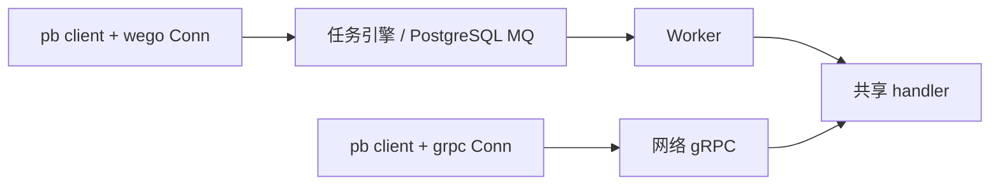
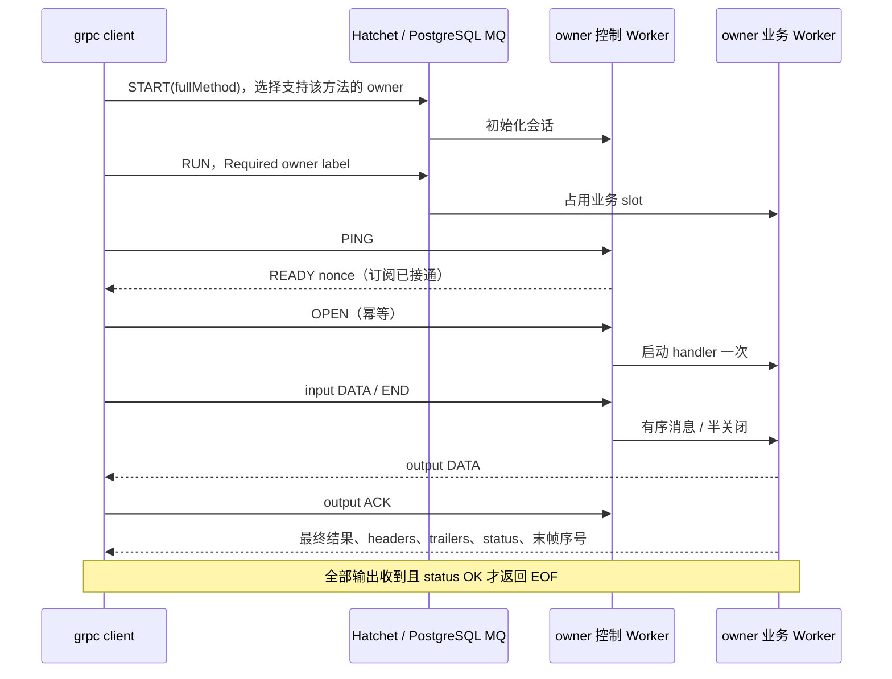

# wego Worker

业务使用标准 gRPC handler 与生成桩；`Conn` 同时提供 wego 运行和管理 API。公开类型与回调均不依赖 Hatchet。

## 注册与连接

```go
cfg := []runtime.Option{
    runtime.WithToken(os.Getenv("HATCHET_CLIENT_TOKEN")),
    runtime.WithAddress("localhost:7077"),
    runtime.WithServerURL("http://localhost:8080"),
    runtime.WithTLSConfig(nil), // 明文连接
    runtime.WithInputProjection(pb.Greeter_SayHello_FullMethodName,
        map[string]string{"group": "group_key"}),
}

srv := wego.NewServer(server.WithRuntime(cfg...), server.WithWorker(
    worker.WithTask(pb.Greeter_SayHello_FullMethodName, task.WithRetries(3)),
    worker.WithDurableTask(pb.Greeter_WaitHello_FullMethodName),
))
pb.RegisterGreeterServer(srv, &greeter{})
go func() {
    if err := srv.Serve(); err != nil { /* 上报启动或运行错误 */ }
}()
defer srv.Stop()

conn, err := client.New(client.WithRuntime(cfg...))
// 处理 err。
defer conn.Close()
rpc := pb.NewGreeterClient(conn)
out, err := rpc.SayHello(ctx, &pb.Request{Message: "hello", GroupKey: "group-a"})

ref, err := conn.RunNoWait(ctx, pb.Greeter_SayHello_FullMethodName, request)
result, err := ref.Result(ctx)
err = result.Into(&pb.Reply{})
// 同一 conn 支持 Run、RunMany、Crons、Schedules、Events、Filters、Runs 等入口。
```

客户端和 Worker 同时使用协议 3，不与其他版本混用。metadata 按原始字节编码，支持 `-bin`。客户端和 Worker 共享投影配置。业务载荷为 protobuf 二进制，在版本 3 JSON envelope 中使用 base64；仅显式配置的字段进入 `input.routing`，CEL 使用 `input.routing.group`。投影先于压缩、加密和卸载生成。Cron / Schedule / Event 的 RPC 输入也可使用 `model.RPCInput{Method: fullMethod, Message: request}`。client stream 的零字节响应有效；终态用 `has_response` 区分它与未发送响应。

## 网络与 Worker 双入口

```go
// 双入口：Worker 默认启用，网络调用直接执行同一 handler。
srv := wego.NewServer(
    server.WithRuntime(cfg...),
    server.WithGRPC(":9000", grpc.ChainUnaryInterceptor(auth)),
)
pb.RegisterUnaryGreeterServer(srv, &greeter{})
err := srv.Serve()

// 纯网络：不建立任务后端连接，也不要求 token。
srv = wego.NewServer(
    server.WithGRPC(":9000"),
    server.WithRuntime(runtime.WithDisableWorker()),
)
```



`WithWorker` 仅配置任务策略；启用开关放在 Runtime。原生 `grpc.ServerOption` 仅作用于网络入口。网络 handler 使用普通 gRPC context，不具备任务身份和 durable 能力。

## Unary 与 durable

```go
func (g *greeter) SayHello(ctx context.Context, in *pb.Request) (*pb.Reply, error) {
    return &pb.Reply{Message: in.Message}, nil
}

func (g *greeter) WaitHello(ctx context.Context, in *pb.Request) (*pb.Reply, error) {
    now, err := task.Now(ctx) // memo，重放复用
    if err != nil { return nil, err }
    if err := task.Sleep(ctx, time.Second); err != nil { return nil, err }
    conn, err := task.Client(ctx) // 借用连接，Close 返回 ErrBorrowedResource
    if err != nil { return nil, err }
    child, err := pb.NewGreeterClient(conn).SayHello(task.WithChildKey(ctx, "greet"), in)
    if err != nil { return nil, err }
    child.ProcessedAt = now.Format(time.RFC3339Nano)
    return child, nil
}
```

`task.WaitForEvent` 支持 CEL、scope 和 lookback；驱逐与 Worker 重启后保留等待序号、memo 和稳定子调用身份。错误使用 gRPC status / details 或 `task.NonRetryable(err)`；`task.Info(ctx)` 返回 wego 执行信息。

## 三种流

```go
// client stream
upload, err := rpc.UploadHellos(ctx)
for _, request := range requests { if err := upload.Send(request); err != nil { return err } }
out, err := upload.CloseAndRecv()

// server stream
watch, err := rpc.WatchHellos(ctx, request)
for { out, err := watch.Recv(); if err == io.EOF { break }; /* 处理 out / err */ }

// bidi stream：一个 goroutine 发送，一个 goroutine 接收。
chat, err := rpc.ChatHellos(ctx)
go func() { for _, request := range requests { chat.Send(request) }; chat.CloseSend() }()
for { out, err := chat.Recv(); if err == io.EOF { break }; /* 处理 out / err */ }
```

```go
func (g *greeter) UploadHellos(s grpc.ClientStreamingServer[pb.Request, pb.Reply]) error {
    var count int32
    for {
        _, err := s.Recv()
        if err == io.EOF { return s.SendAndClose(&pb.Reply{Count: count}) }
        if err != nil { return err }
        count++
    }
}
func (g *greeter) WatchHellos(in *pb.Request, s grpc.ServerStreamingServer[pb.Reply]) error {
    for i := int32(0); i < in.Count; i++ {
        if err := s.Send(&pb.Reply{Count: i}); err != nil { return err }
    }
    return nil
}
func (g *greeter) ChatHellos(s grpc.BidiStreamingServer[pb.Request, pb.Reply]) error {
    for { in, err := s.Recv(); if err == io.EOF { return nil }; if err != nil { return err }
        if err := s.Send(&pb.Reply{Message: in.Message}); err != nil { return err }
    }
}
```



两个方向独立序号、去重和 ACK。默认每方向窗口 64 条、缓冲 4 MiB、单条业务消息 1 MiB；控制 Worker 独立 4 slots。`CloseSend` 只关闭输入。会话不自动重试，不参与 durable 重放；断流、owner 丢失和输出缺口明确失败。

## 关闭与观测

`Serve()` 阻塞到停止或故障；`GracefulStop()` 等待业务排空，`Stop()` 立即取消，也可中断正在进行的排空。退出信号由应用处理。原生 Worker 保留 `Start` / `StartBlocking(ctx)` / `WaitReady` / `Shutdown`。


Conn 的 `runtime.WithShutdown` 同时供原生 Worker 沿用，可选 `DrainUntilDone` 或 `DrainWithTimeout`，默认 30 秒。Server 的 `GracefulStop` 无业务等待超时，`Stop` 的资源清理使用配置预算。Trace provider 属于实例，支持附加 exporter，不替换全局 provider；metrics 默认关闭。Worker 日志级别用 `runtime.WithLogger(slog.New(slog.NewJSONHandler(os.Stderr, &slog.HandlerOptions{Level: slog.LevelDebug})))`；`runtime.WithLogReport(true)` 开启任务日志上报。

可运行示例与断言：[examples/scenarios](../../examples/scenarios)、[验收清单](../../examples/acceptance.json)、[module.md](module.md)。
