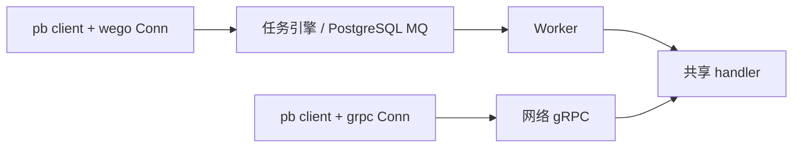
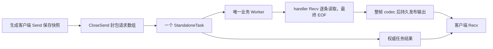
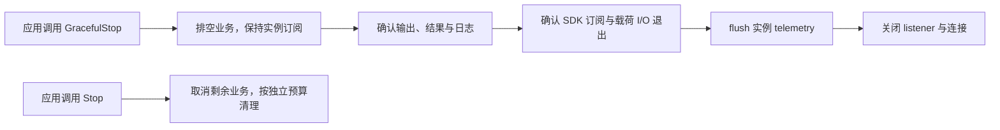

# wego Worker

业务使用标准 gRPC handler 与生成桩；`Conn` 同时提供 wego 运行和管理 API。公开类型与回调均不依赖 Hatchet。

## 注册与连接

下面列出当前注册、连接与调用的完整 option，按作用范围分组。示例值可按需调整；替代配置单独展示。`pb` 指 [示例生成桩](../../examples/proto)，`greeter` 为业务实现；Server 与 Client 代码分别用于服务端和客户端进程。

### Runtime：连接与实例配置

```go
// 两端保持 namespace、routing 默认值、流模式和 codec 一致。
// 每个 Server / Conn 独立拥有资源，复用配置不代表共享底层连接。
cfg := []runtime.Option{
	runtime.WithToken(os.Getenv("HATCHET_CLIENT_TOKEN")), // 租户访问令牌，不写入日志。
	runtime.WithAddress("localhost:7077"),                // Hatchet gRPC 地址。
	runtime.WithServerURL("http://localhost:8080"),       // Hatchet HTTP API 地址。
	runtime.WithTLSConfig(nil),                           // 显式明文；TLS 替代配置见后文。
	// runtime.WithTenantID(os.Getenv("HATCHET_TENANT_ID")), // 可选租户 ID，通常由 token 解析。

	runtime.WithNamespace("demo"),         // 命名作用域，默认空；两端必须一致。
	runtime.WithInstanceName("processor"), // 覆盖完整展示名称，不改变随机 worker_key。
	runtime.WithSlots(100),                // 普通任务容量，默认 100；流执行期间也占容量。
	runtime.WithDurableSlots(1000),        // durable 独立容量，默认 1000。
	runtime.WithLabels(map[string]any{
		"region":   "local", // 业务标签用于亲和性，值使用字符串或整数。
		"capacity": 8,       // 自动追加 worker_name=processor，同名配置由实际名称覆盖。
	}),

	runtime.WithLogger(slog.New(slog.NewJSONHandler(os.Stderr, &slog.HandlerOptions{
		Level: slog.LevelDebug, // wego log 共享出口的等级；并发替换安全，不修改 slog.Default。
	}))),
	runtime.WithLogReport(true), // R 系列打印后附加任务上报，默认 false；普通系列只打印。
	runtime.WithLogReportTimeout(5*time.Second), // 单次同步上报预算，默认 5 秒，与调用 deadline 取较早者。
	runtime.WithTelemetry(telemetry.Config{
		Trace: telemetry.TraceConfig{
			DisableWorkerExporter: false, // 默认向 Hatchet 导出 trace；true 只关闭这个出口。
			Exporters:             nil,   // 可追加已创建的 OTel exporter，由调用方负责关闭。
		},
		Metrics: telemetry.MetricsConfig{Enabled: false}, // 指标默认关闭。
	}),
	runtime.WithMetrics(telemetry.MetricsConfig{
		Enabled: false,            // 只覆盖上面的 Metrics；true 开启 /metrics。
		Addr:    "127.0.0.1:9464", // 多个实例开启指标时必须使用不同监听地址。
	}),

	runtime.WithShutdown(runtime.ShutdownConfig{
		Mode:    runtime.DrainWithTimeout, // Conn / 原生 Worker 按预算排空，可选 DrainUntilDone。
		Timeout: 30 * time.Second,         // 默认 30 秒；强制停止仍有独立资源清理预算。
	}),
	runtime.WithResultPollInterval(time.Second), // 取消状态辅助查询间隔，默认 1 秒；不是等待超时。
	runtime.WithBackendMessageLimit(4 << 20),    // 完整后端 RPC 预算，默认 4 MiB；不能提高服务端上限。

	runtime.WithRoutingDefaults(pb.Greeter_SayHello_FullMethodName, map[string]any{
		"group": "default", // CEL 读取 input.routing.group，不依赖业务 payload 解码。
		"cost":  1,         // 单次调用可覆盖，例如 cost=3 消耗三单位限流额度。
		"skip":  false,     // 供事件过滤表达式读取。
	}),
}
```

普通字段按顺序覆盖；`WithMiddleware` 追加处理链。`WithStreamOptions` 替换该方法的整份配置，`WithStreamMode` / `WithStreamIdempotencyTTL` 只修改对应字段。routing 保存独立快照，顶层键覆盖、嵌套对象整体替换，非法 JSON 值报错。

### Runtime：流与 Worker 通知预算

```go
cfg = append(cfg,
	// 所有流方法的基础限制，未设置方法级值时继承。
	runtime.WithStream(runtime.StreamConfig{
		Window:          64,      // 输出预取条数，默认 64。
		BufferBytes:     4 << 20, // 输出预取业务字节，默认 4 MiB。
		MaxMessageBytes: 1 << 20, // codec 前单条业务消息，默认 1 MiB。
	}),
	runtime.WithStreamOptions(pb.Greeter_WatchHellos_FullMethodName, runtime.StreamOptions{
		Mode:                   runtime.Reliable, // 默认持久输出；Realtime 不提供回放 / checkpoint。
		IdempotencyTTL:         24 * time.Hour,   // 输入提交幂等保留期。
		MaxMessageBytes:        1 << 20,          // codec 前单条业务消息上限。
		MaxFrameBytes:          4 << 20,          // codec 还原后的完整帧上限，含协议字段。
		MaxEncodedMessageBytes: 4 << 20,          // 业务 codec 中间字节上限。
		MaxInputBytes:          4 << 20,          // 整批原始请求累计上限。
		MaxEncodedInputBytes:   4 << 20,          // 完整 JSON 输入 envelope 上限。
		MaxInputMessages:       4096,             // 请求条数上限，零字节消息也计数。
		PrefetchMessages:       64,               // 尚未交付给 Recv 的业务输出条数。
		PrefetchBytes:          4 << 20,          // 尚未交付的业务输出字节上限。
		ClaimTimeout:           10 * time.Second, // 确认本次 CLAIM 的预算。
		CompletionTimeout:      30 * time.Second, // 引擎成功后补齐输出、核对最终清单的预算。
		PublishTimeout:         10 * time.Second, // 固定 producer / 序号 / 字节的发布重试预算。
		DecodeTimeout:          10 * time.Second, // 单帧还原预算，包含 S3 下载等 codec I/O。
		RecoveryTimeout:        30 * time.Second, // 恢复扫描与业务历史迭代的总预算。
		MaxCheckpointMessages:  1000,             // handler 有效历史输出条数上限。
		MaxCheckpointBytes:     10 << 20,         // 有效历史 ProtoJSON 累计上限。
		MaxReplayFrames:        100000,           // 扫描帧数上限，含旧代次无效输出。
		MaxReplayBytes:         64 << 20,         // 分别限制编码及还原的历史总字节。
	}),
	// 仅改对应字段，不清除上面已有预算；Realtime 必须显式选择，不自动降级。
	runtime.WithStreamMode(pb.Greeter_WatchHellos_FullMethodName, runtime.Reliable),
	runtime.WithStreamIdempotencyTTL(pb.Greeter_WatchHellos_FullMethodName, 24*time.Hour),

	runtime.WithWorkerEventOptions(runtime.WorkerEventOptions{
		QueueMessages:   128,              // 业务回调队列条数；不占任务 slots。
		QueueBytes:      1 << 20,          // 排队及正在回调的载荷总量。
		MaxMessageBytes: 64 << 10,         // 完整事件 JSON 上限。
		MaxFrameBytes:   4 << 20,          // codec 还原后的完整事件帧上限。
		MaxEncodedBytes: (4 << 20) - 5120, // 编码帧上限，从 4 MiB 预留协议开销。
		TTL:             5 * time.Minute,  // 未指定 ExpiresAt 时的有效期。
		CallbackTimeout: 30 * time.Second, // 单次回调预算；业务必须响应 context。
		PublishTimeout:  10 * time.Second, // 编码与固定字节发布重试预算。
		DecodeTimeout:   10 * time.Second, // 单帧逆 codec 预算。
		RecoveryTimeout: 30 * time.Second, // 故障后重新确认订阅的预算。
		JoinTimeout:     30 * time.Second, // 加入屏障与历史扫描预算。
		MaxReplayFrames: 100000,           // 屏障前历史扫描上限，含旧广播。
		MaxReplayBytes:  64 << 20,         // 分别限制编码及还原的通知历史总字节。
		DedupEntries:    4096,             // 有效期内事件 ID 去重缓存上限。
	}),
	runtime.WithWorkerEventHandler(func(ctx context.Context, event model.WorkerEvent) error {
		// 处理定向 / 同 namespace 广播；内部取消独立处理，不受业务队列阻塞。
		return reload(ctx, event.Payload)
	}),
)
```

上面流及通知预算为当前默认值；方法级与通知配置的零值字段继承默认值，负值会被拒绝。两端保持模式、提交 TTL 和 codec 一致，各端分别执行资源预算；完整后端请求还受 `WithBackendMessageLimit` 和服务端限制约束。CLAIM、DATA、headers、结束帧及通知控制帧都经过完整帧 codec。

### Middleware：拦截器与载荷 codec

```go
// 四个 interceptor 是业务提供的标准 gRPC 拦截器。
// payloadCodec 是已初始化的 middleware.FramedPayload，例如 gzip + AES-GCM + S3 卸载。
cfg = append(cfg, runtime.WithMiddleware(
	middleware.WithUnaryServer(unaryServer),   // Worker unary handler 拦截器。
	middleware.WithUnaryClient(unaryClient),   // wego Conn unary 调用拦截器。
	middleware.WithStreamServer(streamServer), // Worker 流 handler 拦截器。
	middleware.WithStreamClient(streamClient), // wego Conn 流调用拦截器。
	middleware.WithPayload(payloadCodec),      // 业务输入及完整协议帧变换，routing 保持 JSON 可读。
))
```

编码按注册顺序，解码按反序。流及 Worker 通知要求 codec 实现稳定 `CodecID` 与有界 `DecodeLimit`，支持并发调用，I/O 尊重 context。可运行实现见 [codec 示例](../../examples/codec)。网络入口通过 `server.WithGRPC` 的原生选项配置 interceptor / codec。

### Server / Worker：注册与任务策略

```go
// ptr 区分未配置与显式零值，用于下面模型的指针字段。
func ptr[T any](value T) *T { return &value }

srv := wego.NewServer(
	server.WithRuntime(cfg...), // 实例连接、容量、codec、通知及关闭配置。
	server.WithWorker( // 仅作用于任务入口；方法配置覆盖默认策略。
		// worker.WithDisableMethod( // 按需开启：批量禁用任务注册和消费，网络入口仍可调用。
		// 	pb.Greeter_ChildHello_FullMethodName,
		// 	pb.Greeter_UploadHellos_FullMethodName,
		// ),
		worker.WithTaskDefaults(
			task.WithRetries(3),                      // 失败后的重试次数；0 明确禁止应用重试。
			task.WithExecutionTimeout(time.Minute),   // 每次执行的最长时间。
			task.WithScheduleTimeout(5*time.Minute),  // 排队等待调度的最长时间。
			task.WithRetryBackoff(2, 30*time.Second), // 指数退避倍率及最大等待。
			task.WithSlotCost(1),                     // 容量消耗；Slots=4、cost=2 最多并发两次。
		),
		worker.WithTask(pb.Greeter_SayHello_FullMethodName,
			task.WithSticky(task.StickySoft), // 关联执行优先复用 Worker；StickyHard 不允许回退。
			task.WithConcurrency(task.Concurrency{
				Expression:     "input.routing.group",      // group-a / group-b 各自分组。
				MaxRuns:        ptr(int32(2)),              // 同组最多两次同时执行。
				LimitStrategy:  ptr(model.GroupRoundRobin), // 分组轮转，也可选排队 / 取消 / 丢弃。
				Name:           "group-budget",             // 并发约束名称。
				IsTenantScoped: false,                      // true 在租户内共享同名约束。
				// MaxRunsExpression: ptr("input.routing.max_runs"), // 动态上限，替代固定 MaxRuns。
			}),
			task.WithRateLimits(task.RateLimit{
				KeyExpr:        ptr("input.routing.group"), // 各 group 使用独立限流键。
				UnitsExpr:      ptr("input.routing.cost"),  // cost=3 消耗三单位额度。
				LimitValueExpr: ptr("10"),                  // 每周期最多十单位。
				Duration:       ptr(model.Minute),          // 也可选 Second / Hour / Day 等周期。
				// 静态替代：RateLimit{Key: "api-budget", Units: ptr(1)}，先创建同名限流资源。
			}),
			task.WithCron("* * * * *"), // 每分钟触发；不需要时省略，避免自动执行。
			task.WithCronInput(model.RPCInput{
				Method:  pb.Greeter_SayHello_FullMethodName, // Cron / Schedule / Event 的 RPC 目标。
				Message: &pb.Request{Message: "scheduled"},  // protobuf 请求。
				Routing: map[string]any{"group": "scheduled", "cost": 1, "skip": false},
			}),
			task.WithEvents("greeting:create"), // 事件键触发；流输入由流客户端封包提交。
			task.WithDefaultFilters(task.DefaultFilter{
				Expression: "!input.routing.skip",             // skip=true 的事件不触发任务。
				Scope:      "greeting-scope",                  // 与发布事件 scope 一致。
				Payload:    map[string]any{"source": "event"}, // handler 通过 task.Info 读取附加数据。
			}),
		),
		worker.WithDurableTask(pb.Greeter_WaitHello_FullMethodName,
			task.WithEviction(task.EvictionPolicy{
				TTL:                   option.Some(time.Minute), // 挂起超过此时长允许驱逐。
				AllowCapacityEviction: option.Some(true),        // 允许容量驱逐；false 禁止此类驱逐。
				Priority:              option.Some(0),           // 驱逐优先级，显式 0 保留。
			}),
		),
		worker.WithPanicHandler(func(ctx context.Context, value any) {
			// panic 仍转为任务错误，这里记录业务诊断。
			slog.ErrorContext(ctx, "handler panic", "panic", value)
		}),
	),
	// 可选网络入口；省略 WithGRPC 时只启动 Worker。
	server.WithGRPC(":9002",
		grpc.ChainUnaryInterceptor(unaryServer),   // 原生网络 unary 拦截器，与 Worker 链独立。
		grpc.ChainStreamInterceptor(streamServer), // 原生网络流拦截器。
		grpc.MaxRecvMsgSize(4<<20),                // 网络接收限制，不改变任务预算。
		grpc.MaxSendMsgSize(4<<20),                // 其他 grpc.ServerOption 同样直接透传。
	),
)
pb.RegisterGreeterServer(srv, &greeter{}) // 两个入口共享同一业务实现。
if err := srv.Serve(); err != nil {       // 阻塞到停止或故障；应用调用 Stop / GracefulStop 退出。
	log.Fatal(err)
}
```

`WithDisableMethod(method ...string)` 支持批量传入 unary 和三种流的方法名，也可使用 `methods...` 展开切片；空参数无效果，重复配置幂等，禁用优先于同方法的 `WithTask` / `WithDurableTask`。未知方法在 `Serve` 时返回配置错误；全部方法禁用时使用 `runtime.WithDisableWorker()` 运行纯网络服务。它不删除已有 workflow，也不影响其他 Worker 副本的注册与消费。

并发策略还包括 `CancelInProgress`、`CancelNewest`、`DropNewest`、`QueueNewest`、`CancelQueuedExceptNewest`、`CancelQueuedExceptOldest`。`WithEviction` 只用于 durable unary；输入流不参加 durable eviction/replay。

以下为普通任务的两种**替代**幂等策略，二选一传入 `worker.WithTask`，每次输入必须提供 `routing.id`。可靠流使用内部提交幂等规则，通过 `WithStreamIdempotencyTTL` 调整，不能同时注册冲突的任务幂等策略。

```go
// TTL 策略：24 小时内相同 id 返回含 ExistingRunID 的冲突错误。
dedup := task.WithIdempotencyTTL("input.routing.id", false, 24*time.Hour)
// 状态策略：按运行状态判定；此选项不显式设置 TTL。
// dedup = task.WithIdempotency("input.routing.id", true)
// 注册：worker.WithTask(pb.Greeter_SayHello_FullMethodName, dedup)。
```

### Client：连接与单次调用

```go
conn, err := client.New(client.WithRuntime(cfg...)) // 连接只配置 Runtime，先处理初始化错误。
if err != nil {
	return err
}
defer conn.Close() // 按 WithShutdown 关闭；task.Client 借用连接禁止关闭共享资源。
rpc := pb.NewGreeterClient(conn)

ctx = client.WithRouting(ctx, map[string]any{
	"group": "group-a", "cost": 2, // 顶层覆盖默认值；一次输入流只有一份 routing。
})
out, err := rpc.SayHello(ctx, &pb.Request{Message: "hello"})
// 流调用另可设置提交幂等键，业务在提交前保存 operationKey：
streamCtx := client.WithIdempotencyKey(ctx, operationKey)
watch, err := rpc.WatchHellos(streamCtx, &pb.Request{Count: 3})

runOpts := []client.RunOption{
	client.WithRunPriority(1),                                  // 本次提交优先级，不改变定义策略。
	client.WithRunMetadata(map[string]string{"source": "api"}), // 运行级 metadata，区别于 gRPC metadata。
	client.WithDesiredWorkerLabels(map[string]*model.DesiredWorkerLabel{
		"region": {
			Value:      "local",               // 与 Worker 标签比较。
			Required:   true,                  // 硬亲和，不回退到不匹配的 Worker。
			Weight:     1,                     // 软亲和时用于匹配排序。
			Comparator: ptr(model.LabelEqual), // 可选不等于 / 大于 / 小于等比较。
		},
	}),
	// 父任务 / durable 子调用按需使用，顶层提交通常省略：
	// client.WithRunKey("child-greet"), // 稳定 child key，不是提交幂等键。
	// client.WithRunSticky(true),       // 请求留在父 Worker，配合定义级 Sticky 策略。
}
ref, err := conn.RunNoWait(ctx, pb.Greeter_SayHello_FullMethodName, request, runOpts...)
if err != nil {
	return err
}
result, err := ref.Result(ctx) // 取消等待也请求取消共享运行，其他观察者会受影响。
if err != nil {
	return err
}
err = result.Into(&pb.Reply{})
// Run 使用同一组 RunOption；RunMany 每项通过 RunManyInput.Options 配置。
// 同一 conn 还提供 Crons、Schedules、Events、Filters、Runs 等管理入口。
```

### 原生 JSON / batch Worker 的替代注册

```go
// 原生入口无需生成桩；任务策略仍使用 task.Option。
greet := conn.NewStandaloneTask("greet", func(ctx context.Context, in map[string]string) (map[string]string, error) {
	return map[string]string{"message": "hello " + in["name"]}, nil
}, task.WithRetries(0))

native, err := conn.NewWorker("json-processor",
	client.WithWorkflows(greet), // 注册原生 StandaloneTask / Workflow / batch 定义。
	client.WithWorkerRuntime( // 仅覆盖容量、标签、Logger、LogReport；连接等仍由 Conn 拥有。
		runtime.WithSlots(10),
		runtime.WithDurableSlots(100),
		runtime.WithLabels(map[string]any{"region": "local"}),
	),
	client.WithPanicHandler(func(ctx context.Context, value any) { // 原生 Worker 的 panic 回调。
		slog.ErrorContext(ctx, "native handler panic", "panic", value)
	}),
)
// 处理 err 后使用 native.Start / StartBlocking，生命周期见“关闭与观测”。
```

### 连接与运行模式的替代配置

```go
// WithHostPort 与 WithAddress 二选一，后设置的地址覆盖前者。
runtime.WithHostPort("localhost", 7077)
// 明文之外的 TLS 连接，正常验证证书；RootCAs 等按实际证书配置。
runtime.WithTLSConfig(&tls.Config{MinVersion: tls.VersionTLS12, ServerName: "engine.example.test"})
// 无期限业务排空；Stop 仍可打断，资源清理仍使用 Timeout 预算。
runtime.WithShutdown(runtime.ShutdownConfig{Mode: runtime.DrainUntilDone, Timeout: 30 * time.Second})

// 只禁用 Server Worker，不禁止 Conn 提交；创建原生 Worker 会报配置冲突。
networkOnly := wego.NewServer(
	server.WithRuntime(runtime.WithDisableWorker()),
	server.WithGRPC(":9002"), // 纯网络不要求 token，不创建任务后端或通知订阅。
)

// 嵌入引擎替代外部连接，使用独立配置，并以 wego_embedded build tag 构建。
embeddedCfg := []runtime.Option{
	runtime.WithEmbedded(runtime.EmbeddedConfig{
		DatabaseURL:       os.Getenv("WEGO_EMBEDDED_DATABASE_URL"), // PostgreSQL DSN，不输出凭证。
		GRPCPort:          17077,                                   // 嵌入 gRPC 端口；0 使用嵌入实现的默认配置。
		APIPort:           18080,                                   // 嵌入 HTTP API 端口。
		DisableAPI:        false,                                   // 关闭 API 的开关；依赖管理接口的场景保留 API。
		DisableMigrations: false,                                   // 默认执行迁移，受控预迁移场景才跳过。
		LogLevel:          "info",                                  // 嵌入引擎日志等级，独立于 WithLogger。
	}),
}
// Server 使用 server.WithRuntime(embeddedCfg...)，Conn 使用 client.WithRuntime(embeddedCfg...)。
// 每个实例拥有自己的引擎，不能同时争用上述端口；CI 明确设置 SERVER_SECURITY_CHECK_ENABLED=false。
```

客户端和 Worker 同时使用协议 4。业务输入使用 ProtoJSON；routing 独立于 codec，CEL 使用 `input.routing.group`。Cron / Schedule / Event 使用 `model.RPCInput{Method: fullMethod, Message: request, Routing: fields}`。

Worker 默认名称：`<namespace>-<hostname>-<随机 worker_key 前12位>`；空 namespace 省略前段。workflow：`<namespace>-<完整 protobuf 服务名>-<方法名>`。同方法的副本共享定义，停止 Worker 不自动暂停或删除定义。

Worker 自动追加 `worker_name` 标签，值为最终展示名称。例如 `WithInstanceName("processor")` 注册 `worker_name=processor`；其他业务标签保留，配置中的同名键由实际名称覆盖。

任务 Worker 的实例通知也使用 Durable Streams；部署需先启用租户 entitlement，只有 unary 方法也遵守此要求。纯网络模式不依赖它。

## 网络与 Worker 双入口

```go
// 双入口：Worker 默认启用，网络调用直接执行同一 handler。
srv := wego.NewServer(
    server.WithRuntime(cfg...),
    server.WithGRPC(":9002", grpc.ChainUnaryInterceptor(auth)),
)
pb.RegisterUnaryGreeterServer(srv, &greeter{})
err := srv.Serve()

// 纯网络：不建立任务后端连接，也不要求 token。
srv = wego.NewServer(
    server.WithGRPC(":9002"),
    server.WithRuntime(runtime.WithDisableWorker()),
)
```



`WithWorker` 仅配置任务策略；启用开关放在 Runtime。原生 `grpc.ServerOption` 仅作用于网络入口。网络 handler 使用普通 gRPC context，不具备任务身份和 durable 能力。

## Unary 与 durable

```go
func (g *greeter) SayHello(ctx context.Context, in *pb.Request) (*pb.Reply, error) {
    return &pb.Reply{Message: in.Message}, nil
}

func (g *greeter) WaitHello(ctx context.Context, in *pb.Request) (*pb.Reply, error) {
    now, err := task.Now(ctx) // memo，重放复用
    if err != nil { return nil, err }
    if err := task.Sleep(ctx, time.Second); err != nil { return nil, err }
    conn, err := task.Client(ctx) // 借用连接，Close 返回 ErrBorrowedResource
    if err != nil { return nil, err }
    child, err := pb.NewGreeterClient(conn).SayHello(task.WithChildKey(ctx, "greet"), in)
    if err != nil { return nil, err }
    child.ProcessedAt = now.Format(time.RFC3339Nano)
    return child, nil
}
```

`task.WaitForEvent` 支持 CEL、scope 和 lookback；驱逐与 Worker 重启后保留等待序号、memo 和稳定子调用身份。错误使用 gRPC status / details 或 `task.NonRetryable(err)`；`task.Info(ctx)` 返回 wego 执行信息。

## 三种流

```go
// client stream
upload, err := rpc.UploadHellos(ctx)
for _, request := range requests { if err := upload.Send(request); err != nil { return err } }
out, err := upload.CloseAndRecv()

// server stream
watch, err := rpc.WatchHellos(ctx, request)
for { out, err := watch.Recv(); if err == io.EOF { break }; /* 处理 out / err */ }

// Worker bidi：整批输入、流式输出。网络 gRPC 仍支持交互式双向。
chat, err := rpc.ChatHellos(ctx)
for _, request := range requests { if err := chat.Send(request); err != nil { return err } }
if err := chat.CloseSend(); err != nil { return err }
for { out, err := chat.Recv(); if err == io.EOF { break }; /* 处理 out / err */ }
```

```go
func (g *greeter) UploadHellos(s grpc.ClientStreamingServer[pb.Request, pb.Reply]) error {
    var count int32
    for {
        _, err := s.Recv()
        if err == io.EOF { return s.SendAndClose(&pb.Reply{Count: count}) }
        if err != nil { return err }
        count++
    }
}
func (g *greeter) WatchHellos(in *pb.Request, s grpc.ServerStreamingServer[pb.Reply]) error {
    for i := int32(0); i < in.Count; i++ {
        if err := s.Send(&pb.Reply{Count: i}); err != nil { return err }
    }
    return nil
}
func (g *greeter) ChatHellos(s grpc.BidiStreamingServer[pb.Request, pb.Reply]) error {
    for { in, err := s.Recv(); if err == io.EOF { return nil }; if err != nil { return err }
        if err := s.Send(&pb.Reply{Message: in.Message}); err != nil { return err }
    }
}
```



server/bidi 默认 Reliable，需实例启用 Durable Streams。`runtime.WithStreamMode(fullMethod, runtime.Realtime)` 改用 PutStream；实时模式不支持历史恢复。所有输出及控制帧统一经过 codec，自定义流 codec 必须实现 `middleware.FramedPayload`。默认单条业务 1 MiB、输入总量 4 MiB、预取 64 条/4 MiB；`WithStreamOptions` 按方法调整。

输入流只有一次提交，不参加 durable eviction/replay。恢复已有运行不重新提交输入；业务在提交前保存幂等键，在成功消费后保存 checkpoint。

```go
ctx = client.WithIdempotencyKey(ctx, operationKey)
watch, err := rpc.WatchHellos(ctx, request)
out, err := watch.Recv()
checkpoint, err := client.StreamCheckpoint(watch.Context())
// 业务处理 out 后持久保存 checkpoint，例如 json.Marshal(checkpoint)。

resumed, err := conn.ResumeStream(ctx, checkpoint)
for {
    var out pb.Reply
    err := resumed.RecvMsg(&out)
    if err == io.EOF { break }
    if err != nil { return err }
    // 处理下一条输出，再保存新的消费 checkpoint。
}
```

可靠重试的 handler 恢复有限历史，必须读到 EOF 后继续发送；首次执行历史为空。下面用业务 Count 作为恢复进度：

```go
history, err := task.Checkpoint(s.Context())
if err != nil { return err }
defer history.Close()
var next int32
for {
    var prior pb.Reply
    err := history.Next(&prior)
    if err == io.EOF { break }
    if err != nil { return err }
    next = prior.Count + 1
}
for i := next; i < in.Count; i++ {
    if err := s.Send(&pb.Reply{Count:i}); err != nil { return err }
}
```

外部副作用及“处理消息后、保存断点前”崩溃产生的重复消费，由业务自行幂等。实时模式不提供上述恢复能力。

## Worker 通知

```go
// Server Runtime：当前实例接收定向和同 namespace 广播，回调不占任务 slots。
runtime.WithWorkerEventHandler(func(ctx context.Context, event model.WorkerEvent) error {
    return reload(ctx, event.Payload)
})

event := model.WorkerEvent{Type:"reload", Payload:json.RawMessage(`{"version":2}`)}
err := conn.Workers().SendEvent(ctx, workerKey, event)
err = conn.Workers().BroadcastEvent(ctx, event)
```

workerKey 可从 `task.Info(ctx)` 获取；它是实例身份，展示名称不用于寻址。发布成功表示持久存储成功，不表示回调处理完成。默认有效期五分钟，新实例跳过加入前的广播；业务队列满时明确拒绝，内部取消独立处理。

## 关闭与观测

`Serve()` 阻塞到停止或故障，应用显式调用停止方法：

```go
ctx := log.With(context.Background(), slog.String("component", "processor"))
go func() {
    if err := srv.Serve(); err != nil {
        log.Error(ctx, "server stopped", "error", err)
    }
}()
// 应用自己的退出流程选择一种方式：
srv.GracefulStop() // 停止接收新工作，等待已有业务完成。
// srv.Stop()     // 立即取消，也能中断正在进行的 GracefulStop。
```

SDK 不安装进程信号监听。Conn 与原生 Worker 沿用 Runtime 关闭策略，默认独立清理预算 30 秒；原生 Worker 保留 Start / StartBlocking / WaitReady / Shutdown。



`runtime.WithLogger` 设置 log 包共享输出，最后一次应用的显式配置生效；不修改 slog.Default。普通日志、网络 handler、任务及 R 系列使用同一出口。上下文字段后写覆盖，执行与有效 trace 身份由 SDK 最终补充：

```go
ctx = log.With(ctx, slog.Int("batch_size", 10))
child := log.With(ctx, slog.Int("batch_size", 20)) // 子为 20，父仍为 10。
log.Info(child, "开始处理")                        // 只打印。
err = log.RInfo(child, "处理完成", "count", 20)    // 打印，并在任务开启上报时同步提交 metadata。
logger := log.FromContext(child).WithGroup("request")
logger.Info("请求完成", "id", "r-1")             // 支持标准 slog 方法及分组。
```

R 系列在普通/网络 context 中返回 ErrTaskContext，任务关闭上报时返回 ErrLogReportDisabled；两者仍按等级打印。被等级过滤时两个出口均不执行。上报默认预算 5 秒，不自动重试；本地打印与上报失败合并返回。共用属性请放在 log.With 或 R 参数中，外部 Handler 的私有属性无法反向读取。

Trace provider 属于实例，不替换全局 provider；metrics 默认关闭。可运行示例与断言：[examples/scenarios](../../examples/scenarios)、[验收清单](../../examples/acceptance.json)、[module.md](module.md)。
