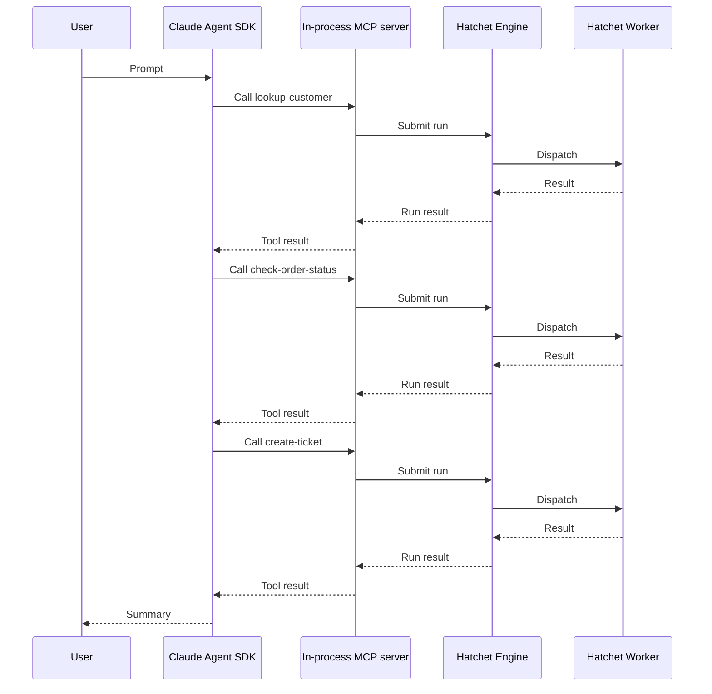

# Hatchet and MCP: Using the Claude Agent SDK in a Trusted Environment

This cookbook builds on the [Hatchet Agent Tools](/cookbooks/hatchet-and-mcp) guide, which covers exposing Hatchet tasks and workflows as MCP tools. Here, we apply the same pattern to a Claude Agent SDK process so Claude can call Hatchet-backed tools as part of an agent loop.

When Claude decides to use a tool, the in-process MCP handler submits a run to the Hatchet engine. A worker executes the task, and the result flows back to Claude.

## What this example builds

The example uses a support scenario similar to [How to Create a Support Agent Using Hatchet](/cookbooks/workflow-support-agent), but with a different architecture. That cookbook models support as a durable Hatchet workflow. This cookbook shows Claude choosing among separate Hatchet-backed tools:

- **lookup-customer**: retrieve a customer profile by ID.
- **check-order-status**: check shipping status and known issues for an order.
- **create-ticket**: open a support ticket for the customer.

> **Info:** The same MCP pattern also works for Hatchet workflows, as shown in [Hatchet
>   Agent Tools](/cookbooks/hatchet-and-mcp). Use a workflow when a tool should
>   trigger a multi-step process rather than a single operation. Later guides in
>   this series will explore larger production agent patterns.

## Architecture



Claude may call independent tools in the same turn instead of waiting for each result before choosing the next tool.

> **Info:** **Trusted environment pattern.** This cookbook uses a trusted-harness
>   architecture. The agent process runs in your own infrastructure with direct
>   access to Hatchet credentials. The in-process MCP server is not an isolation
>   boundary. If you need to run agent turns inside untrusted sandboxes with
>   credentials kept outside, that is a different architecture pattern covered in
>   a later guide.

## Setup


### Prepare your environment

You need:

- A working local Hatchet environment or access to [Hatchet Cloud](https://cloud.hatchet.run)
- A Hatchet SDK example environment (see the [Quickstart](/v1/quickstart))
- An `ANTHROPIC_API_KEY` environment variable set with a valid Anthropic API key

Install the Claude Agent SDK integration for your language:

#### Python

Install the Hatchet SDK extra for Claude:

```bash
    pip install "hatchet-sdk[claude]"
```

#### Typescript

Zod v4 is required for input schema generation:

```bash
    npm install zod@^4.0.0
```

Install the Claude Agent SDK and MCP SDK dependencies:

```bash
    npm install @anthropic-ai/claude-agent-sdk @modelcontextprotocol/sdk
```

### Define the models

Define input and output types for each tool. Claude uses the input schema to understand what arguments a tool accepts.

#### Python

```python
class CustomerLookupInput(BaseModel):
    customer_id: str


class CustomerInfo(BaseModel):
    customer_id: str
    name: str
    email: str
    plan: str
    account_status: str
    default_order_id: str
    support_tier: str


class OrderStatusInput(BaseModel):
    order_id: str


class OrderStatus(BaseModel):
    order_id: str
    status: str
    last_updated: str
    estimated_delivery: str
    known_issue: str | None
    carrier: str
    tracking_number: str


class CreateTicketInput(BaseModel):
    customer_id: str
    order_id: str
    subject: str
    body: str
    priority: str


class TicketResult(BaseModel):
    ticket_id: str
    status: str
    priority: str
    routing_team: str
    summary: str
```

#### Typescript

```typescript
const CustomerLookupInput = z.object({
  customerId: z.string(),
});

type CustomerLookupInputType = z.infer<typeof CustomerLookupInput>;

type CustomerInfo = {
  customerId: string;
  name: string;
  email: string;
  plan: string;
  accountStatus: string;
  defaultOrderId: string;
  supportTier: string;
};

const OrderStatusInput = z.object({
  orderId: z.string(),
});

type OrderStatusInputType = z.infer<typeof OrderStatusInput>;

type OrderStatus = {
  orderId: string;
  status: string;
  lastUpdated: string;
  estimatedDelivery: string;
  knownIssue: string | null;
  carrier: string;
  trackingNumber: string;
};

const CreateTicketInput = z.object({
  customerId: z.string(),
  orderId: z.string(),
  subject: z.string(),
  body: z.string(),
  priority: z.string(),
});

type CreateTicketInputType = z.infer<typeof CreateTicketInput>;

type TicketResult = {
  ticketId: string;
  status: string;
  priority: string;
  routingTeam: string;
  summary: string;
};
```

### Set up the Hatchet client

Initialize the Hatchet client. It reads credentials from environment variables or a `.env` file.

#### Python

```python
from __future__ import annotations

from typing import TYPE_CHECKING

if TYPE_CHECKING:
    from agents import FunctionTool
    from claude_agent_sdk import SdkMcpTool

from pydantic import BaseModel

from hatchet_sdk import Context, Hatchet
from hatchet_sdk.runnables.workflow import MCPProvider

hatchet = Hatchet(debug=True)
```

#### Typescript

```typescript
import { z } from 'zod/v4';
import { hatchet } from '../hatchet-client';
```

### Add deterministic support data

The following fixture data keeps the example runnable without any third-party APIs.

#### Python

```python
CUSTOMERS = {
    "C-100": CustomerInfo(
        customer_id="C-100",
        name="Alice Martin",
        email="alice@example.com",
        plan="business",
        account_status="active",
        default_order_id="ORD-9987",
        support_tier="priority",
    ),
}

ORDERS = {
    "ORD-9987": OrderStatus(
        order_id="ORD-9987",
        status="delayed",
        last_updated="2026-05-20T14:30:00Z",
        estimated_delivery="2026-05-28",
        known_issue="Carrier reported weather delay at regional hub",
        carrier="FastShip",
        tracking_number="FS-482910",
    ),
}
```

#### Typescript

```typescript
const CUSTOMERS: Record<string, CustomerInfo> = {
  'C-100': {
    customerId: 'C-100',
    name: 'Alice Martin',
    email: 'alice@example.com',
    plan: 'business',
    accountStatus: 'active',
    defaultOrderId: 'ORD-9987',
    supportTier: 'priority',
  },
};

const ORDERS: Record<string, OrderStatus> = {
  'ORD-9987': {
    orderId: 'ORD-9987',
    status: 'delayed',
    lastUpdated: '2026-05-20T14:30:00Z',
    estimatedDelivery: '2026-05-28',
    knownIssue: 'Carrier reported weather delay at regional hub',
    carrier: 'FastShip',
    trackingNumber: 'FS-482910',
  },
};
```

### Define the Hatchet-backed tools

Each tool is a standalone Hatchet task with a description and an input validator, as covered in the [Hatchet Agent Tools](/cookbooks/hatchet-and-mcp#or-expose-a-standalone-task) guide.

#### Lookup customer

First, define a tool that retrieves customer profile data.

#### Python

```python
@hatchet.task(
    name="lookup-customer",
    input_validator=CustomerLookupInput,
    description="Look up a customer by ID and return their profile, plan, and support tier.",
)
async def lookup_customer(input: CustomerLookupInput, ctx: Context) -> CustomerInfo:
    customer = CUSTOMERS.get(input.customer_id)
    if customer is None:
        return CustomerInfo(
            customer_id=input.customer_id,
            name="Unknown",
            email="unknown@example.com",
            plan="none",
            account_status="not_found",
            default_order_id="",
            support_tier="standard",
        )
    return customer
```

#### Typescript

```typescript
export const lookupCustomer = hatchet.task({
  name: 'lookup-customer',
  inputValidator: CustomerLookupInput,
  description: 'Look up a customer by ID and return their profile, plan, and support tier.',
  fn: async (input: CustomerLookupInputType): Promise => {
    const customer = CUSTOMERS[input.customerId];
    if (!customer) {
      return {
        customerId: input.customerId,
        name: 'Unknown',
        email: 'unknown@example.com',
        plan: 'none',
        accountStatus: 'not_found',
        defaultOrderId: '',
        supportTier: 'standard',
      };
    }
    return customer;
  },
});
```

#### Check order status

Next, define another tool that returns shipping status, carrier, and any known issues for an order.

#### Python

```python
@hatchet.task(
    name="check-order-status",
    input_validator=OrderStatusInput,
    description="Check the current status, carrier, and any known issues for an order.",
)
async def check_order_status(input: OrderStatusInput, ctx: Context) -> OrderStatus:
    order = ORDERS.get(input.order_id)
    if order is None:
        return OrderStatus(
            order_id=input.order_id,
            status="not_found",
            last_updated="",
            estimated_delivery="",
            known_issue=None,
            carrier="unknown",
            tracking_number="",
        )
    return order
```

#### Typescript

```typescript
export const checkOrderStatus = hatchet.task({
  name: 'check-order-status',
  inputValidator: OrderStatusInput,
  description: 'Check the current status, carrier, and any known issues for an order.',
  fn: async (input: OrderStatusInputType): Promise => {
    const order = ORDERS[input.orderId];
    if (!order) {
      return {
        orderId: input.orderId,
        status: 'not_found',
        lastUpdated: '',
        estimatedDelivery: '',
        knownIssue: null,
        carrier: 'unknown',
        trackingNumber: '',
      };
    }
    return order;
  },
});
```

#### Create ticket

Finally, define a tool that creates a support ticket. Validate inputs before creating records, and consider attaching agent or user context with [additional metadata](/v1/additional-metadata) to improve traceability.

#### Python

```python
@hatchet.task(
    name="create-ticket",
    input_validator=CreateTicketInput,
    description="Create a support ticket for a customer issue and return the ticket ID and routing.",
)
async def create_ticket(input: CreateTicketInput, ctx: Context) -> TicketResult:
    ticket_id = f"TICKET-{input.customer_id}-001"
    return TicketResult(
        ticket_id=ticket_id,
        status="open",
        priority=input.priority,
        routing_team="shipping-support",
        summary=f"Ticket {ticket_id} created for {input.customer_id} "
        f"regarding order {input.order_id}: {input.subject}",
    )
```

#### Typescript

```typescript
export const createTicket = hatchet.task({
  name: 'create-ticket',
  inputValidator: CreateTicketInput,
  description: 'Create a support ticket for a customer issue and return the ticket ID and routing.',
  fn: async (input: CreateTicketInputType): Promise => {
    const ticketId = `TICKET-${input.customerId}-001`;
    return {
      ticketId,
      status: 'open',
      priority: input.priority,
      routingTeam: 'shipping-support',
      summary: `Ticket ${ticketId} created for ${input.customerId} regarding order ${input.orderId}: ${input.subject}`,
    };
  },
});
```

### Expose the tasks as Claude MCP tools

Convert each task into a Claude Agent SDK tool definition using Hatchet's MCP tool helper. The helper uses the task description and input validator to produce a tool object that the Claude Agent SDK can use directly.

#### Python

```python
def create_lookup_customer_tool_claude() -> SdkMcpTool[CustomerLookupInput]:
    return lookup_customer.mcp_tool(MCPProvider.CLAUDE)


def create_check_order_status_tool_claude() -> SdkMcpTool[OrderStatusInput]:
    return check_order_status.mcp_tool(MCPProvider.CLAUDE)


def create_ticket_tool_claude() -> SdkMcpTool[CreateTicketInput]:
    return create_ticket.mcp_tool(MCPProvider.CLAUDE)
```

#### Typescript

```typescript
export function createLookupCustomerToolClaude() {
  return lookupCustomer.mcpTool('claude');
}

export function createCheckOrderStatusToolClaude() {
  return checkOrderStatus.mcpTool('claude');
}

export function createTicketToolClaude() {
  return createTicket.mcpTool('claude');
}
```

> **Info:** The worker does not discover agent tools. It registers Hatchet tasks normally.
>   When the tool handler submits a run, Hatchet dispatches it to a worker that
>   registered the corresponding task.

### Register and start the worker

Register the Hatchet tasks with a worker. Tool calls submit runs to the Hatchet engine, which dispatches them to a running worker.

#### Python

```python
from examples.support_agent_tools.tools import (
    hatchet,
    lookup_customer,
    check_order_status,
    create_ticket,
)


def main() -> None:
    worker = hatchet.worker(
        "support-tools-worker",
        workflows=[lookup_customer, check_order_status, create_ticket],
    )
    worker.start()


if __name__ == "__main__":
    main()
```

#### Typescript

```typescript
import { hatchet } from '../hatchet-client';
import { lookupCustomer, checkOrderStatus, createTicket } from './tools';

async function main() {
  const worker = await hatchet.worker('support-tools-worker', {
    workflows: [lookupCustomer, checkOrderStatus, createTicket],
  });

  await worker.start();
}

if (require.main === module) {
  main();
}
```

### Wire the Claude Agent SDK

The agent process is the trusted harness in this example. It creates the Hatchet-backed tool objects, groups them into an in-process MCP server named `support`, and passes that server to the Claude Agent SDK. Claude can then discover the support tools and call them through MCP, while the worker continues to run ordinary Hatchet tasks.

The allowed tools option pre-approves the specific tools this agent can call, using the `mcp__<server_name>__<tool_name>` naming convention. This is permission pre-approval and does not isolate tool code or protect secrets from the trusted agent process.

#### Python

```python
import asyncio

from claude_agent_sdk import (
    create_sdk_mcp_server,
    ClaudeAgentOptions,
    query,
    ResultMessage,
)
from examples.support_agent_tools.tools import (
    create_lookup_customer_tool_claude,
    create_check_order_status_tool_claude,
    create_ticket_tool_claude,
)


async def main() -> None:
    lookup_customer_tool = create_lookup_customer_tool_claude()
    check_order_status_tool = create_check_order_status_tool_claude()
    ticket_tool = create_ticket_tool_claude()

    support_server = create_sdk_mcp_server(
        name="support",
        version="1.0.0",
        tools=[lookup_customer_tool, check_order_status_tool, ticket_tool],
    )

    server_name = support_server["name"]
    options = ClaudeAgentOptions(
        mcp_servers={"support": support_server},
        allowed_tools=[
            f"mcp__{server_name}__{lookup_customer_tool.name}",
            f"mcp__{server_name}__{check_order_status_tool.name}",
            f"mcp__{server_name}__{ticket_tool.name}",
        ],
    )

    async for message in query(
        prompt=(
            "Customer C-100 says order ORD-9987 has not arrived. "
            "Look up the customer, check the order status, and create a "
            "support ticket if the order has a known issue or delayed delivery. "
            'If you create a ticket, use priority "high", subject '
            '"Delayed order ORD-9987", and a body that summarizes the known '
            "carrier delay. Then summarize what happened."
        ),
        options=options,
    ):
        print(message)
        if isinstance(message, ResultMessage) and message.subtype == "success":
            print(message.result)


if __name__ == "__main__":
    asyncio.run(main())
```

#### Typescript

```typescript
import {
  createLookupCustomerToolClaude,
  createCheckOrderStatusToolClaude,
  createTicketToolClaude,
} from './tools';

async function main() {
  const lookupCustomerTool = createLookupCustomerToolClaude();
  const checkOrderStatusTool = createCheckOrderStatusToolClaude();
  const ticketTool = createTicketToolClaude();

  // The Claude Agent SDK is ESM-only, so avoid loading it at module import time.
  // Run this example with an ESM-compatible TypeScript runner.
  const { query, createSdkMcpServer } = await import('@anthropic-ai/claude-agent-sdk');

  // Wrap the tools in an in-process MCP server
  const supportServer = createSdkMcpServer({
    name: 'support',
    version: '1.0.0',
    tools: [lookupCustomerTool, checkOrderStatusTool, ticketTool],
  });

  for await (const message of query({
    prompt:
      'Customer C-100 says order ORD-9987 has not arrived. ' +
      'Look up the customer, check the order status, and create a ' +
      'support ticket if the order has a known issue or delayed delivery. ' +
      'If you create a ticket, use priority "high", subject ' +
      '"Delayed order ORD-9987", and a body that summarizes the known ' +
      'carrier delay. Then summarize what happened.',
    options: {
      mcpServers: { support: supportServer },
      allowedTools: [
        `mcp__${supportServer.name}__${lookupCustomerTool.name}`,
        `mcp__${supportServer.name}__${checkOrderStatusTool.name}`,
        `mcp__${supportServer.name}__${ticketTool.name}`,
      ],
    },
  })) {
    // "result" is the final message after all tool calls complete
    if (message.type === 'result' && message.subtype === 'success') {
      console.log(message.result);
    }
  }
}

if (require.main === module) {
  main()
    .catch(console.error)
    .finally(() => {
      process.exit(0);
    });
}
```

### Test it

Start the worker in one terminal and run the agent in another. The worker must be running before the agent calls any tools.

#### Python

Start the worker:

```bash
    cd sdks/python
    poetry run python -m examples.support_agent_tools.worker
```

In a second terminal, run the agent:

```bash
    cd sdks/python
    poetry run python -m examples.support_agent_tools.agent_claude
```

#### Typescript

Start the worker:

```bash
    cd sdks/typescript
    pnpm exec tsx -r tsconfig-paths/register src/v1/examples/support_agent_tools/worker.ts
```

In a second terminal, run the agent:

```bash
    cd sdks/typescript
    pnpm exec tsx -r tsconfig-paths/register src/v1/examples/support_agent_tools/agent-claude.ts
```

When successful, you should see tool calls for all three agent tools. Given the fixture data used in this example, Claude looks up customer `C-100`, checks order `ORD-9987`, creates a `high` priority ticket for the delayed delivery, and prints a final summary to the terminal.

> **Info:** Each tool call appears as a task run in the Hatchet dashboard with full
>   status, timing, and input/output visibility.


## Security considerations

MCP is a protocol for exposing tools to agents. It is not a security boundary. The in-process MCP server runs at the same trust level as the agent process.

The agent process has direct access to Hatchet client credentials and runs in your own infrastructure. Do not rely on the agent prompt or allowed tools alone to enforce security rules.

> **Info:** Hatchet does not provide native code sandboxing. If you need to run each agent
>   turn inside an untrusted sandbox, use a different architecture with external
>   sandbox providers and credential proxying. Later guides in this series will
>   explore sandboxed and custom-harness patterns.

## Next steps

- [Hatchet Agent Tools](/cookbooks/hatchet-and-mcp): the prerequisite guide for exposing tasks and workflows as MCP tools.
- [OpenAI Agents SDK](/cookbooks/hatchet-openai-agents-sdk-trusted-env): the same support scenario using the OpenAI Agents SDK.
- [How to Create a Support Agent Using Hatchet](/cookbooks/workflow-support-agent): a workflow-first support-agent pattern with durable waits and escalation.
- [Python SDK reference](/reference/python/client) and [TypeScript SDK reference](/reference/typescript/client): full SDK references.
