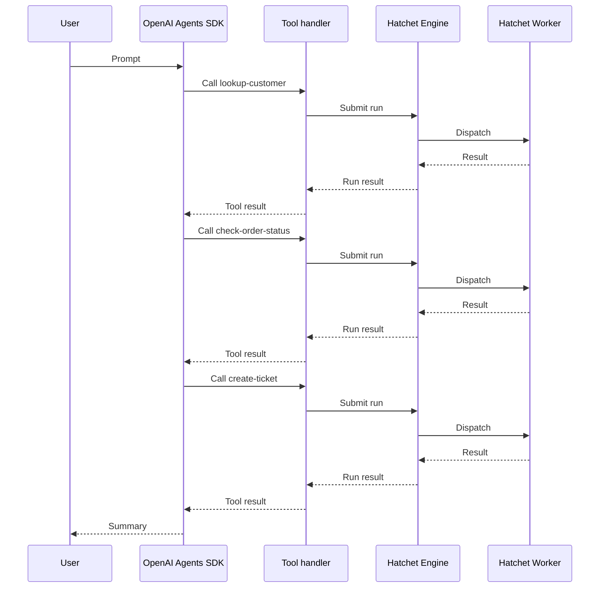

# Hatchet and MCP: Using the OpenAI Agents SDK in a Trusted Environment

This cookbook builds on the [Hatchet Agent Tools](/cookbooks/hatchet-and-mcp) guide by connecting the OpenAI Agents SDK directly to Hatchet-backed support tools. When the agent decides to use a tool, the tool handler submits a run to the Hatchet engine. A worker executes the task, and the result flows back to the agent.

## What this example builds

The example uses a support scenario similar to [How to Create a Support Agent Using Hatchet](/cookbooks/workflow-support-agent), but with a different architecture. That cookbook models support as a durable Hatchet workflow. This cookbook shows the agent choosing among separate Hatchet-backed tools:

- **lookup-customer**: retrieve a customer profile by ID.
- **check-order-status**: check shipping status and known issues for an order.
- **create-ticket**: open a support ticket for the customer.

> **Info:** The same Hatchet-backed tool pattern also works for workflows, as shown in
>   [Hatchet Agent Tools](/cookbooks/hatchet-and-mcp). Use a workflow when a tool
>   should trigger a multi-step process rather than a single operation. Later
>   guides in this series will explore larger production agent patterns.

## Architecture



The agent may call independent tools in a different order depending on the model's decisions.

Unlike the Claude Agent SDK example, there is no in-process MCP server here. Hatchet's MCP tool helper converts each task into an OpenAI-compatible tool, which is passed directly to the OpenAI `Agent`.

> **Info:** **Trusted environment pattern.** This cookbook uses a trusted-harness
>   architecture. The agent process runs in your own infrastructure with direct
>   access to Hatchet credentials. If you need to run agent turns inside untrusted
>   sandboxes with credentials kept outside, that is a different architecture
>   pattern covered in a later guide.

## Setup


### Prepare your environment

You need:

- A working local Hatchet environment or access to [Hatchet Cloud](https://cloud.hatchet.run)
- A Hatchet SDK example environment (see the [Quickstart](/v1/quickstart))
- An `OPENAI_API_KEY` environment variable set with a valid OpenAI API key

Install the OpenAI Agents SDK integration for your language:

#### Python

Install the Hatchet SDK extra for OpenAI:

```bash
    pip install "hatchet-sdk[openai]"
```

#### Typescript

Zod v4 is required for input schema generation:

```bash
    npm install zod@^4.0.0
```

Install the OpenAI Agents SDK:

```bash
    npm install @openai/agents
```

### Define the models

Define input and output types for each tool. The agent uses the input schema to understand what arguments a tool accepts.

#### Python

```python
class CustomerLookupInput(BaseModel):
    customer_id: str


class CustomerInfo(BaseModel):
    customer_id: str
    name: str
    email: str
    plan: str
    account_status: str
    default_order_id: str
    support_tier: str


class OrderStatusInput(BaseModel):
    order_id: str


class OrderStatus(BaseModel):
    order_id: str
    status: str
    last_updated: str
    estimated_delivery: str
    known_issue: str | None
    carrier: str
    tracking_number: str


class CreateTicketInput(BaseModel):
    customer_id: str
    order_id: str
    subject: str
    body: str
    priority: str


class TicketResult(BaseModel):
    ticket_id: str
    status: str
    priority: str
    routing_team: str
    summary: str
```

#### Typescript

```typescript
const CustomerLookupInput = z.object({
  customerId: z.string(),
});

type CustomerLookupInputType = z.infer<typeof CustomerLookupInput>;

type CustomerInfo = {
  customerId: string;
  name: string;
  email: string;
  plan: string;
  accountStatus: string;
  defaultOrderId: string;
  supportTier: string;
};

const OrderStatusInput = z.object({
  orderId: z.string(),
});

type OrderStatusInputType = z.infer<typeof OrderStatusInput>;

type OrderStatus = {
  orderId: string;
  status: string;
  lastUpdated: string;
  estimatedDelivery: string;
  knownIssue: string | null;
  carrier: string;
  trackingNumber: string;
};

const CreateTicketInput = z.object({
  customerId: z.string(),
  orderId: z.string(),
  subject: z.string(),
  body: z.string(),
  priority: z.string(),
});

type CreateTicketInputType = z.infer<typeof CreateTicketInput>;

type TicketResult = {
  ticketId: string;
  status: string;
  priority: string;
  routingTeam: string;
  summary: string;
};
```

### Set up the Hatchet client

Initialize the Hatchet client. It reads credentials from environment variables or a `.env` file.

#### Python

```python
from __future__ import annotations

from typing import TYPE_CHECKING

if TYPE_CHECKING:
    from agents import FunctionTool
    from claude_agent_sdk import SdkMcpTool

from pydantic import BaseModel

from hatchet_sdk import Context, Hatchet
from hatchet_sdk.runnables.workflow import MCPProvider

hatchet = Hatchet(debug=True)
```

#### Typescript

```typescript
import { z } from 'zod/v4';
import { hatchet } from '../hatchet-client';
```

### Add deterministic support data

The following fixture data keeps the example runnable without any third-party APIs.

#### Python

```python
CUSTOMERS = {
    "C-100": CustomerInfo(
        customer_id="C-100",
        name="Alice Martin",
        email="alice@example.com",
        plan="business",
        account_status="active",
        default_order_id="ORD-9987",
        support_tier="priority",
    ),
}

ORDERS = {
    "ORD-9987": OrderStatus(
        order_id="ORD-9987",
        status="delayed",
        last_updated="2026-05-20T14:30:00Z",
        estimated_delivery="2026-05-28",
        known_issue="Carrier reported weather delay at regional hub",
        carrier="FastShip",
        tracking_number="FS-482910",
    ),
}
```

#### Typescript

```typescript
const CUSTOMERS: Record<string, CustomerInfo> = {
  'C-100': {
    customerId: 'C-100',
    name: 'Alice Martin',
    email: 'alice@example.com',
    plan: 'business',
    accountStatus: 'active',
    defaultOrderId: 'ORD-9987',
    supportTier: 'priority',
  },
};

const ORDERS: Record<string, OrderStatus> = {
  'ORD-9987': {
    orderId: 'ORD-9987',
    status: 'delayed',
    lastUpdated: '2026-05-20T14:30:00Z',
    estimatedDelivery: '2026-05-28',
    knownIssue: 'Carrier reported weather delay at regional hub',
    carrier: 'FastShip',
    trackingNumber: 'FS-482910',
  },
};
```

### Define the Hatchet-backed tools

Each tool is a standalone Hatchet task with a description and an input validator, as covered in the [Hatchet Agent Tools](/cookbooks/hatchet-and-mcp#or-expose-a-standalone-task) guide.

#### Lookup customer

First, define a tool that retrieves customer profile data.

#### Python

```python
@hatchet.task(
    name="lookup-customer",
    input_validator=CustomerLookupInput,
    description="Look up a customer by ID and return their profile, plan, and support tier.",
)
async def lookup_customer(input: CustomerLookupInput, ctx: Context) -> CustomerInfo:
    customer = CUSTOMERS.get(input.customer_id)
    if customer is None:
        return CustomerInfo(
            customer_id=input.customer_id,
            name="Unknown",
            email="unknown@example.com",
            plan="none",
            account_status="not_found",
            default_order_id="",
            support_tier="standard",
        )
    return customer
```

#### Typescript

```typescript
export const lookupCustomer = hatchet.task({
  name: 'lookup-customer',
  inputValidator: CustomerLookupInput,
  description: 'Look up a customer by ID and return their profile, plan, and support tier.',
  fn: async (input: CustomerLookupInputType): Promise => {
    const customer = CUSTOMERS[input.customerId];
    if (!customer) {
      return {
        customerId: input.customerId,
        name: 'Unknown',
        email: 'unknown@example.com',
        plan: 'none',
        accountStatus: 'not_found',
        defaultOrderId: '',
        supportTier: 'standard',
      };
    }
    return customer;
  },
});
```

#### Check order status

Next, define another tool that returns shipping status, carrier, and any known issues for an order.

#### Python

```python
@hatchet.task(
    name="check-order-status",
    input_validator=OrderStatusInput,
    description="Check the current status, carrier, and any known issues for an order.",
)
async def check_order_status(input: OrderStatusInput, ctx: Context) -> OrderStatus:
    order = ORDERS.get(input.order_id)
    if order is None:
        return OrderStatus(
            order_id=input.order_id,
            status="not_found",
            last_updated="",
            estimated_delivery="",
            known_issue=None,
            carrier="unknown",
            tracking_number="",
        )
    return order
```

#### Typescript

```typescript
export const checkOrderStatus = hatchet.task({
  name: 'check-order-status',
  inputValidator: OrderStatusInput,
  description: 'Check the current status, carrier, and any known issues for an order.',
  fn: async (input: OrderStatusInputType): Promise => {
    const order = ORDERS[input.orderId];
    if (!order) {
      return {
        orderId: input.orderId,
        status: 'not_found',
        lastUpdated: '',
        estimatedDelivery: '',
        knownIssue: null,
        carrier: 'unknown',
        trackingNumber: '',
      };
    }
    return order;
  },
});
```

#### Create ticket

Finally, define a tool that creates a support ticket. Validate inputs before creating records, and consider attaching agent or user context with [additional metadata](/v1/additional-metadata) to improve traceability.

#### Python

```python
@hatchet.task(
    name="create-ticket",
    input_validator=CreateTicketInput,
    description="Create a support ticket for a customer issue and return the ticket ID and routing.",
)
async def create_ticket(input: CreateTicketInput, ctx: Context) -> TicketResult:
    ticket_id = f"TICKET-{input.customer_id}-001"
    return TicketResult(
        ticket_id=ticket_id,
        status="open",
        priority=input.priority,
        routing_team="shipping-support",
        summary=f"Ticket {ticket_id} created for {input.customer_id} "
        f"regarding order {input.order_id}: {input.subject}",
    )
```

#### Typescript

```typescript
export const createTicket = hatchet.task({
  name: 'create-ticket',
  inputValidator: CreateTicketInput,
  description: 'Create a support ticket for a customer issue and return the ticket ID and routing.',
  fn: async (input: CreateTicketInputType): Promise => {
    const ticketId = `TICKET-${input.customerId}-001`;
    return {
      ticketId,
      status: 'open',
      priority: input.priority,
      routingTeam: 'shipping-support',
      summary: `Ticket ${ticketId} created for ${input.customerId} regarding order ${input.orderId}: ${input.subject}`,
    };
  },
});
```

### Expose the tasks as OpenAI agent tools

Convert each task into an OpenAI `FunctionTool` using Hatchet's tool helper. Although the helper has `mcp` in its name, this example passes `FunctionTool` objects directly to the OpenAI Agents SDK. A later guide in this series will cover using the OpenAI Agents SDK with an MCP server.

#### Python

```python
def create_lookup_customer_tool_openai() -> FunctionTool:
    return lookup_customer.mcp_tool(MCPProvider.OPENAI)


def create_check_order_status_tool_openai() -> FunctionTool:
    return check_order_status.mcp_tool(MCPProvider.OPENAI)


def create_ticket_tool_openai() -> FunctionTool:
    return create_ticket.mcp_tool(MCPProvider.OPENAI)
```

#### Typescript

```typescript
export function createLookupCustomerToolOpenai() {
  return lookupCustomer.mcpTool('openai');
}

export function createCheckOrderStatusToolOpenai() {
  return checkOrderStatus.mcpTool('openai');
}

export function createTicketToolOpenai() {
  return createTicket.mcpTool('openai');
}
```

> **Info:** The worker does not discover agent tools. It registers Hatchet tasks normally.
>   When the tool handler submits a run, Hatchet dispatches it to a worker that
>   registered the corresponding task.

### Register and start the worker

Register the Hatchet tasks with a worker. Tool calls submit runs to the Hatchet engine, which dispatches them to a running worker.

#### Python

```python
from examples.support_agent_tools.tools import (
    hatchet,
    lookup_customer,
    check_order_status,
    create_ticket,
)


def main() -> None:
    worker = hatchet.worker(
        "support-tools-worker",
        workflows=[lookup_customer, check_order_status, create_ticket],
    )
    worker.start()


if __name__ == "__main__":
    main()
```

#### Typescript

```typescript
import { hatchet } from '../hatchet-client';
import { lookupCustomer, checkOrderStatus, createTicket } from './tools';

async function main() {
  const worker = await hatchet.worker('support-tools-worker', {
    workflows: [lookupCustomer, checkOrderStatus, createTicket],
  });

  await worker.start();
}

if (require.main === module) {
  main();
}
```

### Wire the OpenAI Agents SDK

Now we have everything we need to create the support agent. Pass each tool directly to the OpenAI `Agent` through the `tools` array. Unlike the [Claude version of this cookbook](/cookbooks/hatchet-claude-agent-sdk-trusted-env#wire-the-claude-agent-sdk), this example does not create an in-process MCP server or declare a list of pre-approved MCP tool names.

The example runs the agent once, waits for the tool calls to complete, and prints the final result.

#### Python

```python
import asyncio

from agents import Agent, Runner
from examples.support_agent_tools.tools import (
    create_lookup_customer_tool_openai,
    create_check_order_status_tool_openai,
    create_ticket_tool_openai,
)


async def main() -> None:
    lookup_customer_tool = create_lookup_customer_tool_openai()
    check_order_status_tool = create_check_order_status_tool_openai()
    ticket_tool = create_ticket_tool_openai()

    agent = Agent(
        name="support-agent",
        tools=[lookup_customer_tool, check_order_status_tool, ticket_tool],
    )

    result = await Runner.run(
        agent,
        "Customer C-100 says order ORD-9987 has not arrived. "
        "Look up the customer, check the order status, and create a "
        "support ticket if the order has a known issue or delayed delivery. "
        'If you create a ticket, use priority "high", subject '
        '"Delayed order ORD-9987", and a body that summarizes the known '
        "carrier delay. Then summarize what happened.",
    )
    print(result.final_output)


if __name__ == "__main__":
    asyncio.run(main())
```

#### Typescript

```typescript
import {
  createLookupCustomerToolOpenai,
  createCheckOrderStatusToolOpenai,
  createTicketToolOpenai,
} from './tools';

async function main() {
  const lookupCustomerTool = createLookupCustomerToolOpenai();
  const checkOrderStatusTool = createCheckOrderStatusToolOpenai();
  const ticketTool = createTicketToolOpenai();

  // Dynamic import — @openai/agents crashes at load time with Zod v3, so we delay
  // the import until after mcpTool has already verified Zod v4 is available.
  const { Agent, run } = await import('@openai/agents');

  const agent = new Agent({
    name: 'support-agent',
    tools: [lookupCustomerTool, checkOrderStatusTool, ticketTool],
  });

  const result = await run(
    agent,
    'Customer C-100 says order ORD-9987 has not arrived. ' +
      'Look up the customer, check the order status, and create a ' +
      'support ticket if the order has a known issue or delayed delivery. ' +
      'If you create a ticket, use priority "high", subject ' +
      '"Delayed order ORD-9987", and a body that summarizes the known ' +
      'carrier delay. Then summarize what happened.'
  );
  console.log(result.finalOutput);
}

if (require.main === module) {
  main()
    .catch(console.error)
    .finally(() => {
      process.exit(0);
    });
}
```

### Test it

Start the worker in one terminal and run the agent in another. The worker must be running before the agent calls any tools.

#### Python

Start the worker:

```bash
    cd sdks/python
    poetry run python -m examples.support_agent_tools.worker
```

In a second terminal, run the agent:

```bash
    cd sdks/python
    poetry run python -m examples.support_agent_tools.agent_openai
```

#### Typescript

Start the worker:

```bash
    cd sdks/typescript
    pnpm exec tsx -r tsconfig-paths/register src/v1/examples/support_agent_tools/worker.ts
```

In a second terminal, run the agent:

```bash
    cd sdks/typescript
    pnpm exec tsx -r tsconfig-paths/register src/v1/examples/support_agent_tools/agent-openai.ts
```

When successful, you should see tool calls for all three agent tools. Given the fixture data used in this example, the agent looks up customer `C-100`, checks order `ORD-9987`, creates a `high` priority ticket for the delayed delivery, and prints a final summary to the terminal.

> **Info:** Each tool call appears as a task run in the Hatchet dashboard with full
>   status, timing, and input/output visibility.


## Security considerations

The agent process has direct access to Hatchet client credentials and runs in your own infrastructure. Every tool passed to the agent adds to the model's available capability set. Once a tool is available to the model, you should assume the model may attempt to call it. Do not rely on the agent prompt alone to enforce security rules.

> **Info:** Hatchet does not provide native code sandboxing. If you need to run each agent
>   turn inside an untrusted sandbox, use a different architecture with external
>   sandbox providers and credential proxying. Later guides in this series will
>   explore sandboxed and custom-harness patterns.

## Next steps

- [Hatchet Agent Tools](/cookbooks/hatchet-and-mcp): the prerequisite guide for exposing tasks and workflows as MCP tools.
- [Claude Agent SDK](/cookbooks/hatchet-claude-agent-sdk-trusted-env): the same support scenario using the Claude Agent SDK.
- [How to Create a Support Agent Using Hatchet](/cookbooks/workflow-support-agent): a workflow-first support-agent pattern with durable waits and escalation.
- [Python SDK reference](/reference/python/client) and [TypeScript SDK reference](/reference/typescript/client): full SDK references.
