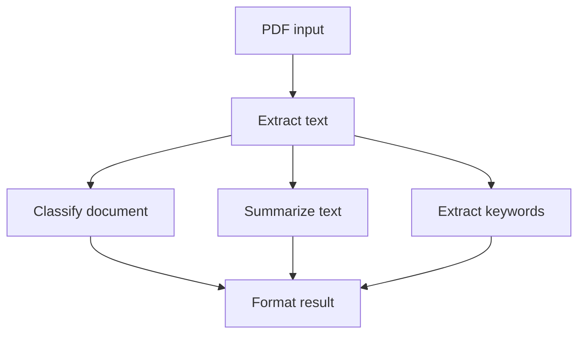

# How to Build a PDF Processing Pipeline with Hatchet DAGs

The [Durable Tasks vs DAG Workflows cookbook](/cookbooks/durable-tasks-vs-dags) explains why document processing pipelines are a natural fit for [DAG workflows](/v1/directed-acyclic-graphs). The steps are known in advance, the dependencies between them are explicit, and independent stages can run in parallel. This cookbook builds a concrete PDF pipeline with the following workflow:



Notice that after text extraction, the classify, summarize, and keyword extraction tasks can run concurrently because they each depend only on `extract_text` and not on each other. DAGs make concurrency explicit and simple to reason about. The final format step waits for all three tasks to finish before combining their outputs. At the end of this cookbook, we show how to swap the extraction task to use [Reducto](#swapping-in-reducto-for-pdf-extraction) for production document parsing.

## Setup


### Prepare your environment

To run this example, you will need:

- a working local Hatchet environment or access to [Hatchet Cloud](https://cloud.onhatchet.run)
- a Hatchet SDK example environment (see the [Quickstart](/v1/quickstart))
- optionally, a PDF text extraction library for real PDF parsing:
  [pypdf](https://pypi.org/project/pypdf/) for Python or
  [pdf2json](https://www.npmjs.com/package/pdf2json) v4 for TypeScript.
  If the library is not installed, the example falls back to deterministic sample text so the DAG still runs.

### Define the models

Define the workflow input and the output types for each task.

#### Python

```python
class PdfInput(BaseModel):
    filename: str
    content_base64: str


class ExtractOutput(BaseModel):
    text: str
    page_count: int


class ClassifyOutput(BaseModel):
    category: str


class SummaryOutput(BaseModel):
    summary: str
    word_count: int


class KeywordsOutput(BaseModel):
    keywords: list[str]


class PipelineResult(BaseModel):
    filename: str
    category: str
    summary: str
    keywords: list[str]
    word_count: int
    page_count: int
```

#### Typescript

```typescript
export type PdfInput = {
  filename: string;
  contentBase64: string;
};

export type ExtractOutput = {
  text: string;
  pageCount: number;
};

export type ClassifyOutput = {
  category: string;
};

export type SummaryOutput = {
  summary: string;
  wordCount: number;
};

export type KeywordsOutput = {
  keywords: string[];
};

export type PipelineResult = {
  filename: string;
  category: string;
  summary: string;
  keywords: string[];
  wordCount: number;
  pageCount: number;
};
```

### Define the DAG

Declare the workflow. All tasks will be registered on this workflow with explicit parent dependencies.

#### Python

```python
pdf_pipeline = hatchet.workflow(name="PdfPipeline", input_validator=PdfInput)
```

#### Typescript

```typescript
export const pdfPipeline = hatchet.workflow({
  name: 'pdf-pipeline',
});
```

### Extract text from the PDF

The first task decodes the base64 input and extracts text using a PDF library. This is the only task that touches the PDF directly; after it finishes, the rest of the pipeline works with plain text. If you later want to swap in OCR, object storage, [Reducto](#swapping-in-reducto-for-pdf-extraction), or a different PDF parser, this is the task you would change.

#### Python

```python
@pdf_pipeline.task()
def extract_text(input: PdfInput, ctx: Context) -> ExtractOutput:
    try:
        pypdf = importlib.import_module("pypdf")
    except ImportError:
        # pypdf not installed: return deterministic fallback text
        return ExtractOutput(text=FALLBACK_TEXT, page_count=1)

    decoded = base64.b64decode(input.content_base64)
    reader = pypdf.PdfReader(io.BytesIO(decoded))
    text = "\n".join(page.extract_text() or "" for page in reader.pages)

    return ExtractOutput(text=text, page_count=len(reader.pages))
```

#### Typescript

```typescript
const extractText = pdfPipeline.task({
  name: 'extract_text',
  fn: async (input: PdfInput) => {
    const decoded = Buffer.from(input.contentBase64, 'base64');
    const { text, pageCount } = await extractPdfText(decoded);
    return { text, pageCount };
  },
});
```

### Classify the document

Now that we can read the text, we can process it in different ways independently. Let's begin by classifying the document via keyword matching.

#### Python

```python
@pdf_pipeline.task(parents=[extract_text])
def classify_document(input: PdfInput, ctx: Context) -> ClassifyOutput:
    text = ctx.task_output(extract_text).text.lower()

    if any(w in text for w in ["invoice", "amount due", "payment", "bill"]):
        category = "invoice"
    elif any(w in text for w in ["receipt", "paid", "transaction"]):
        category = "receipt"
    elif any(w in text for w in ["report", "analysis", "findings", "conclusion"]):
        category = "report"
    elif any(w in text for w in ["dear", "sincerely", "regards"]):
        category = "letter"
    else:
        category = "other"

    return ClassifyOutput(category=category)
```

#### Typescript

```typescript
const classifyDocument = pdfPipeline.task({
  name: 'classify_document',
  parents: [extractText],
  fn: async (input: PdfInput, ctx) => {
    const { text } = await ctx.parentOutput(extractText);
    const lower = text.toLowerCase();

    let category: string;
    if (['invoice', 'amount due', 'payment', 'bill'].some((w) => lower.includes(w))) {
      category = 'invoice';
    } else if (['receipt', 'paid', 'transaction'].some((w) => lower.includes(w))) {
      category = 'receipt';
    } else if (['report', 'analysis', 'findings', 'conclusion'].some((w) => lower.includes(w))) {
      category = 'report';
    } else if (['dear', 'sincerely', 'regards'].some((w) => lower.includes(w))) {
      category = 'letter';
    } else {
      category = 'other';
    }

    return { category };
  },
});
```

### Summarize the text

Independently, we can summarize the text read from `extract_text`. To keep this example simple, our summarizer captures the first 50 words and includes the total word count in its output.

#### Python

```python
@pdf_pipeline.task(parents=[extract_text])
def summarize_text(input: PdfInput, ctx: Context) -> SummaryOutput:
    text = ctx.task_output(extract_text).text
    words = text.split()
    max_words = 50
    summary = " ".join(words[:max_words])
    if len(words) > max_words:
        summary += "..."

    return SummaryOutput(summary=summary, word_count=len(words))
```

#### Typescript

```typescript
const summarizeText = pdfPipeline.task({
  name: 'summarize_text',
  parents: [extractText],
  fn: async (input: PdfInput, ctx) => {
    const { text } = await ctx.parentOutput(extractText);
    const words = text.split(/\s+/).filter(Boolean);
    const maxWords = 50;
    let summary = words.slice(0, maxWords).join(' ');
    if (words.length > maxWords) {
      summary += '...';
    }
    return { summary, wordCount: words.length };
  },
});
```

### Extract keywords

The `extract_keywords` task also runs independently, pulling the most frequent meaningful words from the extracted text using a small stopword list and frequency counting. In fact, there is no interdependency between any of these text processing tasks, so Hatchet can run all three in parallel. Concurrency is not the only benefit of this structure. Since each parallel task in a DAG is an independent unit, task-level behavior can be configured independently for aspects such as [retry policies](/v1/retry-policies), [timeouts](/v1/timeouts), and [concurrency limits](/v1/concurrency), among others. If keyword extraction is the slowest or most failure-prone step, its retry policy can be configured independently so that Hatchet retries it without re-running the classify or summarize tasks. In a sequential pipeline, you would need to build that isolation yourself. In a DAG, it comes from the structure.

#### Python

```python
@pdf_pipeline.task(parents=[extract_text])
def extract_keywords(input: PdfInput, ctx: Context) -> KeywordsOutput:
    text = ctx.task_output(extract_text).text.lower()
    words = re.findall(r"[a-z]+", text)
    filtered = [w for w in words if len(w) >= MIN_WORD_LENGTH and w not in STOPWORDS]
    counts = Counter(filtered)
    top = sorted(counts.items(), key=lambda x: (-x[1], x[0]))[:MAX_KEYWORDS]
    return KeywordsOutput(keywords=[word for word, _ in top])
```

#### Typescript

```typescript
const extractKeywords = pdfPipeline.task({
  name: 'extract_keywords',
  parents: [extractText],
  fn: async (input: PdfInput, ctx) => {
    const { text } = await ctx.parentOutput(extractText);
    const words = text.toLowerCase().match(/[a-z]+/g) ?? [];
    const filtered = words.filter((w) => w.length >= MIN_WORD_LENGTH && !STOPWORDS.has(w));
    const counts = new Map<string, number>();
    for (const w of filtered) {
      counts.set(w, (counts.get(w) ?? 0) + 1);
    }
    const sorted = [...counts.entries()]
      .sort((a, b) => b[1] - a[1] || a[0].localeCompare(b[0]))
      .slice(0, MAX_KEYWORDS);
    return { keywords: sorted.map(([word]) => word) };
  },
});
```

### Format the result

Hatchet runs `format_result` after `classify_document`, `summarize_text`, and `extract_keywords` have all completed. The final task receives the outputs from those parent tasks and combines them into one result.

#### Python

```python
@pdf_pipeline.task(
    parents=[extract_text, classify_document, summarize_text, extract_keywords]
)
def format_result(input: PdfInput, ctx: Context) -> PipelineResult:
    extract = ctx.task_output(extract_text)
    classify = ctx.task_output(classify_document)
    summary = ctx.task_output(summarize_text)
    keywords = ctx.task_output(extract_keywords)

    return PipelineResult(
        filename=input.filename,
        category=classify.category,
        summary=summary.summary,
        keywords=keywords.keywords,
        word_count=summary.word_count,
        page_count=extract.page_count,
    )
```

#### Typescript

```typescript
pdfPipeline.task({
  name: 'format_result',
  parents: [extractText, classifyDocument, summarizeText, extractKeywords],
  fn: async (input: PdfInput, ctx) => {
    const extract = await ctx.parentOutput(extractText);
    const classify = await ctx.parentOutput(classifyDocument);
    const summary = await ctx.parentOutput(summarizeText);
    const keywords = await ctx.parentOutput(extractKeywords);

    return {
      filename: input.filename,
      category: classify.category,
      summary: summary.summary,
      keywords: keywords.keywords,
      wordCount: summary.wordCount,
      pageCount: extract.pageCount,
    };
  },
});
```

### Register and start the worker

Register the DAG workflow on a Hatchet worker and start it.

#### Python

```python
def main() -> None:
    worker = hatchet.worker(
        "pdf-pipeline-worker",
        workflows=[pdf_pipeline],
    )
    worker.start()


if __name__ == "__main__":
    main()
```

#### Typescript

In TypeScript, workflows are registered through the shared example worker
rather than a per-example registration file.

### Run the pipeline

The trigger script creates a small sample PDF, base64-encodes it, and runs the workflow.

#### Python

```python
import base64

from examples.pdf_pipeline.sample_pdf import make_sample_pdf
from examples.pdf_pipeline.worker import PdfInput, pdf_pipeline

pdf_bytes = make_sample_pdf(
    "Invoice from Acme Corp. Total amount due: 150 dollars. Payment terms: Net 30."
)
content_b64 = base64.b64encode(pdf_bytes).decode()

result = pdf_pipeline.run(
    PdfInput(filename="sample-invoice.pdf", content_base64=content_b64)
)
print(f"Pipeline result: {result}")
```

#### Typescript

```typescript
import { pdfPipeline, PdfInput } from './workflow';
import { makeSamplePdf } from './sample-pdf';

async function main() {
  const pdfBytes = makeSamplePdf(
    'Invoice from Acme Corp. Total amount due: 150 dollars. Payment terms: Net 30.'
  );
  const input: PdfInput = {
    filename: 'sample-invoice.pdf',
    contentBase64: pdfBytes.toString('base64'),
  };

  const result = await pdfPipeline.run(input);
  console.log('Pipeline result:', result);
}
```

### Test it

This example includes an end-to-end test that generates a tiny PDF, runs the full pipeline, and asserts on the outputs. If you run it against a local Hatchet instance or Hatchet Cloud, you can inspect the workflow run in the [Hatchet dashboard](/v1/developer-experience).

#### Python

```bash
    pytest examples/pdf_pipeline/test_pdf_pipeline.py
```

#### Typescript

```bash
    pnpm run test:e2e -- --testPathPattern=pdf_pipeline
```


## Why this is a DAG

This pipeline is a good fit for a DAG because the processing stages are known before execution starts and the dependencies are easy to declare up front. The workflow does not need a loop, an unknown number of iterations, or a runtime decision about which tasks exist. Once `extract_text` completes, `classify_document`, `summarize_text`, and `extract_keywords` can run independently, and `format_result` waits for all three outputs before combining them. Each task points forward to later tasks, and no child step feeds back into an ancestor. If you later wanted to process a runtime-determined set of PDFs, a durable task could handle that outer decision and spawn this DAG once per document.

## Swapping in Reducto for PDF extraction

The local example above runs without external services, but production document pipelines often need more than basic text extraction. Reducto's [Parse API](https://docs.reducto.ai/parse/overview) can run OCR, detect document layout, and return structured chunks for content such as tables, figures, scanned pages, and multi-column documents. Since Hatchet's DAG isolates PDF parsing in a single task, swapping in Reducto is as simple as replacing `extract_text`; the downstream tasks stay the same. Hatchet continues to run the workflow around the task, including retries, concurrency, and observability, while Reducto handles the document parsing itself.

[Install the Reducto SDK](https://docs.reducto.ai/quickstart#install-the-sdk) and set `REDUCTO_API_KEY` in your environment.

The examples in this cookbook generate a tiny base64-encoded PDF and pass it to the workflow as input data to keep the demo self-contained. For larger PDFs, store the file in object storage such as S3 and pass a file key, URL, or Reducto file reference instead. This avoids putting large PDF payloads into workflow inputs, which can run into [Hatchet's gRPC payload size limit](/v1/troubleshooting#could-not-send-task-to-worker).

For small documents, the snippets below handle the inline result returned when `result.result.type` is `"full"`. For larger documents, Reducto may return a URL result instead; production code should check that field and fetch the result from the URL if needed.

#### Python

```python
    import base64
    import tempfile
    from pathlib import Path
    from reducto import Reducto

    @pdf_pipeline.task()
    def extract_text(input: PdfInput, ctx: Context) -> ExtractOutput:
        client = Reducto()  # reads REDUCTO_API_KEY from environment

        decoded = base64.b64decode(input.content_base64)
        with tempfile.TemporaryDirectory() as tmp_dir:
            tmp_path = Path(tmp_dir) / "input.pdf"
            tmp_path.write_bytes(decoded)
            upload = client.upload(file=tmp_path)

        result = client.parse.run(input=upload.file_id)
        text = "\n".join(chunk.content for chunk in result.result.chunks)

        return ExtractOutput(text=text, page_count=result.usage.num_pages)
```

#### Typescript

```typescript
    import Reducto from "reductoai";
    import { writeFileSync, rmSync, mkdtempSync } from "fs";
    import { createReadStream } from "fs";
    import { join } from "path";
    import { tmpdir } from "os";

    const extractText = pdfPipeline.task({
      name: "extract_text",
      fn: async (input: PdfInput) => {
        const client = new Reducto(); // reads REDUCTO_API_KEY from environment

        const decoded = Buffer.from(input.contentBase64, "base64");
        const tmpDir = mkdtempSync(join(tmpdir(), "hatchet-pdf-"));
        const tmpFile = join(tmpDir, "input.pdf");
        writeFileSync(tmpFile, decoded);

        try {
          const upload = await client.upload({ file: createReadStream(tmpFile) });
          const result = await client.parse.run({ input: upload.file_id });
          const text = result.result.chunks.map((c: any) => c.content).join("\n");

          return { text, pageCount: result.usage.num_pages };
        } finally {
          try { rmSync(tmpDir, { recursive: true, force: true }); } catch {}
        }
      },
    });
```

## Next steps

From here you could add more processing stages, such as language detection, entity extraction, or metadata enrichment. You could also use Reducto for richer production parsing, replace keyword extraction or classification with an LLM call, configure retries or concurrency limits for the slowest stages, or fan out to process multiple PDFs by spawning the DAG as a child workflow from a [durable task](/v1/durable-tasks). For this cookbook, the five-task DAG is enough to show the core pattern.
