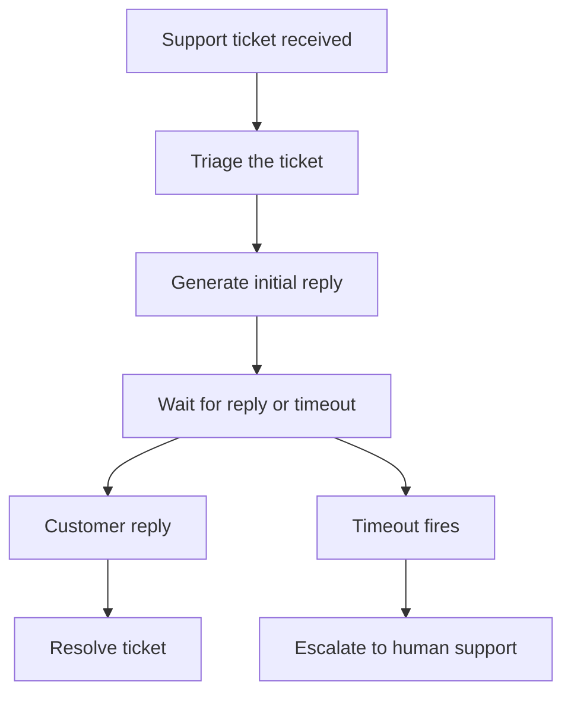

# How to Create a Support Agent Using Hatchet

Many real-world workflows become difficult to manage once they involve multiple steps, long waits, human replies, and escalation rules. Support is one example, but the same pattern also shows up in onboarding, approvals, incident response, and other operational flows. In this cookbook, we will build a simple support agent that triages a ticket, generates an initial reply, and then waits for either a customer response or a timeout. If the customer replies, the workflow resolves. If no reply arrives in time, the workflow escalates the ticket to a human support agent.

## What this example builds

This example implements the following durable support workflow:



Hatchet's durable execution model helps keep the whole interaction in one workflow rather than scattering it across separate queue jobs and ad hoc timers.

## Setup


### Prepare your environment

To run this example, you will need:

- a working local Hatchet environment or access to [Hatchet Cloud](https://cloud.hatchet.run)
- a Hatchet SDK example environment (see the [Quickstart](/v1/quickstart))
- optionally, an `ANTHROPIC_API_KEY` for live LLM replies

Without `ANTHROPIC_API_KEY`, the example runs using a fixed fallback reply. To use the live Claude path, you also need the Anthropic SDK installed for your language.

### Define the models

Start by defining the types for the workflow input and task outputs.

#### Python

```python
class SupportTicketInput(BaseModel):
    ticket_id: str
    customer_email: str
    subject: str
    body: str


class TriageOutput(BaseModel):
    category: str
    priority: str


class ReplyOutput(BaseModel):
    message: str


class EscalationOutput(BaseModel):
    reason: str
    assigned_to: str
```

#### Typescript

```typescript
export type SupportTicketInput = {
  ticketId: string;
  customerEmail: string;
  subject: string;
  body: string;
};

export type TriageOutput = {
  category: string;
  priority: string;
};

export type ReplyOutput = {
  message: string;
};

export type EscalationOutput = {
  reason: string;
  assignedTo: string;
};
```

The models keep the inputs and outputs for each task explicit, which makes the workflow easier to inspect and test.

### Add the workflow tasks

The durable workflow delegates its work to a few small [tasks](/v1/tasks).

First, add a task to classify the incoming ticket:

#### Python

```python
@hatchet.task(input_validator=SupportTicketInput)
async def triage_ticket(input: SupportTicketInput, ctx: Context) -> TriageOutput:
    """Classify the ticket into a category and priority."""
    subject = input.subject.lower()
    body = input.body.lower()
    text = subject + " " + body

    if any(word in text for word in ["bill", "charge", "payment", "invoice"]):
        category = "billing"
    elif any(word in text for word in ["login", "password", "auth", "access"]):
        category = "account"
    else:
        category = "technical"

    if any(word in text for word in ["urgent", "critical", "down", "outage"]):
        priority = "high"
    elif any(word in text for word in ["twice", "broken", "error"]):
        priority = "medium"
    else:
        priority = "low"

    return TriageOutput(category=category, priority=priority)
```

#### Typescript

```typescript
// Classify the ticket into a category and priority.
export const triageTicket = hatchet.task({
  name: 'triage-ticket',
  fn: async (input: SupportTicketInput) => {
    const text = `${input.subject} ${input.body}`.toLowerCase();

    let category: string;
    if (['bill', 'charge', 'payment', 'invoice'].some((w) => text.includes(w))) {
      category = 'billing';
    } else if (['login', 'password', 'auth', 'access'].some((w) => text.includes(w))) {
      category = 'account';
    } else {
      category = 'technical';
    }

    let priority: string;
    if (['urgent', 'critical', 'down', 'outage'].some((w) => text.includes(w))) {
      priority = 'high';
    } else if (['twice', 'broken', 'error'].some((w) => text.includes(w))) {
      priority = 'medium';
    } else {
      priority = 'low';
    }

    return { category, priority };
  },
});
```

Next, add a task to generate the initial support reply. When `ANTHROPIC_API_KEY` is set, the task calls Claude to produce the reply. Otherwise it returns a fixed fallback response.

#### Python

```python
@hatchet.task(input_validator=SupportTicketInput)
async def generate_reply(input: SupportTicketInput, ctx: Context) -> ReplyOutput:
    """Generate an initial support reply using Claude."""
    api_key = os.environ.get("ANTHROPIC_API_KEY")

    if not api_key:
        return ReplyOutput(
            message=f"Thank you for contacting support about: {input.subject}. "
            "We are looking into this and will get back to you shortly."
        )

    import importlib

    anthropic = importlib.import_module("anthropic")
    client = anthropic.AsyncAnthropic(api_key=api_key)

    response = await client.messages.create(
        model="claude-sonnet-4-20250514",
        max_tokens=300,
        messages=[
            {
                "role": "user",
                "content": (
                    f"You are a friendly support agent. Write a brief, helpful initial "
                    f"reply to this support ticket.\n\n"
                    f"Subject: {input.subject}\n"
                    f"Message: {input.body}\n\n"
                    f"Keep the reply under 3 sentences."
                ),
            }
        ],
    )

    text = response.content[0].text
    return ReplyOutput(message=text)
```

#### Typescript

```typescript
// Generate an initial support reply using Claude.
export const generateReply = hatchet.task({
  name: 'generate-reply',
  fn: async (input: SupportTicketInput) => {
    const apiKey = process.env.ANTHROPIC_API_KEY;

    if (!apiKey) {
      return {
        message: `Thank you for contacting support about: ${input.subject}. We are looking into this and will get back to you shortly.`,
      };
    }

    // eslint-disable-next-line @typescript-eslint/no-require-imports
    const anthropic = require('@anthropic-ai/sdk');
    const Anthropic = anthropic.default || anthropic;
    const client = new Anthropic({ apiKey });

    const response = await client.messages.create({
      model: 'claude-sonnet-4-20250514',
      max_tokens: 300,
      messages: [
        {
          role: 'user' as const,
          content:
            `You are a friendly support agent. Write a brief, helpful initial ` +
            `reply to this support ticket.\n\n` +
            `Subject: ${input.subject}\n` +
            `Message: ${input.body}\n\n` +
            `Keep the reply under 3 sentences.`,
        },
      ],
    });

    const [block] = response.content;
    const text = block?.type === 'text' ? block.text : '';
    return { message: text };
  },
});
```

Finally, add a task to represent escalation to the support team:

#### Python

```python
@hatchet.task(input_validator=SupportTicketInput)
async def escalate_ticket(input: SupportTicketInput, ctx: Context) -> EscalationOutput:
    """Escalate an unresolved ticket to the human support team."""
    return EscalationOutput(
        reason=f"No customer reply within {TIMEOUT_SECONDS}s timeout",
        assigned_to="support-team@example.com",
    )
```

#### Typescript

```typescript
// Escalate an unresolved ticket to the human support team.
export const escalateTicket = hatchet.task({
  name: 'escalate-ticket',
  fn: async (input: SupportTicketInput) => {
    return {
      reason: `No customer reply within ${TIMEOUT_SECONDS}s timeout`,
      assignedTo: 'support-team@example.com',
    };
  },
});
```

Keeping triage, reply generation, and escalation as separate tasks keeps the workflow itself small and makes each piece easier to reason about.

### Build the durable workflow

Now tie everything together in a [durable Hatchet workflow](/v1/durable-execution). A durable workflow is a good fit here because this interaction may stay open for some time while waiting for a customer reply. Hatchet persists the workflow state and its wait conditions, so the workflow can survive long delays, worker restarts, or even a worker crash, then continue later on another worker. That gives you a straightforward way to model the whole interaction without adding custom recovery logic.

#### Python

```python
@hatchet.durable_task(input_validator=SupportTicketInput)
async def support_agent(
    input: SupportTicketInput, ctx: DurableContext
) -> dict[str, Any]:
    # Step 1: Triage the ticket
    triage = await triage_ticket.aio_run(input)

    # Step 2: Generate an initial reply
    reply = await generate_reply.aio_run(input)

    # Step 3: Wait for a customer reply or timeout
    now = await ctx.aio_now()
    consider_events_since = now - timedelta(minutes=LOOKBACK_MINUTES)

    wait_result = await ctx.aio_wait_for(
        "await-customer-reply",
        or_(
            SleepCondition(timedelta(seconds=TIMEOUT_SECONDS)),
            UserEventCondition(
                event_key=REPLY_EVENT_KEY,
                scope=input.ticket_id,
                consider_events_since=consider_events_since,
            ),
        ),
    )

    # The or-group result is {"CREATE": {"<condition_key>": ...}}.
    # Check whether the reply event condition was the one that resolved.
    resolved_key = list(wait_result["CREATE"].keys())[0]
    customer_replied = resolved_key == REPLY_EVENT_KEY

    if not customer_replied:
        # Step 4a: Timeout -> escalate
        await escalate_ticket.aio_run(input)
        return {
            "ticket_id": input.ticket_id,
            "status": "escalated",
            "triage_category": triage.category,
            "triage_priority": triage.priority,
            "initial_reply": reply.message,
        }

    # Step 4b: Customer replied -> resolve
    return {
        "ticket_id": input.ticket_id,
        "status": "resolved",
        "triage_category": triage.category,
        "triage_priority": triage.priority,
        "initial_reply": reply.message,
    }
```

#### Typescript

```typescript
export const supportAgent = hatchet.durableTask({
  name: 'support-agent',
  executionTimeout: '10m',
  fn: async (input: SupportTicketInput, ctx) => {
    // Step 1: Triage the ticket
    const triage = await triageTicket.run(input);

    // Step 2: Generate an initial reply
    const reply = await generateReply.run(input);

    // Step 3: Wait for a customer reply or timeout
    const now = await ctx.now();
    const considerEventsSince = new Date(
      now.getTime() - durationToMs(LOOKBACK_WINDOW)
    ).toISOString();

    const waitResult = await ctx.waitFor(
      Or(
        new SleepCondition(`${TIMEOUT_SECONDS}s`, TIMEOUT_LABEL),
        new UserEventCondition(
          REPLY_EVENT_KEY,
          '',
          REPLY_LABEL,
          undefined,
          input.ticketId,
          considerEventsSince
        )
      )
    );

    // Determine which condition fired. ctx.waitFor returns
    // { CREATE: { <label>: ... } } where <label> is the readableDataKey
    // we assigned above ('timeout' or 'reply').
    const create = (waitResult as Record<string, Record<string, unknown>>)['CREATE'] ?? waitResult;
    const resolvedLabel = Object.keys(create as Record<string, unknown>)[0] ?? '';
    const customerReplied = resolvedLabel === REPLY_LABEL;

    if (!customerReplied) {
      // Step 4a: Timeout -> escalate
      await escalateTicket.run(input);
      return {
        ticketId: input.ticketId,
        status: 'escalated' as const,
        triageCategory: triage.category,
        triagePriority: triage.priority,
        initialReply: reply.message,
      };
    }

    // Step 4b: Customer replied -> resolve
    return {
      ticketId: input.ticketId,
      status: 'resolved' as const,
      triageCategory: triage.category,
      triagePriority: triage.priority,
      initialReply: reply.message,
    };
  },
});
```

The workflow runs triage first, generates an initial reply, and then waits for one of two things to happen: either a customer reply event arrives for that ticket, or the timeout fires. From there, the workflow either resolves the ticket or escalates it.

The detail that matters most here is the lookback window on the reply event condition. A customer reply could arrive while the workflow is still finishing triage or generating the first response. By using a lookback window ([`consider_events_since`](/v1/durable-event-waits#lookback-windows) in Python, `considerEventsSince` in TypeScript), the workflow can still pick up that reply once the wait becomes active instead of missing it because the event arrived slightly early.

### Register and start the worker

To run this workflow, register the workflow and its tasks on a Hatchet worker, then start it.

```python
def main() -> None:
    worker = hatchet.worker(
        "support-agent-worker",
        workflows=[support_agent, triage_ticket, generate_reply, escalate_ticket],
    )
    worker.start()


if __name__ == "__main__":
    main()
```

In TypeScript, workflows are registered through the shared example worker rather than a per-example registration file.

With the worker running, you can trigger the workflow and observe either the resolved or escalated outcome.

### Trigger the workflow

The example also includes a small trigger script that starts the workflow, pushes a scoped reply event, and waits for the result.

#### Python

```python
from examples.support_agent.worker import (
    REPLY_EVENT_KEY,
    SupportTicketInput,
    hatchet,
    support_agent,
)

ticket = SupportTicketInput(
    ticket_id="ticket-42",
    customer_email="alice@example.com",
    subject="Login broken",
    body="I can't log in since this morning.",
)

# Start the support agent workflow
ref = support_agent.run(ticket, wait_for_result=False)
print(f"Started workflow run: {ref.workflow_run_id}")

# Push a customer reply event (scoped to this ticket)
print("Pushing customer reply event...")
hatchet.event.push(
    REPLY_EVENT_KEY,
    {"message": "I cleared my cookies and it works now. Thanks!"},
    scope=ticket.ticket_id,
)

# Wait for the workflow to complete
result = ref.result()
print(f"Workflow completed: {result}")
```

#### Typescript

```typescript
async function main() {
  const input: SupportTicketInput = {
    ticketId: 'ticket-42',
    customerEmail: 'alice@example.com',
    subject: 'Login broken',
    body: "I can't log in since this morning.",
  };

  // Start the support agent workflow
  const ref = await supportAgent.runNoWait(input);
  const runId = await ref.getWorkflowRunId();
  console.log(`Started workflow run: ${runId}`);

  // Push a customer reply event (scoped to this ticket)
  console.log('Pushing customer reply event...');
  await hatchet.events.push(
    REPLY_EVENT_KEY,
    { message: 'I cleared my cookies and it works now. Thanks!' },
    { scope: input.ticketId }
  );

  // Wait for the workflow to complete
  const result = await ref.output;
  console.log('Workflow completed:', result);
}
```

Because the workflow uses a lookback window, the trigger can push the reply event immediately after starting the support agent.

### Test it

This example includes two end-to-end tests against a live Hatchet instance:

- a resolved path, where the customer reply event arrives before the timeout
- a timeout path, where no reply arrives and the workflow escalates

If you are running the SDK examples locally:

#### Python

```bash
    pytest examples/support_agent/test_support_agent.py
```

#### Typescript

```bash
    pnpm run test:e2e -- --testPathPattern=support_agent
```

Together, these tests validate both branches of the workflow and confirm that early reply events are handled safely without coordination sleeps.


## Why Hatchet fits this workflow

The interesting part of this example is not the LLM call. It is the combination of waiting, branching, and keeping the full interaction in one place. A support flow like this usually needs to preserve state across several steps, wait for human input, and react differently depending on whether a reply arrives before a deadline. Hatchet fits that pattern well because you can express the event wait and timeout branch directly in the workflow. That makes the control flow easier to inspect, easier to test, and easier to extend as the interaction becomes more complex.

## Next steps

A natural next step would be to connect this workflow to a real ticketing system and carry the conversation beyond a single reply. You could also make escalation depend on the content of the customer response instead of only on timeout. For this cookbook, though, the smaller version is enough to show the core pattern: start work immediately, wait safely for a reply, and escalate when the deadline passes.
