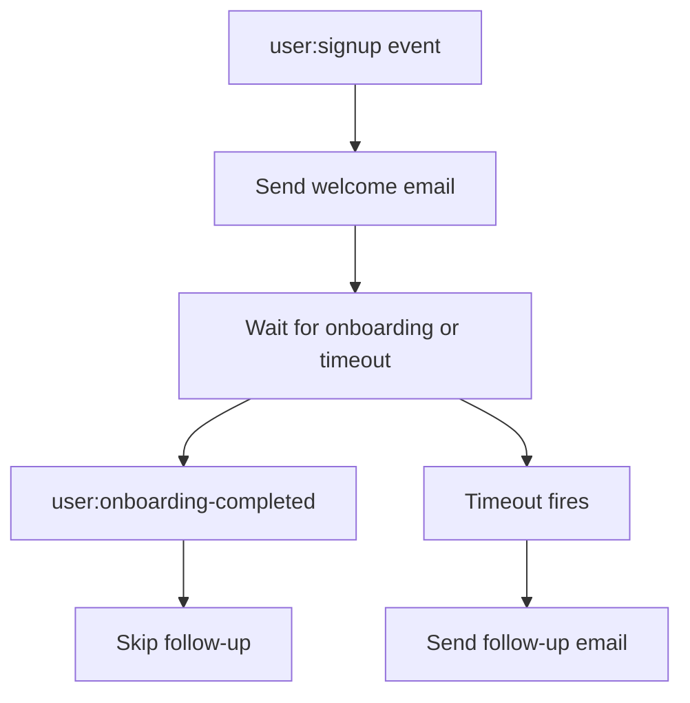

# 欢迎邮件

客户引导（onboarding）帮助用户完成必要的设置，加深他们对产品的理解，并帮助他们更快地获得价值。注册后发送一封简短的欢迎邮件并附上有用的入门链接是常见做法。

用户都是忙碌的人，经常要应对不断变化的优先事项，因此有时会在引导完成之前就流失了。为了减少引导流失，你可能希望只向未按时达到里程碑的用户发送跟进邮件。你需要的是一个等待可能到达也可能不到达的事件的 workflow，并由超时触发适当的回退行为。让我们在 Hatchet 中构建一个小型持久化 workflow 来处理这种模式：



Hatchet 的持久化执行使 workflow 在等待期间保持存活。即使 worker 重启或等待持续数天，workflow 也会从中断处继续。在本 cookbook 末尾，我们将展示如何将占位邮件步骤替换为使用 [Loops](#sending-welcome-emails-with-loops) 进行生产级邮件投递。

## 设置


### 准备环境

要运行此示例，你需要：

- 一个可用的本地 Hatchet 环境或 [Hatchet Cloud](https://cloud.hatchet.run) 的访问权限
- 一个 Hatchet SDK 示例环境（参见[快速开始](<../v1/01. get-started（入门）/02. quickstart.md>)）

不需要外部邮件提供商。示例使用 `print` / `console.log` 代替真实的邮件投递。要发送真实邮件，请参阅[使用 Loops 发送欢迎邮件](#sending-welcome-emails-with-loops)。

### 定义模型

首先定义输入和输出类型。workflow 接收新用户的邮箱和 ID，并返回发送了哪些邮件。

#### Python

```python
class SignupInput(BaseModel):
    email: str
    user_id: str


class WelcomeEmailResult(BaseModel):
    user_id: str
    welcome_sent: bool
    follow_up_sent: bool
```

#### Typescript

```typescript
export type SignupInput = {
  email: string;
  user_id: string;
};

export type WelcomeEmailResult = {
  userId: string;
  welcomeSent: boolean;
  followUpSent: boolean;
};
```

### 构建 durable task

此示例的核心是一个按顺序运行三个步骤的单个 [durable task](<../v1/02. core-concepts（核心概念）/04. durable-execution.md>)：

1. 立即发送欢迎邮件。
2. 等待限定于该用户的 `user:onboarding-completed` 事件，或超时。
3. 如果超时触发，发送跟进邮件。如果引导事件先到达，则跳过。

#### Python

```python
@hatchet.durable_task(
    name="welcome-email",
    on_events=["user:signup"],
    input_validator=SignupInput,
    execution_timeout=timedelta(minutes=5),
)
async def welcome_email(input: SignupInput, ctx: DurableContext) -> WelcomeEmailResult:
    # Step 1: Send the welcome email
    print(f"Sending welcome email to {input.email}: finish your first onboarding step")

    # Step 2: Wait for the user to complete onboarding, or time out
    # (use a longer duration for a more realistic workflow)
    now = await ctx.aio_now()
    consider_events_since = now - timedelta(minutes=LOOKBACK_MINUTES)

    wait_result = await ctx.aio_wait_for(
        "onboarding-or-timeout",
        or_(
            SleepCondition(timedelta(seconds=TIMEOUT_SECONDS)),
            # Scope the event condition to this user so that another user's
            # onboarding-completed event does not resolve this wait.
            UserEventCondition(
                event_key=ONBOARDING_EVENT_KEY,
                scope=input.user_id,
                consider_events_since=consider_events_since,
            ),
        ),
    )

    # The or-group result is {"CREATE": {"<condition_key>": ...}}.
    # Check whether the onboarding event was the one that resolved.
    resolved_key = list(wait_result["CREATE"].keys())[0]
    onboarding_completed = resolved_key == ONBOARDING_EVENT_KEY

    if onboarding_completed:
        # Step 3a: User completed onboarding -> skip follow-up
        print(f"User {input.user_id} completed onboarding, skipping follow-up")
        return WelcomeEmailResult(
            user_id=input.user_id,
            welcome_sent=True,
            follow_up_sent=False,
        )

    # Step 3b: Timeout -> send follow-up email
    print(f"Sending follow-up email to {input.email}: need help finishing onboarding?")
    return WelcomeEmailResult(
        user_id=input.user_id,
        welcome_sent=True,
        follow_up_sent=True,
    )
```

#### Typescript

```typescript
export const welcomeEmail = hatchet.durableTask({
  name: 'welcome-email',
  onEvents: ['user:signup'],
  executionTimeout: '5m',
  fn: async (input, ctx) => {
    // Step 1: Send the welcome email
    ctx.logger.info(`Sending welcome email to ${input.email}: finish your first onboarding step`);

    // Step 2: Wait for the user to complete onboarding, or time out
    // (use a longer duration for a more realistic workflow)
    const now = await ctx.now();
    const considerEventsSince = new Date(
      now.getTime() - durationToMs(LOOKBACK_WINDOW)
    ).toISOString();

    const waitResult = await ctx.waitFor(
      Or(
        { sleepFor: `${TIMEOUT_SECONDS}s` },
        // Scope the event condition to this user so that another user's
        // onboarding-completed event does not resolve this wait.
        { eventKey: ONBOARDING_EVENT_KEY, scope: input.user_id, considerEventsSince }
      )
    );

    // The or-group result is { CREATE: { <condition_key>: ... } }.
    // Check whether the onboarding event was the one that resolved.
    const create = (waitResult as Record<string, Record<string, unknown>>)['CREATE'] ?? waitResult;
    const resolvedKey = Object.keys(create as Record<string, unknown>)[0] ?? '';
    const onboardingCompleted = resolvedKey === ONBOARDING_EVENT_KEY;

    if (onboardingCompleted) {
      // Step 3a: User completed onboarding -> skip follow-up
      ctx.logger.info(`User ${input.user_id} completed onboarding, skipping follow-up`);
      return { userId: input.user_id, welcomeSent: true, followUpSent: false };
    }

    // Step 3b: Timeout -> send follow-up email
    ctx.logger.info(`Sending follow-up email to ${input.email}: need help finishing onboarding?`);
    return { userId: input.user_id, welcomeSent: true, followUpSent: true };
  },
});
```

在本示例中，`user:onboarding-completed` 代表来自你的应用的激活事件。你的应用会在用户完成引导里程碑时发出它。欢迎邮件引导用户走向该步骤；跟进邮件仅针对在超时前未完成的用户。超时本身是持久的，因此 workflow 无需在等待期间保持一个 worker 进程处于睡眠状态，即使在等待期间 worker 重启，它也能恢复。

事件条件使用了设为当前用户 ID 的 `scope`。稍后推送 `user:onboarding-completed` 事件时，必须包含相同的 `scope` 值。按用户 ID 限定作用域可确保一个用户的引导事件不会满足另一个用户的等待条件。该条件还包含一个短的回看窗口。这使 workflow 能够拾取在等待激活之前稍早到达的引导事件。当欢迎邮件步骤和引导事件几乎同时发生时，就可能出现这种情况。

### 注册并启动 worker

在 Hatchet worker 上注册 durable task 并启动。

#### Python

```python
def main() -> None:
    worker = hatchet.worker("welcome-email-worker", workflows=[welcome_email])
    worker.start()


if __name__ == "__main__":
    main()
```

#### Typescript

在 TypeScript 中，workflow 通过共享的示例 worker 注册，
而不是每个示例一个注册文件。

### 触发 workflow

该 durable task 配置为由 `user:signup` 事件启动。事件 payload 会原样传递为 task 输入：

```json
{
  "email": "alice@example.com",
  "user_id": "user-123"
}
```

示例还包含一个触发脚本，它直接启动 workflow，推送一个限定作用域的引导事件，并等待结果。

#### Python

```python
from examples.welcome_email.worker import (
    ONBOARDING_EVENT_KEY,
    SignupInput,
    hatchet,
    welcome_email,
)

signup = SignupInput(
    email="alice@example.com",
    user_id="user-123",
)

# Start the welcome-email workflow
ref = welcome_email.run(signup, wait_for_result=False)
print(f"Started workflow run: {ref.workflow_run_id}")

# Push onboarding-completed event (scoped to this user)
print("Pushing onboarding-completed event...")
hatchet.event.push(
    ONBOARDING_EVENT_KEY,
    {"status": "done"},
    scope=signup.user_id,
)

# Wait for the workflow to complete
result = ref.result()
print(f"Workflow completed: {result}")
```

#### Typescript

```typescript
import { hatchet } from '../hatchet-client';
import { welcomeEmail, ONBOARDING_EVENT_KEY, SignupInput } from './workflow';

async function main() {
  const input: SignupInput = {
    email: 'alice@example.com',
    user_id: 'user-123',
  };

  // Start the welcome-email workflow
  const ref = await welcomeEmail.runNoWait(input);
  const runId = await ref.getWorkflowRunId();
  console.log(`Started workflow run: ${runId}`);

  // Push onboarding-completed event (scoped to this user)
  console.log('Pushing onboarding-completed event...');
  await hatchet.events.push(ONBOARDING_EVENT_KEY, { status: 'done' }, { scope: input.user_id });

  // Wait for the workflow to complete
  const result = await ref.output;
  console.log('Workflow completed:', result);
}
```

### 测试

此示例包含两个针对运行中 Hatchet 实例的端到端测试：

- 引导完成测试：限定作用域的事件在超时前到达，跳过跟进邮件
- 超时测试：没有引导事件到达，workflow 发送跟进邮件

如果你在本地运行 SDK 示例：

#### Python

```bash
    pytest examples/welcome_email/test_welcome_email.py
```

#### Typescript

```bash
    pnpm run test:e2e -- --testPathPattern=welcome_email
```


## 使用 Loops 发送欢迎邮件

本地示例使用 `print` / `console.log`，因此无需外部服务即可运行。在生产环境中，[Loops](https://loops.so) 可以作为[事务性邮件](https://loops.so/docs/transactional)处理实际的邮件投递，而 Hatchet 继续围绕该 task 运行 workflow，包括重试、并发和可观测性。

要使用 Loops，你需要一个 [Loops 账户](https://loops.so)和[已验证的发信域名](https://loops.so/docs/sending-domain)，以及在 Loops 中创建的[事务性邮件](https://loops.so/docs/transactional)及其 [`transactionalId`](https://loops.so/docs/transactional#review-your-email)。在环境中设置 `LOOPS_API_KEY`。由于这些示例直接调用 Loops 的事务性邮件 API，无需安装 SDK。如果你更喜欢客户端库，Loops 为多种语言提供了[官方 SDK](https://loops.so/docs/sdks#official-sdks)。

下面的代码片段将 `print` / `console.log` 调用替换为 Loops API 调用。Loops 支持 `Idempotency-Key` 头，这意味着 Hatchet 可以安全地重试 task，而不会冒重复发送邮件的风险。

#### Python

```python
    import json
    import os
    from urllib.error import HTTPError
    from urllib.request import Request, urlopen

    LOOPS_API_KEY = os.environ["LOOPS_API_KEY"]
    WELCOME_TEMPLATE_ID = "your-welcome-transactional-id"
    FOLLOWUP_TEMPLATE_ID = "your-followup-transactional-id"

    def send_loops_email(
        template_id: str,
        email: str,
        idempotency_key: str | None = None,
    ) -> None:
        body = {
            "transactionalId": template_id,
            "email": email,
        }

        headers = {
            "Authorization": f"Bearer {LOOPS_API_KEY}",
            "Content-Type": "application/json",
            "User-Agent": "hatchet-cookbook/1.0",
        }
        if idempotency_key:
            headers["Idempotency-Key"] = idempotency_key

        req = Request(
            "https://app.loops.so/api/v1/transactional",
            data=json.dumps(body).encode(),
            headers=headers,
            method="POST",
        )
        try:
            with urlopen(req) as resp:
                result = json.loads(resp.read())
                if not result.get("success"):
                    raise RuntimeError(f"Loops API error: {result}")
        except HTTPError as e:
            if e.code == 409:
                return  # already sent with this idempotency key
            raise
```

然后在 durable task 内部，替换 `print` 调用：

```python
    # Step 1: Send the welcome email
    send_loops_email(
        WELCOME_TEMPLATE_ID,
        input.email,
        idempotency_key=f"welcome:{WELCOME_TEMPLATE_ID}:{input.user_id}",
    )

    # ... wait for onboarding or timeout ...

    # Step 3b: Timeout -> send follow-up email
    send_loops_email(
        FOLLOWUP_TEMPLATE_ID,
        input.email,
        idempotency_key=f"followup:{FOLLOWUP_TEMPLATE_ID}:{input.user_id}",
    )
```

#### Typescript

```typescript
    const LOOPS_API_KEY = process.env.LOOPS_API_KEY!;
    const WELCOME_TEMPLATE_ID = "your-welcome-transactional-id";
    const FOLLOWUP_TEMPLATE_ID = "your-followup-transactional-id";

    async function sendLoopsEmail(
      templateId: string,
      email: string,
      idempotencyKey?: string,
    ): Promise<void> {
      const body = { transactionalId: templateId, email };

      const headers: Record<string, string> = {
        Authorization: `Bearer ${LOOPS_API_KEY}`,
        "Content-Type": "application/json",
      };
      if (idempotencyKey) headers["Idempotency-Key"] = idempotencyKey;

      const resp = await fetch("https://app.loops.so/api/v1/transactional", {
        method: "POST",
        headers,
        body: JSON.stringify(body),
      });

      if (resp.status === 409) return; // already sent with this idempotency key

      const result = await resp.json();
      if (!result.success) {
        throw new Error(`Loops API error: ${JSON.stringify(result)}`);
      }
    }
```

然后在 durable task 内部，替换 `console.log` 调用：

```typescript
    // Step 1: Send the welcome email
    await sendLoopsEmail(
      WELCOME_TEMPLATE_ID,
      input.email,
      `welcome:${WELCOME_TEMPLATE_ID}:${input.userId}`,
    );

    // ... wait for onboarding or timeout ...

    // Step 3b: Timeout -> send follow-up email
    await sendLoopsEmail(
      FOLLOWUP_TEMPLATE_ID,
      input.email,
      `followup:${FOLLOWUP_TEMPLATE_ID}:${input.userId}`,
    );
```

每个幂等键将邮件用途（如 `welcome` 或 `followup`）与模板 ID 和用户 ID 组合。这使 Hatchet 可以在瞬时故障后重试 task，而 Loops 不会发送相同的邮件两次。当键在 24 小时内被复用时，Loops 返回 `409 Conflict`，上面的辅助函数将其视为已发送。如果用户在 24 小时内可能合理地多次收到同一类型的邮件，请在键中加入 workflow run ID 或注册事件 ID，以保持每次发送的唯一性。

## 后续步骤

从这里你可以延长超时时间以适应实际的引导流程，添加更多跟进阶段，使用 [Loops](https://loops.so) 或其他提供商进行真实邮件投递，为事务性邮件添加[数据变量](https://loops.so/docs/transactional#add-data-variables)以实现个性化，或将此模式与其他 Hatchet 功能（例如[速率限制](<../v1/05. flow-control（流控）/02. rate-limits.md>)）结合，以在整个 worker 集群中节流邮件发送。
