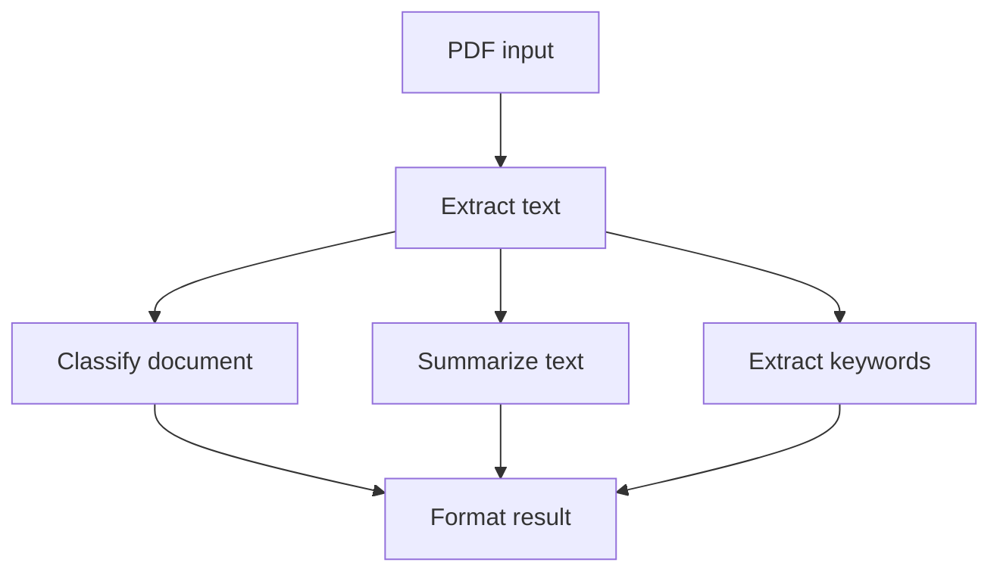

# 如何使用 Hatchet DAG 构建 PDF 处理管道

[Durable Task 与 DAG Workflow cookbook](<06. durable-tasks-vs-dags.md>) 解释了为什么文档处理管道天然适合 [DAG workflow](<../v1/06. durable-execution（持久化执行）/06. directed-acyclic-graphs.md>)。步骤预先已知，步骤之间的依赖是显式的，独立的阶段可以并行运行。本 cookbook 构建一个具体的 PDF 管道，workflow 如下：



注意，在文本提取之后，分类、摘要和关键词提取 task 可以并发运行，因为它们各自只依赖 `extract_text`，而不依赖彼此。DAG 使并发变得显式且易于推理。最后的格式化步骤等待所有三个 task 完成后合并它们的输出。在本 cookbook 的末尾，我们将展示如何将提取 task 替换为使用 [Reducto](#swapping-in-reducto-for-pdf-extraction) 进行生产级文档解析。

## 设置


### 准备环境

要运行此示例，你需要：

- 一个可用的本地 Hatchet 环境或 [Hatchet Cloud](https://cloud.onhatchet.run) 的访问权限
- 一个 Hatchet SDK 示例环境（参见[快速开始](<../v1/01. get-started（入门）/02. quickstart.md>)）
- 可选地，用于真实 PDF 解析的 PDF 文本提取库：
  Python 的 [pypdf](https://pypi.org/project/pypdf/) 或
  TypeScript 的 [pdf2json](https://www.npmjs.com/package/pdf2json) v4。
  如果未安装该库，示例会回退到确定性的示例文本，DAG 仍可运行。

### 定义模型

定义 workflow 输入和每个 task 的输出类型。

#### Python

```python
class PdfInput(BaseModel):
    filename: str
    content_base64: str


class ExtractOutput(BaseModel):
    text: str
    page_count: int


class ClassifyOutput(BaseModel):
    category: str


class SummaryOutput(BaseModel):
    summary: str
    word_count: int


class KeywordsOutput(BaseModel):
    keywords: list[str]


class PipelineResult(BaseModel):
    filename: str
    category: str
    summary: str
    keywords: list[str]
    word_count: int
    page_count: int
```

#### Typescript

```typescript
export type PdfInput = {
  filename: string;
  contentBase64: string;
};

export type ExtractOutput = {
  text: string;
  pageCount: number;
};

export type ClassifyOutput = {
  category: string;
};

export type SummaryOutput = {
  summary: string;
  wordCount: number;
};

export type KeywordsOutput = {
  keywords: string[];
};

export type PipelineResult = {
  filename: string;
  category: string;
  summary: string;
  keywords: string[];
  wordCount: number;
  pageCount: number;
};
```

### 定义 DAG

声明 workflow。所有 task 都将注册到此 workflow 上，并带有显式的父依赖。

#### Python

```python
pdf_pipeline = hatchet.workflow(name="PdfPipeline", input_validator=PdfInput)
```

#### Typescript

```typescript
export const pdfPipeline = hatchet.workflow({
  name: 'pdf-pipeline',
});
```

### 从 PDF 提取文本

第一个 task 解码 base64 输入并使用 PDF 库提取文本。这是唯一直接接触 PDF 的 task；在它完成后，管道的其余部分处理的是纯文本。如果你以后想换成 OCR、对象存储、[Reducto](#swapping-in-reducto-for-pdf-extraction) 或其他 PDF 解析器，需要修改的就是这个 task。

#### Python

```python
@pdf_pipeline.task()
def extract_text(input: PdfInput, ctx: Context) -> ExtractOutput:
    try:
        pypdf = importlib.import_module("pypdf")
    except ImportError:
        # pypdf not installed: return deterministic fallback text
        return ExtractOutput(text=FALLBACK_TEXT, page_count=1)

    decoded = base64.b64decode(input.content_base64)
    reader = pypdf.PdfReader(io.BytesIO(decoded))
    text = "\n".join(page.extract_text() or "" for page in reader.pages)

    return ExtractOutput(text=text, page_count=len(reader.pages))
```

#### Typescript

```typescript
const extractText = pdfPipeline.task({
  name: 'extract_text',
  fn: async (input: PdfInput) => {
    const decoded = Buffer.from(input.contentBase64, 'base64');
    const { text, pageCount } = await extractPdfText(decoded);
    return { text, pageCount };
  },
});
```

### 对文档分类

现在我们可以读取文本了，可以以不同方式独立地处理它。先通过关键词匹配对文档进行分类。

#### Python

```python
@pdf_pipeline.task(parents=[extract_text])
def classify_document(input: PdfInput, ctx: Context) -> ClassifyOutput:
    text = ctx.task_output(extract_text).text.lower()

    if any(w in text for w in ["invoice", "amount due", "payment", "bill"]):
        category = "invoice"
    elif any(w in text for w in ["receipt", "paid", "transaction"]):
        category = "receipt"
    elif any(w in text for w in ["report", "analysis", "findings", "conclusion"]):
        category = "report"
    elif any(w in text for w in ["dear", "sincerely", "regards"]):
        category = "letter"
    else:
        category = "other"

    return ClassifyOutput(category=category)
```

#### Typescript

```typescript
const classifyDocument = pdfPipeline.task({
  name: 'classify_document',
  parents: [extractText],
  fn: async (input: PdfInput, ctx) => {
    const { text } = await ctx.parentOutput(extractText);
    const lower = text.toLowerCase();

    let category: string;
    if (['invoice', 'amount due', 'payment', 'bill'].some((w) => lower.includes(w))) {
      category = 'invoice';
    } else if (['receipt', 'paid', 'transaction'].some((w) => lower.includes(w))) {
      category = 'receipt';
    } else if (['report', 'analysis', 'findings', 'conclusion'].some((w) => lower.includes(w))) {
      category = 'report';
    } else if (['dear', 'sincerely', 'regards'].some((w) => lower.includes(w))) {
      category = 'letter';
    } else {
      category = 'other';
    }

    return { category };
  },
});
```

### 摘要文本

独立地，我们可以对从 `extract_text` 读取的文本做摘要。为使示例简单，我们的摘要器取前 50 个词，并在输出中包含总词数。

#### Python

```python
@pdf_pipeline.task(parents=[extract_text])
def summarize_text(input: PdfInput, ctx: Context) -> SummaryOutput:
    text = ctx.task_output(extract_text).text
    words = text.split()
    max_words = 50
    summary = " ".join(words[:max_words])
    if len(words) > max_words:
        summary += "..."

    return SummaryOutput(summary=summary, word_count=len(words))
```

#### Typescript

```typescript
const summarizeText = pdfPipeline.task({
  name: 'summarize_text',
  parents: [extractText],
  fn: async (input: PdfInput, ctx) => {
    const { text } = await ctx.parentOutput(extractText);
    const words = text.split(/\s+/).filter(Boolean);
    const maxWords = 50;
    let summary = words.slice(0, maxWords).join(' ');
    if (words.length > maxWords) {
      summary += '...';
    }
    return { summary, wordCount: words.length };
  },
});
```

### 提取关键词

`extract_keywords` task 也独立运行，使用一个小的停用词表和频率统计，从提取的文本中取出最高频的有意义词汇。实际上，这些文本处理 task 之间没有任何相互依赖，因此 Hatchet 可以并行运行全部三个。并发并不是这种结构的唯一好处。由于 DAG 中的每个并行 task 都是独立单元，task 级别的行为可以在[重试策略](<../v1/04. reliability（可靠性）/01. retry-policies.md>)、[超时](<../v1/04. reliability（可靠性）/02. timeouts.md>)、[并发限制](<../v1/05. flow-control（流控）/01. concurrency.md>)等方面独立配置。如果关键词提取是最慢或最容易失败的步骤，可以为其独立配置重试策略，使 Hatchet 只重试它，而不重新运行分类或摘要 task。在顺序管道中，你需要自己构建这种隔离。而在 DAG 中，它来自结构本身。

#### Python

```python
@pdf_pipeline.task(parents=[extract_text])
def extract_keywords(input: PdfInput, ctx: Context) -> KeywordsOutput:
    text = ctx.task_output(extract_text).text.lower()
    words = re.findall(r"[a-z]+", text)
    filtered = [w for w in words if len(w) >= MIN_WORD_LENGTH and w not in STOPWORDS]
    counts = Counter(filtered)
    top = sorted(counts.items(), key=lambda x: (-x[1], x[0]))[:MAX_KEYWORDS]
    return KeywordsOutput(keywords=[word for word, _ in top])
```

#### Typescript

```typescript
const extractKeywords = pdfPipeline.task({
  name: 'extract_keywords',
  parents: [extractText],
  fn: async (input: PdfInput, ctx) => {
    const { text } = await ctx.parentOutput(extractText);
    const words = text.toLowerCase().match(/[a-z]+/g) ?? [];
    const filtered = words.filter((w) => w.length >= MIN_WORD_LENGTH && !STOPWORDS.has(w));
    const counts = new Map<string, number>();
    for (const w of filtered) {
      counts.set(w, (counts.get(w) ?? 0) + 1);
    }
    const sorted = [...counts.entries()]
      .sort((a, b) => b[1] - a[1] || a[0].localeCompare(b[0]))
      .slice(0, MAX_KEYWORDS);
    return { keywords: sorted.map(([word]) => word) };
  },
});
```

### 格式化结果

Hatchet 会在 `classify_document`、`summarize_text` 和 `extract_keywords` 全部完成后运行 `format_result`。最终的 task 接收这些父 task 的输出并将它们合并为一个结果。

#### Python

```python
@pdf_pipeline.task(
    parents=[extract_text, classify_document, summarize_text, extract_keywords]
)
def format_result(input: PdfInput, ctx: Context) -> PipelineResult:
    extract = ctx.task_output(extract_text)
    classify = ctx.task_output(classify_document)
    summary = ctx.task_output(summarize_text)
    keywords = ctx.task_output(extract_keywords)

    return PipelineResult(
        filename=input.filename,
        category=classify.category,
        summary=summary.summary,
        keywords=keywords.keywords,
        word_count=summary.word_count,
        page_count=extract.page_count,
    )
```

#### Typescript

```typescript
pdfPipeline.task({
  name: 'format_result',
  parents: [extractText, classifyDocument, summarizeText, extractKeywords],
  fn: async (input: PdfInput, ctx) => {
    const extract = await ctx.parentOutput(extractText);
    const classify = await ctx.parentOutput(classifyDocument);
    const summary = await ctx.parentOutput(summarizeText);
    const keywords = await ctx.parentOutput(extractKeywords);

    return {
      filename: input.filename,
      category: classify.category,
      summary: summary.summary,
      keywords: keywords.keywords,
      wordCount: summary.wordCount,
      pageCount: extract.pageCount,
    };
  },
});
```

### 注册并启动 worker

在 Hatchet worker 上注册 DAG workflow 并启动。

#### Python

```python
def main() -> None:
    worker = hatchet.worker(
        "pdf-pipeline-worker",
        workflows=[pdf_pipeline],
    )
    worker.start()


if __name__ == "__main__":
    main()
```

#### Typescript

在 TypeScript 中，workflow 通过共享的示例 worker 注册，
而不是每个示例一个注册文件。

### 运行管道

触发脚本会创建一个小的示例 PDF，对其进行 base64 编码，然后运行 workflow。

#### Python

```python
import base64

from examples.pdf_pipeline.sample_pdf import make_sample_pdf
from examples.pdf_pipeline.worker import PdfInput, pdf_pipeline

pdf_bytes = make_sample_pdf(
    "Invoice from Acme Corp. Total amount due: 150 dollars. Payment terms: Net 30."
)
content_b64 = base64.b64encode(pdf_bytes).decode()

result = pdf_pipeline.run(
    PdfInput(filename="sample-invoice.pdf", content_base64=content_b64)
)
print(f"Pipeline result: {result}")
```

#### Typescript

```typescript
import { pdfPipeline, PdfInput } from './workflow';
import { makeSamplePdf } from './sample-pdf';

async function main() {
  const pdfBytes = makeSamplePdf(
    'Invoice from Acme Corp. Total amount due: 150 dollars. Payment terms: Net 30.'
  );
  const input: PdfInput = {
    filename: 'sample-invoice.pdf',
    contentBase64: pdfBytes.toString('base64'),
  };

  const result = await pdfPipeline.run(input);
  console.log('Pipeline result:', result);
}
```

### 测试

此示例包含一个端到端测试，它生成一个微型 PDF，运行完整管道，并对输出进行断言。如果你针对本地 Hatchet 实例或 Hatchet Cloud 运行，可以在 [Hatchet 仪表盘](<../v1/11. evaluating-hatchet（评估）/07. developer-experience.md>)中检查 workflow run。

#### Python

```bash
    pytest examples/pdf_pipeline/test_pdf_pipeline.py
```

#### Typescript

```bash
    pnpm run test:e2e -- --testPathPattern=pdf_pipeline
```


## 为什么这是一个 DAG

此管道非常适合 DAG，因为处理阶段在执行开始前就已知，且依赖易于预先声明。该 workflow 不需要循环、未知数量的迭代，或运行时决定存在哪些 task。一旦 `extract_text` 完成，`classify_document`、`summarize_text` 和 `extract_keywords` 就可以独立运行，`format_result` 等待全部三个输出后再合并它们。每个 task 都指向后续 task，没有子步骤回馈到祖先。如果以后要处理运行时才确定的 PDF 集合，可以由一个 durable task 处理外层决策，并为每个文档派生一次此 DAG。

## 换用 Reducto 进行 PDF 提取

上面的本地示例无需外部服务即可运行，但生产文档管道往往需要比基本文本提取更多的能力。Reducto 的 [Parse API](https://docs.reducto.ai/parse/overview) 可以运行 OCR、检测文档布局，并为表格、插图、扫描页和多栏文档等内容返回结构化的块。由于 Hatchet 的 DAG 将 PDF 解析隔离在单个 task 中，换用 Reducto 只需替换 `extract_text`；下游 task 保持不变。Hatchet 继续围绕该 task 运行 workflow，包括重试、并发和可观测性，而 Reducto 负责文档解析本身。

[安装 Reducto SDK](https://docs.reducto.ai/quickstart#install-the-sdk)并在环境中设置 `REDUCTO_API_KEY`。

本 cookbook 中的示例会生成一个微型的 base64 编码 PDF，并作为输入数据传给 workflow，以保持演示自包含。对于较大的 PDF，请将文件存储在 S3 等对象存储中，改为传递文件键、URL 或 Reducto 文件引用。这可以避免将大的 PDF payload 放入 workflow 输入，否则可能触及 [Hatchet 的 gRPC payload 大小限制](<../v1/01. get-started（入门）/01. index.md#could-not-send-task-to-worker>)。

对于小文档，下面的代码片段处理 `result.result.type` 为 `"full"` 时返回的内联结果。对于较大的文档，Reducto 可能返回 URL 结果；生产代码应检查该字段，并在需要时从 URL 获取结果。

#### Python

```python
    import base64
    import tempfile
    from pathlib import Path
    from reducto import Reducto

    @pdf_pipeline.task()
    def extract_text(input: PdfInput, ctx: Context) -> ExtractOutput:
        client = Reducto()  # reads REDUCTO_API_KEY from environment

        decoded = base64.b64decode(input.content_base64)
        with tempfile.TemporaryDirectory() as tmp_dir:
            tmp_path = Path(tmp_dir) / "input.pdf"
            tmp_path.write_bytes(decoded)
            upload = client.upload(file=tmp_path)

        result = client.parse.run(input=upload.file_id)
        text = "\n".join(chunk.content for chunk in result.result.chunks)

        return ExtractOutput(text=text, page_count=result.usage.num_pages)
```

#### Typescript

```typescript
    import Reducto from "reductoai";
    import { writeFileSync, rmSync, mkdtempSync } from "fs";
    import { createReadStream } from "fs";
    import { join } from "path";
    import { tmpdir } from "os";

    const extractText = pdfPipeline.task({
      name: "extract_text",
      fn: async (input: PdfInput) => {
        const client = new Reducto(); // reads REDUCTO_API_KEY from environment

        const decoded = Buffer.from(input.contentBase64, "base64");
        const tmpDir = mkdtempSync(join(tmpdir(), "hatchet-pdf-"));
        const tmpFile = join(tmpDir, "input.pdf");
        writeFileSync(tmpFile, decoded);

        try {
          const upload = await client.upload({ file: createReadStream(tmpFile) });
          const result = await client.parse.run({ input: upload.file_id });
          const text = result.result.chunks.map((c: any) => c.content).join("\n");

          return { text, pageCount: result.usage.num_pages };
        } finally {
          try { rmSync(tmpDir, { recursive: true, force: true }); } catch {}
        }
      },
    });
```

## 后续步骤

从这里你可以添加更多处理阶段，例如语言检测、实体提取或元数据丰富。你也可以使用 Reducto 进行更丰富的生产级解析，用 LLM 调用替换关键词提取或分类，为最慢的阶段配置重试或并发限制，或通过从 [durable task](<../v1/06. durable-execution（持久化执行）/01. durable-tasks.md>) 将此 DAG 作为子 workflow 派生来扇出处理多个 PDF。就本 cookbook 而言，这个五 task 的 DAG 足以展示核心模式。
