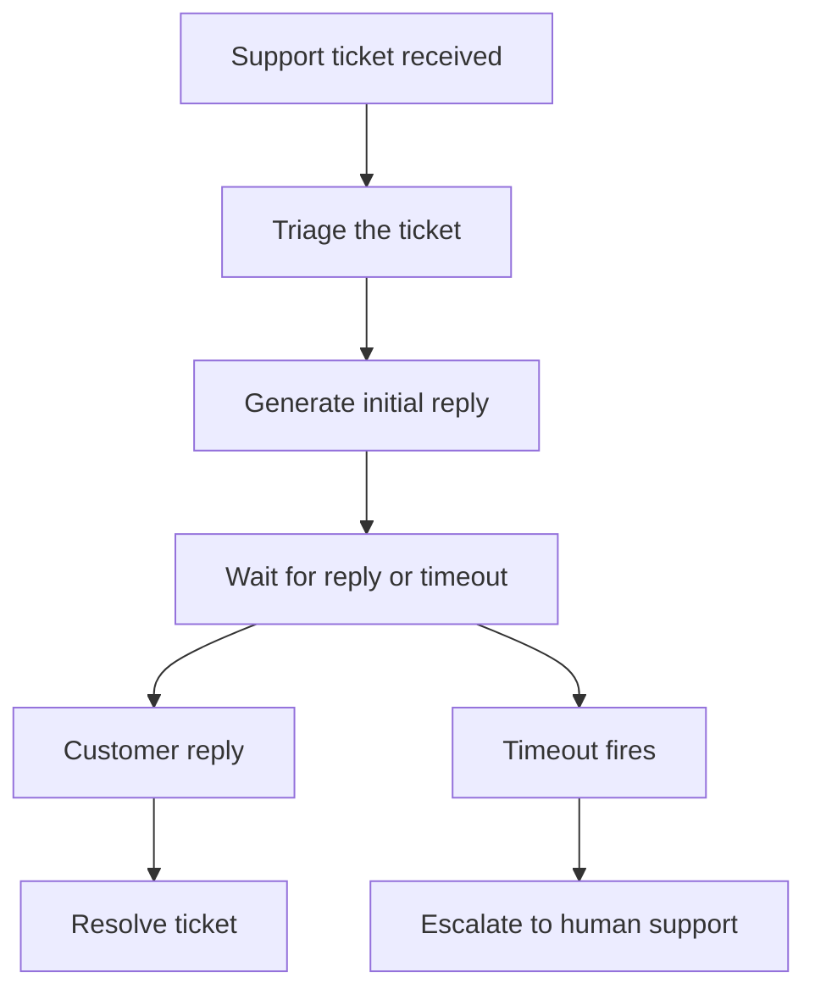

# 如何使用 Hatchet 创建支持 Agent

许多现实世界的 workflow 一旦涉及多个步骤、长时间等待、人工回复和升级规则，就变得难以管理。支持场景就是一例，同样的模式也出现在引导、审批、事件响应和其他运营流程中。在本 cookbook 中，我们将构建一个简单的支持 agent，它对工单进行分类，生成初始回复，然后等待客户响应或超时。如果客户回复，workflow 解决工单。如果没有及时收到回复，workflow 将工单升级给人工支持。

## 本示例构建的内容

本示例实现以下持久化支持 workflow：



Hatchet 的持久化执行模型有助于将整个交互保留在一个 workflow 中，而不是分散到各个队列作业和临时计时器中。

## 设置


### 准备环境

要运行此示例，你需要：

- 一个可用的本地 Hatchet 环境或 [Hatchet Cloud](https://cloud.hatchet.run) 的访问权限
- 一个 Hatchet SDK 示例环境（参见[快速开始](<../v1/01. get-started（入门）/02. quickstart.md>)）
- 可选地，用于实时 LLM 回复的 `ANTHROPIC_API_KEY`

没有 `ANTHROPIC_API_KEY` 时，示例使用固定的回退回复运行。要使用实时 Claude 路径，你还需要为你的语言安装 Anthropic SDK。

### 定义模型

首先定义 workflow 输入和 task 输出的类型。

#### Python

```python
class SupportTicketInput(BaseModel):
    ticket_id: str
    customer_email: str
    subject: str
    body: str


class TriageOutput(BaseModel):
    category: str
    priority: str


class ReplyOutput(BaseModel):
    message: str


class EscalationOutput(BaseModel):
    reason: str
    assigned_to: str
```

#### Typescript

```typescript
export type SupportTicketInput = {
  ticketId: string;
  customerEmail: string;
  subject: string;
  body: string;
};

export type TriageOutput = {
  category: string;
  priority: string;
};

export type ReplyOutput = {
  message: string;
};

export type EscalationOutput = {
  reason: string;
  assignedTo: string;
};
```

这些模型使每个 task 的输入和输出保持显式，让 workflow 更易于检查和测试。

### 添加 workflow task

持久化 workflow 将其工作委托给几个小的 [task](<../v1/02. core-concepts（核心概念）/01. tasks.md>)。

首先，添加一个对传入工单进行分类的 task：

#### Python

```python
@hatchet.task(input_validator=SupportTicketInput)
async def triage_ticket(input: SupportTicketInput, ctx: Context) -> TriageOutput:
    """Classify the ticket into a category and priority."""
    subject = input.subject.lower()
    body = input.body.lower()
    text = subject + " " + body

    if any(word in text for word in ["bill", "charge", "payment", "invoice"]):
        category = "billing"
    elif any(word in text for word in ["login", "password", "auth", "access"]):
        category = "account"
    else:
        category = "technical"

    if any(word in text for word in ["urgent", "critical", "down", "outage"]):
        priority = "high"
    elif any(word in text for word in ["twice", "broken", "error"]):
        priority = "medium"
    else:
        priority = "low"

    return TriageOutput(category=category, priority=priority)
```

#### Typescript

```typescript
// Classify the ticket into a category and priority.
export const triageTicket = hatchet.task({
  name: 'triage-ticket',
  fn: async (input: SupportTicketInput) => {
    const text = `${input.subject} ${input.body}`.toLowerCase();

    let category: string;
    if (['bill', 'charge', 'payment', 'invoice'].some((w) => text.includes(w))) {
      category = 'billing';
    } else if (['login', 'password', 'auth', 'access'].some((w) => text.includes(w))) {
      category = 'account';
    } else {
      category = 'technical';
    }

    let priority: string;
    if (['urgent', 'critical', 'down', 'outage'].some((w) => text.includes(w))) {
      priority = 'high';
    } else if (['twice', 'broken', 'error'].some((w) => text.includes(w))) {
      priority = 'medium';
    } else {
      priority = 'low';
    }

    return { category, priority };
  },
});
```

接下来，添加一个生成初始支持回复的 task。设置了 `ANTHROPIC_API_KEY` 时，task 会调用 Claude 生成回复。否则返回固定的回退响应。

#### Python

```python
@hatchet.task(input_validator=SupportTicketInput)
async def generate_reply(input: SupportTicketInput, ctx: Context) -> ReplyOutput:
    """Generate an initial support reply using Claude."""
    api_key = os.environ.get("ANTHROPIC_API_KEY")

    if not api_key:
        return ReplyOutput(
            message=f"Thank you for contacting support about: {input.subject}. "
            "We are looking into this and will get back to you shortly."
        )

    import importlib

    anthropic = importlib.import_module("anthropic")
    client = anthropic.AsyncAnthropic(api_key=api_key)

    response = await client.messages.create(
        model="claude-sonnet-4-20250514",
        max_tokens=300,
        messages=[
            {
                "role": "user",
                "content": (
                    f"You are a friendly support agent. Write a brief, helpful initial "
                    f"reply to this support ticket.\n\n"
                    f"Subject: {input.subject}\n"
                    f"Message: {input.body}\n\n"
                    f"Keep the reply under 3 sentences."
                ),
            }
        ],
    )

    text = response.content[0].text
    return ReplyOutput(message=text)
```

#### Typescript

```typescript
// Generate an initial support reply using Claude.
export const generateReply = hatchet.task({
  name: 'generate-reply',
  fn: async (input: SupportTicketInput) => {
    const apiKey = process.env.ANTHROPIC_API_KEY;

    if (!apiKey) {
      return {
        message: `Thank you for contacting support about: ${input.subject}. We are looking into this and will get back to you shortly.`,
      };
    }

    // eslint-disable-next-line @typescript-eslint/no-require-imports
    const anthropic = require('@anthropic-ai/sdk');
    const Anthropic = anthropic.default || anthropic;
    const client = new Anthropic({ apiKey });

    const response = await client.messages.create({
      model: 'claude-sonnet-4-20250514',
      max_tokens: 300,
      messages: [
        {
          role: 'user' as const,
          content:
            `You are a friendly support agent. Write a brief, helpful initial ` +
            `reply to this support ticket.\n\n` +
            `Subject: ${input.subject}\n` +
            `Message: ${input.body}\n\n` +
            `Keep the reply under 3 sentences.`,
        },
      ],
    });

    const [block] = response.content;
    const text = block?.type === 'text' ? block.text : '';
    return { message: text };
  },
});
```

最后，添加一个代表升级给支持团队的 task：

#### Python

```python
@hatchet.task(input_validator=SupportTicketInput)
async def escalate_ticket(input: SupportTicketInput, ctx: Context) -> EscalationOutput:
    """Escalate an unresolved ticket to the human support team."""
    return EscalationOutput(
        reason=f"No customer reply within {TIMEOUT_SECONDS}s timeout",
        assigned_to="support-team@example.com",
    )
```

#### Typescript

```typescript
// Escalate an unresolved ticket to the human support team.
export const escalateTicket = hatchet.task({
  name: 'escalate-ticket',
  fn: async (input: SupportTicketInput) => {
    return {
      reason: `No customer reply within ${TIMEOUT_SECONDS}s timeout`,
      assignedTo: 'support-team@example.com',
    };
  },
});
```

将分类、回复生成和升级保持为独立的 task，使 workflow 本身保持精简，也让每个部分更易于推理。

### 构建持久化 workflow

现在用一个[持久化 Hatchet workflow](<../v1/02. core-concepts（核心概念）/04. durable-execution.md>) 将一切串联起来。持久化 workflow 非常适合这里，因为此交互在等待客户回复期间可能保持打开一段时间。Hatchet 会持久化 workflow 状态及其等待条件，因此 workflow 可以在长时间延迟、worker 重启甚至 worker 崩溃后存活，随后在其他 worker 上继续。这为你提供了一种直观的方式来建模整个交互，而无需添加自定义恢复逻辑。

#### Python

```python
@hatchet.durable_task(input_validator=SupportTicketInput)
async def support_agent(
    input: SupportTicketInput, ctx: DurableContext
) -> dict[str, Any]:
    # Step 1: Triage the ticket
    triage = await triage_ticket.aio_run(input)

    # Step 2: Generate an initial reply
    reply = await generate_reply.aio_run(input)

    # Step 3: Wait for a customer reply or timeout
    now = await ctx.aio_now()
    consider_events_since = now - timedelta(minutes=LOOKBACK_MINUTES)

    wait_result = await ctx.aio_wait_for(
        "await-customer-reply",
        or_(
            SleepCondition(timedelta(seconds=TIMEOUT_SECONDS)),
            UserEventCondition(
                event_key=REPLY_EVENT_KEY,
                scope=input.ticket_id,
                consider_events_since=consider_events_since,
            ),
        ),
    )

    # The or-group result is {"CREATE": {"<condition_key>": ...}}.
    # Check whether the reply event condition was the one that resolved.
    resolved_key = list(wait_result["CREATE"].keys())[0]
    customer_replied = resolved_key == REPLY_EVENT_KEY

    if not customer_replied:
        # Step 4a: Timeout -> escalate
        await escalate_ticket.aio_run(input)
        return {
            "ticket_id": input.ticket_id,
            "status": "escalated",
            "triage_category": triage.category,
            "triage_priority": triage.priority,
            "initial_reply": reply.message,
        }

    # Step 4b: Customer replied -> resolve
    return {
        "ticket_id": input.ticket_id,
        "status": "resolved",
        "triage_category": triage.category,
        "triage_priority": triage.priority,
        "initial_reply": reply.message,
    }
```

#### Typescript

```typescript
export const supportAgent = hatchet.durableTask({
  name: 'support-agent',
  executionTimeout: '10m',
  fn: async (input: SupportTicketInput, ctx) => {
    // Step 1: Triage the ticket
    const triage = await triageTicket.run(input);

    // Step 2: Generate an initial reply
    const reply = await generateReply.run(input);

    // Step 3: Wait for a customer reply or timeout
    const now = await ctx.now();
    const considerEventsSince = new Date(
      now.getTime() - durationToMs(LOOKBACK_WINDOW)
    ).toISOString();

    const waitResult = await ctx.waitFor(
      Or(
        new SleepCondition(`${TIMEOUT_SECONDS}s`, TIMEOUT_LABEL),
        new UserEventCondition(
          REPLY_EVENT_KEY,
          '',
          REPLY_LABEL,
          undefined,
          input.ticketId,
          considerEventsSince
        )
      )
    );

    // Determine which condition fired. ctx.waitFor returns
    // { CREATE: { <label>: ... } } where <label> is the readableDataKey
    // we assigned above ('timeout' or 'reply').
    const create = (waitResult as Record<string, Record<string, unknown>>)['CREATE'] ?? waitResult;
    const resolvedLabel = Object.keys(create as Record<string, unknown>)[0] ?? '';
    const customerReplied = resolvedLabel === REPLY_LABEL;

    if (!customerReplied) {
      // Step 4a: Timeout -> escalate
      await escalateTicket.run(input);
      return {
        ticketId: input.ticketId,
        status: 'escalated' as const,
        triageCategory: triage.category,
        triagePriority: triage.priority,
        initialReply: reply.message,
      };
    }

    // Step 4b: Customer replied -> resolve
    return {
      ticketId: input.ticketId,
      status: 'resolved' as const,
      triageCategory: triage.category,
      triagePriority: triage.priority,
      initialReply: reply.message,
    };
  },
});
```

workflow 先运行分类，生成初始回复，然后等待两件事之一发生：该工单的客户回复事件到达，或超时触发。此后，workflow 要么解决工单，要么将其升级。

这里最重要的细节是回复事件条件上的回看窗口。客户回复可能在 workflow 还在完成分类或生成第一响应时就到达。通过使用回看窗口（Python 的 [`consider_events_since`](<../v1/06. durable-execution（持久化执行）/04. durable-event-waits.md#lookback-windows>)，TypeScript 的 `considerEventsSince`），workflow 在等待激活后仍能拾取该回复，而不是因为事件来得稍早而错过它。

### 注册并启动 worker

要运行此 workflow，请将 workflow 及其 task 注册到 Hatchet worker 上，然后启动。

```python
def main() -> None:
    worker = hatchet.worker(
        "support-agent-worker",
        workflows=[support_agent, triage_ticket, generate_reply, escalate_ticket],
    )
    worker.start()


if __name__ == "__main__":
    main()
```

在 TypeScript 中，workflow 通过共享的示例 worker 注册，而不是每个示例一个注册文件。

worker 运行后，你可以触发 workflow 并观察解决或升级的结果。

### 触发 workflow

示例还包含一个小的触发脚本，它启动 workflow，推送一个限定作用域的回复事件，并等待结果。

#### Python

```python
from examples.support_agent.worker import (
    REPLY_EVENT_KEY,
    SupportTicketInput,
    hatchet,
    support_agent,
)

ticket = SupportTicketInput(
    ticket_id="ticket-42",
    customer_email="alice@example.com",
    subject="Login broken",
    body="I can't log in since this morning.",
)

# Start the support agent workflow
ref = support_agent.run(ticket, wait_for_result=False)
print(f"Started workflow run: {ref.workflow_run_id}")

# Push a customer reply event (scoped to this ticket)
print("Pushing customer reply event...")
hatchet.event.push(
    REPLY_EVENT_KEY,
    {"message": "I cleared my cookies and it works now. Thanks!"},
    scope=ticket.ticket_id,
)

# Wait for the workflow to complete
result = ref.result()
print(f"Workflow completed: {result}")
```

#### Typescript

```typescript
async function main() {
  const input: SupportTicketInput = {
    ticketId: 'ticket-42',
    customerEmail: 'alice@example.com',
    subject: 'Login broken',
    body: "I can't log in since this morning.",
  };

  // Start the support agent workflow
  const ref = await supportAgent.runNoWait(input);
  const runId = await ref.getWorkflowRunId();
  console.log(`Started workflow run: ${runId}`);

  // Push a customer reply event (scoped to this ticket)
  console.log('Pushing customer reply event...');
  await hatchet.events.push(
    REPLY_EVENT_KEY,
    { message: 'I cleared my cookies and it works now. Thanks!' },
    { scope: input.ticketId }
  );

  // Wait for the workflow to complete
  const result = await ref.output;
  console.log('Workflow completed:', result);
}
```

由于 workflow 使用了回看窗口，触发脚本可以在启动支持 agent 后立即推送回复事件。

### 测试

此示例包含两个针对运行中 Hatchet 实例的端到端测试：

- 解决路径：客户回复事件在超时前到达
- 超时路径：没有回复到达，workflow 进行升级

如果你在本地运行 SDK 示例：

#### Python

```bash
    pytest examples/support_agent/test_support_agent.py
```

#### Typescript

```bash
    pnpm run test:e2e -- --testPathPattern=support_agent
```

这些测试共同验证了 workflow 的两个分支，并确认早期回复事件可以在无需协调休眠的情况下被安全处理。


## 为什么 Hatchet 适合此 workflow

本示例有趣的部分不在于 LLM 调用，而在于等待、分支以及将完整交互保存在一处这三者的结合。这样的支持流程通常需要跨多个步骤保存状态，等待人工输入，并根据回复是否在截止时间前到达做出不同反应。Hatchet 非常适合这种模式，因为你可以在 workflow 中直接表达事件等待和超时分支。这使控制流更易于检查、更易于测试，也更容易随着交互复杂化而扩展。

## 后续步骤

一个自然的下一步是将此 workflow 连接到真实的工单系统，并将对话延续到单次回复之外。你还可以让升级依赖于客户响应的内容，而不仅仅是超时。就本 cookbook 而言，较小的版本足以展示核心模式：立即开始工作，安全地等待回复，并在截止时间过后升级。
