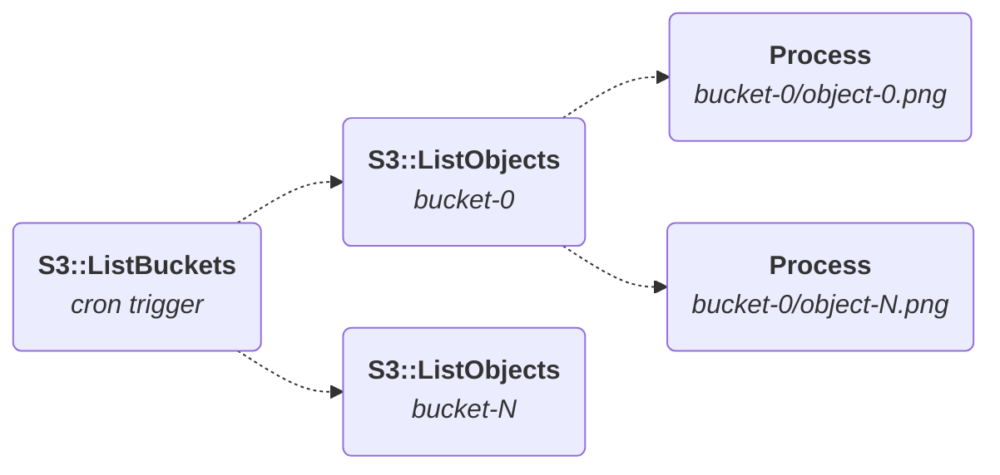
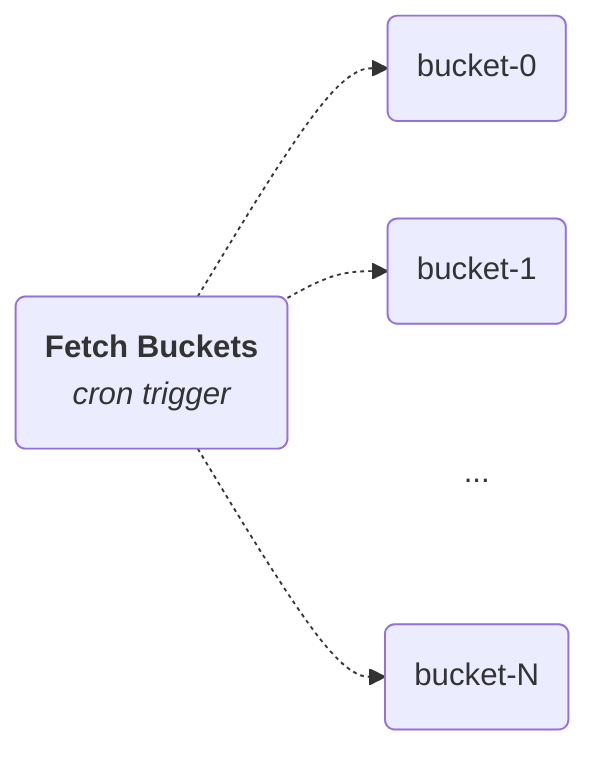
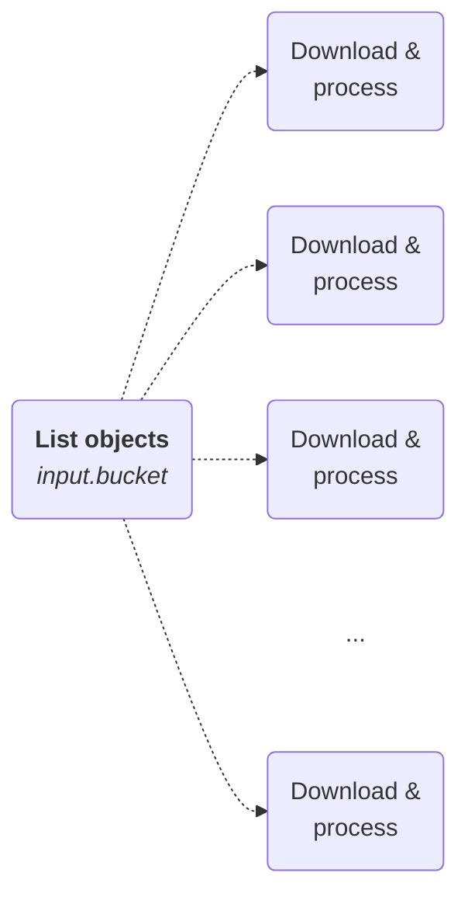

# 使用 Hatchet 大规模处理 S3 对象

## 简介

Amazon S3 是一个可靠而朴素（reliable-and-boring）的分布式对象存储，具有强[读写一致性（read-after-write）](https://docs.aws.amazon.com/AmazonS3/latest/userguide/Welcome.html#ConsistencyModel)，是大规模处理海量数据集的理想后端。然而，要协调真正发挥 S3 规模优势的工作负载（又不产生天文数字的云账单），并非易事。

本指南介绍如何构建一个高度并行（embarrassingly parallel）的 Hatchet 管道，用于摄取和处理存储在多个区域绑定 S3 桶中的数十万个图像。此方法将大量使用 Hatchet 的[并发控制](<../v1/05. flow-control（流控）/01. concurrency.md>)功能，并结合通过[动态子任务派生](<../v1/06. durable-execution（持久化执行）/02. child-spawning.md#fan-out-spawning-many-children-in-parallel>)进行的激进扇出，在保证资源公平分配和对象幂等处理的同时，将数据处理 workflow 彻底并行化。

<figure style={{ margin: "2rem auto", maxWidth: "400px", textAlign: "center" }}>
  
  <figcaption
    style={{
      marginTop: "0.75rem",
      fontSize: "0.875rem",
      fontStyle: "italic",
      opacity: 0.7,
    }}
  >
    没有并发控制时，没有什么能阻止多个 worker 同时抓取并处理同一个对象。
  </figcaption>
</figure>

### 场景

在本指南中，我们对系统做如下约束：

- 每个桶对应一类单独的对象。
- 桶大小分布不均匀。
- 对象是短暂的。成功处理后，对象应被删除。
- 数据可以随时添加或删除，其中相当大一部分在启动时集中涌入。

## 设置

### AWS 凭据

此管道需要配置了以下 IAM 权限的 [AWS 访问密钥](https://docs.aws.amazon.com/sdkref/latest/guide/feature-static-credentials.html)：

Action，Resource，原因

`s3:ListAllMyBuckets`，`*`，对账户中的桶进行分页。
`s3:ListBucket`，`arn:aws:s3:::<your-bucket-prefix>-*`，对每个桶中的对象键进行分页。
`s3:GetObject`，`arn:aws:s3:::<your-bucket-prefix>-*/*`，下载每个对象进行处理。
`s3:DeleteObject`，`arn:aws:s3:::<your-bucket-prefix>-*/*`，处理后删除对象。

_注意：`<your-bucket-prefix>` 应在运行时限定为你所针对的特定桶前缀。_

这些可以通过环境变量设置，SDK 客户端会自动获取：

#### Python

```python
s3 = boto3.client("s3")
```

#### Typescript

```typescript
const s3 = new S3Client({ forcePathStyle: true });
```

## Workflow

为确保最大并行度，我们将每个桶中每个对象的处理视为独立的工作单元。具体来说，执行顺序为：

1. 从 S3 获取桶。
2. 获取每个桶中的对象。
3. 处理每个对象。
4. 删除每个对象。

我们将其实现为_双重扇出_：一次跨桶扇出以派生每个桶的轮询 task，再在每个轮询 task 内部扇出为每个对象派生一个处理 task。这使我们可以将列出和处理工作分布到水平扩展的 worker 集群中，而不让任何单个 worker 成为瓶颈。



### 定义模型

首先为 workflow 输入定义数据模型。

#### Python

```python
class ListObjectsInput(BaseModel):
    bucket: str


class ProcessObjectInput(BaseModel):
    bucket: str
    key: str
```

#### Typescript

```typescript
type ListObjectsInput = {
  bucket: string;
};

type ProcessObjectInput = {
  bucket: string;
  key: string;
};
```

注意我们只为输入数据定义了模型，因为 task 在对象删除后自然结束。

### 获取桶

我们首先从 S3 获取所有相关桶。为简单起见，此管道放弃了 [S3 Event Notifications](https://docs.aws.amazon.com/AmazonS3/latest/userguide/EventNotifications.html)，改为通过 [cron 触发器](<../v1/03. triggers（触发）/02. cron-runs.md>)进行周期性扫描。

作为管道的根，此 task 对我们区域中的所有桶进行分页，为每个桶扇出一个子 workflow。由于只是跨桶的小批次/页进行迭代，这里没有值得并行化的工作。

不过，我们的策略仍应防范同一 cron 作业的_执行重叠_。如果 S3 在扫描中途对我们限流，导致某次运行超过 cron 间隔，下一个 tick 应被拒绝直到在途运行完成，而不是堆积更多并发列出调用使限流恶化。



#### Python

```python
fetch_buckets_workflow = hatchet.workflow(
    name="fetch_s3_buckets",
    concurrency=ConcurrencyExpression(
        expression="'singleton'",
        max_runs=1,
        limit_strategy=ConcurrencyLimitStrategy.CANCEL_NEWEST,
    ),
)
```

#### Typescript

```typescript
const fetchBucketsWorkflow = hatchet.workflow({
  name: 'fetch_s3_buckets',
  on: {
    cron: '* * * * *',
  },
  concurrency: {
    expression: "'singleton'",
    maxRuns: 1,
    limitStrategy: ConcurrencyLimitStrategy.CANCEL_NEWEST,
  },
});
```

这里我们将并发键设为 CEL 表达式 `'singleton'`，一个对每次运行求值都相同的字符串字面量。结合 `max_runs=1` 和 `CANCEL_NEWEST`，此规则将所有运行导入**单个 worker 上的单个槽位**：当一个运行在途时，cron 触发的任何新运行都会立即被取消。

task 体负责收集我们区域的所有相关桶，并为每个桶从 `fetch_s3_objects` workflow 派生一个新的 `fetch_objects` task：

#### Python

```python
@fetch_buckets_workflow.task()
async def fetch_buckets(input: EmptyModel, ctx: Context) -> dict[str, Any]:
    paginator = s3.get_paginator("list_buckets")
    pages = paginator.paginate(
        Prefix=BUCKET_PREFIX,
        PaginationConfig={"PageSize": 10},
    )

    for page in pages:
        items = [
            fetch_objects_workflow.create_bulk_run_item(
                input=ListObjectsInput(bucket=b["Name"]),
                child_key=b["Name"],
                additional_metadata={"bucket-name": b["Name"]},
            )
            for b in page.get("Buckets", [])
        ]
        if items:
            await fetch_objects_workflow.aio_run_many(items, wait_for_result=False)

    return {}
```

#### Typescript

```typescript
fetchBucketsWorkflow.task({
  name: 'fetch_buckets',
  fn: async () => {
    for await (const page of paginateListBuckets(
      { client: s3, pageSize: 10 },
      { Prefix: BUCKET_PREFIX }
    )) {
      const items = (page.Buckets ?? [])
        .filter((bucket): bucket is { Name: string } => bucket.Name !== undefined)
        .map((bucket) => ({
          input: { bucket: bucket.Name },
          opts: {
            childKey: bucket.Name,
            additionalMetadata: { 'bucket-name': bucket.Name },
          },
        }));

      if (items.length > 0) {
        await fetchObjectsWorkflow.runManyNoWait(items);
      }
    }

    return {};
  },
});
```

我们为每次派生使用桶名作为其 child key，以确保下游 `fetch_objects` run 的去重。

### 获取对象

接下来，我们定义一个负责轮询给定 S3 桶中对象的 workflow，然后扇出并为每个对象分配一个处理 task。



与[获取桶](#fetch-buckets)类似，此 workflow 需要确保每个桶同时最多只有一个轮询器在途，通过 `CANCEL_NEWEST` 策略防止重叠并限制为单次运行。不过这里我们使用 CEL 表达式 `input.bucket` 按桶名分组，以强制执行按桶的并发。

此外，我们定义了一个全局并发表达式，限制同时可以启动的桶轮询器数量。超出此规则的 task 会使用 `GROUP_ROUND_ROBIN` 策略排队，并在并发槽位释放时执行。

#### Python

```python
fetch_objects_workflow = hatchet.workflow(
    name="fetch_s3_objects",
    input_validator=ListObjectsInput,
    concurrency=[
        ConcurrencyExpression(
            expression="input.bucket",
            max_runs=1,
            limit_strategy=ConcurrencyLimitStrategy.CANCEL_NEWEST,
        ),
        ConcurrencyExpression.from_int(MAX_CONCURRENT_BUCKET_POLLERS),
    ],
)
```

#### Typescript

```typescript
const fetchObjectsWorkflow = hatchet.workflow({
  name: 'fetch_s3_objects',
  concurrency: [
    {
      expression: 'input.bucket',
      maxRuns: 1,
      limitStrategy: ConcurrencyLimitStrategy.CANCEL_NEWEST,
    },
    {
      expression: "'constant'",
      maxRuns: MAX_CONCURRENT_BUCKET_POLLERS,
      limitStrategy: ConcurrencyLimitStrategy.GROUP_ROUND_ROBIN,
    },
  ],
});
```

这两个 `ConcurrencyExpression` 条目组合起来，确保**每个桶单个轮询器**，同时**workflow 级别限制**在途轮询器总数。

task 本身对桶中的对象进行分页，并为每个对象派生一个处理 run：

#### Python

```python
@fetch_objects_workflow.task()
async def fetch_objects(input: ListObjectsInput, ctx: Context) -> dict[str, Any]:
    paginator = s3.get_paginator("list_objects_v2")
    pages = paginator.paginate(
        Bucket=input.bucket,
        PaginationConfig={"PageSize": 100},
    )

    for page in pages:
        items = [
            process_object_workflow.create_bulk_run_item(
                input=ProcessObjectInput(bucket=input.bucket, key=obj["Key"]),
                child_key=f"{input.bucket}/{obj['Key']}",
            )
            for obj in page.get("Contents", [])
        ]
        if items:
            await process_object_workflow.aio_run_many(items, wait_for_result=False)

    return {}
```

#### Typescript

```typescript
fetchObjectsWorkflow.task({
  name: 'fetch_objects',
  fn: async (input: ListObjectsInput) => {
    for await (const page of paginateListObjectsV2(
      { client: s3, pageSize: 100 },
      { Bucket: input.bucket }
    )) {
      const items = (page.Contents ?? [])
        .filter((obj): obj is { Key: string } => obj.Key !== undefined)
        .map((obj) => ({
          input: { bucket: input.bucket, key: obj.Key },
          opts: {
            childKey: `${input.bucket}/${obj.Key}`,
          },
        }));

      if (items.length > 0) {
        await processObjectWorkflow.runManyNoWait(items);
      }
    }

    return {};
  },
});
```

此处的 child key 将桶名和对象键组合（`{bucket}/{key}`），保证重新触发父任务不会为同一对象派生重复的处理 run。S3 对象键只在特定桶内唯一，因此桶前缀是必需的。

### 处理对象

最后，我们定义处理 workflow，它承载了管道大部分的实际计算工作。回顾前几节：

1. 每个桶的对象分布不均匀。
2. 处理完的对象会立即删除。

我们不做全局并发上限，而是使用 `S3_WORKER_MAX_RUNS_PER_BUCKET` 将限制限定为_按桶_。全局上限会允许最大的桶垄断所有处理槽位。按桶的上限则无论单个桶大小如何，都能保持整个系统吞吐的公平。当某个桶达到上限时，额外的 run 会排队，并随着槽位释放按 `GROUP_ROUND_ROBIN` 轮转分发。


上面的图展示了这种稳态：工作在各桶之间交错，worker 池保持在其槽位上限，积压按轮转顺序消化。即使 `bucket-1` 待处理对象最多，它也不会垄断 worker。

此 workflow 没有子侧去重（没有以 `{bucket}/{object-key}` 为键的并发表达式）。因为 `process-object` run 只会由 [`fetch_objects`](#fetch-objects) 派生（后者已在派生时通过 child key 处理了去重），再加一个并发表达式就是冗余的。

#### Python

```python
process_object_workflow = hatchet.workflow(
    name="process_object",
    input_validator=ProcessObjectInput,
    concurrency=ConcurrencyExpression(
        expression="input.bucket",
        max_runs=MAX_RUNS_PER_BUCKET,
        limit_strategy=ConcurrencyLimitStrategy.GROUP_ROUND_ROBIN,
    ),
)
```

#### Typescript

```typescript
const processObjectWorkflow = hatchet.workflow({
  name: 'process_object',
  concurrency: {
    expression: 'input.bucket',
    maxRuns: MAX_RUNS_PER_BUCKET,
    limitStrategy: ConcurrencyLimitStrategy.GROUP_ROUND_ROBIN,
  },
});
```

最后一步是下载对象、处理它，并安全地从源桶中删除它：

#### Python

```python
@process_object_workflow.task()
def process_object(input: ProcessObjectInput, ctx: Context) -> dict[str, Any]:
    buf = BytesIO()
    try:
        s3.download_fileobj(input.bucket, input.key, buf)
    except s3.exceptions.ClientError as e:
        if (code := e.response["Error"]["Code"]) in {
            "NoSuchKey",
            "NoSuchBucket",
            "404",
        }:
            ctx.log(f"skipping {input.bucket}/{input.key}: not found ({code})")
            return {}
        raise

    buf.seek(0)
    # TODO: actual image processing here

    s3.delete_object(Bucket=input.bucket, Key=input.key)
    return {}
```

#### Typescript

```typescript
processObjectWorkflow.task({
  name: 'process_object',
  fn: async (input: ProcessObjectInput, ctx) => {
    let body: Buffer;

    try {
      const response = await s3.send(
        new GetObjectCommand({ Bucket: input.bucket, Key: input.key })
      );
      if (!response.Body) {
        return {};
      }
      body = Buffer.from(await response.Body.transformToByteArray());
    } catch (err) {
      if (err instanceof NoSuchKey || err instanceof NoSuchBucket) {
        await ctx.log(`skipping ${input.bucket}/${input.key}: not found`);
        return {};
      }
      throw err;
    }

    // TODO: actual image processing here

    await s3.send(new DeleteObjectCommand({ Bucket: input.bucket, Key: input.key }));
    return {};
  },
});
```

此架构通过两个核心机制提供了一个幂等的、实际意义上恰好一次（exactly-once）的处理管道：

1. **幂等运行：**每个 `download_and_process` task 获取、处理然后删除目标对象。如果对象不存在，`NoSuchKey` / `NoSuchBucket`（404）分支会捕获并返回空操作。S3 的强读写一致性确保"未找到"响应是可靠的完成信号。
2. **派生时去重：**针对完全相同 `(bucket, object)` 的并发重复 run 会被父任务的 `child_key` 约束主动阻止，这意味着 404 空操作路径纯粹是安全网而非常态。

## 注册并启动 worker

你可以按如下方式启动 worker，它将开始轮询所有以 `S3_WORKER_BUCKET_PREFIX` 为前缀的 S3 桶：

#### Python

从 `sdks/python/`：

```bash
S3_WORKER_BUCKET_PREFIX="bucket-" \
S3_WORKER_MAX_CONCURRENT_BUCKET_POLLERS=10 \
S3_WORKER_MAX_RUNS_PER_BUCKET=20 \
S3_WORKER_SLOTS=40 \
poetry run python -m examples.aws.s3.worker
```

#### Typescript

从 `sdks/typescript/`：

```bash
S3_WORKER_BUCKET_PREFIX="bucket-" \
S3_WORKER_MAX_CONCURRENT_BUCKET_POLLERS=10 \
S3_WORKER_MAX_RUNS_PER_BUCKET=20 \
S3_WORKER_SLOTS=40 \
npx ts-node src/v1/examples/aws/s3/worker.ts
```

> **Info:** **本地运行 Worker**
>
> 使用提供的 `docker-compose.yaml` 启动 `localstack/localstack:4.14`：
>
> ```bash
> docker compose -f examples/aws/s3/docker-compose.yml up -d --wait
> ```
>
> 然后在运行前设置以下环境变量：
>
> ```bash
> AWS_ENDPOINT_URL=http://localhost:4566
> AWS_ACCESS_KEY_ID=test
> AWS_SECRET_ACCESS_KEY=test
> AWS_REGION=us-east-1
> ```

## 测试

#### Python

运行 Python worker 测试套件以演练端到端 workflow，其启动和清理由 `pytest` fixture 管理。这将：

- 通过 `docker compose` 启动一个 LocalStack 实例。
- 为其播种 S3 数据。
- 启动 worker，开始轮询。
- 验证每个播种的对象都被处理和删除。

```bash
pytest examples/aws/s3/test_worker.py
```

#### Typescript

TypeScript worker 没有自动化测试套件。请使用上述步骤针对 LocalStack 手动运行。
