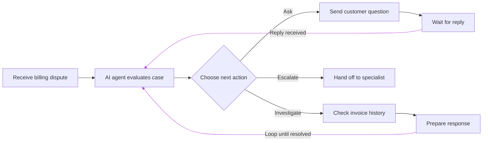
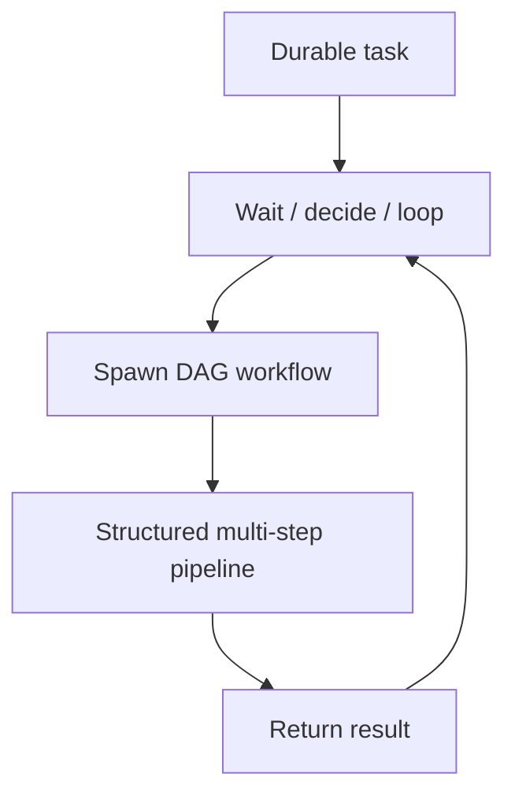

# 何时使用 Durable Task 与 DAG Workflow

Hatchet 支持两种编排持久化多步骤 workflow 的方式：[有向无环图（DAG）](<../v1/06. durable-execution（持久化执行）/06. directed-acyclic-graphs.md>)和[durable task](<../v1/06. durable-execution（持久化执行）/01. durable-tasks.md>)。Hatchet 会持久化 task 状态和结果，使 workflow 无需重新运行已完成的工作即可恢复。重要的区别在于你如何编写 workflow，这意味着需要尽早做出架构决策：这个 workflow 应该建模为 DAG，还是应该在运行时由 task 组合而成？两者都是 Hatchet 中[持久化执行（durable execution）](<../v1/02. core-concepts（核心概念）/04. durable-execution.md>)的形式，但它们适合不同类型的 workflow。选择取决于 workflow 的控制流和依赖关系在实现时是否已知。如果已知，DAG 通常是自然的选择。如果未知，durable task 通常更合适。在该模型中，你的代码在运行、做决策、等待、派生子任务，而 Hatchet 在此过程中持久化进度。

## 结构预先已知时

当 workflow 在实现时可以轻松表示为无环图时，DAG 效果最好。这意味着所有步骤必须预先已知，且子步骤不能回馈到其祖先。文档处理、ETL 管道和 CI/CD 管道都是很好的例子。主要阶段提前已知，可以按依赖顺序轻松排列且没有循环。Hatchet 负责调度工作、将输出从父步骤传递给子步骤，并在仪表盘中为你提供管道的清晰可视化呈现。

## 声明式结构不再实用时

DAG 可以处理等待、条件分支和 [or group](<../v1/06. durable-execution（持久化执行）/06. directed-acyclic-graphs.md#waiting-on-conditions-with-or-groups>)，因此仅存在等待或分支并不意味着你需要 durable task。可维护性往往是决定性因素。当分支规则过多或相互交织，以致于声明式表达容易出错时，DAG 就成了错误的工具。当分支逻辑变化频繁，维护图的开销超过用命令式编写同样逻辑时，也是如此。然而，当 workflow 包含循环或直到运行时才能知道的步骤时，DAG 根本无法使用。

支持工单 workflow、审批流和 agentic 循环都是很好的例子。考虑一个[支持 agent](<04. workflow-support-agent.md>)：它对工单进行分类，发送初始响应，等待客户回复或超时，然后解决或升级。你可以用 or group 和[父条件](<../v1/06. durable-execution（持久化执行）/06. directed-acyclic-graphs.md#branching-with-parent-conditions>)将其简单版本表达为 DAG。但在实践中，分支逻辑往往会超出可维护的范围，出现多条升级路径、多轮对话和依赖上下文的重试。到那时，用带检查点的命令式代码编写反而更省力。Agentic 循环是更明显的例子：迭代次数未知，每个动作依赖于前一个结果，停止条件在运行时求值。这需要一个循环，而 DAG 无法表达。

Durable task 通过让你直接在代码中编写控制流来处理这些场景。Hatchet 会在等待和[子任务派生](<../v1/06. durable-execution（持久化执行）/02. child-spawning.md>)周围对进度打检查点，在等待期间将 task 从 worker 槽位中移出，并在等待解除后从检查点恢复。workflow 可以暂停任意时长，从上次中断的地方准确继续，并根据实际发生的情况做出下一个决策。

## 混合两种模型

有些 workflow 并非纯粹的单一模型。一个 durable task 可以处理外层交互，等待事件，做分支决策，循环直至完成，并在到达需要执行结构化多步骤工作的节点时派生一个 DAG workflow。DAG 作为子任务运行、完成、返回结果，然后 durable task 继续执行。

反过来也是可能的。Hatchet 的 SDK 允许 DAG 包含一个或多个 durable task 节点。如果固定的管道中有单个步骤需要循环、动态派生子任务或复杂的命令式分支，该节点可以是 durable task，而 DAG 的其余部分保持声明式。DAG 等待该节点完成，然后继续执行图的其余部分。

## 具体示例

Workflow，模型，原因

ETL 管道（摄取 -> 解析 -> 转换 -> 校验 -> 存储），DAG，步骤和依赖预先已知。并行阶段是主要价值。
CI/CD 管道（构建 -> 测试 -> 打包 -> 部署 -> 冒烟测试），DAG，固定阶段、显式依赖、并行执行。
带支付等待的订单管道（准备 -> 等待支付 -> 履约 -> 通知），DAG，带单个等待的固定阶段，用 or group 表达。结构仍然是完全声明式的。
随时间增长的支持 workflow（分类 -> 回复 -> 等待 -> 解决/升级，加上按类别的升级路径、多轮处理、依赖上下文的重试），Durable task，简单版本可以是 DAG，但随着分支规则成倍增加且频繁变化，维护声明式图变得脆弱。命令式代码更易于演进。
Agentic 循环 / 迭代式工具调用，Durable task，包含循环。迭代次数未知，停止条件在运行时求值。DAG 无法表达。
动态运行时扇出，两者结合，durable task 在运行时决定需要执行什么工作，然后为每个结构化子管道派生一个 DAG。

## 决策清单

问题，适合 DAG，适合 Durable Task

workflow 结构在开始前基本已知？，是，否，或仅部分已知
依赖关系容易预先声明？，是，不一定
workflow 涉及等待（事件、计时器、人工输入）？，通过 or group 原生支持，同样原生支持
分支逻辑简单、稳定、易于声明式维护？，非常适合，也可行，但此处不需要命令式代码
分支逻辑复杂、繁多或频繁变化？，可能变得脆弱且易错，非常适合：逻辑在代码中，更易读、测试和更新
workflow 包含循环或未知迭代次数？，DAG 中不可能，必需：只有 durable task 能表达循环

如果你的大多数答案落在左列，从 DAG 开始。如果 workflow 包含循环，或大多数答案落在右列，从 durable task 开始。如果答案有分歧，请考虑外层 workflow 是否实际上是一个包含若干结构化子管道的动态编排器，因为这种分歧往往指向两者的组合。

## 延伸阅读

- [持久化执行简介](<../v1/02. core-concepts（核心概念）/04. durable-execution.md>)：两种模型共同的概念基础
- [Durable Task](<../v1/06. durable-execution（持久化执行）/01. durable-tasks.md>)：durable task 的工作原理、使用时机和确定性规则
- [作为持久化 Workflow 的 DAG](<../v1/06. durable-execution（持久化执行）/06. directed-acyclic-graphs.md>)：如何定义 DAG、声明依赖以及使用分支和 or group
- [子任务派生](<../v1/06. durable-execution（持久化执行）/02. child-spawning.md>)：durable task 如何派生子任务，包括整个 DAG workflow
