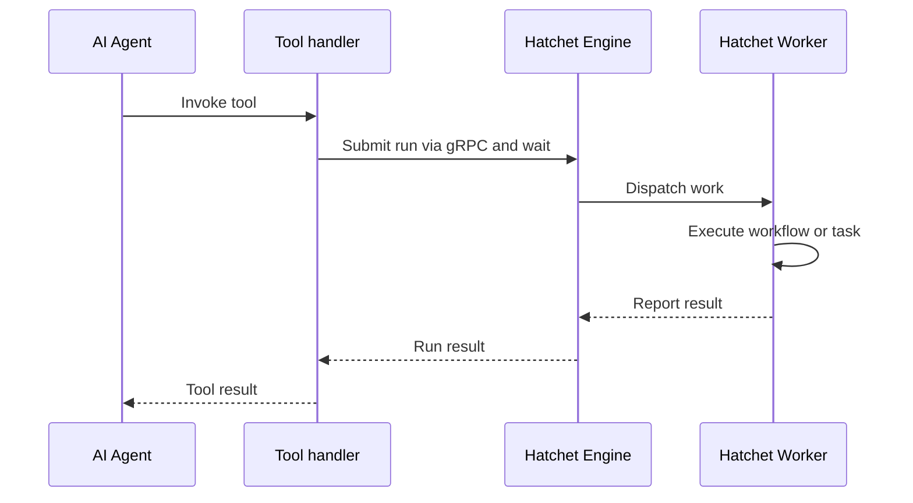

# Hatchet 与 MCP：将 Task 和 Workflow 暴露为 Agent 工具

[模型上下文协议（Model Context Protocol，MCP）](https://modelcontextprotocol.io/)是一个将 AI agent 连接到外部工具、数据源和服务的开放标准。本指南介绍如何将 Hatchet [workflow](<../v1/06. durable-execution（持久化执行）/06. directed-acyclic-graphs.md>) 和[独立 task](<../v1/02. core-concepts（核心概念）/01. tasks.md>) 暴露为工具，供 Claude Agent SDK 和 OpenAI Agents SDK 等框架调用。本系列后续的 cookbook 将展示如何将这些工具集成到完整的 agent 循环中。

在本指南中，我们定义一个 Hatchet workflow 和一个独立 task，各自带有描述和类型化输入 schema，然后将它们分别转换为 agent 工具。当 agent 调用其中一个工具时，工具处理器会向 Hatchet engine 提交一个 run。Worker 接取并执行该 workflow 或 task，并将结果报告给 Hatchet。工具处理器再将该结果返回给 agent。

## 本指南构建的内容

本指南构建一个由 Hatchet 支撑的温度查询工具。该 workflow 和独立 task 调用 [Open-Meteo API](https://open-meteo.com/) 并返回给定位置的当前温度。同一操作分别以 workflow 和独立 task 两种方式实现，以便你了解它们各自如何成为 agent 工具。



agent 进程包含提交 run 的工具处理器，但它不执行 workflow 或 task。相反，由 Hatchet worker 执行已注册的 workflow 或 task，并通过 Hatchet 将结果报告给等待中的工具处理器。由于每次工具调用都通过 Hatchet 提交 run，agent 触发的工作将获得与其他任何 Hatchet task 或 workflow 相同的可观测性和[核心可靠性保证](<../v1/11. evaluating-hatchet（评估）/01. architecture-and-guarantees.md#core-reliability-guarantees>)。

## 设置


### 准备环境

要运行此示例，你需要：

- 一个可用的本地 Hatchet 环境或 [Hatchet Cloud](https://cloud.hatchet.run) 的访问权限
- 一个 Hatchet SDK 示例环境（参见[快速开始](<../v1/01. get-started（入门）/02. quickstart.md>)）

为你计划使用的语言和 agent 框架安装可选依赖：

#### Python

为你的提供商安装 Hatchet SDK 的附加组件：

```bash
    pip install "hatchet-sdk[claude]"
```

或：

```bash
    pip install "hatchet-sdk[openai]"
```

#### Typescript

输入 schema 生成需要 Zod v4：

```bash
    npm install zod@^4.0.0
```

为你的提供商安装 agent SDK：

```bash
    npm install @anthropic-ai/claude-agent-sdk
```

或：

```bash
    npm install @openai/agents
```

### 定义模型

首先定义输入和输出类型。agent 使用输入 schema 来理解工具接受哪些参数。

#### Python

```python
class TemperatureCoords(BaseModel):
    latitude: float
    longitude: float


class TemperatureInput(BaseModel):
    location_name: str
    coords: TemperatureCoords


class TemperatureContent(BaseModel):
    text: str
```

#### Typescript

```typescript
// Agent tools require a Zod v4 inputValidator so the SDK can generate the tool input schema.
const TemperatureCoordinates = z.object({
  latitude: z.number(),
  longitude: z.number(),
});

const TemperatureInput = z.object({
  locationName: z.string(),
  coords: TemperatureCoordinates,
});

export type TemperatureInputWithZod = z.infer<typeof TemperatureInput>;
```

在 Python 中，Pydantic 模型或 dataclass 定义 schema。在 TypeScript 中，Zod v4 schema 承担同样的作用，并额外生成 agent 框架所需的 JSON Schema。

### 定义 workflow

Agent 工具需要描述和输入验证器。描述告诉 agent 何时使用该工具。输入验证器提供工具参数的 schema。为 workflow 定义这两者，使其可以被暴露为 agent 工具。

#### Python

```python
get_temperature_workflow = hatchet.workflow(
    name="get_temperature",
    input_validator=TemperatureInput,
    description="Get the current temperature at a location",
)


@get_temperature_workflow.task()
async def get_temperature(input: TemperatureInput, ctx: Context) -> TemperatureContent:
    async with httpx.AsyncClient() as client:
        response = await client.get(
            "https://api.open-meteo.com/v1/forecast",
            params={
                "latitude": input.coords.latitude,
                "longitude": input.coords.longitude,
                "current": "temperature_2m",
                "temperature_unit": "fahrenheit",
            },
        )
        data = response.json()

    return TemperatureContent(
        text=f"Temperature in {input.location_name}: {data['current']['temperature_2m']}°F"
    )
```

#### Typescript

```typescript
export const getTemperatureWorkflow = hatchet.workflow({
  name: 'getTemperatureWorkflow',
  inputValidator: TemperatureInput,
  description: 'Get the current temperature at a location',
});

getTemperatureWorkflow.task({
  name: 'getTemperature',
  fn: temperatureRequest,
});
```

### 或暴露独立 task

你可以用同样的方式暴露独立 task。当 agent 工具对应单个操作而非多步骤 workflow 时，这很有用。

#### Python

```python
@hatchet.task(
    input_validator=TemperatureInput,
    description="Get the current temperature at a location",
)
async def get_temperature_standalone(
    input: TemperatureInput, ctx: Context
) -> TemperatureContent:
    async with httpx.AsyncClient() as client:
        response = await client.get(
            "https://api.open-meteo.com/v1/forecast",
            params={
                "latitude": input.coords.latitude,
                "longitude": input.coords.longitude,
                "current": "temperature_2m",
                "temperature_unit": "fahrenheit",
            },
        )
        data = response.json()

    return TemperatureContent(
        text=f"Temperature in {input.location_name}: {data['current']['temperature_2m']}°F"
    )
```

#### Typescript

```typescript
export const getTemperature = hatchet.task({
  name: 'getTemperature',
  retries: 3,
  fn: temperatureRequest,
  inputValidator: TemperatureInput,
  description: 'Get the current temperature at a location',
});
```

### 创建 agent 工具

在运行 agent 的进程中创建工具。示例围绕 Hatchet 的 MCP 工具转换调用使用了辅助函数，以便导入 workflow 和 task 定义时不必加载每个可选的提供商 SDK。每个辅助函数返回一个提供商特定的工具定义，供 agent SDK 使用。你上面添加的描述和输入验证器会成为该工具定义的一部分，这就是它们是必需的原因。

#### Python

```python
def create_temperature_workflow_tool_claude() -> Any:
    return get_temperature_workflow.mcp_tool(MCPProvider.CLAUDE)


def create_temperature_workflow_tool_openai() -> Any:
    return get_temperature_workflow.mcp_tool(MCPProvider.OPENAI)


def create_temperature_task_tool_claude() -> Any:
    return get_temperature_standalone.mcp_tool(MCPProvider.CLAUDE)


def create_temperature_task_tool_openai() -> Any:
    return get_temperature_standalone.mcp_tool(MCPProvider.OPENAI)
```

#### Typescript

```typescript
export function createTemperatureWorkflowToolClaude() {
  return getTemperatureWorkflow.mcpTool('claude');
}

export function createTemperatureWorkflowToolOpenai() {
  return getTemperatureWorkflow.mcpTool('openai');
}

export function createTemperatureTaskToolClaude() {
  return getTemperature.mcpTool('claude');
}

export function createTemperatureTaskToolOpenai() {
  return getTemperature.mcpTool('openai');
}
```

> **Info:** Worker 并不发现 agent 工具。它正常注册 Hatchet workflow 和 task。
>   当工具处理器提交 run 时，Hatchet 会将其分发给注册了相应 workflow 或
>   task 的 worker。

### 注册并启动 worker

worker 必须处于运行状态工具才能工作。当 agent 调用工具时，工具处理器向 Hatchet engine 提交一个 run，engine 将其分发给某个 worker 执行。

#### Python

```python
from examples.agent.workflows import (
    hatchet,
    get_temperature_workflow,
    get_temperature_standalone,
)


def main() -> None:
    worker = hatchet.worker(
        "test-worker", workflows=[get_temperature_workflow, get_temperature_standalone]
    )
    worker.start()


if __name__ == "__main__":
    main()
```

#### Typescript

```typescript
import { hatchet } from '../hatchet-client';
import { getTemperature, getTemperatureWorkflow } from './workflow';

async function main() {
  const worker = await hatchet.worker('temperature-worker', {
    workflows: [getTemperature, getTemperatureWorkflow],
  });

  await worker.start();
}

if (require.main === module) {
  main();
}
```

### 测试

你可以确认 workflow 定义和辅助函数可以成功导入而无需提供商 SDK：

#### Python

```bash
    cd sdks/python
    poetry run python -c "from examples.agent.workflows import create_temperature_workflow_tool_claude, create_temperature_task_tool_claude; print('OK')"
```

#### Typescript

```bash
    cd sdks/typescript
    pnpm exec tsc --noEmit
```

要测试 agent 与 Hatchet 支撑的工具之间的完整往返，在一个终端启动 worker，在另一个终端运行特定提供商的 agent 示例。这需要你所运行的 agent 示例对应的提供商 SDK 和 API 密钥（`ANTHROPIC_API_KEY` 或 `OPENAI_API_KEY`）。

#### Python

启动 worker：

```bash
    cd sdks/python
    poetry run python -m examples.agent.worker
```

在第二个终端，运行 Claude 或 OpenAI agent 示例：

```bash
    cd sdks/python
    poetry run python -m examples.agent.agent_claude
    # or
    poetry run python -m examples.agent.agent_openai
```

#### Typescript

启动 worker：

```bash
    cd sdks/typescript
    pnpm exec tsx -r tsconfig-paths/register src/v1/examples/agent/worker.ts
```

在第二个终端，运行 Claude 或 OpenAI agent 示例：

```bash
    cd sdks/typescript
    pnpm exec tsx -r tsconfig-paths/register src/v1/examples/agent/agent-claude.ts
    # or
    pnpm exec tsx -r tsconfig-paths/register src/v1/examples/agent/agent-openai.ts
```

如果成功，agent 将调用该工具并将温度结果打印到终端。


## 相关 Hatchet 功能

由于每次 agent 工具调用都通过 Hatchet 提交 run，你可以应用与其他 task 和 workflow 相同的控制手段：

- **[持久化执行](<../v1/02. core-concepts（核心概念）/04. durable-execution.md>)：**Hatchet 持久地跟踪执行状态，使工作可以在 worker 重启和故障后存活。
- **[可配置重试](<../v1/04. reliability（可靠性）/01. retry-policies.md>)：**失败的 task 可根据你的 workflow 或 task 配置进行重试。
- **[速率限制](<../v1/05. flow-control（流控）/02. rate-limits.md>)和[并发控制](<../v1/05. flow-control（流控）/01. concurrency.md>)：**保护下游系统免受 agent 驱动的突发流量。
- **[可观测性](<../v1/08. observability（可观测性）/01. logging.md>)：**在 Hatchet 仪表盘中检查工具触发的 run，包含状态、时序、日志和 [OpenTelemetry trace](<../v1/08. observability（可观测性）/02. opentelemetry.md>)。

## 安全考量

MCP 是一个向 agent 暴露工具的协议。它不是安全边界。工具可能代表任意代码执行，应谨慎对待。不要仅依赖 agent 提示词来强制执行安全规则。

对于生产部署：

- 在 workflow 层面校验工具输入，然后再执行业务逻辑。
- 应用[速率限制](<../v1/05. flow-control（流控）/02. rate-limits.md>)和[并发控制](<../v1/05. flow-control（流控）/01. concurrency.md>)，防止失控的工具调用。
- 使用[附加元数据](<../v1/08. observability（可观测性）/05. additional-metadata.md>)追踪是哪个 agent 会话触发了每个 run。
- 以受限权限运行 worker。
- 使用网络策略限制 worker 可访问的范围。
- 当工具可能执行不受信任的代码时，使用外部沙箱提供商。

> **Info:** Hatchet 不提供原生代码沙箱。如果你需要在 agent 与执行环境之间进行
>   隔离，那属于基础设施层面的决策。
