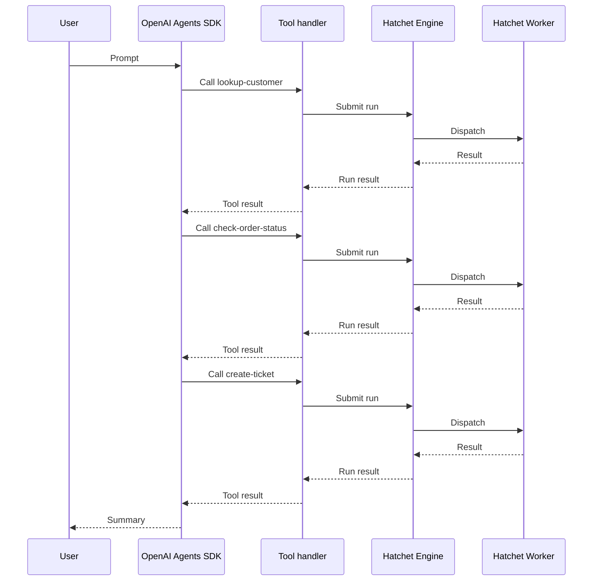

# Hatchet 与 MCP：在可信环境中使用 OpenAI Agents SDK

本 cookbook 基于 [Hatchet Agent Tools](<10. hatchet-and-mcp.md>) 指南，将 OpenAI Agents SDK 直接连接到由 Hatchet 支撑的支持工具。当 agent 决定使用某个工具时，工具处理器向 Hatchet engine 提交一个 run。Worker 执行 task，结果回流给 agent。

## 本示例构建的内容

该示例使用与[如何使用 Hatchet 创建支持 Agent](<04. workflow-support-agent.md>) 类似的支持场景，但架构不同。那个 cookbook 将支持流程建模为持久的 Hatchet workflow。本 cookbook 展示 agent 在多个由 Hatchet 支撑的独立工具之间进行选择：

- **lookup-customer**：按 ID 检索客户资料。
- **check-order-status**：查询订单的发货状态和已知问题。
- **create-ticket**：为客户创建支持工单。

> **Info:** 同样的 Hatchet 工具模式也适用于 workflow，如
>   [Hatchet Agent Tools](<10. hatchet-and-mcp.md>) 所示。当工具应触发多步骤流程
>   而非单个操作时，使用 workflow。本系列的后续指南将探讨更大的生产级 agent
>   模式。

## 架构



agent 可能根据模型的决策以不同顺序调用相互独立的工具。

与 Claude Agent SDK 示例不同，这里没有进程内 MCP 服务器。Hatchet 的 MCP 工具辅助函数将每个 task 转换为 OpenAI 兼容的工具，并直接传递给 OpenAI 的 `Agent`。

> **Info:** **可信环境模式。**本 cookbook 使用可信 harness 架构。agent 进程
>   运行在你自己的基础设施中，可直接访问 Hatchet 凭据。如果你需要在不受信任的
>   沙箱内运行 agent 轮次并将凭据保留在外部，那是另一种架构模式，将在后续
>   指南中介绍。

## 设置


### 准备环境

你需要：

- 一个可用的本地 Hatchet 环境或 [Hatchet Cloud](https://cloud.hatchet.run) 的访问权限
- 一个 Hatchet SDK 示例环境（参见[快速开始](<../v1/01. get-started（入门）/02. quickstart.md>)）
- 设置了有效 OpenAI API 密钥的 `OPENAI_API_KEY` 环境变量

为你的语言安装 OpenAI Agents SDK 集成：

#### Python

安装 Hatchet SDK 的 OpenAI 附加组件：

```bash
    pip install "hatchet-sdk[openai]"
```

#### Typescript

输入 schema 生成需要 Zod v4：

```bash
    npm install zod@^4.0.0
```

安装 OpenAI Agents SDK：

```bash
    npm install @openai/agents
```

### 定义模型

为每个工具定义输入和输出类型。agent 使用输入 schema 来理解工具接受哪些参数。

#### Python

```python
class CustomerLookupInput(BaseModel):
    customer_id: str


class CustomerInfo(BaseModel):
    customer_id: str
    name: str
    email: str
    plan: str
    account_status: str
    default_order_id: str
    support_tier: str


class OrderStatusInput(BaseModel):
    order_id: str


class OrderStatus(BaseModel):
    order_id: str
    status: str
    last_updated: str
    estimated_delivery: str
    known_issue: str | None
    carrier: str
    tracking_number: str


class CreateTicketInput(BaseModel):
    customer_id: str
    order_id: str
    subject: str
    body: str
    priority: str


class TicketResult(BaseModel):
    ticket_id: str
    status: str
    priority: str
    routing_team: str
    summary: str
```

#### Typescript

```typescript
const CustomerLookupInput = z.object({
  customerId: z.string(),
});

type CustomerLookupInputType = z.infer<typeof CustomerLookupInput>;

type CustomerInfo = {
  customerId: string;
  name: string;
  email: string;
  plan: string;
  accountStatus: string;
  defaultOrderId: string;
  supportTier: string;
};

const OrderStatusInput = z.object({
  orderId: z.string(),
});

type OrderStatusInputType = z.infer<typeof OrderStatusInput>;

type OrderStatus = {
  orderId: string;
  status: string;
  lastUpdated: string;
  estimatedDelivery: string;
  knownIssue: string | null;
  carrier: string;
  trackingNumber: string;
};

const CreateTicketInput = z.object({
  customerId: z.string(),
  orderId: z.string(),
  subject: z.string(),
  body: z.string(),
  priority: z.string(),
});

type CreateTicketInputType = z.infer<typeof CreateTicketInput>;

type TicketResult = {
  ticketId: string;
  status: string;
  priority: string;
  routingTeam: string;
  summary: string;
};
```

### 设置 Hatchet 客户端

初始化 Hatchet 客户端。它会从环境变量或 `.env` 文件中读取凭据。

#### Python

```python
from __future__ import annotations

from typing import TYPE_CHECKING

if TYPE_CHECKING:
    from agents import FunctionTool
    from claude_agent_sdk import SdkMcpTool

from pydantic import BaseModel

from hatchet_sdk import Context, Hatchet
from hatchet_sdk.runnables.workflow import MCPProvider

hatchet = Hatchet(debug=True)
```

#### Typescript

```typescript
import { z } from 'zod/v4';
import { hatchet } from '../hatchet-client';
```

### 添加确定性的支持数据

以下固定数据使示例无需任何第三方 API 即可运行。

#### Python

```python
CUSTOMERS = {
    "C-100": CustomerInfo(
        customer_id="C-100",
        name="Alice Martin",
        email="alice@example.com",
        plan="business",
        account_status="active",
        default_order_id="ORD-9987",
        support_tier="priority",
    ),
}

ORDERS = {
    "ORD-9987": OrderStatus(
        order_id="ORD-9987",
        status="delayed",
        last_updated="2026-05-20T14:30:00Z",
        estimated_delivery="2026-05-28",
        known_issue="Carrier reported weather delay at regional hub",
        carrier="FastShip",
        tracking_number="FS-482910",
    ),
}
```

#### Typescript

```typescript
const CUSTOMERS: Record<string, CustomerInfo> = {
  'C-100': {
    customerId: 'C-100',
    name: 'Alice Martin',
    email: 'alice@example.com',
    plan: 'business',
    accountStatus: 'active',
    defaultOrderId: 'ORD-9987',
    supportTier: 'priority',
  },
};

const ORDERS: Record<string, OrderStatus> = {
  'ORD-9987': {
    orderId: 'ORD-9987',
    status: 'delayed',
    lastUpdated: '2026-05-20T14:30:00Z',
    estimatedDelivery: '2026-05-28',
    knownIssue: 'Carrier reported weather delay at regional hub',
    carrier: 'FastShip',
    trackingNumber: 'FS-482910',
  },
};
```

### 定义由 Hatchet 支撑的工具

每个工具都是一个带有描述和输入验证器的独立 Hatchet task，如 [Hatchet Agent Tools](<10. hatchet-and-mcp.md#or-expose-a-standalone-task>) 指南所述。

#### 查询客户

首先，定义一个检索客户资料数据的工具。

#### Python

```python
@hatchet.task(
    name="lookup-customer",
    input_validator=CustomerLookupInput,
    description="Look up a customer by ID and return their profile, plan, and support tier.",
)
async def lookup_customer(input: CustomerLookupInput, ctx: Context) -> CustomerInfo:
    customer = CUSTOMERS.get(input.customer_id)
    if customer is None:
        return CustomerInfo(
            customer_id=input.customer_id,
            name="Unknown",
            email="unknown@example.com",
            plan="none",
            account_status="not_found",
            default_order_id="",
            support_tier="standard",
        )
    return customer
```

#### Typescript

```typescript
export const lookupCustomer = hatchet.task({
  name: 'lookup-customer',
  inputValidator: CustomerLookupInput,
  description: 'Look up a customer by ID and return their profile, plan, and support tier.',
  fn: async (input: CustomerLookupInputType): Promise => {
    const customer = CUSTOMERS[input.customerId];
    if (!customer) {
      return {
        customerId: input.customerId,
        name: 'Unknown',
        email: 'unknown@example.com',
        plan: 'none',
        accountStatus: 'not_found',
        defaultOrderId: '',
        supportTier: 'standard',
      };
    }
    return customer;
  },
});
```

#### 查询订单状态

接下来，定义另一个返回订单发货状态、承运商和已知问题的工具。

#### Python

```python
@hatchet.task(
    name="check-order-status",
    input_validator=OrderStatusInput,
    description="Check the current status, carrier, and any known issues for an order.",
)
async def check_order_status(input: OrderStatusInput, ctx: Context) -> OrderStatus:
    order = ORDERS.get(input.order_id)
    if order is None:
        return OrderStatus(
            order_id=input.order_id,
            status="not_found",
            last_updated="",
            estimated_delivery="",
            known_issue=None,
            carrier="unknown",
            tracking_number="",
        )
    return order
```

#### Typescript

```typescript
export const checkOrderStatus = hatchet.task({
  name: 'check-order-status',
  inputValidator: OrderStatusInput,
  description: 'Check the current status, carrier, and any known issues for an order.',
  fn: async (input: OrderStatusInputType): Promise => {
    const order = ORDERS[input.orderId];
    if (!order) {
      return {
        orderId: input.orderId,
        status: 'not_found',
        lastUpdated: '',
        estimatedDelivery: '',
        knownIssue: null,
        carrier: 'unknown',
        trackingNumber: '',
      };
    }
    return order;
  },
});
```

#### 创建工单

最后，定义一个创建支持工单的工具。创建记录前先校验输入，并考虑使用[附加元数据](<../v1/08. observability（可观测性）/05. additional-metadata.md>)附加上下文以提升可追溯性。

#### Python

```python
@hatchet.task(
    name="create-ticket",
    input_validator=CreateTicketInput,
    description="Create a support ticket for a customer issue and return the ticket ID and routing.",
)
async def create_ticket(input: CreateTicketInput, ctx: Context) -> TicketResult:
    ticket_id = f"TICKET-{input.customer_id}-001"
    return TicketResult(
        ticket_id=ticket_id,
        status="open",
        priority=input.priority,
        routing_team="shipping-support",
        summary=f"Ticket {ticket_id} created for {input.customer_id} "
        f"regarding order {input.order_id}: {input.subject}",
    )
```

#### Typescript

```typescript
export const createTicket = hatchet.task({
  name: 'create-ticket',
  inputValidator: CreateTicketInput,
  description: 'Create a support ticket for a customer issue and return the ticket ID and routing.',
  fn: async (input: CreateTicketInputType): Promise => {
    const ticketId = `TICKET-${input.customerId}-001`;
    return {
      ticketId,
      status: 'open',
      priority: input.priority,
      routingTeam: 'shipping-support',
      summary: `Ticket ${ticketId} created for ${input.customerId} regarding order ${input.orderId}: ${input.subject}`,
    };
  },
});
```

### 将 task 暴露为 OpenAI agent 工具

使用 Hatchet 的工具辅助函数将每个 task 转换为 OpenAI `FunctionTool`。尽管该辅助函数名称中带有 `mcp`，但本示例将 `FunctionTool` 对象直接传递给 OpenAI Agents SDK。本系列的后续指南将介绍如何将 OpenAI Agents SDK 与 MCP 服务器结合使用。

#### Python

```python
def create_lookup_customer_tool_openai() -> FunctionTool:
    return lookup_customer.mcp_tool(MCPProvider.OPENAI)


def create_check_order_status_tool_openai() -> FunctionTool:
    return check_order_status.mcp_tool(MCPProvider.OPENAI)


def create_ticket_tool_openai() -> FunctionTool:
    return create_ticket.mcp_tool(MCPProvider.OPENAI)
```

#### Typescript

```typescript
export function createLookupCustomerToolOpenai() {
  return lookupCustomer.mcpTool('openai');
}

export function createCheckOrderStatusToolOpenai() {
  return checkOrderStatus.mcpTool('openai');
}

export function createTicketToolOpenai() {
  return createTicket.mcpTool('openai');
}
```

> **Info:** Worker 并不发现 agent 工具。它正常注册 Hatchet task。当工具处理器
>   提交 run 时，Hatchet 会将其分发给注册了相应 task 的 worker。

### 注册并启动 worker

将 Hatchet task 注册到 worker。工具调用向 Hatchet engine 提交 run，engine 将其分发给正在运行的 worker。

#### Python

```python
from examples.support_agent_tools.tools import (
    hatchet,
    lookup_customer,
    check_order_status,
    create_ticket,
)


def main() -> None:
    worker = hatchet.worker(
        "support-tools-worker",
        workflows=[lookup_customer, check_order_status, create_ticket],
    )
    worker.start()


if __name__ == "__main__":
    main()
```

#### Typescript

```typescript
import { hatchet } from '../hatchet-client';
import { lookupCustomer, checkOrderStatus, createTicket } from './tools';

async function main() {
  const worker = await hatchet.worker('support-tools-worker', {
    workflows: [lookupCustomer, checkOrderStatus, createTicket],
  });

  await worker.start();
}

if (require.main === module) {
  main();
}
```

### 接入 OpenAI Agents SDK

现在我们已拥有创建支持 agent 所需的一切。通过 `tools` 数组将每个工具直接传递给 OpenAI 的 `Agent`。与[本 cookbook 的 Claude 版本](<11. hatchet-claude-agent-sdk-trusted-env.md#wire-the-claude-agent-sdk>)不同，本示例不创建进程内 MCP 服务器，也不声明预批准的 MCP 工具名列表。

该示例运行 agent 一次，等待工具调用完成，然后打印最终结果。

#### Python

```python
import asyncio

from agents import Agent, Runner
from examples.support_agent_tools.tools import (
    create_lookup_customer_tool_openai,
    create_check_order_status_tool_openai,
    create_ticket_tool_openai,
)


async def main() -> None:
    lookup_customer_tool = create_lookup_customer_tool_openai()
    check_order_status_tool = create_check_order_status_tool_openai()
    ticket_tool = create_ticket_tool_openai()

    agent = Agent(
        name="support-agent",
        tools=[lookup_customer_tool, check_order_status_tool, ticket_tool],
    )

    result = await Runner.run(
        agent,
        "Customer C-100 says order ORD-9987 has not arrived. "
        "Look up the customer, check the order status, and create a "
        "support ticket if the order has a known issue or delayed delivery. "
        'If you create a ticket, use priority "high", subject '
        '"Delayed order ORD-9987", and a body that summarizes the known '
        "carrier delay. Then summarize what happened.",
    )
    print(result.final_output)


if __name__ == "__main__":
    asyncio.run(main())
```

#### Typescript

```typescript
import {
  createLookupCustomerToolOpenai,
  createCheckOrderStatusToolOpenai,
  createTicketToolOpenai,
} from './tools';

async function main() {
  const lookupCustomerTool = createLookupCustomerToolOpenai();
  const checkOrderStatusTool = createCheckOrderStatusToolOpenai();
  const ticketTool = createTicketToolOpenai();

  // Dynamic import — @openai/agents crashes at load time with Zod v3, so we delay
  // the import until after mcpTool has already verified Zod v4 is available.
  const { Agent, run } = await import('@openai/agents');

  const agent = new Agent({
    name: 'support-agent',
    tools: [lookupCustomerTool, checkOrderStatusTool, ticketTool],
  });

  const result = await run(
    agent,
    'Customer C-100 says order ORD-9987 has not arrived. ' +
      'Look up the customer, check the order status, and create a ' +
      'support ticket if the order has a known issue or delayed delivery. ' +
      'If you create a ticket, use priority "high", subject ' +
      '"Delayed order ORD-9987", and a body that summarizes the known ' +
      'carrier delay. Then summarize what happened.'
  );
  console.log(result.finalOutput);
}

if (require.main === module) {
  main()
    .catch(console.error)
    .finally(() => {
      process.exit(0);
    });
}
```

### 测试

在一个终端启动 worker，在另一个终端运行 agent。agent 调用任何工具之前，worker 必须处于运行状态。

#### Python

启动 worker：

```bash
    cd sdks/python
    poetry run python -m examples.support_agent_tools.worker
```

在第二个终端，运行 agent：

```bash
    cd sdks/python
    poetry run python -m examples.support_agent_tools.agent_openai
```

#### Typescript

启动 worker：

```bash
    cd sdks/typescript
    pnpm exec tsx -r tsconfig-paths/register src/v1/examples/support_agent_tools/worker.ts
```

在第二个终端，运行 agent：

```bash
    cd sdks/typescript
    pnpm exec tsx -r tsconfig-paths/register src/v1/examples/support_agent_tools/agent-openai.ts
```

成功时，你应该能看到所有三个 agent 工具的调用。基于本示例使用的固定数据，agent 会查询客户 `C-100`，检查订单 `ORD-9987`，为延迟交付创建 `high` 优先级工单，并向终端打印最终摘要。

> **Info:** 每次工具调用都会作为 task run 出现在 Hatchet 仪表盘中，具有完整的
>   状态、时序和输入/输出可见性。


## 安全考量

agent 进程可直接访问 Hatchet 客户端凭据，并运行在你自己的基础设施中。传递给 agent 的每个工具都会增加模型可用的能力集。一旦某个工具对模型可用，就应假设模型可能会尝试调用它。不要仅依赖 agent 提示词来强制执行安全规则。

> **Info:** Hatchet 不提供原生代码沙箱。如果你需要在不受信任的沙箱内运行每个
>   agent 轮次，请采用结合外部沙箱提供商和凭据代理的不同架构。本系列的后续
>   指南将探讨沙箱化和自定义 harness 模式。

## 后续步骤

- [Hatchet Agent Tools](<10. hatchet-and-mcp.md>)：将 task 和 workflow 暴露为 MCP 工具的前置指南。
- [Claude Agent SDK](<11. hatchet-claude-agent-sdk-trusted-env.md>)：使用 Claude Agent SDK 的相同支持场景。
- [如何使用 Hatchet 创建支持 Agent](<04. workflow-support-agent.md>)：带有持久等待和升级的 workflow 优先支持 agent 模式。
- [Python SDK 参考](<../reference/15. client.md>)和 [TypeScript SDK 参考](<../reference/38. client.md>)：完整的 SDK 参考文档。
