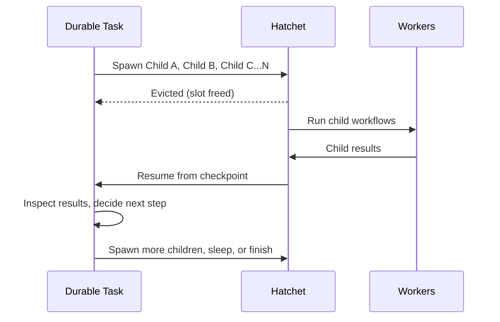

# 持久化 Task（Durable Tasks）

持久化 task 是 Hatchet 中持久化执行的基本构建单元。持久化 task 是由持久化执行原语组成、并遵循[持久化执行核心假设](<../02. core-concepts（核心概念）/04. durable-execution.md#core-assumptions>)的 task。在 Hatchet 中，持久化 task 执行两类持久化操作：它们**等待**（等待时间流逝或事件到达），以及**派生子 task**。每当其中之一发生时，Hatchet 都会向持久化事件日志写入一个检查点。在重试时，Hatchet 可以从该检查点重放，而不是重新运行已完成的应用逻辑，这为你的 task 提供了许多其他任务队列实现无法给出的精确一次（exactly-once）语义。

在以下情况请使用持久化 task：工作形态事先未知、task 的某些部分难以做到幂等，或者执行可能被中断并在稍后恢复。常见的例子有 agentic 循环（通常带有 human-in-the-loop 步骤）、在运行时选择子 workflow 的动态工作流，以及不应占用 worker slot 的长时间等待。它们也可以非常简单：sleep 后继续；或等待一个 event，然后退出。

> **Warning:** 持久化 task 必须只调用持久化 context 上的方法或派生子任务，并且
>   在给定事件历史的情况下必须是确定性的。例如，你_不_应该在持久化 task 内部
>   直接访问数据库或外部 API，也不应该生成随机数并将其用于控制流。请让你的
>   持久化 task 派生子任务来完成这类工作。

## 持久化 task 中的确定性

编写持久化 task 时需要牢记的重要一点：检查点之间的代码必须是确定性的。当 task 被驱逐并恢复时，Hatchet 会重放持久化事件日志来重建状态——它不会重新执行已完成的操作，但会重新运行通往每个检查点的代码路径。

这在实践中意味着几点：

- **基于检查点输出做决策**，而不是基于两次运行之间可能变化的外部状态（墙上时钟、数据库读取、随机值）。如果第一次运行时走了某个分支，重放时必须再次走这个分支。
- **不要在函数中途读取外部状态**并假定某个特定值在不同运行间保持不变。
- **把副作用推到子 task 中**。如果需要调用外部 API、数据库或其他服务，请在子 task 中完成，并等待其结果。

如果不确定某段代码是否安全，请问自己："如果这个 task 被中断并从上一个检查点重放，这段代码会产生相同的结果吗？"如果是，那就没问题。

## 何时使用持久化 task

| 场景 | 为什么用持久化？ |
| --- | --- |
| **Agentic 循环** | 循环派生子任务、收集结果并继续，且不丢失进展。 |
| **难以幂等的步骤** | 从检查点重放，而不是重新运行已完成的逻辑。 |
| **运行时选择的工作流** | 根据中间结果决定运行哪些子 task/workflow。 |
| **长时间等待 / human-in-the-loop** | 等待超时或审批而不占用 worker 资源。 |
| **从中断中恢复** | worker 重启或崩溃后从检查点恢复。 |

## 工作原理

每当持久化 task 结束一次等待（sleep、event 或子 run 完成）时，Hatchet 都会为进度建立检查点。task 等待期间，Hatchet 可以将其[驱逐](<05. task-eviction.md>)并释放 worker 的 slot。等待结束后，Hatchet 会重新将 task 入队，重放持久化事件日志，并从最新检查点恢复该持久化 task，就像它从未被驱逐过一样。

这与 DAG 不同：DAG 中的每个 task 和依赖都是在执行开始前声明好的。而使用持久化 task，你的代码可以在运行时决定派生多少个子任务、走哪个分支，以及继续还是停止。

## 持久化 context

当你把一个 task 声明为持久化时，它收到的是持久化 context 而不是普通 context。持久化 context 包含普通 context 中的一切，外加你用来构建持久化 task 的持久化执行工具集。这些方法允许你[等待 sleep 结束](<03. durable-sleep.md>)、[等待 event 到达](<04. durable-event-waits.md>)、[等待子任务完成](<02. child-spawning.md>)，或使用 [or group](<06. directed-acyclic-graphs.md#waiting-on-conditions-with-or-groups>) 以布尔"或"逻辑组合它们。
