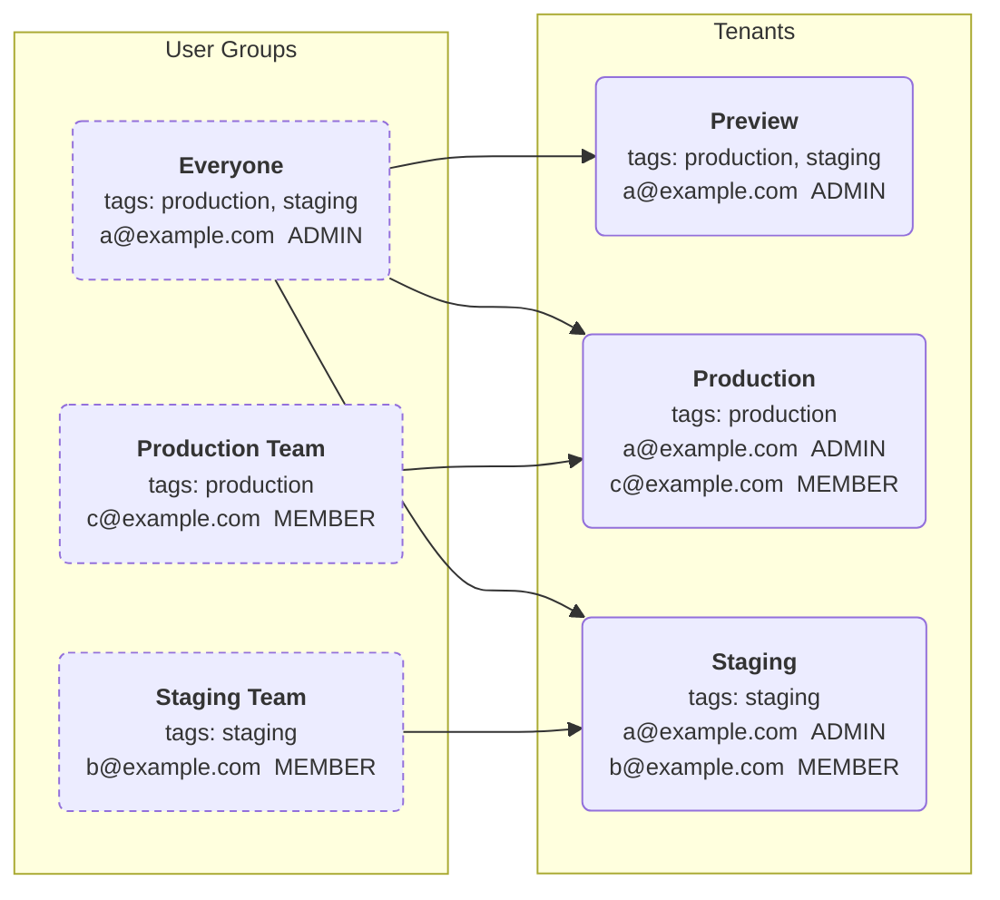

# 用户组（User Groups）

> **Info:** 用户组仅在我们的 Cloud Scale 计划中提供。详情请参阅
>   [定价](https://hatchet.run/pricing)。

用户组让为组织内的租户授予自动访问权限变得更加容易。

### 创建用户组

导航到 Settings > Team，然后点击 New Group 按钮。

<figure style={{ margin: "2rem auto", maxWidth: "100%", textAlign: "center" }}>
  
</figure>

在弹窗中，输入组名、通过该组同步的用户将拥有的[租户角色](<02. user-roles.md>)，以及用于确定用户组将同步到哪些租户的标签（tag）。组还可以限制其成员的[载荷可见性](<02. user-roles.md#payload-visibility>)；如果一个用户匹配多个组，则以限制最严格的组为准。

<figure style={{ margin: "2rem auto", maxWidth: "50%", textAlign: "center" }}>
  
</figure>

### 为租户添加标签

导航到 Settings 中的租户页面，从某个租户的下拉菜单中选择 "Edit tags"。

<figure style={{ margin: "2rem auto", maxWidth: "100%", textAlign: "center" }}>
  
</figure>

添加所需的标签。

<figure style={{ margin: "2rem auto", maxWidth: "50%", textAlign: "center" }}>
  
</figure>

创建新租户时也可以设置标签。

<figure style={{ margin: "2rem auto", maxWidth: "50%", textAlign: "center" }}>
  
</figure>

## 标签同步

用户组的工作方式是：自动将组内用户的访问权限授予那些标签是用户组标签*子集*的租户。下图展示了一个租户-用户组的示例配置。三个租户 —— "Preview"（标签为 `production` 和 `staging`）、"Production"（标签为 `production`）和 "Staging"（标签为 `staging`）—— 以及标签组合相同的三个用户组。每个租户都列出了根据哪些组的标签是其自身标签的超集而自动同步进来的用户：

## 组织所有者

组织所有者不受标签同步角色约束，他们会以 "OWNER" 角色被加入组织内的每个租户。
