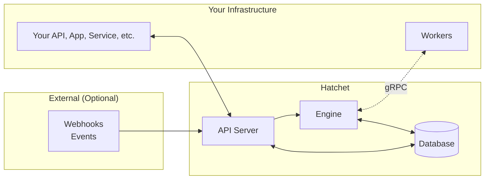

# 架构与保障

本页介绍 Hatchet 的整体结构、各主要组件的职责，以及你在设计 worker 时应当依据的可靠性保障。

## 架构概览

Hatchet 有三个主要组成部分：

- **API server**：HTTP 接口层，用于触发 workflow、查询状态以及支撑 UI
- **Engine（引擎）**：调度和分发工作、执行依赖关系与策略，并持久化记录状态转换
- **Worker**：你的进程，运行实际的 task 代码

状态会持久化存储（PostgreSQL 是唯一可信数据源）。在许多部署场景下这已经足够——无需单独的 broker——而自托管的高吞吐场景可以根据需要增加额外组件（例如 RabbitMQ）。

Hatchet Cloud 与自托管 Hatchet 共享同一套架构；区别仅在于由谁来运行和运维 Hatchet 服务。

## 核心组件

### API server

API server 是 Hatchet 的入口。你的应用和 Hatchet UI 通过它来：

- 携带输入数据触发 workflow
- 查询 workflow/task 状态（在支持的情况下，还可订阅状态更新）
- 管理 schedule 和设置等资源
- 接收 webhook/event（可选）

### Engine

Engine 负责把"某个 workflow 应该运行"转换为"这些 task 已就绪、应当被执行"。具体来说，它会：

- 求解 workflow 的依赖关系
- 执行并发限制、速率限制、优先级等策略
- 调度就绪的 task 并将其分发给已连接的 worker
- 持久化记录状态转换，并应用重试/超时行为
- 运行定时/cron workflow

Worker 通过双向 gRPC 连接到 Engine，从而实现低延迟分发和频繁的状态上报。

### Worker

Worker 是你自己的进程。它们连接到 Engine，接收 task，运行你的代码，并将进度/结果报告回 Hatchet。

Worker 在设计上非常灵活：你可以在本地、容器或 VM 中运行它们，并且可以独立于 Hatchet 服务对 worker 进行扩缩容。你还可以根据系统需要运行不同"类型"的 worker（甚至使用不同语言）。

### 存储（以及可选的消息组件）

PostgreSQL 是 workflow 定义和执行状态（排队中/运行中/已完成、输入/输出、重试等）的持久化存储。在自托管部署中，你可以先只用 PostgreSQL，在需要更高吞吐时再添加 RabbitMQ 等组件。

## 保障与权衡

Hatchet 的定位是折中：比简单队列更有结构，但又比完整的分布式 workflow 系统更易于运维。

### 适合的场景

- 带有依赖关系、重试和超时的**workflow 编排**
- 对"不丢失工作"有要求的**持久化后台任务**
- **中高吞吐**系统（并通过调优/分片获得向更高规模扩展的路径）。如果你要逼近极限，请[联系我们](mailto:support@hatchet.run)。
- **多语言 / polyglot worker**
- **已经在使用 PostgreSQL** 并希望运维简单化的团队
- **云上或隔离网络（air-gapped）环境**（[Hatchet Cloud](https://cloud.hatchet.run) 或[自托管](<../01. get-started（入门）/01. index.md>)）

### 不适合的场景

- 不做分片/定制调优的**超高吞吐**（例如持续 10,000+ task/秒）
- **亚毫秒级分发延迟**要求
- 不需要持久性的**纯内存队列**
- 以 **serverless-only 运行时**（如 AWS Lambda / Cloud Functions）作为主要 worker 模型

## 核心可靠性保障

### 至少一次（at-least-once）的 task 执行

Hatchet 是**至少一次**语义：task 不会被静默丢弃，失败后会按照你的配置重试。这也意味着**一个 task 可能运行多次**，因此你的 task 代码应当是**幂等的**（或以其他方式保证重试安全）。

### 持久化的状态转换

Workflow 状态持久化在 PostgreSQL 中，状态转换以事务方式执行。这有助于保持依赖求解的一致性，并使系统能够容忍重启和瞬时故障。

### 显式的执行策略

默认情况下，task 分配是 FIFO 的，你可以通过以下方式改变执行行为：

- [并发策略](<../05. flow-control（流控）/01. concurrency.md>)
- [速率限制](<../05. flow-control（流控）/02. rate-limits.md>)
- [优先级](<../05. flow-control（流控）/03. priority.md>)

### 无状态服务；可弹性恢复的 worker

Engine 和 API server 被设计为重启后不丢失状态，这也使得可以通过运行多个实例实现水平扩展。Worker 在网络中断后会自动重连，并且可以根据延迟目标运行在靠近你服务的位置（或靠近 Hatchet 的位置）。

## 性能预期

实际性能很大程度上取决于拓扑结构（worker 与 Engine 之间的网络延迟）、数据库规格以及工作负载形态。

- **分发延迟**：在使用 PostgreSQL 存储的情况下通常低于 50ms；在经过优化的"热 worker"部署中可接近 ~25ms P95。
- **吞吐量**：因部署而异。仅用 PostgreSQL 的部署通常每个 Engine 实例可处理数百 task/秒；更高的吞吐量通常需要额外调优和/或 RabbitMQ 等组件。经过调优和分片后，Hatchet 可以扩展到每秒数万 task 的量级——如果你想按此设计，请[联系我们](mailto:support@hatchet.run)。
- **常见瓶颈**：数据库连接数上限、大 payload（如 > 1MB）、复杂的依赖图以及跨区域延迟。

> **Warning:** **没有达到预期性能？**
>
> 如果实际性能不符合预期，请[联系我们](https://cal.com/team/hatchet/talk-to-us)或[加入社区](https://hatchet.run/discord)探讨调优方案。

## 后续步骤

- **[快速开始](<../01. get-started（入门）/02. quickstart.md>)**：搭建你的第一个 Hatchet worker
- **[自托管](<../01. get-started（入门）/01. index.md>)**：在你自己的基础设施上部署 Hatchet
