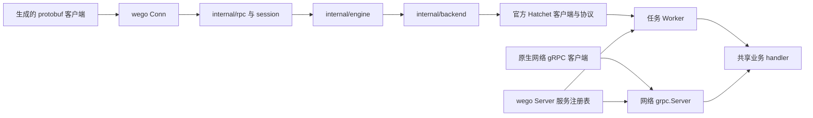
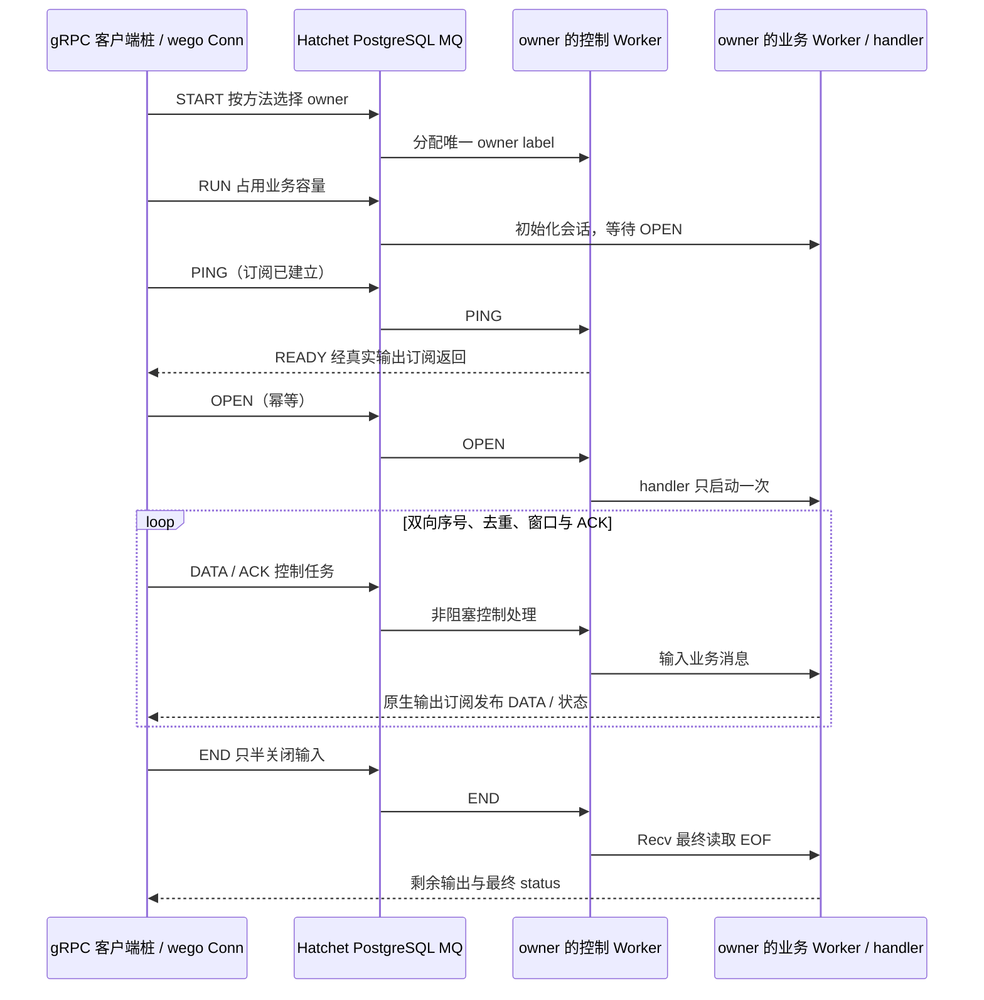

# wego SDK 背景、实现现状与独立评审上下文

本文供 Claude 或其他评审者理解项目并开展代码评审，记录截至 **2026-10-07** 的实现与证据。当前 SDK 为 0.1.11；前次 Claude 评审处理见 [0.1.9 修复记录](claude-review-fixes.md)，深度质量评审处理见 [0.1.10 完成报告](deep-quality-fixes.md)，当前简洁性与官方镜像升级结果见 [0.1.11 完成报告](conciseness-fixes.md)。请以实际源码、测试行为及带版本的运行报告为依据，独立判断正确性、功能完整性、边界处理和维护成本。本文描述设计意图与已有验证，不代表实现已经没有缺陷。

## 1. 项目背景与目标

wego 是面向 Go 业务的任务执行 SDK，在 Hatchet 引擎之上复用标准 protobuf 消息、gRPC 服务定义、生成的客户端桩和服务端 handler。业务开发者可以按 gRPC 的方式编写服务，同时获得任务调度、重试、并发、事件触发、durable 等能力。

最常用的 unary RPC 映射为 Hatchet StandaloneTask。client stream、server stream、bidi stream 则需要会话协议，将多次任务交互组织成标准 gRPC 流语义。开发者不需要在业务中操作 Hatchet SDK 类型，也不需要另写一套任务 handler。

同一个 Server 还可以提供原生网络 gRPC 入口：网络调用直接执行注册的 handler；Worker 入口将请求提交给任务引擎后执行。二者共享业务实现，但任务身份、排队、重试和 durable 能力只属于 Worker 入口。

当前阶段的功能基线来自官方 Go SDK 示例中的 **28 个源文件、74 个 standalone 构造片段**，包括辅助函数中的演示。还增加三种流、双入口、载荷变换、关闭及故障场景。这个基线是明确选择的验收范围，不等同于覆盖 Hatchet 的全部 API 或全部工作流能力。

## 2. 必须遵守的边界

1. **禁止修改 Hatchet 上游源码。** 修复和新增功能限定在 `sdks/wego/**`，不能依靠修改 `sdks/go`、`pkg/client`、`pkg/worker`、引擎、根依赖或仓库 CI 来完成适配。
2. **业务 API 不暴露 Hatchet 类型。** 公开签名、字段、别名、嵌入、方法集、泛型约束、回调值、动态结果和错误链都属于检查范围；gRPC、protobuf、OTel 类型可以使用。
3. **只有 `internal/backend` 可以导入 Hatchet 实现。** 其他实现包通过 wego 自有端口和 DTO 调用后端；examples 不直接导入 Hatchet。
4. **业务 protobuf 使用二进制编码。** Hatchet 仍接收 JSON/string，wego 因而使用版本化 JSON envelope 和 base64；没有改变引擎的存储或传输格式。
5. **调度信息显式投影。** 只将应用配置的 protobuf 字段暴露给 CEL，投影在压缩、加密或对象存储卸载之前生成。
6. **MQ 使用 PostgreSQL。** 本机与验收不依赖 RabbitMQ；官方引擎依赖中存在间接库依赖，不应据此理解为部署了 RabbitMQ。
7. **资源按实例拥有。** 借用的子调用连接不能关闭共享资源；trace provider 不覆盖 OTel 全局 provider；SDK 不接管进程信号。
8. **中文注释必须帮助理解当前规则。** 包含私有声明和测试，但不能用注释数量代替对并发、协议和失败路径的解释。

仓库约束见 [AGENTS.md](../../../AGENTS.md)。所有 CI 中启动 Hatchet 服务的位置需显式设置 `SERVER_SECURITY_CHECK_ENABLED=false`；SDK 变更需更新版本与 changelog。

## 3. 当前版本与运行基线

| 项目 | 当前情况 |
| --- | --- |
| SDK 模块 | `github.com/hatchet-dev/hatchet/sdks/wego`，独立 `go.mod` |
| 当前 SDK 版本 | `0.1.11`；包含简洁性处理、nil protobuf 回归与官方最新镜像验收 |
| 最新完整真实引擎报告 | SDK `0.1.11`，完成于 `2026-10-07T15:49:59.866491+00:00`，15 门禁全部通过 |
| wire 协议 | `3`；客户端与 Worker 必须使用兼容协议 |
| Go | `1.26.7` |
| 官方 Hatchet 发行依赖 | `v0.109.0`，发行依赖门禁使用 `GOWORK=off` |
| embedded 依赖 | `github.com/hatchet-dev/hatchet-embedded v0.105.0`，由 `wego_embedded` tag 启用 |
| gRPC / protobuf 依赖 | `v1.84.0` / `v1.36.12` |
| 生成工具 | protoc `29.6`、protoc-gen-go `v1.36.12`、protoc-gen-go-grpc `v1.5.1` |
| 本机 Hatchet | `v0.110.5`，API `http://localhost:8080`，gRPC `localhost:7077`，明文，PostgreSQL MQ |
| 本机观测 | trace 开启；观测验收使用 Jaeger OTLP `localhost:4317`、查询 API `localhost:16686` |
| CI 状态 | SDK 内提供模板，Compose 在本机验证；未安装仓库 workflow，未运行托管 CI |

依赖版本与运行服务版本不同。已验证的组合是上表中的组合，不能直接推导其他版本全部兼容。SDK 自有 [go.work](../go.work) 用于仓库内测试；[发行依赖检查](../scripts/check-released.py) 另行检验不使用本地替换的构建。

历史 0.1.7 最终源码补充验证记录包含 **202 个 Go 文件**及摘要 `e68218993402394310022b7f154a7598df8517dfa21dc8283a536c2a9b0718b7`。这是当时源码快照的证据；本次版本常量变化后不能将它作为当前文件内容的摘要。历史报告的版本、时间和结果保持原值。

## 4. 使用模型与实际公开 API

### 4.1 注册一次，选择执行入口

```go
// 默认启动 Worker；WithGRPC 额外启用网络入口。
srv := wego.NewServer(
    server.WithRuntime(cfg...), // cfg 是客户端与 Worker 共享的 runtime.Option 配置。
    server.WithGRPC(":9000"),
)
pb.RegisterGreeterServer(srv, &greeter{})
if err := srv.Serve(); err != nil {
    log.Fatal(err)
}
```

示例采用 [demo.proto](../examples/proto/demo.proto) 的生成桩；省略 imports、handler 实现和应用自己的信号处理。`Serve` 阻塞，应用通过 `Stop` 或 `GracefulStop` 协调关闭。

纯网络模式：

```go
srv := wego.NewServer(
    server.WithGRPC(":9000", grpc.ChainUnaryInterceptor(interceptor)),
    server.WithRuntime(runtime.WithDisableWorker()),
)
pb.RegisterGreeterServer(srv, &greeter{})
```

纯网络模式不要求 token，不初始化任务后端、嵌入引擎或 Worker telemetry。原生 `grpc.ServerOption` 仅作用于网络入口；Worker 执行策略使用 `server.WithWorker(...)`。

Server 方法集为：

```go
func NewServer(opts ...ServerOption) *Server
func (s *Server) RegisterService(desc *grpc.ServiceDesc, impl any)
func (s *Server) GetServiceInfo() map[string]grpc.ServiceInfo
func (s *Server) Serve() error
func (s *Server) Stop()
func (s *Server) GracefulStop()
```

`NewServer` 采用单返回值，注册及启动错误通过 `Serve` 返回。`Server` 实现 `grpc.ServiceRegistrar`，但不承诺等同 `*grpc.Server` 的全部方法集。当前没有公开 `ServeContext`、`WaitReady`、`Shutdown`、`ServeHTTP` 或外部 listener 入口，也没有网络请求转任务的代理模式。

### 4.2 标准桩与任务能力共用 Conn

```go
conn, err := wego.NewConn(client.WithRuntime(cfg...))
if err != nil {
    return err
}
defer conn.Close()

rpc := pb.NewGreeterClient(conn)
reply, err := rpc.SayHello(ctx, request)
```

`Conn` 实现 `grpc.ClientConnInterface`。应传入 `pb.NewXXXClient(conn)`，而不是传入 `grpc.NewClient(conn)`；原生 `grpc.NewClient` 接收网络目标地址。相同生成桩接收原生 gRPC Conn 时走网络，接收 wego Conn 时走任务引擎。

Conn 同时提供 `Run`、`RunNoWait`、`RunMany`、任务句柄和结果读取，以及 `Crons()`、`Schedules()`、`Events()`、`Filters()`、`Runs()`、`Workers()`、`Workflows()`、`Logs()`、`Webhooks()`、`Metrics()`、`RateLimits()`、`CEL()`、`Tenant()` 管理入口。具体参数和支持操作以公开方法及 DTO 为准，不能按官方客户端名称推断逐方法等价。

`runtime.WithDisableWorker()` 不禁止 Conn 发起任务；直接创建原生 Worker 时，与禁用标记冲突会报错。原生 Worker 保留 `Start()`、`StartBlocking(ctx)`、`WaitReady(ctx)`、`Shutdown(ctx)`。这些生命周期方法不属于 Server。

### 4.3 标准 handler 内的任务能力

handler 使用 `context.Context` 和 protobuf。Worker 入口可以通过 `task` 包读取任务身份、durable 等待、scope 和借用的子调用客户端；网络入口没有这些能力，相关操作需明确返回错误，不能伪造任务上下文。

普通与 durable RPC 通过 Worker 配置绑定。batch、Webhook、原生 JSON task/workflow/DAG、引擎原生输出订阅仍保留 wego 原生入口，不强行套入 unary 或 gRPC 流。完整可运行代码在 [examples](../examples)；简短使用说明在 [worker.md](design/worker.md)。

## 5. 功能覆盖与完成情况

下表的“通过”指 0.1.11 报告中的相关场景已执行并有断言。它不表示所有输入空间、外部系统或生产负载都经过验证。

| 功能组 | 当前实现与验收覆盖 | 状态 / 证据 |
| --- | --- | --- |
| Unary | protobuf 请求响应、标准桩、同步/异步/批量、子调用、metadata、headers/trailers、status details、deadline/cancel | simple、stubs、SDK migration、child 场景通过 |
| 执行策略 | 重试和退避、并发策略与分组、动态限制、静态/动态限流、slot cost、required affinity、sticky、幂等 | 对应官方片段通过；包含辅助函数中的场景 |
| 触发与管理 | Cron/Schedule、事件过滤及 filter payload、Webhook fixture、日志、运行及其他管理门面 | Cron 真实触发、事件及受控 HTTP 场景通过；并非全量官方管理 API 验收 |
| Durable | Sleep、WaitForEvent、Now、scope、lookback、子身份复用、驱逐及禁止驱逐 | 等待、驱逐、Worker 重启、并发子结果及真实未完成 memo 两次恢复通过 |
| Batch | simple、keyed、broadcast 三种定义；大小/时间触发、分组、逐成员映射、广播 | 三种定义与关闭预算场景通过 |
| gRPC 三种流 | 多消息、零消息、半关闭、同时收发、提前返回、业务错误、metadata/status、取消 | grpc-streams、dual-entry 和故障矩阵通过 |
| 网络 gRPC | 纯网络 unary/三种流、TLS、interceptor、消息限制、服务信息、双入口共享 handler | 网络与双入口测试通过；网络调用不产生任务记录 |
| 生命周期 | 失败启动、重复/并发停止、停止先于启动、强制中断排空、两种 drain 策略 | 单元、race 和真实 shutdown 场景通过 |
| 观测与日志 | 实例 trace、多 exporter、上下文传播、日志确认、panic；Metrics 默认关闭 | Jaeger、日志、panic 及全局 provider 保持原值的断言通过 |
| 载荷中间件 | 压缩、加密、对象存储卸载、反向还原；routing 可读、控制帧独立 | 受控 fixture 往返及故障验证通过，不涵盖所有外部存储实现 |
| Embedded | tag 隔离、独立模块/进程、独立 PostgreSQL 库、迁移、调用和关闭 | 本机独立 embedded 验收通过；测试数据库已删除 |

精确片段清单及断言关联在 [acceptance.json](../examples/acceptance.json)，实际执行记录在 [acceptance-report.json](design/acceptance-report.json)。官方源文件定位在 [sdks/go/examples](../../go/examples)。源码同步后应重新生成和核对清单，不能只保持“28”这个数字。

## 6. 模块结构及依赖边界



| 包 / 目录 | 主要职责与边界 |
| --- | --- |
| 根 `wego` | 对业务提供构造函数和 wego 自有别名 |
| `client` / `internal/client` | Conn、原生定义、Run/Result/Worker；公开门面与实例装配分离 |
| `features` / `internal/features` | 管理门面、生命周期与 namespace 适配；后端对象不向业务开放 |
| `server` | 共享注册表、网络入口、Worker 初始化、统一启动和停止 |
| `runtime` / `internal/spec` | 实例选项、默认值、校验、深复制；连接、容量、投影、载荷、观测和关闭 |
| `worker` / `option` | 方法绑定与执行策略；不能替代 Runtime 的入口开关或资源所有权 |
| `model` / `task` | 自有 DTO、枚举、错误；context 中的任务能力和 durable/child 接口 |
| `middleware` / `log` / `telemetry` | 业务变换/拦截、日志入口、实例观测配置 |
| `internal/ports` | 后端无关的能力契约和封闭类型化管理请求 |
| `internal/binding` / `internal/callctx` | 服务描述到任务的绑定、稳定命名、执行能力和子身份 |
| `internal/wire` / `internal/rpc` | envelope、帧、投影、metadata/status；标准 gRPC 调用适配 |
| `internal/session` | owner、握手、序号、ACK、背压、半关闭、终态和清理 |
| `internal/engine` / `internal/telemetry` | SDK 自有资源、在途调用/I/O、排空、provider/exporter 生命周期 |
| `internal/backend` | 唯一 Hatchet 适配层：注册、提交、执行、durable、batch、结果、管理及 embedded |
| `examples` / `tests` / `scripts` | 独立示例、单元/质量/E2E、生成、清单与验收运行器 |
| `deployment` / `docs` | 本机部署配置、使用与设计资料、验收记录 |

评审需判断拆分是否降低复杂度：尤其检查公开门面与内部实现层是否有必要、配置与能力是否重复表达、端口是否过度抽象、单个包是否仍承担过多职责。目录数量和文件长度本身不足以证明过度拆分，也不足以证明设计合理。

### 官方 v0 客户端为何仍存在

[backend.go](../internal/backend/backend.go) 的私有 `raw v0.Client` 中，`v0` 是官方 `pkg/client` 的导入别名。官方 Worker 的依赖接口仍要求该客户端；wego 没有向业务提供 v0 客户端，也没有因此让业务使用废弃的工作流定义 API。

当前适配使用未经修改的官方 Worker、durable listener 和协议客户端。部分协议类型来自官方模块的 `internal/services/...`，这是实际源码依赖，不应理解为仅依赖稳定公开高层 API。虽然发行依赖构建已通过，模块路径约束、协议变动和升级成本仍值得检查。

官方当前没有满足本实现需求的共享连接注入入口，backend 因而拥有两条 gRPC 连接：官方执行客户端连接，以及可精确控制 context 预算的协议连接。管理入口复用实例后端，关闭时释放两条连接。评审应检查这项成本及失败清理，而不能通过修改官方源码“消除”它。

`ports.FeatureRequest` 使用封闭、自有类型和命名字段；私有字符串/位置参数适配只在 backend 内。公开管理 Resource/Query 仍保留动态 JSON 扩展，不代表每个管理 schema 都已强类型化。

## 7. 关键协议、并发和资源规则

### 7.1 Protobuf 与显式投影

unary 的 envelope 包含协议版本、protobuf 业务字节、类型、routing、metadata、trace 和 deadline。`encoding/json` 将业务字节编为 base64；二进制 metadata 的编码也需保留任意字节和多值。

例如配置：

```go
runtime.WithInputProjection("/wego.example.v1.Greeter/SayHello", map[string]string{
    "group": "group_key",
})
```

方法名对应 demo.proto 的 Greeter，实际配置可引用生成桩的 fullMethod 常量。当请求中 `group_key="group-a"` 时，调度器读取 `input.routing.group == "group-a"`；其他业务字段不会自动投影。客户端和 Worker 必须共用投影与载荷配置。远期 Cron/Schedule/Event 使用 `model.RPCInput`，不应继承发布请求的临时 deadline。

原生 JSON 字符串 `"7"`、`"null"` 保持字符串类型；需要原始 JSON 时显式使用 `json.RawMessage`。选择任务输出时，键存在且值为 JSON null 与键缺失必须区分。`Result.IntoContext` 支持调用方解码预算及实例 I/O 跟踪；`Into` 使用实例关闭预算，默认 30 秒。

### 7.2 流会话



START 按完整方法名选择支持该方法的 owner；随后会话任务和控制任务通过该实例的唯一标签路由，亲和性 `Required=true`。业务会话占业务槽；控制 Worker 有独立容量，默认 4 slots。控制处理不能等待业务消费者，ACK 与终态不能被业务消息缓冲阻塞。

默认每方向窗口 64 条、每方向缓冲预算 4 MiB、单条业务消息上限 1 MiB、握手预算 10 秒、初始化 TTL 30 秒；CANCEL 独立预算默认 5 秒且不超过实例清理预算。两个方向各自维护序号、去重和 ACK。END 只关闭输入方向；客户端必须收齐输出并确认最终成功状态才能返回 EOF。零字节 protobuf 响应与“未发送响应”通过协议 3 的存在性字段区分。

同一会话最多一个在途 PING，重发以 250ms～1s 退避；匹配 READY 后回收 PING 等待再提交 OPEN。会话不自动重试、不 durable 重放，也不自动迁移到另一个 owner。断流、Worker 丢失、输出缺口需明确失败。RUN 提交也受握手预算约束。清理必须等待 SDK 拥有的订阅和结果等待 goroutine 退出后再注销会话。

### 7.3 Durable

backend 私有保留官方执行上下文；根入口在业务启动前绑定一次派生预算，子调用使用独立能力视图，保留父子身份、durable listener、scope 与稳定 child key。不能重建 durable 上下文来获得子预算，不能并发改写根上下文。

官方 ACK 以任务与 invocation 为槽位。Sleep、事件等待、memo 和子提交的登记/确认通过同一协调门串行化；长期等待不能占住该门。发送后取消的请求需隔离并排空迟到 ACK；根退出终止等待并禁止新登记，官方 Stop/CleanupTaskState 也会交付错误确认。

同一 branch/node 的子结果共享一个根监听，观察者独立取消，完成结果可反复读取并交付字节副本。没有观察者时仍需保留尚未完成的唯一监听，避免丢失一次性结果。驱逐计数、候选和取消函数绑定具体 invocation，旧执行迟到退出不能修改恢复执行。

Now 在同一 invocation 内缓存已确认时间，恢复时使用已记录结果；已存在但尚无完成载荷的 memo 需补算并提交完成通知。批量提交必须保留各块已接受的 RunID、InputIndex 和冲突详情，后续块失败不能把部分成功抹掉。

### 7.4 启停与资源所有权

启动前验证注册和配置，先绑定网络端口再启动 Worker，任一入口失败需回收已取得资源。重复服务、错误 handler、启动后注册和全部入口关闭均应有明确失败行为；`GetServiceInfo` 返回独立副本。

`GracefulStop` 停止新网络 RPC、新 Worker 分配和新会话，保留已有流的控制通道；排空后确认结果/日志、flush telemetry、关闭资源。`Stop` 能中断正在排空的过程，立即取消传输和执行，再用配置的清理预算处理 SDK 自有资源。SDK 无法强制终止不响应 context 的任意业务 goroutine。

启动和停止并发、启动前停止、重复停止需安全，资源只释放一次，停止后不能重启。正常停止使 `Serve` 返回 nil，故障保留真实错误。Conn、Worker、流、I/O 和 telemetry 的预算与关闭责任需要分别核对，不能只凭一个 `sync.Once` 判断生命周期正确。

Runtime 的 map、嵌套投影、选项切片、TLS 和 embedded 配置需隔离可变容器；能力对象仍由原所有者管理。原生 `client.WithWorkerRuntime` 仅允许覆盖 Slots/DurableSlots、labels、Logger/LogReport；不能替换连接、namespace、投影、载荷、观测或关闭策略。

## 8. 验收证据及其边界

0.1.11 报告记录 **28 个源文件 / 74 个片段、30 个示例场景 / 252 条必需断言**，并包含新增真实 pending memo 两次恢复与四会话并发样本。0.1.7 的原始证据另存为 [历史报告](design/acceptance-report-0.1.7.json)。清单将官方片段映射到具体场景和断言，不能用“注册成功”或场景名字存在代替业务执行。必需场景缺失、Skip、失败或断言错配会拒绝通过。

15 项门禁的名称和状态：

| 分类 | 已记录通过的门禁 |
| --- | --- |
| 依赖与边界 | source-boundary、published-dependency |
| 常规检查 | format、unit、vet、race |
| 官方回归与独立模块 | upstream、upstream-embedded、embedded-module |
| 工具与配置 | generation、fuzz、compose-config |
| 真实引擎 | engine、engine-race、embedded-engine |

真实引擎 race 是报告所列选择性场景集合，并非全部 E2E 都带 race。fuzz 门禁是协议解码的 10 秒运行，不是长期模糊测试结论。声明/API 隔离门禁也不能证明所有动态路径都安全，需人工复核实现。源码边界脚本检查相对当前 Git 基线的 SDK 外变更，并不独立证明整个仓库历史与某个官方 tag 完全相同。

**历史 0.1.7 最终源码与完整套件的时间差：** F12 的未完成 memo 修复在完整 engine 套件运行期间补入，该套件此前已构建测试二进制。后续 engine-race / embedded 使用更新源码；最终源码又通过 format、unit、vet、race、发行依赖、源码边界及真实 durable 等待/驱逐/重启定向复验。不能将完整套件的全部结果自动作为 F12 分支的执行证据。

`TestNowCompletesPendingMemo` 使用受控协议对端与真实官方 listener 验证 memo 引用、CompleteMemo 载荷、返回时间和单次 invocation 缓存。它自身不证明数据库中的 pending 恢复。0.1.9 已增加 `TestDurablePendingMemoRecovery`，真实丢弃首个 CompleteMemo 后重启补算、再重启验证持久复用，具体证据见修复记录和当前报告。

报告含命令、断言、RunID、必要 WorkerID/traceID、清理结果，不含凭证。测试工作流和触发资源、embedded 测试数据库已删除；运行历史和引擎 Worker 记录保留，包括故意模拟 owner 退出的记录。原始 `.test-results` 为本机忽略文件，其他评审环境未必具备这些日志，不能把它们当作必然随源码交付的证据。

## 9. 已修复问题与再次评审重点

历史记录包括 0.1.5、0.1.6 修复；当前实现主要在 0.1.7 完成并发、结果与关闭边界复审修复。下列条目的 FIXED/PASSED 来自 [本轮修复记录](design/review-fixes-0.1.7.json)，仍需独立审查。

| 编号 | 问题与当前规则 | 重点检查位置 |
| --- | --- | --- |
| F01 | durable 等待/memo/子提交覆盖 ACK；登记至确认串行化，迟到 ACK 隔离 | `backend/durable.go` 及并发、取消测试 |
| F02 | durable 后续块失败丢失已接受身份；保留 RunID/InputIndex 与部分成功错误 | `backend/durable_submit.go` |
| F03 | 普通批量只保留首块冲突；合并各块成功、冲突和其他错误 | `backend/run.go`，1002 条跨块 fixture |
| F04 | 旧 invocation 退出影响新 invocation；计数与取消绑定具体执行记录 | `backend/native_worker.go` |
| F05 | RUN 提交未受握手预算约束；整体握手可取消 | `session/client.go` |
| F06 | 流清理过早结束；等待订阅和结果 goroutine 退出 | `session/client.go` 与 engine 清理 |
| F07 | 原生 JSON 字符串被猜测为原始 JSON；保持输入类型 | `rpc/unary.go` |
| F08 | 合法 null 被当成缺失输出；区分键存在性 | `client/run.go` |
| F09 | Worker 局部配置污染 Conn；深复制容器并限定可覆盖字段 | `spec/runtime.go`、`client/worker.go` |
| F10 | 结果载荷下载无预算/登记；IntoContext 纳入实例 I/O 生命周期 | `client` Result、`engine` 关闭 |
| F11 | 多观察者覆盖 durable 子结果监听；共享根监听、独立取消、结果副本 | `backend/durable.go` 与 shared-result 测试 |
| F12 | 未完成 memo 的空载荷解码失败；补算并 CompleteMemo | `backend/execution.go`、`backend/memo_test.go` |

测试名称及实现定位详见 [module.md 的 0.1.7 条目](design/module.md)。还应核对 trace 协议属性、管理错误转换、配置能力对象所有权和 API 隔离。历史 [review-fixes.md](design/review-fixes.md) 与 [rereview-fixes.md](design/rereview-fixes.md) 用于理解已报告问题，不能把旧版本的状态直接当作当前结论。

## 10. 未充分证明或仍有成本的部分

### 10.1 历史 0.1.7 的两次流握手超时观察

两次完整复验尝试出现过握手超时，最终重新执行的完整套件通过。过程没有从记录中删除：

- 延迟订阅故障场景耗尽 8 秒测试握手预算，相同配置随后连续 3 次通过，约 4.7～5.9 秒。故障测试改为 20 秒握手预算、30 秒初始化 TTL；保留 800 毫秒延迟注入和 75 秒场景预算。SDK 默认握手预算仍为 10 秒，受控 RUN 黑洞单元测试仍验证预算取消。
- middleware 最后一条用于取消的 bidi 流耗尽已设置的 30 秒握手预算。相同配置随后连续 3 次完整场景通过，约 42～55 秒；这些是整个场景耗时，不是握手耗时。此次没有增加预算，目前未确定根因。

这两项观察不能单凭定向复跑通过归因于环境，也不能直接认定为已经修复的 SDK bug。应重点检查初始化 TTL、owner 选择、业务容量归还、控制吞吐、订阅时序、后台任务和真实 engine 排队。

### 10.2 Worker 流的调度成本

`TestReviewStreamingCost` 的样本为本机 PostgreSQL MQ、启用 race、并发 1、8 条 256 字节串行 bidi 消息：

| 指标 | 样本结果 |
| --- | --- |
| 握手 | 约 1962 ms |
| 消息往返最小 / 中位 / 最大 | 约 68 / 615 / 2085 ms |
| 提交任务总数 | 22：DATA 8、ACK 8、START/RUN/OPEN/END 各 1、PING 2 |

任务计数不包含输出发布与 REST 查询。这是 0.1.7 的历史样本；0.1.9 新增四会话并发成本测试，具体结果见修复记录与当前报告。辅助 REST 轮询现在默认 1 秒、可配置，仍需评估并发请求放大。已有样本不证明长期稳定性、跨机器或生产规模，不能据此宣称 Worker 流是高频交互的最优传输。

### 10.3 其他明确限制

- 协议 3 与旧协议不能假定兼容；未提供会话自动恢复、owner 迁移或 durable 流重放。
- 网络入口的 handler 没有任务身份；gRPC API 兼容是接口与语义适配范围，不是所有原生选项对 Worker 都生效。
- 管理 Resource/Query 保留动态 JSON；已有管理门面不等于全量官方 API 覆盖。
- 本机通过不等于生产可用性证明；未执行托管 CI、广泛服务端版本矩阵、长期负载和外部真实业务系统验收。
- 文档中的已通过检查来自指定版本和构建；0.1.8 文档更新未重跑完整真实引擎套件；最新复验需查看当前报告的实际版本。

## 11. 建议的评审范围与输出方式

请完整检查 `sdks/wego` 中的源码、测试、proto/生成流程、示例、模块依赖、脚本、部署与验收资料，记录实际检查范围。官方源码可以阅读以核实契约，但修复方案应保持上游零修改。

优先关注以下问题：

1. **确定性与并发：** durable ACK 隔离、迟到事件、同节点多观察者、memo 未完成恢复、旧 invocation 的驱逐与取消；当前锁粒度是否正确，是否有死锁、丢通知或资源不释放。
2. **流协议：** 重复 START/RUN/OPEN、乱序/重复 DATA、END 先到、非法 ACK、满窗口、慢消费者、输出缺口、零字节消息、终态与取消竞态、owner 退出；业务容量满时控制能否持续工作。
3. **预算与生命周期：** 每个真实 RPC、订阅、轮询、下载、日志/结果上报和 exporter 是否响应取消；启动部分成功如何回滚；Stop 是否中断 GracefulStop，资源何时真正释放。
4. **数据与身份：** JSON 字符串/null、protobuf 类型/大小、二进制 metadata、status details、部分成功与幂等冲突 RunID、稳定 child key、namespace 和不同 Worker 的隔离。
5. **接口与设计：** 是否泄露 Hatchet 类型或内部能力，私有官方依赖是否有替代方案，公开选项是否可被误用；包拆分、别名层、DTO、重复逻辑和错误模型是否易维护。
6. **测试可信度：** 断言是否真实验证演示语义，是否只是复述实现；fault fixture 是否触发目标路径；Skip、宽松预算、固定 sleep、选择性 race、日志缺失是否掩盖问题。
7. **观测与成本：** global provider、flush、多个 exporter、脱敏、任务/轮询放大；哪些负载适合 Worker 流，哪些结论还需要测试支持。

每项发现建议给出严重程度、准确文件和行号、触发条件、原因、实际影响、最小复现或应补测试，以及可在 SDK 内完成的修复建议。区分“确认缺陷”“待验证风险”“设计取舍”和“维护建议”。指出不确定性和缺失证据，不必沿用本文或历史评审的结论。

## 12. 阅读顺序与复验入口

推荐先读本文、[worker.md](design/worker.md)、[module.md](design/module.md) 与 [README](../README.md)，再读 `wego.go`、`client`、`server`、`runtime`、`worker`、`task`、`model`，随后沿 `rpc → session/engine → ports/backend` 追踪调用、关闭和 durable。最后交叉核对测试、清单、生成脚本与运行报告；不要依赖注释推断实际行为。

文档优先级：当前源码与公开 API、当前版本模块/使用说明、带实际版本的报告和修复记录。`docs/hatchet-docs/raw` 是本地官方资料；其他早期设计 Markdown 可能未同步，不作为当前验收承诺。

以下命令从仓库根目录执行：

```sh
export GOWORK="$PWD/sdks/wego/go.work"
go test ./sdks/wego/...
go vet ./sdks/wego/...
go test -race ./sdks/wego/...
go test ./sdks/go/... ./pkg/client/... ./pkg/worker/...
python3 sdks/wego/scripts/check-upstream.py
python3 sdks/wego/scripts/check-released.py
```

本机完整验收入口，会生成新的验收报告；运行前保留需要比较的历史记录：

```sh
python3 sdks/wego/scripts/acceptance.py
```

真实引擎定向入口：

```sh
python3 sdks/wego/scripts/local-test.py go test -count=1 -tags=e2e ./sdks/wego/tests/e2e/... -timeout 30m
python3 sdks/wego/scripts/local-test.py go test -count=1 -tags=e2e,wego_embedded ./sdks/wego/tests/e2e/... -run '^TestEmbedded$' -timeout 10m
```

真实验收需要有效 token、API/gRPC 连通、PostgreSQL 分区及必需引擎能力；观测验收还需要 Jaeger。运行器使用唯一 namespace；embedded 使用独立进程、测试库和空闲端口。连接配置和凭证由本机环境或运行脚本读取，本评审材料不包含密码、JWT 或私有连接串。

0.1.8 仅做文档和版本元数据校验；0.1.9 的修复记录另存 [历史修复](claude-review-fixes.md)；0.1.10 的代码、基准、门禁和运行问题调查见 [深度评审完成报告](deep-quality-fixes.md)；当前 0.1.11 的简洁性与 v0.110.5 复验见 [本轮完成报告](conciseness-fixes.md) 与当前验收报告。

0.1.9 完整复验：15 项门禁、28 个源文件/74 个片段、30 个示例场景/252 条必需断言、9 组流故障、真实引擎 race、pending memo 两次恢复与独立 embedded 均通过。完成于 `2026-10-07T13:03:39.865221+00:00`；源码摘要及逐项处理见 [修复 JSON](claude-review-fixes.json)。托管 CI 未运行，生产规模/长期稳定性仍未证明。
